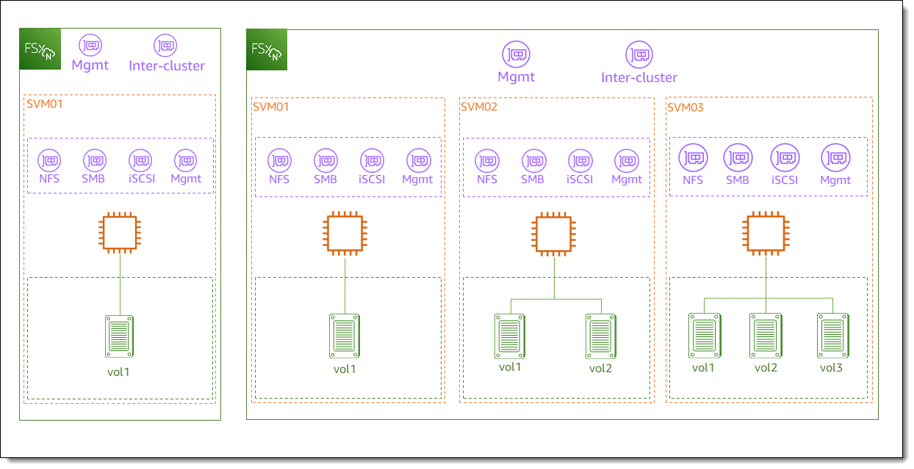

# Managing FSx for ONTAP file systems

A file system is the primary Amazon FSx resource, analogous to an on-premises ONTAP
cluster. You specify the solid state drive (SSD) storage capacity and throughput
capacity for your file system, and choose a virtual private cloud (VPC) in which to
create the file system. Each file system has a management endpoint that you can use
to manage resources and data with the ONTAP CLI or REST API.

## File system resources

An Amazon FSx for NetApp ONTAP file system is composed of the following primary resources:

- The physical hardware of the file system itself, which includes the file servers and storage media.
- One or more highly-available (HA) file server pairs, which host your storage virtual machines (SVMs). First-generation file systems
  and Multi-AZ second-generation file systems have one HA pair, and second-generation Single-AZ file systems have up to 12 HA pairs.
  Each HA pair has a storage pool called an aggregate. The collection of
  aggregates across all HA pairs makes up your SSD storage tier.
- One or more SVMs that host the file system volumes and have
  their own credentials and access management.
- One or more volumes that virtually organize your data and are mounted by your clients.

The following image illustrates the architecture of a first-generation FSx for ONTAP file system with one HA pair, and the
relationship between its primary resources. The FSx for ONTAP file system on the left
is the simplest file system, with one SVM and one volume. The file system on the
right has multiple SVMs, with some SVMs having multiple volumes. File systems and
SVMs each have multiple management endpoints, and SVMs also have data access endpoints.

When creating an FSx for ONTAP file system, you define the following properties:

- **Deployment type** – The deployment type of your file
  system (Multi-AZ or Single-AZ). Single-AZ file systems replicate your data and offer
  automatic failover within a single Availability Zone. First-generation Single-AZ file systems support one HA pair.
  Second-generation Single-AZ file systems support up to 12 HA pairs. Multi-AZ file systems
  provide added resiliency by also replicating your data and supporting
  failover across multiple Availability Zones within the same
  AWS Region. First-generation and second-generation Multi-AZ file systems both support one HA pair.

###### Note

You can't change your file system's deployment type after creation. If you want to change
the deployment type (for example, to move from Single-AZ 1 to Single-AZ 2), you can back up your data and restore
it on a new file system. You can also migrate your data with NetApp SnapMirror, with
AWS DataSync, or with a third-party data copying tool.
For more information, see [Migrating to FSx for ONTAP using NetApp SnapMirror](migrating-fsx-ontap-snapmirror.md "migrating-fsx-ontap-snapmirror.md") and
[Migrating to FSx for ONTAP using
AWS DataSync](migrate-files-to-fsx-datasync.md "migrate-files-to-fsx-datasync.md").

- **Storage capacity** – This is the amount of SSD storage, up to
  192 tebibytes (TiB) for first-generation file systems, 512 TiB for second-generation Multi-AZ file systems,
  and 1 pebibyte (PiB) for second-generation Single-AZ file systems.
- **SSD IOPS** – By default, each gigabyte of SSD storage
  includes three SSD IOPS (up to the maximum supported by your file system configuration). You can optionally provision additional SSD IOPS as
  needed.
- **Throughput capacity** – The sustained speed at which the
  file server can serve data.
- **Networking** – The VPC and subnets for the management
  and data access endpoints that your file system creates. For a Multi-AZ file system, you
  also define an IP address range and route tables.
- **Encryption** – The AWS Key Management Service (AWS KMS) key that's used to
  encrypt the file system data at rest.
- **Administrative access** – You can specify the password
  for the `fsxadmin` user. You can use this user to administer the file system
  by using the NetApp ONTAP CLI and REST API.

You can manage FSx for ONTAP file systems by using the NetApp ONTAP CLI or REST API. You can
also set up SnapMirror or SnapVault relationships between an Amazon FSx file system and another ONTAP
deployment (including another Amazon FSx file system). Each FSx for ONTAP file system has the
following file system endpoints that provide access to NetApp applications:

- **Management** – Use this endpoint to access the NetApp
  ONTAP CLI over Secure Shell (SSH), or to use the NetApp ONTAP REST API with your file
  system.
- **Intercluster** – Use this endpoint when setting up
  replication using NetApp SnapMirror or caching using NetApp FlexCache.

For more information, see [Managing FSx for ONTAP resources using NetApp applications](managing-resources-ontap-apps.md "managing-resources-ontap-apps.md") and
[Replicating your data using NetApp SnapMirror](scheduled-replication.md "scheduled-replication.md").
