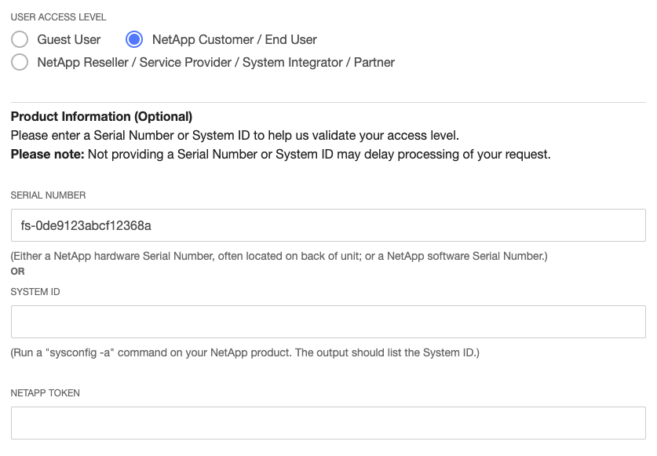
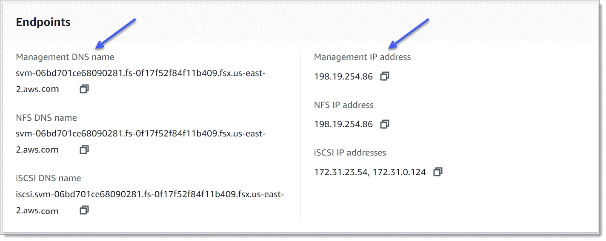

# Managing FSx for ONTAP resources using NetApp applications

In addition to the AWS Management Console, AWS CLI, and AWS API and SDKs, you can also use these NetApp management tools and applications to manage your FSx for ONTAP resources:

###### Topics

- [Signing up for a NetApp account](#signing-up-for-netapp "#signing-up-for-netapp")
- [Using NetApp Console](#netapp-bluexp "#netapp-bluexp")
- [Using the NetApp ONTAP CLI](#netapp-ontap-cli "#netapp-ontap-cli")
- [Using the ONTAP REST API](#netapp-ontap-api "#netapp-ontap-api")

###### Important

Amazon FSx periodically syncs with ONTAP to ensure consistency. If you create
or modify volumes using NetApp applications, it may take
up to several minutes for these changes to be reflected in the AWS Management Console, AWS CLI, API and SDKs.

## Signing up for a NetApp account

In order to download some NetApp software, such as NetApp Console, SnapCenter, and the ONTAP Antivirus connector, you need to have a NetApp account. To sign up for a NetApp account, perform the following steps:

1. Go to the [NetApp User Registration](https://mysupport.netapp.com/site/user/registration "https://mysupport.netapp.com/site/user/registration") page and register for a new NetApp user account.
2. Complete the form(s) with your information. Be sure to select the **NetApp Customer/End User** access level.
   In the **SERIAL NUMBER** field, copy and paste the File System ID for your FSx for ONTAP file system. See the following example:



### What to expect after you register

Customers with existing NetApp products will have their NSS account leveled-up to **Customer Level** access within one business day. Customers new to NetApp will be onboarded using standard business practices,
in addition to having their NSS account leveled-up to Customer Level access. Providing the File System ID helps expedite this process. You can check the status of your NSS account by logging into [mysupport.netapp.com](https://mysupport.netapp.com/site/ "https://mysupport.netapp.com/site/") and navigating to the **Welcome** page.
The access level of your account should be **Customer Access**.

## Using NetApp Console

NetApp Console (formerly NetApp BlueXP) is a unified control plane that simplifies management experiences for storage
and data services across on-premises and cloud environments. NetApp Console provides a centralized user interface to manage, monitor, and
automate ONTAP deployments in AWS and on premises. For more information,
see the [NetApp Console documentation](https://docs.netapp.com/us-en/console-family/index.html "https://docs.netapp.com/us-en/console-family/index.html") and the
[Amazon FSx for NetApp ONTAP management](https://docs.netapp.com/us-en/storage-management-fsx-ontap/index.html "https://docs.netapp.com/us-en/storage-management-fsx-ontap/index.html") documentation.

###### Note

NetApp Console isn't supported for second-generation file systems with more than one high-availability (HA) pair.

### Using NetApp System Manager with NetApp Console

You can manage your Amazon FSx for NetApp ONTAP file systems using System Manager directly from NetApp Console.
NetApp Console lets you use the same System Manager interface that you’re accustomed to using, so you can
manage your hybrid multi-cloud infrastructure from a single control plane. You also have access to NetApp Console's
other functionality. For more information, see the
[Integrate ONTAP System Manager with NetApp Console](https://docs.netapp.com/us-en/ontap/concepts/sysmgr-integration-console-concept.html "https://docs.netapp.com/us-en/ontap/concepts/sysmgr-integration-console-concept.html")
topic in the NetApp ONTAP documentation.

###### Note

NetApp System Manager isn't supported for second-generation file systems with more than one HA pair.

## Using the NetApp ONTAP CLI

You can manage your Amazon FSx for NetApp ONTAP resources using the NetApp ONTAP CLI. You can manage
resources at the file system (analogous to NetApp ONTAP cluster) level, and at the SVM
level.

### Managing file systems with the ONTAP CLI

You can run ONTAP CLI commands on your FSx for ONTAP file system, similar to running
them on a NetApp ONTAP cluster. You access the ONTAP CLI on your file system by
establishing a secure shell (SSH) connection to the file system's management endpoint, and logging in with
the `fsxadmin` username and password. You have the option to set the `fsxadmin` password
when you create a file system using the [custom create flow](creating-file-systems.md "creating-file-systems.md") or using the AWS CLI.
If you created the file system using the Quick create option, the `fsxadmin` password was not set, so you'll need
to set one in order to log in to the ONTAP CLI. For more information about setting the file system's `fsxadmin`,
password, see [Updating file systems](updating-file-system.md "updating-file-system.md").
You can find the **DNS name** and **IP address** of your file system's
management endpoint in the Amazon FSx console, in the **Administration** tab of the
FSx for ONTAP file system details page.

To connect to the file system's management endpoint with SSH, first log in to an EC2 instance in the same VPC
as the FSx for ONTAP file system. Once you're logged into the EC2 instance, use the `fsxadmin` user and
password to SSH into the file system's management endpoint IP address or DNS name, as in the following examples.

```
ssh fsxadmin@`file-system-management-endpoint-ip-address`
```

The SSH command with sample values:

```
`ec2user $` `ssh fsxadmin@`198.51.100.0``
```

The SSH command using the management endpoint DNS name:

```
`ec2user $` ssh fsxadmin@`file-system-management-endpoint-dns-name`
```

The SSH command using a sample DNS name:

```
`ec2user $` `ssh fsxadmin@management.fs-`0abcdef123456789`.fsx.`us-east-2`.aws.com`
  `Password:` ``fsxadmin_password``
`This is your first recorded login.
`FsxId0abcdef123456789::>``
```

#### Scope of ONTAP CLI commands available to `fsxadmin`

The `fsxadmin`'s administrative view is at the file system level, which includes all
SVMs and volumes in the file system. The `fsxadmin` role performs the role of the ONTAP cluster
administrator. Because Amazon FSx for NetApp ONTAP file systems are fully managed, the `fsxadmin` role can run a
subset of the available ONTAP CLI commands.

To see a list of the commands that `fsxadmin` can run, use the following
[`security login role show`](https://docs.netapp.com/us-en/ontap-cli/security-login-role-show.html "https://docs.netapp.com/us-en/ontap-cli/security-login-role-show.html")
ONTAP CLI command:

```
`FsxId0abc123def456::>` `security login role show -role fsxadmin -access !none`
 `Role Command/ Access
Vserver Name Directory Query Level
---------- ------------- --------- ----------------------------------- --------
FsxId0abcdef123456789
 fsxadmin application all
 cluster application-record all
 cluster date show readonly
 cluster ha modify readonly
 cluster ha show readonly
 cluster identity modify readonly
 cluster identity show readonly
 cluster log-forwarding -port !55555 all
 cluster modify readonly
 cluster peer all
 cluster show readonly
 cluster statistics show readonly
 cluster time-service ntp server create readonly
 cluster time-service ntp server delete readonly
 cluster time-service ntp server modify readonly
 cluster time-service ntp server show readonly
 debug network tcpdump -ipspace !Cluster all
 debug san lun all
 df -vserver !FsxId* -vserver !Cluster readonly
 echo all
 event catalog show readonly
 event config all
.
.
.
378 entries were displayed.`
```

### Managing SVMs with the ONTAP CLI

You can access the ONTAP CLI on your SVM by establishing a secure shell
(SSH) connection to the SVM's management endpoint using the
`vsadmin` user name and password. You can find the SVM's management
endpoint **DNS name** and **IP address** in the Amazon FSx console,
in the **Endpoints** panel of the **Storage virtual machines** details page, shown
in the following graphic.



To connect to the SVM's management endpoint with SSH, you can use the `vsadmin`
username and password. If you did not set a password for the `vsadmin`
user when the SVM was created, you can set the `vsadmin` password at anytime. For more information,
see [Updating storage virtual machines (SVM)](updating-svms.md "updating-svms.md"). You can SSH into the
SVM from a client that is in the same VPC as the file system, using the management endpoint IP
address or DNS name.

```
ssh vsadmin@`svm-management-endpoint-ip-address`
```

The command with sample values:

```
ssh vsadmin@198.51.100.10
```

The SSH command using the management endpoint DNS name:

```
ssh vsadmin@`svm-management-endpoint-dns-name`
```

The SSH command using a sample DNS name:

```
ssh vsadmin@management.svm-`abcdef01234567892`fs-`0abcdef123456789`.fsx.`us-east-2`.aws.com
```

```
`Password:` ``vsadmin-password``
`This is your first recorded login.
FsxId0abcdef123456789::>`
```

Amazon FSx for NetApp ONTAP supports the NetApp ONTAP CLI commands.

For a complete reference of NetApp ONTAP CLI commands, see the
[ONTAP Commands: Manual Page Reference](https://docs.netapp.com/us-en/ontap-cli-9131/ "https://docs.netapp.com/us-en/ontap-cli-9131/").

## Using the ONTAP REST API

When accessing your FSx for ONTAP file system using the ONTAP REST API using the
`fsxadmin` credentials, do one of the following:

- Disable TLS validation.

Or

- Trust the AWS certificate authorities (CAs) –
  The certificate bundle for the CAs in each region can be found at the follow URLs:
  - https://fsx-aws-certificates.s3.amazonaws.com/bundle-`aws-region`.pem for Public AWS Regions
  - https://fsx-aws-us-gov-certificates.s3.us-gov-west-1.amazonaws.com/bundle-`aws-region`.pem for AWSGovCloud Regions
  - https://fsx-aws-cn-certificates.s3.cn-north-1.amazonaws.com.cn/bundle-`aws-region`.pem for AWS China Regions

For a complete reference of NetApp ONTAP REST API commands, see the
[NetApp ONTAP REST API Online Reference](https://library.netapp.com/ecmdocs/ECMLP2882307/html/index.html "https://library.netapp.com/ecmdocs/ECMLP2882307/html/index.html").
