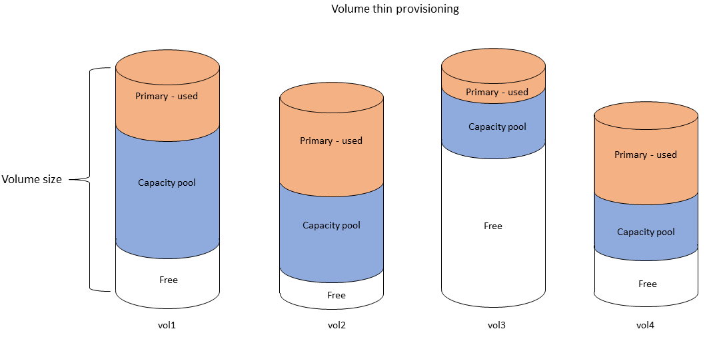
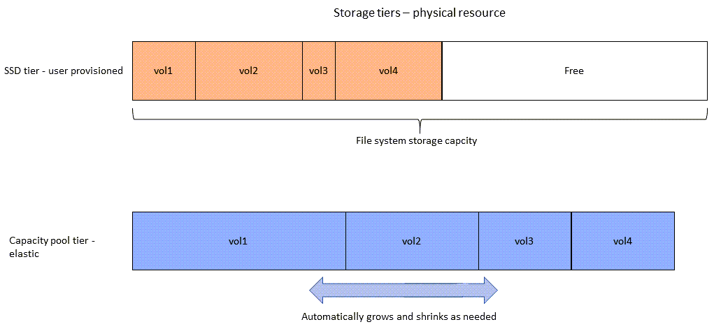

# Managing storage capacity

Amazon FSx for NetApp ONTAP provides a number of storage-related features you can use to manage storage capacity on your file system.

###### Topics

- [FSx for ONTAP storage tiers](#storage-tiers "#storage-tiers")
- [Choosing the right amount of file system SSD storage](#choose-ssd-capacity "#choose-ssd-capacity")
- [File system storage capacity and IOPS](storage-capacity-and-IOPS.md "storage-capacity-and-IOPS.md")
- [Volume storage capacity](volume-storage-capacity.md "volume-storage-capacity.md")

## FSx for ONTAP storage tiers

Storage tiers are the physical storage media for an Amazon FSx for NetApp ONTAP file
system. FSx for ONTAP offers the following storage tiers:

- _SSD tier_ – The user-provisioned, high-performance solid-state
  drive (SSD) storage that’s purpose-built for the active portion of your data
  set.
- _Capacity pool tier_ – Fully elastic storage that automatically
  scales to petabytes in size, and is cost-optimized for your infrequently accessed
  data.

An FSx for ONTAP volume is a virtual resource that, similar to folders, doesn't
consume storage capacity. The data that you store—and that consumes physical
storage—lives inside volumes. When you create a volume, you specify its size—which
you can modify after it's created. FSx for ONTAP volumes are thin provisioned, and
file system storage is not reserved in advance. Instead, SSD and capacity pool storage
are allocated dynamically, as needed. A [tiering
policy](volume-storage-capacity.md#data-tiering-policy "volume-storage-capacity.md#data-tiering-policy"), which you configure at the volume level, determines if and when data
that's stored in the SSD tier transitions to the capacity pool tier.

The following diagram illustrates an example of data laid out across multiple FSx for ONTAP volumes in a file system.



The following diagram illustrates how the file system's physical storage capacity is consumed by the data in the four volumes in the previous diagram.



You can reduce your storage costs by choosing the tiering policy that best meets
the requirements for each volume on your file system. For more information, see [Volume data tiering](volume-storage-capacity.md#volume-data-tiering "volume-storage-capacity.md#volume-data-tiering").

## Choosing the right amount of file system SSD storage

When choosing amount of SSD storage capacity for your FSx for ONTAP file system, you need to keep in mind the following items
that impact the amount of SSD storage available for storing your data:

- Storage capacity reserved for the NetApp ONTAP software overhead.
- File metadata
- Recently written data
- Files that you intend to store on SSD storage, whether it's data that hasn't hit its cooling period,
  or data that you recently read that was retrieved back to SSD.

### How SSD storage is used

Your file system's SSD storage is used for a combination of NetApp ONTAP software (overhead),
file metadata, and your data.

#### NetApp ONTAP software overhead

Like other NetApp ONTAP file systems, up to 16% of a file system's SSD
storage capacity is reserved for ONTAP overhead, which means it's not available
for storing your files. The ONTAP overhead is allocated as follows:

- 11% is reserved for NetApp ONTAP software. For file systems with over 30 tebibytes
  (TiB) of SSD storage capacity, 6% is reserved.
- 5% is reserved for aggregate snapshots, which are required to synchronize data between
  both of a file system's file servers.

#### File metadata

File metadata typically consumes 3-7% of the storage
capacity that is consumed by the files. This percentage depends on the average
file size (a smaller average file size requires more metadata), and the amount
of storage efficiency savings achieved on your files. Note that file metadata
doesn't benefit from storage efficiency savings. You can use the following
guidelines for estimating the amount of SSD storage used for metadata on your
file system.

| Average file size | Size of metadata as a percentage of file data |
| ----------------- | --------------------------------------------- |
| 4 KB              | 7%                                            |
| 8 KB              | 3.5%                                          |
| 32 KB or greater  | 1-3%                                          |

When sizing the amount of SSD storage capacity you need for the metadata of files you plan to store on the capacity pool tier,
we recommend using a conservative ratio of 1 GiB of SSD storage for every 10 GiB of data you plan to store on the capacity pool tier.

#### File data stored on your SSD tier

In addition to your active data set and all file metadata, all data written to your file system is initially written
to the SSD tier before being tiered-off to capacity pool storage. This is true regardless of the volume's tiering policy,
with the exception that data is written directly to capacity pool storage when using SnapMirror on a volume configured
with an **All** data tiering policy.

Random reads from the capacity pool tier are cached in the SSD tier, as long as the SSD tier is under 90% utilization.
For more information, see [Volume data tiering](volume-storage-capacity.md#volume-data-tiering "volume-storage-capacity.md#volume-data-tiering").

### Recommended SSD capacity utilization

We recommend that you do not exceed 80% utilization of your SSD storage tier on an ongoing basis. For second-generation
file systems, we additionally recommend that you don't exceed 80% utilization of any of your file system's aggregates
on an ongoing basis.
These recommendations is consistent with NetApp's recommendation for ONTAP. Because your file system’s
SSD tier is also used for staging writes to, and for random reads from, the capacity
pool tier, any sudden changes in access patterns can quickly cause the utilization of your SSD tier to increase.

At 90% SSD utilization, data read from the capacity pool tier is no longer cached on the SSD tier
so that the remaining SSD capacity is preserved for any new data that is written to the file system.
This causes repeat reads of the same data from the capacity pool tier to be read from capacity pool storage instead
of being cached and read from the SSD tier, which can impact the throughput capacity your file system.

All tiering functionality stops when the SSD tier is at or above 98% utilization.
For more information, see [Tiering thresholds](volume-storage-capacity.md#storage-tiering-thresholds "volume-storage-capacity.md#storage-tiering-thresholds").

### Storage efficiency

NetApp ONTAP offers block-level storage efficiency features at the volume level that include compression, compaction, and deduplication.
These features can save you up to 65% in storage capacity for general file shares, without sacrificing performance. You can enable storage efficiency on a
per volume basis. These features reduce the amount of storage capacity that your data consumes, allowing you to consume less storage spaces in SSD,
capacity pool, and backups storage. You can enable compression and deduplication on each volume for data in SSD storage. Storage savings from compression
and deduplication in SSD storage is preserved when data is tiered to capacity pool storage. Storage efficiency is always enabled for backup data, regardless
of your file system's storage efficiency configuration.

The following table shows examples of typical storage savings.

|                              | Compression only | Deduplication only | Compression & deduplication |
| ---------------------------- | ---------------- | ------------------ | --------------------------- |
| General-purpose file shares  | 50%              | 30%                | 65%                         |
| Virtual servers and desktops | 55%              | 70%                | 70%                         |
| Databases                    | 65-70%           | 0%                 | 65-70%                      |
| Engineering data             | 55%              | 30%                | 75%                         |
| Geoseismic data              | 40%              | 3%                 | 40%                         |

For most workloads, enabling compression and deduplication will not adversely impact file system performance.
For most workloads, compression increases overall performance. To provide fast reads and writes from RAM cache, FSx for ONTAP
file servers are equipped with higher levels of network bandwidth on the front-end network interface cards (NICs) than is
available between the file servers and storage disks. Since data compression reduces the amount of data sent between file
servers and storage disks, for most workloads, you will see an increase in overall file system throughput capacity when
using data compression. Increases in throughput capacity related to data compression will be capped once you saturate the
front-end NIC of your file system.

Amazon FSx for NetApp ONTAP also supports other ONTAP features that save you space, including snapshots, thin provisioning, and FlexClone volumes.

Storage efficiency features are not enabled by default. You can enable them as follows:

- On an SVM's root volume when you [create a file system](creating-file-systems.md "creating-file-systems.md").
- When you [create a new volume](creating-volumes.md "creating-volumes.md").
- When you [modify an existing volume](updating-volumes.md "updating-volumes.md").

To view the amount of storage savings on a file system with storage efficiency enabled,
see [Monitoring storage efficiency savings](view-storage-efficiency.md "view-storage-efficiency.md").

#### Calculating storage efficiency savings

You can use the `LogicalDataStored` and `StorageUsed` FSx for ONTAP CloudWatch file system metrics to
calculate storage savings from compression, deduplication, compaction, snapshots, and FlexClones. These
metrics have a single dimension, `FileSystemId`. For more information,
see [File system metrics](file-system-metrics.md "file-system-metrics.md").

- To compute storage-efficiency savings in bytes, take the Average of `StorageUsed` over a given
  period and subtract it from the Average of `LogicalDataStored` over the same period.
- To compute storage-efficiency savings as a percentage of total logical data size, take the
  `Average` of `StorageUsed` over a given period and subtract it from the `Average`
  of `LogicalDataStored` over the same period. Then divide the difference by the `Average` of
  `LogicalDataStored` over the same period.

#### SSD sizing example

Assume you want to store 100 TiB of data for an application where 80% of the data is infrequently accessed.
In this scenario, 80% (80 TiB) of your data is automatically tiered to the capacity pool tier and the remaining 20% (20 TiB) remains in SSD storage.
Based on the typical storage efficiency savings
of 65% for general-purpose file sharing workloads, that equates to 7 TiB of data. To maintain an 80% SSD utilization rate, you
need 8.75 TiB of SSD storage capacity for the 20 TiB of actively-accessed data. The amount of SSD storage that you
provision also needs to account for the ONTAP software storage overhead of 16%, as shown in the following calculation.

```
ssdNeeded = ssdProvisioned * (1 - 0.16)
8.75 TiB / 0.84 = ssdProvisioned
10.42 TiB = ssdProvisioned
```

So in this example, you need to provision at least 10.42 TiB of SSD storage. You will also use 28 TiB of capacity pool storage
for the remaining 80 TiB of infrequently accessed data.
