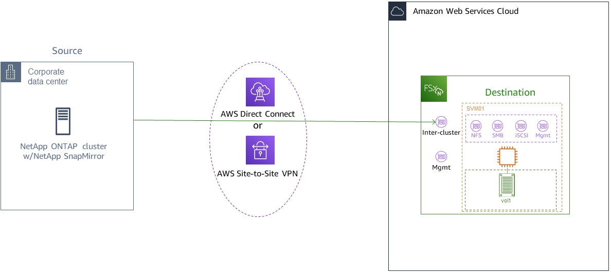

# Migrating to FSx for ONTAP using NetApp SnapMirror

You can migrate your NetApp ONTAP file systems to Amazon FSx for NetApp ONTAP using NetApp SnapMirror.

NetApp SnapMirror employs block-level replication between two ONTAP file systems, replicating data from a
specified source volume to a destination volume. We recommend using SnapMirror to migrate on-premise NetApp ONTAP
file systems to FSx for ONTAP. NetApp SnapMirror's block-level replication is quick and efficient even for
file systems with:

- Complex directory structures
- Over 50 million files
- Very small file sizes (on the order of kilobytes)
  When you use SnapMirror to migrate to FSx for ONTAP, deduplicated and compressed data remains in those states,
  which reduces transfer times and reduces the amount of bandwidth required for migration. Snapshots that
  exist on the source ONTAP volumes are preserved when migrated to the destination volumes.
  Migrating your on-premises NetApp ONTAP file systems to FSx for ONTAP involves the following high level tasks:

1. Create the destination volume in Amazon FSx.
2. Gather source and destination logical interfaces (LIFs).
3. Establish cluster peering between the source and destination file systems.
4. Create an SVM peering relationship.
5. Create the SnapMirror relationship.
6. Maintain an updated destination cluster.
7. Cut over to your FSx for ONTAP file system.
   The following diagram illustrates the migration scenario described in this section.



###### Topics

- [Before you begin](#prerequisites "#prerequisites")
- [Create the destination volume](#create-destination-volume "#create-destination-volume")
- [Record the source and destination inter-cluster LIFs](#get-lifs "#get-lifs")
- [Establish cluster peering between source and destination](#cluster-peering "#cluster-peering")
- [Create an SVM peering relationship](#svm-peering "#svm-peering")
- [Create the SnapMirror relationship](#snapmirror-relationship "#snapmirror-relationship")
- [Transfer data to your FSx for ONTAP file system](#transfer-data "#transfer-data")
- [Cutting over to Amazon FSx](#cutover "#cutover")

## Before you begin

Before you begin using the procedures described in the following sections, be sure that you have met the following prerequisites:

- FSx for ONTAP prioritizes client traffic over background tasks including data tiering, storage efficiency, and backups.
  When migrating data, and as a general best practice, we recommend that you monitor your SSD tier's capacity to ensure it is not exceeding
  80% utilization. You can monitor your SSD tier's utilization using [CloudWatch File system metrics](file-system-metrics.md "file-system-metrics.md").
  For more information, see [Volume metrics](volume-metrics.md "volume-metrics.md").
- If you set the destination volume's data tiering policy to `All` when migrating your data, all file metadata is stored on the
  primary SSD storage tier. File metadata is always stored on the SSD-based primary tier, regardless of the volume's
  data tiering policy. We recommend that you assume a ratio of 1 : 10 for primary tier : capacity pool tier storage capacity.
- The source and destination file systems are connected in the same VPC, or are
  in networks that are peered using Amazon VPC Peering, Transit Gateway, AWS Direct Connect or AWS VPN.
  For more information, see [Accessing data from within the AWS Cloud](supported-fsx-clients.md#access-environments "supported-fsx-clients.md#access-environments") and
  [What is VPC peering?](../../../vpc/latest/peering/what-is-vpc-peering.md "../../../vpc/latest/peering/what-is-vpc-peering.md")
  in the _Amazon VPC Peering Guide_.
- The VPC security group for the FSx for ONTAP file system has inbound and outbound rules allowing
  ICMP as well as TCP on ports 443, 10000, 11104, and 11105 for your inter-cluster endpoints
  (LIFs).
- Verify that the source and destination volumes are running compatible NetApp ONTAP versions before creating a
  SnapMirror data protection relationship. For more information, see
  [Compatible ONTAP versions for SnapMirror relationships](https://docs.netapp.com/us-en/ontap/data-protection/compatible-ontap-versions-snapmirror-concept.html#snapmirror-dr-relationships "https://docs.netapp.com/us-en/ontap/data-protection/compatible-ontap-versions-snapmirror-concept.html#snapmirror-dr-relationships") in NetApp's ONTAP user documentation.
  The procedures presented here use an on-premise NetApp ONTAP file system for the source.
- Your on-premises (source) NetApp ONTAP file system includes a SnapMirror license.
- You have created a destination FSx for ONTAP file system with an SVM, but you have not
  created a destination volume. For more information, see
  [Creating file systems](creating-file-systems.md "creating-file-systems.md").

The commands in these procedures use the following cluster, SVM, and volume aliases:

- `FSx-Dest` – the destination (FSx) cluster's ID (in the format FSxIdabcdef1234567890a).
- `OnPrem-Source` – the source cluster's ID.
- `DestSVM` – the destination SVM name.
- `SourceSVM` – the source SVM name.
- Both the source and destination volume names are `vol1`.

###### Note

An FSx for ONTAP file system is referred to as a cluster in all of the ONTAP CLI commands.

The procedures in this section use the following NetApp ONTAP CLI commands.

- [volume create](https://docs.netapp.com/ontap-9/topic/com.netapp.doc.dot-cm-cmpr-9101/volume__create.html "https://docs.netapp.com/ontap-9/topic/com.netapp.doc.dot-cm-cmpr-9101/volume__create.html") command
- [cluster](https://docs.netapp.com/ontap-9/topic/com.netapp.doc.dot-cm-cmpr-9101/TOC__cluster.html "https://docs.netapp.com/ontap-9/topic/com.netapp.doc.dot-cm-cmpr-9101/TOC__cluster.html") commands
- [vserver peer](https://docs.netapp.com/ontap-9/topic/com.netapp.doc.dot-cm-cmpr-9101/TOC__vserver__peer.html "https://docs.netapp.com/ontap-9/topic/com.netapp.doc.dot-cm-cmpr-9101/TOC__vserver__peer.html") commands
- [snapmirror](https://docs.netapp.com/ontap-9/topic/com.netapp.doc.dot-cm-cmpr-9101/TOC__snapmirror.html "https://docs.netapp.com/ontap-9/topic/com.netapp.doc.dot-cm-cmpr-9101/TOC__snapmirror.html") commands

You will use the NetApp ONTAP CLI to create and manage a SnapMirror configuration on your FSx for ONTAP file system.
For more information, see [Using the NetApp ONTAP CLI](managing-resources-ontap-apps.md#netapp-ontap-cli "managing-resources-ontap-apps.md#netapp-ontap-cli").

## Create the destination volume

You can create a data protection (DP) destination volume using the Amazon FSx console,
the AWS CLI, and the Amazon FSx API, in addition to the NetApp ONTAP CLI and REST API. For information about creating
a destination volume using the Amazon FSx console and AWS CLI, see [Creating volumes](creating-volumes.md "creating-volumes.md").

###### Note

ONTAP does not preserve post-process compression savings achieved at the source in the destination
DP volume when the destination volume's tiering policy is `All`. To preserve post-process compression savings, you
should set the destination volume tiering policy to `Auto` and enable inactive-data-compression on the destination
file system to re-apply post-process compression savings at the destination.

In the following procedure, you will use the NetApp ONTAP CLI to create a destination volume on your FSx for ONTAP file system.
You will need the `fsxadmin` password and the IP address or DNS name of the file system's management port.

1. Establish an SSH session with the destination file system using user `fsxadmin`
   and the password that you set when you created the file system.

```
ssh fsxadmin@`file-system-management-endpoint-ip-address`
```

2. Create a volume on the destination cluster that has a storage capacity that is at least equal to the storage capacity of the source volume.
   Use `-type DP` to designate it as a destination for a SnapMirror relationship.

If you plan to use data tiering, we recommended that you set
`-tiering-policy` to `all`. This ensures that your data is immediately
transferred to capacity pool storage and prevents you from running out of capacity on your SSD
tier. After migration, you can switch `-tiering-policy` to
`auto`.

###### Note

File metadata is always stored on the SSD-based primary tier, regardless of the volume's data tiering policy.

```
FSx-Dest::> vol create -vserver `DestSVM` -volume vol1 -aggregate aggr1 -size 1g -type DP -tiering-policy all
```

## Record the source and destination inter-cluster LIFs

SnapMirror uses inter-cluster logical interfaces (LIFs), each with a unique IP address,
to facilitate data transfer between source and destination clusters.

1. For the destination FSx for ONTAP file systems, you can retrieve the **Inter-cluster endpoint - IP addresses**
   from the Amazon FSx console by navigating to the
   **Administration** tab on your file system's details page.
2. For the source NetApp ONTAP cluster, retrieve the inter-cluster LIF IP addresses using the ONTAP CLI. Run the following command:

```
`OnPrem-Source::>` `network interface show -role intercluster`

`Logical Network
Vserver Interface Status Address/Mask
----------- ---------- ------- ------------
FSx-Dest
 inter_1 up/up 10.0.0.36/24
 inter_2 up/up 10.0.1.69/24`
```

###### Note

For second-generation Single-AZ file systems, there are two inter-cluster IP addresses for each
high-availability (HA) pair. Save these values for later.

Save the `inter_1` and `inter_2` IP addresses. They are referenced in the `FSx-Dest` as `dest_inter_1` and
`dest_inter_2` and for `OnPrem-Source` as `source_inter_1` and `source_inter_2`.

## Establish cluster peering between source and destination

Establish a cluster peer relationship on the destination cluster by providing the inter-cluster
IP addresses. You will also need to create a passphrase which you will need to enter
in when you establish cluster peering on the source cluster.

1. Set up peering on the destination cluster using the following command. For second-generation Single-AZ file systems, you'll need to provide each inter-cluster IP address.

```
`FSx-Dest::>` `cluster peer create -address-family ipv4 -peer-addrs `source_inter_1`,`source_inter_2``

`Enter the passphrase:
Confirm the passphrase:
Notice: Now use the same passphrase in the "cluster peer create" command in the other cluster.`
```

2. Next, establish the cluster peer relationship on the source cluster.
   You’ll need to enter the passphrase you created above to authenticate. For second-generation Single-AZ file systems, you'll need to provide each inter-cluster IP address.

```
`OnPrem-Source::>` `cluster peer create -address-family ipv4 -peer-addrs `dest_inter_1`,`dest_inter_2``

`Enter the passphrase:
Confirm the passphrase:`
```

3. Verify the peering was successful using the following command on the source cluster. In the output, `Availability` should be set to `Available`.

```
`OnPrem-Source::>` `cluster peer show`
`Peer Cluster Name Availability Authentication
----------------- -------------- --------------
FSx-Dest Available ok`
```

## Create an SVM peering relationship

With cluster peering established, the next step is peering the SVMs. Create an SVM peering relationship on the destination cluster
(FSx-Dest) using the `vserver peer` command. Additional aliases used in the following commands are as follows:

- `DestLocalName` – this is name used to identify the destination SVM when configuring SVM peering on the source SVM.
- `SourceLocalName` – this is the name used to identify the source SVM when configuring SVM peering on the destination SVM.

1. Use the following command to create an SVM peering relationship between the source and destination SVMs.

```
`FSx-Dest::>` `vserver peer create -vserver `DestSVM` -peer-vserver `SourceSVM` -peer-cluster `OnPrem-Source` -applications snapmirror -local-name `SourceLocalName``
`Info: [Job 207] 'vserver peer create' job queued`
```

2. Accept the peering relationship on the source cluster:

```
`OnPrem-Source::>` `vserver peer accept -vserver `SourceSVM` -peer-vserver `DestSVM` -local-name `DestLocalName``
`Info: [Job 211] 'vserver peer accept' job queued`
```

3. Verify the SVM peering status using the following command; `Peer State` should be set to `peered` in the response.

```
`OnPrem-Source::>` `vserver peer show`

 `Peer Peer Peer Peering Remote
Vserver Vserver State Cluster Applications Vserver
------- -------- ------ -------- ------------- ---------
svm01 destsvm1 peered FSx-Dest snapmirror svm01`
```

## Create the SnapMirror relationship

Now that you have peered the source and destination SVMs, the next steps are to create and initialize the
SnapMirror relationship on the destination cluster.

###### Note

Once you create and initialize a SnapMirror relationship, the destination volumes are read-only until the relationship is broken.

- Use the `snapmirror create`
  command to create the SnapMirror relationship on the destination cluster. The `snapmirror create` command must be used from the destination SVM.

You can optionally use `-throttle` to set the maximum bandwidth (in kB/sec) for the SnapMirror relationship.

```
`FSx-Dest::>` `snapmirror create -source-path `SourceLocalName`:vol1 -destination-path `DestSVM`:vol1 -vserver `DestSVM` -throttle unlimited`
`Operation succeeded: snapmirror create for the relationship with destination "DestSVM:vol1".`
```

## Transfer data to your FSx for ONTAP file system

Now that the you've created the SnapMirror relationship, you can transfer data to the destination file system.

1. You can transfer data to the destination file system by running the following command on the destination file system.

###### Note

Once you run this command, SnapMirror begins transferring snapshots of data from the source volume to the destination volume.

```
`FSx-Dest::>` `snapmirror initialize -destination-path `DestSVM`:vol1 -source-path `SourceLocalName`:vol1`
```

2. If you are migrating data that is being actively used, you’ll need to update your destination cluster so that it remains synced
   with your source cluster. To perform a one-time update to the destination cluster, run the following command.

```
`FSx-Dest::>` `snapmirror update -destination-path `DestSVM`:vol1`
```

3. You can also schedule hourly or daily updates prior to completing the migration and moving your clients to FSx for ONTAP.
   You can establish a SnapMirror update schedule using the [`snapmirror modify`](https://docs.netapp.com/ontap-9/topic/com.netapp.doc.dot-cm-cmpr-9101/snapmirror__modify.html "https://docs.netapp.com/ontap-9/topic/com.netapp.doc.dot-cm-cmpr-9101/snapmirror__modify.html") command.

```
`FSx-Dest::>` `snapmirror modify -destination-path `DestSVM`:vol1 -schedule hourly`
```

## Cutting over to Amazon FSx

To prepare for the cut over to your FSx for ONTAP file system, do the following:

- Disconnect all clients that write to the source cluster.
- Perform a final SnapMirror transfer to ensure there is no data loss when cutting over.
- Break the SnapMirror relationship.
- Connect all clients to your FSx for ONTAP file system.

1. To ensure that all data from the source cluster is transferred to FSx for ONTAP file system, perform a final Snapmirror transfer.

```
`FSx-Dest::>` `snapmirror update -destination-path `DestSVM`:vol1`
```

2. Ensure that the data migration is complete by verifying that `Mirror State` is set to `Snapmirrored`,
   and `Relationship Status` is set to `Idle`. You also should ensure that the `Last Transfer End Timestamp`
   date is as expected, as it shows when the last transfer to the destination volume occurred.
3. Run the following command to show the SnapMirror status.

```
`FSx-Dest::>` `snapmirror show -fields state,status,last-transfer-end-timestamp`
`Source Destination Mirror Relationship Last Transfer End
Path Path State Status Timestamp
---------- ----------- ---------- ------- ---------------
Svm01:vol1 svm02:DestVol Snapmirrored Idle 09/02 09:02:21`
```

4. Disable any future SnapMirror transfers by using the `snapmirror quiesce` command.

```
`FSx-Dest::>` `snapmirror quiesce -destination-path `DestSVM`:vol1`
```

5. Verify that the `Relationship Status` has changed to `Quiesced` using `snapmirror show`.

```
`FSx-Dest::>` `snapmirror show`
`Source Destination Mirror Relationship
Path Path State Status
----------- ------------ ------------- --------
sourcesvm1:vol1 svm01:DestVol Snapmirrored Quiesced`
```

6. During migration, the destination volume is read-only. To enable read/write, you need to break the SnapMirror relationship
   and cut over to your FSx for ONTAP file system. Break the SnapMirror relationship using the following command.

```
`FSx-Dest::>` `snapmirror break -destination-path `DestSVM`:vol1`
`Operation succeeded: snapmirror break for destination "DestSVM:vol1".`
```

7. Once the SnapMirror replication has completed and you have broken the SnapMirror
   relationship, you can mount the volume to make the data available.

```
FSx-Dest::> vol mount -vserver fsx -volume vol1 -junction-path /vol1
```

The volume is now available with the data from the source volume fully migrated to the
destination volume The volume is also available for clients to read and write to it. If you
previously set the `tiering-policy` of this volume to `all`, you can
change it to `auto` or `snapshot-only` and your data will automatically
transition between storage tiers according to access patterns. To make this data accessible to
clients and applications, see [Accessing your FSx for ONTAP data](supported-fsx-clients.md "supported-fsx-clients.md").
