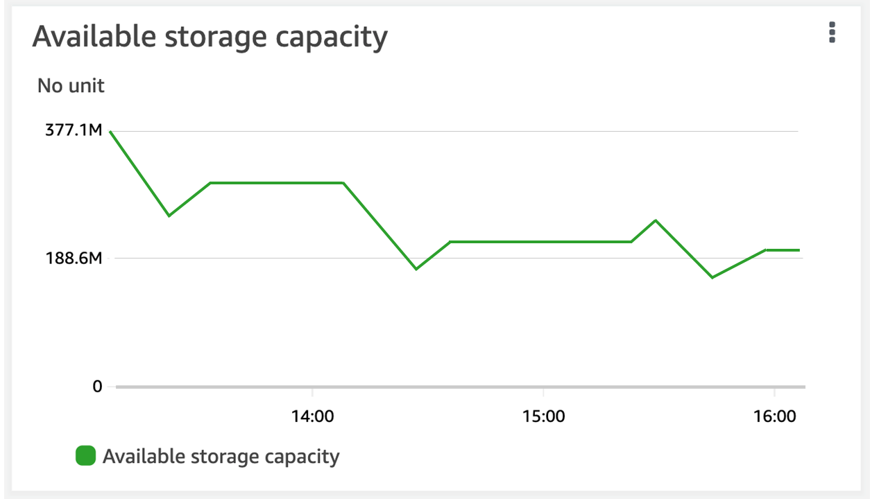
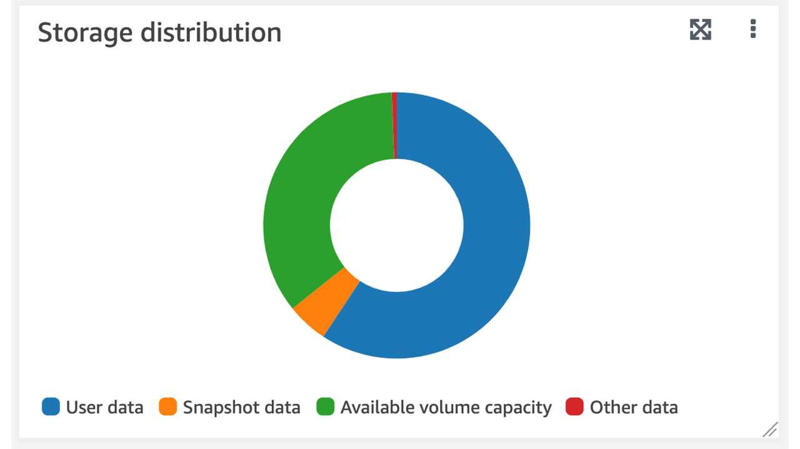

# Monitoring volume storage capacity

You can view a volume's available storage and it's storage distribution in AWS Management Console, AWS CLI, and the NetApp ONTAP CLI.

###### To monitor a volume's storage capacity (console)

The **Available storage**
graph displays the amount of free storage capacity on a volume over time. The **Storage distribution** graph shows how a volume's
storage capacity is currently distributed over 4 categories:

- User data
- Snapshot data
- Available volume capacity
- Other data

1. Open the Amazon FSx console at [https://console.aws.amazon.com/fsx/](https://console.aws.amazon.com/fsx/ "https://console.aws.amazon.com/fsx/").
2. Choose **Volumes** in the left navigation column, then choose the ONTAP
   volume that you want to view storage capacity information for. The
   volume detail page appears.
3. In the second panel, choose the **Monitoring** tab. The **Available
   storage** and **Storage distribution**
   graphs display, along with several other graphs.





###### To monitor a volume's storage capacity (ONTAP CLI)

You can monitor how your volume's storage capacity is being consumed by using the `volume show-space`
ONTAP CLI command. For more information, see
[`volume show-space`](https://docs.netapp.com/us-en/ontap-cli-9111/volume-show-space.html "https://docs.netapp.com/us-en/ontap-cli-9111/volume-show-space.html") in
the NetApp ONTAP Documentation Center.

1. To access the ONTAP CLI, establish an SSH session on the management port of the
   Amazon FSx for NetApp ONTAP file system or SVM by running the following command. Replace
   `management_endpoint_ip` with the IP address of the file system's
   management port.

```
`[~]$` `ssh fsxadmin@`management_endpoint_ip``
```

For more information, see [Managing file systems with the ONTAP CLI](managing-resources-ontap-apps.md#fsxadmin-ontap-cli "managing-resources-ontap-apps.md#fsxadmin-ontap-cli"). 2. View a volume's storage capacity usage by issuing the following command, replacing the following values:

    * Replace ``svm_name`` with the name of the SVM that
     the volume is created on.
    * Replace ``vol_name`` with name of the volume for which you
     are setting the data-tiering policy.

```
`::>` `volume show-space -vserver `svm_name` -volume `vol_name``
```

If the command is successful, you'll see output similar to the following:

```
Vserver : svm_name
Volume  : vol_name
Feature                                    Used      Used%
--------------------------------     ----------     ------
User Data                                 140KB         0%
Filesystem Metadata                     164.4MB         1%
Inodes                                  10.28MB         0%
Snapshot Reserve                        563.2MB         5%
Deduplication                              12KB         0%
Snapshot Spill                           9.31GB        85%
Performance Metadata                      668KB         0%

Total Used                              10.03GB        91%

Total Physical Used                     10.03GB        91%
```

The output of this command shows the amount of physical space that different types of data
occupy on this volume. It also shows the percentage of the total volume's capacity that each type of data consumes. In
this example, `Snapshot Spill` and `Snapshot Reserve` consume a combined
90 percent of the volume's capacity.
`Snapshot Reserve` shows the amount of disk space reserved for storing Snapshot copies. If the Snapshot copies storage exceeds the reserve space,
it spills into the file system and this amount is shown under `Snapshot Spill`.

To increase the amount of available space, you can either [increase the size](manage-volume-capacity.md#increase-volume-size "manage-volume-capacity.md#increase-volume-size") of the volume,
or you can [delete snapshots](snapshots-ontap.md#delete-snapshots "snapshots-ontap.md#delete-snapshots") that you are not using, as shown in the following procedures.

For FlexVol volume types (the default volume type for FSx for ONTAP
volumes), you can also enable [volume autosizing](enable-volume-autosizing.md "enable-volume-autosizing.md"). When you enable autosizing, the volume size
automatically increases when it reaches certain thresholds. You can also
disable automatic snapshots. Both of these features are explained in the
following sections.
