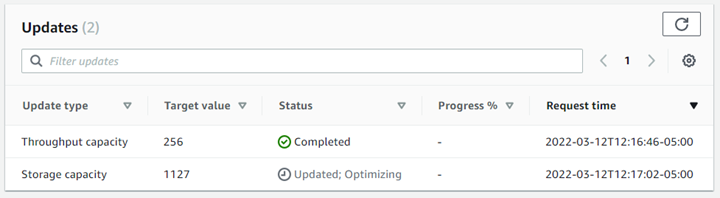

# Monitoring storage capacity and IOPS updates

You can monitor the progress of an SSD storage capacity and IOPS update by using the Amazon FSx
console, CLI, and API.

In the **Updates** tab on the **File system details** page
for your FSx for ONTAP file system, you can view the 10 most recent updates for each
update type.



For SSD storage capacity and IOPS updates, you can view the following information:

\***\*Update type\*\***

Supported types are **Storage capacity**, **Mode**,
and **IOPS**. The **Mode** and **IOPS**
values are listed for all storage capacity and IOPS scaling requests.

\***\*Target value\*\***

The value that you specified to update the file system's SSD storage capacity or
IOPS to.

\***\*Status\*\***

The current status of the update. The possible values are as follows:

- **Pending** – Amazon FSx received the update request, but hasn't started
  processing it.
- **In progress** – Amazon FSx is processing the update request.
- **Updated; Optimizing** – Amazon FSx increased the file system's SSD
  storage capacity. The storage-optimization process is
  now rebalancing your data in the background.
- **Completed** – The update finished successfully.
- **Failed** – The update request failed. Choose the question mark
  (**?**) to see details.

\***\*Progress %\*\***

Displays the progress of the storage-optimization process as the percentage
complete.

\***\*Request time\*\***

The time that Amazon FSx received the update action request.

You can view and monitor file system SSD storage capacity increase and decrease requests by using the
[`describe-file-systems`](../../../cli/latest/reference/fsx/describe-file-systems.md "../../../cli/latest/reference/fsx/describe-file-systems.md") AWS CLI command and the [DescribeFileSystems](../APIReference/API_DescribeFileSystems.md "../APIReference/API_DescribeFileSystems.md") API operation. The
`AdministrativeActions` array lists the 10 most recent update actions
for each administrative action type. When you increase a file system's SSD
storage capacity, two `AdministrativeActions` actions are generated: a
`FILE_SYSTEM_UPDATE` and a `STORAGE_OPTIMIZATION` action. When you decrease a file system's SSD
storage capacity, only one `AdministrativeActions` action is generated: a
`FILE_SYSTEM_UPDATE` action.

The following example shows an excerpt of the response of a
`describe-file-systems` CLI command. The file system has a pending
administrative action to increase the SSD storage capacity to 2000 GiB and the
provisioned SSD IOPS to 7000.

```
"AdministrativeActions": [
    {
        "AdministrativeActionType": "FILE_SYSTEM_UPDATE",
        "RequestTime": 1586797629.095,
        "Status": "PENDING",
        "TargetFileSystemValues": {
            "StorageCapacity": 2000,
            "OntapConfiguration": {
                "DiskIopsConfiguration": {
                    "Mode": "USER_PROVISIONED",
                    "Iops": 7000
                }
             }
        }
    },
    {
        "AdministrativeActionType": "STORAGE_OPTIMIZATION",
        "RequestTime": 1586797629.095,
        "Status": "PENDING"
    }
]
```

Amazon FSx processes the `FILE_SYSTEM_UPDATE` action first, adding the new larger
storage disks to the file system. When the new storage is available to the file
system, the `FILE_SYSTEM_UPDATE` status changes to
`UPDATED_OPTIMIZING`. The storage capacity shows the new larger
value, and Amazon FSx begins processing the `STORAGE_OPTIMIZATION`
administrative action. This behavior is shown in the following excerpt of the
response of a `describe-file-systems` CLI command.

The `ProgressPercent` property displays the progress of the
storage-optimization process. After the storage-optimization process has completed
successfully, the status of the `FILE_SYSTEM_UPDATE` action changes to
`COMPLETED`, and the `STORAGE_OPTIMIZATION` action no
longer appears.

```
"AdministrativeActions": [
    {
        "AdministrativeActionType": "FILE_SYSTEM_UPDATE",
        "RequestTime": 1586799169.445,
        "Status": "UPDATED_OPTIMIZING",
        "TargetFileSystemValues": {
            "StorageCapacity": 2000,
            "OntapConfiguration": {
                "DiskIopsConfiguration": {
                    "Mode": "USER_PROVISIONED",
                    "Iops": 7000
                }
            }
        }
    },
    {
        "AdministrativeActionType": "STORAGE_OPTIMIZATION",
        "ProgressPercent": 41,
        "RequestTime": 1586799169.445,
        "Status": "IN_PROGRESS"
    }
]
```

When decreasing SSD capacity, the `FILE_SYSTEM_UPDATE` action includes a `Message` property that provides information about which volumes are currently being moved and how many volumes remain. For example:

```
"AdministrativeActions": [
    {
        "AdministrativeActionType": "FILE_SYSTEM_UPDATE",
        "Message": "Moving data for [vol1 vol2]. 2 volume(s) remaining. https://docs.aws.amazon.com/fsx/latest/ONTAPGuide/troubleshooting.html",
        "ProgressPercent": 8,
        "RequestTime": 1748981251.591,
        "Status": "IN_PROGRESS",
        "TargetFileSystemValues": {
            "StorageCapacity": 4096,
            "OntapConfiguration": {
                "DiskIopsConfiguration": {
                    "Mode": "AUTOMATIC",
                    "Iops": 12288
                }
            }
        }
    }
]
```

If the SSD decrease operation is paused because the target aggregate has exceeded 80% utilization, the status will change to `PAUSED` with an appropriate message:

```
"AdministrativeActions": [
    {
        "AdministrativeActionType": "FILE_SYSTEM_UPDATE",
        "Message": "Your file system has insufficient free space in its SSD tier. Please free up space or increase your file system's storage capacity.",
        "ProgressPercent": 8,
        "RequestTime": 1748981251.591,
        "Status": "PAUSED",
        "TargetFileSystemValues": {
            "StorageCapacity": 4096,
            "OntapConfiguration": {
                "DiskIopsConfiguration": {
                    "Mode": "AUTOMATIC",
                    "Iops": 12288
                }
            }
        }
    }
]
```

If the storage capacity or IOPS update request fails, the status of the
`FILE_SYSTEM_UPDATE` action changes to `FAILED`, as shown
in the following example. The `FailureDetails` property provides
information about the failure.

```
"AdministrativeActions": [
    {
        "AdministrativeActionType": "FILE_SYSTEM_UPDATE",
        "RequestTime": 1586373915.697,
        "Status": "FAILED",
        "TargetFileSystemValues": {
            "StorageCapacity": 2000,
            "OntapConfiguration": {
                "DiskIopsConfiguration": {
                    "Mode": "USER_PROVISIONED",
                    "Iops": 7000
                }
            }
        },
        "FailureDetails": {
            "Message": "`failure-message`"
        }
    }
]
```
