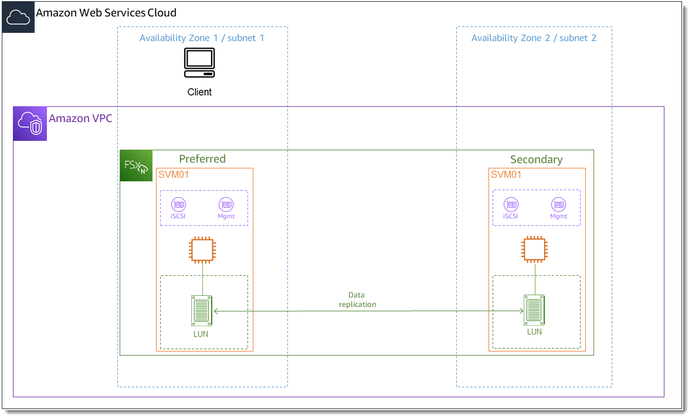

# Provisioning iSCSI for Linux

FSx for ONTAP supports the iSCSI protocol. You need to provision iSCSI on both the Linux client and your file system
in order to use the iSCSI protocol to transport data between clients and your file system. The iSCSI protocol is available
on all file systems that have 6 or fewer [high-availability (HA) pairs](HA-pairs.md "HA-pairs.md").

There are three main steps to process of configuring iSCSI on your Amazon FSx for NetApp ONTAP, which are covered in the following procedures:

1. Install and configure the iSCSI client on the Linux host.
2. Configure iSCSI on the file system's SVM.
   - Create an iSCSI initiator group.
   - Map the initiator group to the LUN.

3. Mount an iSCSI LUN on the Linux client.

## Before you begin

Before you begin the process of configuring your file system for iSCSI, you need to have the
following items completed.

- Create an FSx for ONTAP file system.
  For more information, see [Creating file systems](creating-file-systems.md "creating-file-systems.md").
- Create an iSCSI LUN on the file system. For more information, see
  [Creating an iSCSI LUN](create-iscsi-lun.md "create-iscsi-lun.md").
- Create an EC2 instance running the Amazon Linux 2 Amazon Machine Image (AMI) in the same VPC as the file system.
  This is the Linux host on which you will configure iSCSI and access your file data.

Beyond the scope of these procedures, if the host is located in another VPC, you
can use VPC peering or AWS Transit Gateway to grant other VPCs access to the volume's iSCSI
endpoints. For more information, see
[Accessing data from outside the
deployment VPC](supported-fsx-clients.md#access-from-outside-deployment-vpc "supported-fsx-clients.md#access-from-outside-deployment-vpc").

- Configure the Linux host's VPC security groups to allow inbound and
  outbound traffic as described in [File System Access Control with Amazon VPC](limit-access-security-groups.md "limit-access-security-groups.md").
- Obtain the credentials for the ONTAP user with `fsxadmin` privileges
  that you will use to access the ONTAP CLI. For more information, see
  [ONTAP roles and users](roles-and-users.md "roles-and-users.md").
- The Linux host that you will configure for iSCSI and use to access the FSx for ONTAP file system are located in
  the same VPC and AWS account.
- We recommend that the EC2 instance be in the same availability zone
  as your file system's preferred subnet, as shown in the following graphic.



If your EC2 instance runs a different Linux AMI than Amazon Linux 2, some of the utilities used
in these procedures and examples might already be installed, and you might use different commands to
install required packages. Aside from installing packages, the commands used in this section
are valid for other EC2 Linux AMIs.

###### Topics

- [Install and configure iSCSI on the Linux host](#configure-iscsi-on-linux-client "#configure-iscsi-on-linux-client")
- [Configure iSCSI on the FSx for ONTAP file system](#configure-iscsi-on-fsx-ontap "#configure-iscsi-on-fsx-ontap")
- [Mount an iSCSI LUN on your Linux client](#mount-iscsi-lun-on-linux-client "#mount-iscsi-lun-on-linux-client")

## Install and configure iSCSI on the Linux host

###### To install the iSCSI client

1. Confirm that `iscsi-initiator-utils` and `device-mapper-multipath` are installed on
   your Linux device. Connect to your Linux instance using an SSH client. For more information, see
   [Connect to your Linux instance using SSH](../../../AWSEC2/latest/UserGuide/AccessingInstancesLinux.md "../../../AWSEC2/latest/UserGuide/AccessingInstancesLinux.md").
2. Install `multipath` and the iSCSI client using the following command.
   Installing `multipath` is required if you want to automatically failover between your file servers.

```
`~$` sudo yum install -y device-mapper-multipath iscsi-initiator-utils
```

3. To facilitate a faster response when automatically failing over between file servers when using
   `multipath`, set the replacement timeout value in the `/etc/iscsi/iscsid.conf`
   file to a value of `5` instead of using the default value of `120`.

```
`~$` sudo sed -i 's/node.session.timeo.replacement_timeout = .*/node.session.timeo.replacement_timeout = 5/' /etc/iscsi/iscsid.conf; sudo cat /etc/iscsi/iscsid.conf | grep node.session.timeo.replacement_timeout
```

4. Start the iSCSI service.

```
`~$` sudo service iscsid start
```

Note that depending on your Linux version, you may have to use this command instead:

```
`~$` sudo systemctl start iscsid
```

5. Confirm that the service is running using the following command.

```
`~$` sudo systemctl status iscsid.service
```

The system responds with the following output:

```
`iscsid.service - Open-iSCSI
 Loaded: loaded (/usr/lib/systemd/system/iscsid.service; disabled; vendor preset: disabled)
 Active: active (running) since Fri 2021-09-02 00:00:00 UTC; 1min ago
 Docs: man:iscsid(8)
 man:iscsiadm(8)
 Process: 14658 ExecStart=/usr/sbin/iscsid (code=exited, status=0/SUCCESS)
 Main PID: 14660 (iscsid)
 CGroup: /system.slice/iscsid.service
 ├─14659 /usr/sbin/iscsid
 └─14660 /usr/sbin/iscsid`
```

###### To configure iSCSI on your Linux client

1. To enable your clients to automatically failover between your file servers, you must configure multipath.
   Use the following command:

```
`~$` sudo mpathconf --enable --with_multipathd y
```

2. Determine the initiator name of your Linux host using the following command. The location of the initiator name depends on your iSCSI
   utility. If you are using `iscsi-initiator-utils`, the initiator name is
   located in the file `/etc/iscsi/initiatorname.iscsi`.

```
`~$` sudo cat /etc/iscsi/initiatorname.iscsi
```

The system responds with the initiator name.

```
`InitiatorName=iqn.1994-05.com.redhat:abcdef12345`
```

## Configure iSCSI on the FSx for ONTAP file system

1. Connect to the NetApp ONTAP CLI on the FSx for ONTAP file system on which you created the iSCSI LUN using the following command.
   For more information, see [Using the NetApp ONTAP CLI](managing-resources-ontap-apps.md#netapp-ontap-cli "managing-resources-ontap-apps.md#netapp-ontap-cli").

```
`~$` ssh fsxadmin@`your_management_endpoint_ip`
```

2. Create the initiator group (`igroup`) using the NetApp ONTAP CLI [**lun igroup create**](https://docs.netapp.com/us-en/ontap-cli-9111/lun-igroup-create.html "https://docs.netapp.com/us-en/ontap-cli-9111/lun-igroup-create.html") command. An initiator group maps to iSCSI LUNs and control which
   initiators (clients) have access to LUNs. Replace `host_initiator_name` with the initiator
   name from your Linux host that you retrieved in the previous procedure.

```
`::>` lun igroup create -vserver ``svm_name`` -igroup `igroup_name` -initiator `host_initiator_name` -protocol iscsi -ostype linux
```

If you want to make the LUNs mapped to this igroup available to multiple hosts, you can specify multiple
initiator names separated with a comma. For more information, see
[lun igroup create](https://docs.netapp.com/us-en/ontap-cli-9111/lun-igroup-create.html "https://docs.netapp.com/us-en/ontap-cli-9111/lun-igroup-create.html") in the _NetApp ONTAP Documentation Center_. 3. Confirm that the `igroup` exists using the [**lun igroup show**](https://docs.netapp.com/us-en/ontap-cli-9111/lun-igroup-show.html "https://docs.netapp.com/us-en/ontap-cli-9111/lun-igroup-show.html") command:

```
`::>` lun igroup show
```

The system responds with the following output:

```
`Vserver Igroup Protocol OS Type Initiators
--------- ------------ -------- -------- ------------------------------------
`svm_name` `igroup_name` iscsi linux iqn.1994-05.com.redhat:abcdef12345`
```

4. This step assumes that you have already created an iSCSI LUN. If you have not, see [Creating an iSCSI LUN](create-iscsi-lun.md "create-iscsi-lun.md")
   for step-by-step instructions to do so.

Create a mapping from the LUN you created to the igroup you created, using the
[**lun mapping create**](https://docs.netapp.com/us-en/ontap-cli-9111/lun-mapping-create.html "https://docs.netapp.com/us-en/ontap-cli-9111/lun-mapping-create.html"),
specifying the following attributes:

    * ``svm_name`` – The name of the storage virtual machine providing the iSCSI target. The host
     uses this value to reach the LUN.
    * ``vol_name`` – The name of the volume hosting the LUN.
    * ``lun_name`` – The name that you assigned to the LUN.
    * ``igroup_name`` – The name of the initiator group.
    * ``lun_id`` – The LUN ID integer is specific to the mapping, not to the LUN itself.
     This is used by the initiators in the igroup as the Logical Unit Number use this value for the initiator
     when accessing the storage.

```
`::>` lun mapping create -vserver `svm_name` -path /vol/`vol_name`/`lun_name` -igroup `igroup_name` -lun-id `lun_id`
```

5. Use the [`lun show -path`](https://docs.netapp.com/us-en/ontap-cli-9111/lun-show.html "https://docs.netapp.com/us-en/ontap-cli-9111/lun-show.html")
   command to confirm the LUN is created, online, and mapped.

```
`::>` lun show -path /vol/`vol_name`/`lun_name` -fields state,mapped,serial-hex
```

The system responds with the following output:

```
 `Vserver Path serial-hex state mapped
 --------- ------------------------------- ------------------------ -------- --------
 `svm_name` /vol/`vol_name`/`lun_name` 6c5742314e5d52766e796150 online mapped`
```

Save the `serial_hex` value (in this example, it is `6c5742314e5d52766e796150`), you will use it in a later step to create a
friendly name for the block device. 6. Use the
[`network interface show -vserver`](https://docs.netapp.com/us-en/ontap-cli-9111/network-interface-show.html "https://docs.netapp.com/us-en/ontap-cli-9111/network-interface-show.html")
command to retrieve the addresses of the `iscsi_1` and `iscsi_2`
interfaces for the SVM in which you've created your iSCSI LUN.

```
`::>` network interface show -vserver ``svm_name``
```

The system responds with the following output:

```
 `Logical Status Network Current Current Is
Vserver Interface Admin/Oper Address/Mask Node Port Home
----------- ---------- ---------- ------------------ ------------- ------- ----
`svm_name`
 iscsi_1 up/up 172.31.0.143/20 FSxId0123456789abcdef8-01 e0e true
 iscsi_2 up/up 172.31.21.81/20 FSxId0123456789abcdef8-02 e0e true
 nfs_smb_management_1
 up/up 198.19.250.177/20 FSxId0123456789abcdef8-01 e0e true
3 entries were displayed.`
```

In this example, the IP address of `iscsi_1` is `172.31.0.143` and
`iscsi_2` is `172.31.21.81`.

## Mount an iSCSI LUN on your Linux client

The process of mounting the iSCSI LUN on your Linux client involves three steps:

1. Discovering the target iSCSI nodes
2. Partitioning the iSCSI LUN
3. Mounting the iSCSI LUN on the client

These are covered in the following procedures.

###### To discover the target iSCSI nodes

1. On your Linux client, use the following command to discover the target iSCSI nodes using
   `iscsi_1`’s IP address `iscsi_1_IP`.

```
`~$` `sudo iscsiadm --mode discovery --op update --type sendtargets --portal `iscsi_1_IP``
```

```
`172.31.0.143:3260,1029 iqn.1992-08.com.netapp:sn.9cfa2c41207a11ecac390182c38bc256:vs.3
172.31.21.81:3260,1028 iqn.1992-08.com.netapp:sn.9cfa2c41207a11ecac390182c38bc256:vs.3`
```

In this example, `iqn.1992-08.com.netapp:sn.9cfa2c41207a11ecac390182c38bc256:vs.3`
corresponds to the `target_initiator` for the iSCSI LUN in the preferred availability zone. 2. (Optional) To drive higher throughput than the Amazon EC2 single client maximum of 5 Gbps (~625 MBps) to your iSCSI LUN,
follow the procedures described in
[Amazon EC2 instance network bandwidth](../../../AWSEC2/latest/UserGuide/ec2-instance-network-bandwidth.md "../../../AWSEC2/latest/UserGuide/ec2-instance-network-bandwidth.md")
in the Amazon Elastic Compute Cloud User Guide for Linux Instances to establish additional sessions for greater throughput.

The following command establishes 8 sessions per initiator per
ONTAP node in each availability zone, enabling the client to drive up to 40
Gbps (5,000 MBps) of aggregate throughput to the iSCSI LUN.

```
`~$` `sudo iscsiadm --mode node -T `target_initiator` --op update -n node.session.nr_sessions -v 8`
```

3. Log into the target initiators. Your iSCSI LUNs are presented as available disks.

```
`~$` `sudo iscsiadm --mode node -T `target_initiator` --login`
```

```
`Logging in to [iface: default, target: iqn.1992-08.com.netapp:sn.9cfa2c41207a11ecac390182c38bc256:vs.3, portal: 172.31.14.66,3260] (multiple)
Login to [iface: default, target: iqn.1992-08.com.netapp:sn.9cfa2c41207a11ecac390182c38bc256:vs.3, portal: 172.31.14.66,3260] successful.`

```

The output above is truncated; you should see one `Logging in` and one `Login 
 successful` response for each session on each file server. In the case of 4 sessions per node, there will be 8
`Logging in` and 8 `Login successful` responses. 4. Use the following command to verify that `dm-multipath` has identified and merged the iSCSI sessions by showing a single LUN with multiple
policies. There should be an equal number of devices that are listed as `active` and those listed as `enabled`.

```
`~$` `sudo multipath -ll`
```

In the output, the disk name is formatted as `dm-xyz`, where `xyz` is an integer. If there are no other
multipath disks, this value is `dm-0`.

````
`3600a09806c5742314e5d52766e79614f `dm-xyz` NETAPP ,LUN C-Mode
size=10G features='4 queue_if_no_path pg_init_retries 50 retain_attached_hw_handle' hwhandler='0' wp=rw
|-+- policy='service-time 0' prio=50 status=active
| |- 0:0:0:1 sda 8:0 active ready running
| |- 1:0:0:1 sdc 8:32 active ready running
| |- 3:0:0:1 sdg 8:96 active ready running
| `- 4:0:0:1 sdh 8:112 active ready running `-+- policy='service-time 0' prio=10 status=enabled |- 2:0:0:1 sdb 8:16 active ready running
|- 7:0:0:1 sdf 8:80 active ready running |- 6:0:0:1 sde 8:64 active ready running `- 5:0:0:1 sdd 8:48 active ready running` ``` Your block device is now connected to your Linux client. It is located under the path `/dev/`dm-xyz``. You should not use this path for administrative purposes; instead, use the symbolic link that is under the path `/dev/mapper/`wwid``, where ``wwid`` is a unique identifier for your LUN that is consistent across devices. In the next step, you’ll provide a friendly name for the ``wwid`` so you can distinguish it from other multipathed disks. ###### To assign the block device a friendly name 1. To provide your device a friendly name, create an alias in the `/etc/multipath.conf` file. To do this, add the following entry to the file using your preferred text editor, replacing the following placeholders: <br>• Replace `serial_hex` with the value the you saved in the [Configure iSCSI on the FSx for ONTAP file system](#configure-iscsi-on-fsx-ontap "#configure-iscsi-on-fsx-ontap") procedure. <br>• Add the prefix `3600a0980` to the `serial_hex` value as shown in the example. This is a unique preamble for the NetApp ONTAP distribution that Amazon FSx for NetApp ONTAP uses. <br>• Replace `device_name` with the friendly name you want to use for your device. ``` multipaths { multipath { wwid 3600a0980`serial_hex` alias `device_name` } } ``` As an alternative, you can copy and save the following script as a bash file, such as `multipath_alias.sh`. You can run the script with sudo privileges, replacing ``serial_hex`` (without the 3600a0980 prefix) and ``device_name`` with your respective serial number and the desired friendly name. This script searches for an uncommented `multipaths` section in the `/etc/multipath.conf` file. If one exists, it appends a `multipath` entry to that section; otherwise, it will create a new `multipaths` section with a `multipath` entry for your block device. ``` #!/bin/bash SN=serial_hex ALIAS=device_name CONF=/etc/multipath.conf grep -q '^multipaths {' $CONF UNCOMMENTED=$? if [ $UNCOMMENTED -eq 0 ] then sed -i '/^multipaths {/a\\tmultipath {\n\t\twwid 3600a0980'"${SN}"'\n\t\talias '"${ALIAS}"'\n\t}\n' $CONF else printf "multipaths {\n\tmultipath {\n\t\twwid 3600a0980$SN\n\t\talias $ALIAS\n\t}\n}" >> $CONF fi ``` 2. Restart the `multipathd` service for the changes to `/etc/multipathd.conf` take effect. ``` `~$` systemctl restart multipathd.service ``` ###### To partition the LUN The next step is to format and partition your LUN using `fdisk`. 1. Use the following command to verify that the path to your `device_name` is present. ``` `~$` `ls /dev/mapper/`device_name`` ``` ``` /dev/`device_name` ``` 2. Partition the disk using `fdisk`. You’ll enter an interactive prompt. Enter the options in the order shown. You can make multiple partitions by using a value smaller than the last sector (`20971519` in this example). ###### Note The `Last sector` value will vary depending on the size of your iSCSI LUN (10GB in this example). ``` `~$` `sudo fdisk /dev/mapper/`device_name`` ``` The `fsdisk` interactive prompt starts. ``` `Welcome to fdisk (util-linux 2.30.2). Changes will remain in memory only, until you decide to write them. Be careful before using the write command. Device does not contain a recognized partition table. Created a new DOS disklabel with disk identifier 0x66595cb0. Command (m for help):` `n` `Partition type p primary (0 primary, 0 extended, 4 free) e extended (container for logical partitions) Select (default p):` `p` `Partition number (1-4, default 1):` `1` `First sector (2048-20971519, default 2048):` `2048` `Last sector, +sectors or +size{K,M,G,T,P} (2048-20971519, default 20971519):` `20971519` `Created a new partition 1 of type 'Linux' and of size 512 B. Command (m for help):` `w` `The partition table has been altered. Calling ioctl() to re-read partition table. Syncing disks.` ``` After entering `w`, your new partition `/dev/mapper/`partition_name`` becomes available. The `partition_name` has the format `<device_name>``<partition_number>`. `1` was used as the partition number used in the `fdisk` command in the previous step. 3. Create your file system using `/dev/mapper/`partition_name`` as the path. ``` `~$` `sudo mkfs.ext4 /dev/mapper/`partition_name`` ``` The system responds with the following output: ``` `mke2fs 1.42.9 (28-Dec-2013) Discarding device blocks: done Filesystem label= OS type: Linux Block size=4096 (log=2) Fragment size=4096 (log=2) Stride=0 blocks, Stripe width=16 blocks 655360 inodes, 2621184 blocks 131059 blocks (5.00%) reserved for the super user First data block=0 Maximum filesystem blocks=2151677952 80 block groups 32768 blocks per group, 32768 fragments per group 8192 inodes per group Superblock backups stored on blocks: 32768, 98304, 163840, 229376, 294912, 819200, 884736, 1605632 Allocating group tables: done Writing inode tables: done Creating journal (32768 blocks): done Writing superblocks and filesystem accounting information: done` ``` ###### To mount the LUN on the Linux client 1. Create a directory `directory_path` as the mount point for your file system. ``` `~$` `sudo mkdir /`directory_path`/`mount_point`` ``` 2. Mount the file system using the following command. ``` `~$` `sudo mount -t ext4 /dev/mapper/`partition_name` /`directory_path`/`mount_point`` ``` 3. (Optional) If you want to give a specific user ownership of the mount directory, replace ``username`` with the owner's username. ``` `~$` `sudo chown `username`:`username` /`directory_path`/`mount_point`` ``` 4. (Optional) Verify that you can read from and write data to the file system. ``` `~$` `echo "Hello world!" > /`directory_path`/`mount_point`/HelloWorld.txt` `~$` `cat `directory_path`/HelloWorld.txt` `Hello world!` ``` You have successfully created and mounted an iSCSI LUN on your Linux client.
````
