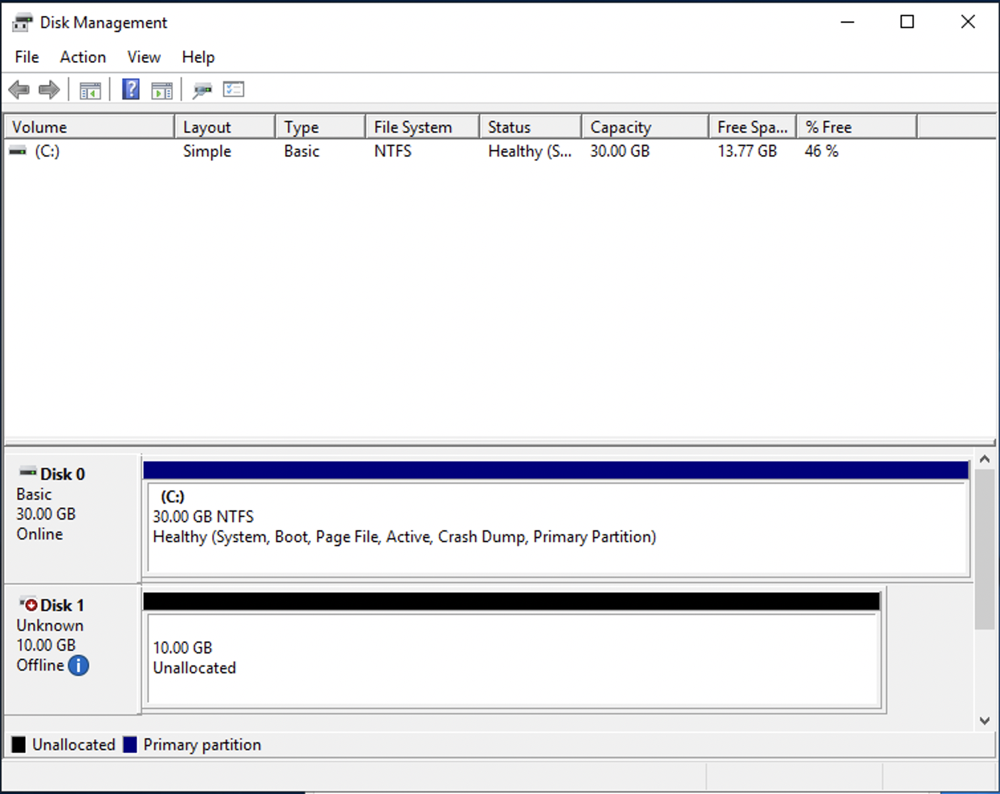
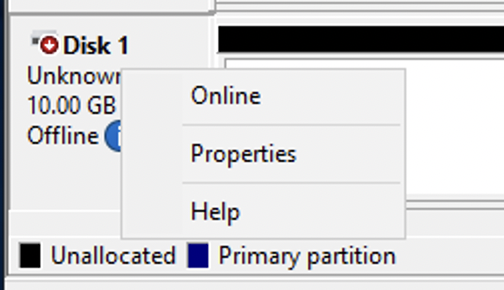

# Provisioning iSCSI for Windows

FSx for ONTAP supports the iSCSI protocol. You need to provision iSCSI on both the Windows client and the SVM and volume
in order to use the iSCSI protocol to transport data between clients and your file system. The iSCSI protocol is available
on all file systems that have 6 or fewer [high-availability (HA) pairs](HA-pairs.md "HA-pairs.md").

The examples presented in these procedures show how to provision the iSCSI protocol on the client and FSx for ONTAP
file system, and use the following set up:

- The iSCSI LUN that is getting mounted to a Windows host is already created.
  For more information, see [Creating an iSCSI LUN](create-iscsi-lun.md "create-iscsi-lun.md").
- The Microsoft Windows host that is mounting the iSCSI LUN is an Amazon EC2 instance
  running a Microsoft Windows Server 2019 Amazon Machine Image (AMI). It has VPC security
  groups configured to allow inbound and outbound traffic as described in
  [File System Access Control with Amazon VPC](limit-access-security-groups.md "limit-access-security-groups.md").

You may be using a different Microsoft Windows AMI in your set up.

- The client and the file system are located in
  the same VPC and AWS account. If the client is located in another VPC, you
  can use VPC peering or AWS Transit Gateway to grant other VPCs access to the iSCSI
  endpoints. For more information, see
  [Accessing data from outside the
  deployment VPC](supported-fsx-clients.md#access-from-outside-deployment-vpc "supported-fsx-clients.md#access-from-outside-deployment-vpc").

We recommend that the EC2 instance be in the same availability zone
as your file system's preferred subnet, as shown in the following graphic.


###### Topics

- [Configure iSCSI on the Windows client](#configure-iscsi-win-client "#configure-iscsi-win-client")
- [Configure iSCSI on the FSx for ONTAP file system](#configure-iscsi-on-ontap-win "#configure-iscsi-on-ontap-win")
- [Mount an iSCSI LUN on the Windows client](#configure-iscsi-on-fsx "#configure-iscsi-on-fsx")
- [Validating your iSCSI
  configuration](#validate-iscsi-windows "#validate-iscsi-windows")

## Configure iSCSI on the Windows client

1. Use Windows Remote Desktop to connect to the Windows client on which you want to mount the iSCSI LUN. For more information,
   see [Connect to your Windows instance using RDP](../../../AWSEC2/latest/WindowsGuide/connecting_to_windows_instance.md#connect-rdp "../../../AWSEC2/latest/WindowsGuide/connecting_to_windows_instance.md#connect-rdp") in the _Amazon Elastic Compute Cloud User
   Guide_.
2. Open a Windows PowerShell as an Administrator. Use the following commands to enable iSCSI on your Windows instance
   and configure the iSCSI service to start automatically.

```
`PS C:\>` `Start-Service MSiSCSI`
`PS C:\>` `Set-Service -Name msiscsi -StartupType Automatic`
```

3. Retrieve the initiator name of your Windows instance. You’ll use this value in configuring iSCSI on your FSx for ONTAP
   file system using the NetApp ONTAP CLI.

```
`PS C:\>` (Get-InitiatorPort).NodeAddress
```

The system responds with the initiator port:

```
iqn.1991-05.com.microsoft:ec2amaz-abc123d
```

4. To enable your clients to automatically failover between your file servers, you need install
   `Multipath-IO` (MPIO) on your Windows instance.
   Use the following command:

```
`PS C:\>` Install-WindowsFeature Multipath-IO
```

5. Restart your Windows instance after the `Multipath-IO` installation has completed.
   Keep your Windows instance open to perform steps for mounting the iSCSI LUN in a section that follows.

## Configure iSCSI on the FSx for ONTAP file system

1. To access the ONTAP CLI, establish an SSH session on the management port of the
   Amazon FSx for NetApp ONTAP file system or SVM by running the following command. Replace
   `management_endpoint_ip` with the IP address of the file system's
   management port.

```
`[~]$` `ssh fsxadmin@`management_endpoint_ip``
```

For more information, see [Managing file systems with the ONTAP CLI](managing-resources-ontap-apps.md#fsxadmin-ontap-cli "managing-resources-ontap-apps.md#fsxadmin-ontap-cli"). 2. Using the ONTAP CLI [**lun igroup create**](https://docs.netapp.com/us-en/ontap-cli-9141/lun-igroup-create.html "https://docs.netapp.com/us-en/ontap-cli-9141/lun-igroup-create.html"), create the initiator group, or `igroup`. An initiator group maps
to iSCSI LUNs and controls which initiators (clients) have access to LUNs. Replace `host_initiator_name`
with the initiator name from your Windows host that you retrieved in the previous procedure.

```
`::>` lun igroup create -vserver `svm_name` -igroup `igroup_name` -initiator `host_initiator_name` -protocol iscsi -ostype windows
```

Io make the LUNs mapped to this `igroup` available to multiple hosts, you can specify multiple
comma-separated initiator names using
[`lun igroup create`](https://docs.netapp.com/us-en/ontap-cli-9141/lun-create.html#parameters "https://docs.netapp.com/us-en/ontap-cli-9141/lun-create.html#parameters") ONTAP CLI command. 3. Confirm that the `igroup` was created successfully using the
[lun igroup show](https://docs.netapp.com/us-en/ontap-cli-9141/lun-igroup-show.html "https://docs.netapp.com/us-en/ontap-cli-9141/lun-igroup-show.html")
ONTAP CLI command:

```
`::>` `lun igroup show`
```

The system responds with the following output:

```
`Vserver Igroup Protocol OS Type Initiators
--------- ------------ -------- -------- ------------------------------------
`svm_name` `igroup_name` iscsi windows iqn.1994-05.com.windows:abcdef12345`
```

With the `igroup` created, you are ready to create LUNs and map them to the `igroup`. 4. This step assumes that you have already created an iSCSI LUN. If you have not, see [Creating an iSCSI LUN](create-iscsi-lun.md "create-iscsi-lun.md")
for step-by-step instructions to do so.

Create a LUN mapping from the LUN to your new `igroup`.

```
`::>` lun mapping create -vserver `svm_name` -path /vol/`vol_name`/`lun_name` -igroup `igroup_name` -lun-id `lun_id`
```

5. Confirm that the LUN is created, online, and mapped with the following command:

```
`::>` lun show -path /vol/`vol_name`/`lun_name`
Vserver     Path                            State   Mapped   Type     Size
---------   ------------------------------- ------- -------- -------- --------
`svm_name`    /vol/`vol_name`/`lun_name`          online  mapped   windows  10GB
```

You are now ready to add the iSCSI target on your Windows instance. 6. Retrieve the IP addresses of the `iscsi_1` and `iscsi_2`
interfaces for your SVM using the following command:

```
`::>` `network interface show -vserver `svm_name``
```

```
 `Logical Status Network Current Current Is
Vserver Interface Admin/Oper Address/Mask Node Port Home
----------- ---------- ---------- ------------------ ------------- ------- ----
`svm_name`
 iscsi_1 up/up 172.31.0.143/20 FSxId0123456789abcdef8-01
 e0e true
 iscsi_2 up/up 172.31.21.81/20 FSxId0123456789abcdef8-02
 e0e true
 nfs_smb_management_1
 up/up 198.19.250.177/20 FSxId0123456789abcdef8-01
 e0e true
3 entries were displayed.`
```

In this example, the IP address of `iscsi_1` is `172.31.0.143` and
`iscsi_2` is `172.31.21.81`.

## Mount an iSCSI LUN on the Windows client

1.  On your Windows instance, open a PowerShell terminal as an Administrator.
2.  You will create a `.ps1` script that does the following:

        * Connects to each of your file system’s iSCSI interfaces.
        * Adds and configures MPIO for iSCSI.
        * Establishes 8 sessions for each iSCSI connection, which enables
         the client to drive up to 40 Gbps (5,000 MBps) of aggregate
         throughput to the iSCSI LUN. Having 8 sessions ensures a single
         client can drive the full 4,000 MBps throughput capacity for the
         highest-level FSx for ONTAP throughput capacity. You can optionally
         change the number of sessions to a higher or lower number of
         sessions (each session provides up to 625 MBps of throughput) by
         modifying the `RecommendedConnectionCount` variable.
         For more information, see  [Amazon EC2 instance network bandwidth](../../../AWSEC2/latest/WindowsGuide/ec2-instance-network-bandwidth.md "../../../AWSEC2/latest/WindowsGuide/ec2-instance-network-bandwidth.md") in the
         *Amazon Elastic Compute Cloud User Guide for Windows
         Instances*.

    Copy the following set of commands into a file to create the `.psl` script.

        * Replace `iscsi_1` and `iscsi_2` with the IP addresses
         you retrieved in the previous step.
        * Replace `ec2_ip` with the IP address of your Windows instance.

```
Write-Host "Starting iSCSI connection setup..."
     $TargetPortalAddresses = @("iscsi_1","iscsi_2"); $LocaliSCSIAddress = "ec2_ip"
     $RecommendedConnectionCount = 8

     Foreach ($TargetPortalAddress in $TargetPortalAddresses) {
         New-IscsiTargetPortal -TargetPortalAddress $TargetPortalAddress -TargetPortalPortNumber 3260 -InitiatorPortalAddress $LocaliSCSIAddress
     }

     New-MSDSMSupportedHW -VendorId MSFT2005 -ProductId iSCSIBusType_0x9

     $currentMPIOSettings = Get-MPIOSetting
     if ($currentMPIOSettings.PathVerificationState -ne 'Enabled') {
         Write-Host "Setting MPIO path verification state to Enabled"; Set-MPIOSetting -NewPathVerificationState Enabled
     } else { Write-Host "MPIO path verification state already Enabled" }

     $portalConnectionCounts = @{}
     foreach ($TargetPortalAddress in $TargetPortalAddresses) { $portalConnectionCounts[$TargetPortalAddress] = 0 }

     $sessions = Get-IscsiSession
     if ($sessions) {
         foreach ($session in $sessions) {
             if ($session.IsConnected) {
                 $targetPortal = (Get-IscsiTargetPortal -iSCSISession $session).TargetPortalAddress
                 if ($portalConnectionCounts.ContainsKey($targetPortal)) { $portalConnectionCounts[$targetPortal]++ }
             }
         }
     }

     foreach ($TargetPortalAddress in $TargetPortalAddresses) {
         $existingCount = $portalConnectionCounts[$TargetPortalAddress]; $remainingConnections = $RecommendedConnectionCount - $existingCount
         Write-Host "Portal $TargetPortalAddress has $existingCount existing connections, $remainingConnections remaining (max recommended: $RecommendedConnectionCount)"
         if ($remainingConnections -gt 0) {
             Write-Host "Creating $remainingConnections connections for portal $TargetPortalAddress"
             1..$remainingConnections | ForEach-Object {
                 Get-IscsiTarget | Connect-IscsiTarget -IsMultipathEnabled $true -TargetPortalAddress $TargetPortalAddress -InitiatorPortalAddress $LocaliSCSIAddress -IsPersistent $true
             }
         } else { Write-Host "Maximum connections (8) reached for portal $TargetPortalAddress" }
     }

     Set-MSDSMGlobalDefaultLoadBalancePolicy -Policy RR
```

3. Launch the Windows Disk Management application. Open the Windows Run dialog box, and enter `diskmgmt.msc`
   and press **Enter**. The Disk Management application opens.

 4. Locate the unallocated disk This is the iSCSI LUN. In the example, Disk 1 is the iSCSI
disk. It is offline.



Bring the volume online by placing the cursor over **Disk 1** and right-click then choose **Online**.

###### Note

You can modify the storage area network (SAN) policy so that new volumes are automatically brought online.
For more information, see [SAN policies](https://docs.microsoft.com/en-us/windows-server/administration/windows-commands/san "https://docs.microsoft.com/en-us/windows-server/administration/windows-commands/san") in the _Microsoft Windows Server Command Reference_. 5. To initialize the disk, place the cursor over **Disk 1** right-click, and choose
**Initialize**. The Initialize dialog appears. Choose **OK**
initialize the disk. 6. Format the disk as you would normally. After formatting is complete, the
iSCSI drive appears as a usable drive on the Windows client.

## Validating your iSCSI

configuration

We have provided a script to check that your iSCSI setup is properly
configured. The script examines parameters such as session count, node distribution,
and Multipath I/O (MPIO) status. The following task explains how to install and use
the script.

###### To validate your iSCSI configuration

1. Open a Windows PowerShell window.
2. Download the script using the following command.

```
`PS C:\>` `Invoke-WebRequest "https://docs.aws.amazon.com/fsx/latest/ONTAPGuide/samples/CheckiSCSI.zip" -OutFile "CheckiSCSI.zip"`
```

3. Expand the zip file using the following command.

```
`PS C:\>` `Expand-Archive -Path ".\CheckiSCSI.zip" -DestinationPath "./"`
```

4. Run the script using the following command.

```
`PS C:\>` `./CheckiSCSI.ps1`
```

5. Review the output to understand your configuration's current state. The following example demonstrates a
   successful iSCSI configuration.

```
PS C:\> `./CheckiSCSI.ps1`
`This script checks the iSCSI configuration on the local instance.
It will provide information about the number of connected sessions, connected file servers, and MPIO status.

MPIO is installed on this server.

MPIO Load Balance Policy is set to Round Robin (RR).
Initiator: 'iqn.1991-05.com.microsoft:ec2amaz-d2cebnb'
to Target: 'iqn.1992-08.com.netapp:sn.13266b10e61411ee8bc0c76ad263d613:vs.3'
has 16 total sessions (16 active, 0 non-active)
spread across 2 node(s).
MPIO: Yes`


```
