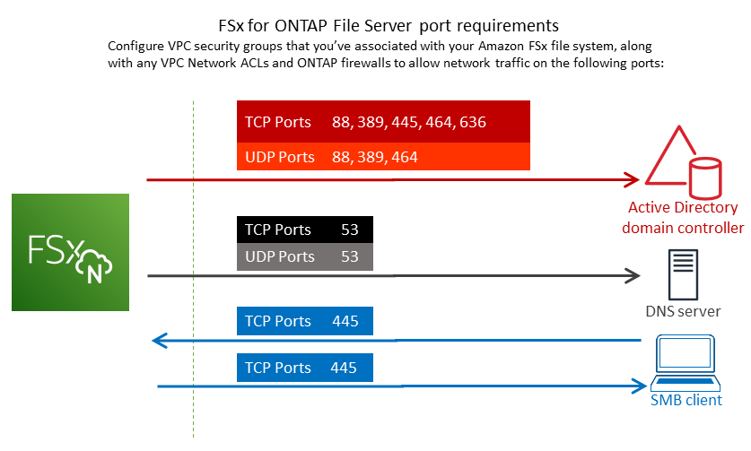

# Prerequisites for joining an SVM to a

self-managed Microsoft AD

Before you join an FSx for ONTAP SVM to a self-managed Microsoft AD domain, make sure that your
Active Directory and network meet the requirements described in the following sections.

###### Topics

- [On-premises Active Directory requirements](#ontap-ad-on-prem-prereqs "#ontap-ad-on-prem-prereqs")
- [Network configuration requirements](#ontap-ad-network-configs "#ontap-ad-network-configs")
- [Active Directory service account requirements](#ontap-ad-service-account-prereqs "#ontap-ad-service-account-prereqs")

## On-premises Active Directory requirements

Make sure that you already have an on-premises or other self-managed Microsoft AD that you can join the SVM to.
This Active Directory should have the following configuration:

- The Active Directory domain controller domain functional level is at Windows Server 2000
  or higher.
- The Active Directory uses a domain name that's not in the Single Label Domain (SLD) format. Amazon FSx
  doesn't support SLD domains.
- If you have Active Directory sites defined, make sure that the subnets in the VPC that's
  associated with your FSx for ONTAP file system are defined in the same Active Directory sites, and that
  no conflicts exist between your VPC subnets and the subnets on your Active Directory sites.

###### Note

If you are using Directory Service, FSx for ONTAP doesn't support joining SVMs to the Simple Active
Directory.

## Network configuration requirements

Make sure that you have the following network configurations in place and associated information available to you.

###### Important

For an SVM to join Active Directory, you need to ensure that the ports documented in this topic allow traffic
between all Active Directory Domain Controllers and both iSCSI IP addresses (iscsi_1 and iscsi_2 logical
interfaces (LIFs)) on the SVM.

- The DNS server and Active Directory domain controller IP addresses.
- Connectivity between the Amazon VPC where you're creating the file system and your
  self-managed Active Directory using [Direct Connect](https://aws.amazon.com/directconnect/ "https://aws.amazon.com/directconnect/"), [Site-to-Site VPN](https://aws.amazon.com/vpn/ "https://aws.amazon.com/vpn/"), or [AWS Transit Gateway](https://aws.amazon.com/transit-gateway/ "https://aws.amazon.com/transit-gateway/").
- The security group and the VPC Network ACLs for the subnets on which you're creating the
  file system must allow traffic on the ports and in the directions shown in the following
  diagram.

The role of each port is described in the following table.

| Protocol | Ports | Role                                                       |
| -------- | ----- | ---------------------------------------------------------- |
| TCP/UDP  | 53    | Domain Name System (DNS)                                   |
| TCP/UDP  | 88    | Kerberos authentication                                    |
| TCP/UDP  | 389   | Lightweight Directory Access Protocol (LDAP)               |
| TCP      | 445   | Directory Services SMB file sharing                        |
| TCP/UDP  | 464   | Change/Set password                                        |
| TCP      | 636   | Lightweight Directory Access Protocol over TLS/SSL (LDAPS) |

- These traffic rules should also be mirrored on the firewalls that apply to each of the
  Active Directory domain controllers, DNS servers, FSx clients, and FSx administrators.

###### Important

While Amazon VPC security groups require ports to be opened only in the direction that network traffic is initiated,
most Windows firewalls and VPC network ACLs require ports to be open in both directions.

## Active Directory service account requirements

Make sure that you have a service account in your self-managed Microsoft AD that has delegated permissions to join
computers to the domain. A _service account_ is a user
account in your self-managed Active Directory that has been delegated certain tasks.

At a minimum, the service account must be delegated the following permissions in the OU to
which you're joining the SVM:

- Ability to reset passwords
- Ability to restrict accounts from reading and writing data
- Ability to set the `msDS-SupportedEncryptionTypes` property on computer objects
- Validated ability to write to the DNS hostname
- Validated ability to write to the service principal name
- Ability to create and delete computer objects
- Validated ability to read and write Account Restrictions

These represent the minimum set of permissions that are required to join computer objects
to your Active Directory. For more information, see the Windows Server documentation topic [Error: Access is denied when non-administrator users who have been delegated control try
to join computers to a domain controller](https://support.microsoft.com/en-us/help/932455/error-message-when-non-administrator-users-who-have-been-delegated-con "https://support.microsoft.com/en-us/help/932455/error-message-when-non-administrator-users-who-have-been-delegated-con").

You can store your Active Directory service account credentials in AWS Secrets Manager (recommended) and provide Amazon FSx with a secret ARN to join your Active Directory, or you can provide plaintext credentials.

To learn more about creating a service account with the correct permissions, see
[Delegating permissions to your Amazon FSx service
account](self-managed-AD-best-practices.md#connect_delegate_privileges "self-managed-AD-best-practices.md#connect_delegate_privileges").

###### Important

Amazon FSx requires a valid service account throughout the lifetime of your Amazon FSx file system.
Amazon FSx must be able to fully manage the file system and perform tasks that require it to
unjoin and rejoin resources to your Active Directory domain. These tasks include replacing a failed file
system or SVM, or patching NetApp ONTAP software. Keep your Active Directory configuration information up
to date with Amazon FSx, including the service account credentials. To learn more, see [Keeping your Active Directory configuration updated with
Amazon FSx](self-managed-AD-best-practices.md#keep-ad-config-updated "self-managed-AD-best-practices.md#keep-ad-config-updated").

If this is your first time using AWS and FSx for ONTAP, make sure that you complete the
initial setup steps before starting your Active Directory integration. For more information, see [Setting up FSx for ONTAP](getting-started.md#setting-up "getting-started.md#setting-up").

###### Important

Don't move computer objects that Amazon FSx creates in the OU after your SVMs are created, or
delete your Active Directory while your SVM is joined to it. Doing so will cause your SVMs to become
misconfigured.
