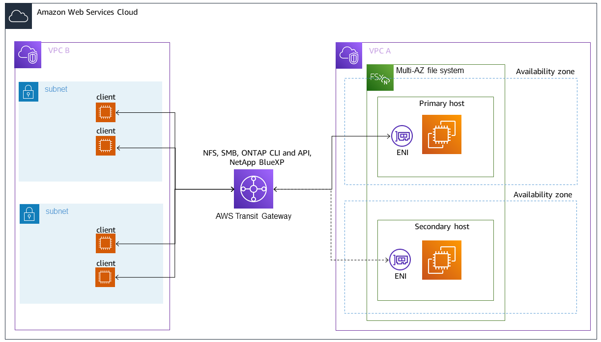
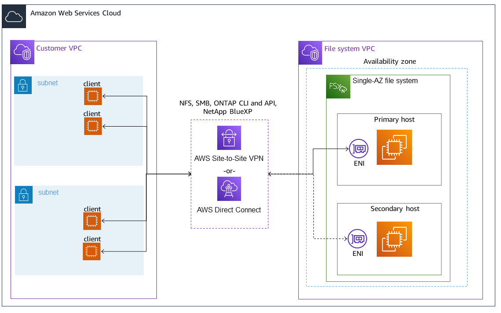

# Accessing your FSx for ONTAP data

You can access your Amazon FSx file systems using a variety of supported clients and methods in
both the AWS Cloud and on premises environments.

Each SVM has four endpoints that are used to access data or to manage the SVM using the
NetApp ONTAP CLI or REST API:

- `Nfs` – For connecting using the Network File System (NFS) protocol
- `Smb` – For connecting using the Service Message Block (SMB) protocol (If
  your SVM is joined to an Active Directory, or you're using a workgroup.)
- `Iscsi` – For connecting using the Internet Small Computer Systems Interface
  (iSCSI) protocol for shared block storage support.
- `Nvme` – For connecting using the Non-Volatile Memory Express (NVMe) over TCP/IP for shared block storage support.
- `Management` – For managing SVMs using the NetApp ONTAP CLI or API, or
  NetApp Console

###### Note

The iSCSI protocol is available on all file systems that have 6 or fewer
[high-availability pairs (HA) pairs](HA-pairs.md "HA-pairs.md"). The NVMe/TCP protocol is
available on second-generation file systems that have 6 or fewer HA pairs.

###### Topics

- [Supported clients](#supported-clients-fsx "#supported-clients-fsx")
- [Using block storage protocols](#using-block-storage "#using-block-storage")
- [Accessing data from within the AWS Cloud](#access-environments "#access-environments")
- [Accessing data from on-premises](#accessing-data-from-on-premises "#accessing-data-from-on-premises")
- [Configure routing to access Multi-AZ file systems from outside your VPC](configuring-routing-using-AWSTG.md "configuring-routing-using-AWSTG.md")
- [Configure routing to access Multi-AZ file systems from on-premises](configure-routing-maz-on-prem.md "configure-routing-maz-on-prem.md")
- [Mounting volumes on Linux clients](attach-linux-client.md "attach-linux-client.md")
- [Mounting volumes on Microsoft Windows
  clients](attach-windows-client.md "attach-windows-client.md")
- [Mounting volumes on macOS clients](attach-mac-client.md "attach-mac-client.md")
- [Provisioning iSCSI for Linux](mount-iscsi-luns-linux.md "mount-iscsi-luns-linux.md")
- [Provisioning iSCSI for Windows](mount-iscsi-windows.md "mount-iscsi-windows.md")
- [Provisioning NVMe/TCP for Linux](provision-nvme-linux.md "provision-nvme-linux.md")
- [Accessing your data via Amazon S3 access points](accessing-data-via-s3-access-points.md "accessing-data-via-s3-access-points.md")
- [Accessing data from other AWS
  services](using-fsx-with-other-AWS-services.md "using-fsx-with-other-AWS-services.md")

## Supported clients

FSx for ONTAP file systems support accessing data from a wide variety of compute
instances and operating systems. It does this by supporting access using the Network
File System (NFS) protocol (v3, v4.0, v4.1 and v4.2), all versions of the Server Message
Block (SMB) protocol (including 2.0, 3.0, and 3.1.1), and the Internet Small Computer
Systems Interface (iSCSI) protocol.

###### Important

Amazon FSx doesn't support accessing file systems from the public internet. Amazon FSx
automatically detaches any Elastic IP address which is a public IP address reachable from
the Internet, that gets attached to a file system's elastic network interface.

The following AWS compute instances are supported for use with FSx for ONTAP:

- Amazon Elastic Compute Cloud (Amazon EC2) instances running Linux with NFS or SMB support, Microsoft
  Windows, and MacOS. For more information see [Mounting volumes on Linux clients](attach-linux-client.md "attach-linux-client.md")
  [Mounting volumes on Microsoft Windows
  clients](attach-windows-client.md "attach-windows-client.md"), and
  [Mounting volumes on macOS clients](attach-mac-client.md "attach-mac-client.md").
- Amazon Elastic Container Service (Amazon ECS) Docker containers on Amazon EC2 Windows and Linux instances. For
  more information, see [Using Amazon Elastic Container Service with FSx for ONTAP](mount-ontap-ecs-containers.md "mount-ontap-ecs-containers.md").
- Amazon Elastic Kubernetes Service – To learn more, see [Amazon FSx for NetApp ONTAP CSI driver](../../../eks/latest/userguide/fsx-ontap.md "../../../eks/latest/userguide/fsx-ontap.md")
  in the _Amazon EKS User Guide_.
- Red Hat OpenShift Service on AWS (ROSA) – To learn more, see [What is
  Red Hat OpenShift Service on AWS?](../../../ROSA/latest/userguide/what-is-rosa.md "../../../ROSA/latest/userguide/what-is-rosa.md") in the Red Hat
  OpenShift Service on AWS User Guide.
- Amazon WorkSpaces instances. For more information, see [Using Amazon WorkSpaces with FSx for ONTAP](using-workspaces.md "using-workspaces.md").
- Amazon AppStream 2.0
  instances.
- AWS Lambda – For more information, see the AWS blog post [Enabling SMB access for server-less workloads with Amazon FSx](https://aws.amazon.com/blogs/storage/enabling-smb-access-for-serverless-workloads/ "https://aws.amazon.com/blogs/storage/enabling-smb-access-for-serverless-workloads/").
- Virtual machines (VMs) running in VMware Cloud on AWS environments. For more information, see [Configure Amazon FSx for NetApp ONTAP as External Storage](https://docs.vmware.com/en/VMware-Cloud-on-AWS/services/com.vmware.vmc-aws-operations/GUID-D55294A3-7C40-4AD8-80AA-B33A25769CCA.html?hWord=N4IghgNiBcIGYGcAeIC+Q "https://docs.vmware.com/en/VMware-Cloud-on-AWS/services/com.vmware.vmc-aws-operations/GUID-D55294A3-7C40-4AD8-80AA-B33A25769CCA.html?hWord=N4IghgNiBcIGYGcAeIC+Q")
  and [VMware Cloud on AWS with Amazon FSx for NetApp ONTAP Deployment Guide](https://vmc.techzone.vmware.com/fsx-guide#overview "https://vmc.techzone.vmware.com/fsx-guide#overview").

Once mounted, FSx for ONTAP file systems appear as a local directory or drive letter over
NFS and SMB, providing fully managed, shared network file storage that can be
simultaneously accessed by up to thousands of clients. iSCSI LUNS are accessible as
block devices when mounted over iSCSI.

## Using block storage protocols

Amazon FSx for NetApp ONTAP supports the Internet Small Computer Systems Interface (iSCSI) and
Non-Volatile Memory Express (NVMe) over TCP (NVMe/TCP) block storage protocols.
In Storage Area Network (SAN) environments, storage systems are targets that have storage
target devices. For iSCSI, the storage target devices are referred to as logical units (LUNs).
For NVMe/TCP, the storage target devices are referred to as namespaces.

You use an SVM's iSCSI logical interface (LIF) to connect to both NVMe and iSCSI block storage.

You configure storage by creating LUNs for iSCSI and by creating namespaces for NVMe.
LUNs and namespaces are then accessed by hosts using iSCSI or TCP protocols.

For more information about configuring iSCSI and NVMe/TCP block storage, see:

- [Provisioning iSCSI for Linux](mount-iscsi-luns-linux.md "mount-iscsi-luns-linux.md")
- [Provisioning iSCSI for Windows](mount-iscsi-windows.md "mount-iscsi-windows.md")
- [Provisioning NVMe/TCP for Linux](provision-nvme-linux.md "provision-nvme-linux.md")

## Accessing data from within the AWS Cloud

Each Amazon FSx file system is associated with a Virtual Private Cloud (VPC). You can
access your FSx for ONTAP file system from anywhere in the file system's VPC, regardless
of Availability Zone. You can also access your file system from other VPCs that
can be in different AWS accounts or AWS Regions. In addition to the requirements described in the
following sections for accessing FSx for ONTAP resources, you also need to ensure that your file
system's VPC security group is configured so that data and management traffic can flow between your file system and clients.
For more information about configuring security groups with the required ports, see
[Amazon VPC security groups](limit-access-security-groups.md#fsx-vpc-security-groups "limit-access-security-groups.md#fsx-vpc-security-groups").

### Accessing data from within the same VPC

When you create your Amazon FSx for NetApp ONTAP file system, you select the Amazon VPC in which it
is located. All SVMs and volumes associated with the Amazon FSx for NetApp ONTAP file system are
also located in the same VPC. When mounting a volume, if the file system and the client
mounting the volume are located in the same VPC and AWS account,
you can use the SVM's DNS name and volume junction or SMB share,
depending on the client.

You can achieve optimal performance if the client and the volume are located in the
in the same Availability Zone as the file system's subnet, or preferred subnet for Multi-AZ file systems. To
identify a file system's subnet or preferred subnet, in the Amazon FSx console, choose
**File systems**, then choose the ONTAP file system whose
volume you are mounting, and the subnet or preferred subnet (Multi-AZ) is displayed in the
**Subnet** or **Preferred subnet** panel.

### Accessing data from outside the

deployment VPC

This section describes how to access an FSx for ONTAP file system's endpoints from AWS locations
outside of the file system's deployment VPC.

#### Accessing NFS, SMB, and

ONTAP management endpoints on Multi-AZ file systems

The NFS, SMB, and ONTAP management endpoints on Amazon FSx for NetApp ONTAP Multi-AZ file systems use
floating internet protocol (IP) addresses so that connected clients seamlessly
transition between the preferred and standby file servers during a failover event.
For more information about failovers, see
[Failover process for FSx for ONTAP](high-availability-AZ.md#Failover "high-availability-AZ.md#Failover").

These floating IP addresses are created in the VPC route tables that you associate
with your file system, and are within the file system's `EndpointIPv4AddressRange`
or `EndpointIPv6AddressRange`
which you specify during creation. The endpoint IP address range uses the
following address ranges, depending on how a file system is created:

- Multi-AZ dual-stack file systems created with the Amazon FSx console or Amazon FSx API by default
  use an available /118 IP address range selected by Amazon FSx from one of the VPC's
  CIDR ranges. You can have overlapping endpoint IP addresses for file systems deployed in
  the same VPC/route tables, as long as they don't overlap with any subnet.
- Multi-AZ IPv4-only file systems created using the Amazon FSx console use the last
  64 IP addresses in the VPC's primary CIDR range for the file system's
  endpoint IP address range by default.

Multi-AZ IPv4-only file systems created using the AWS CLI or Amazon FSx API use
an IP address range within the `198.19.0.0/16` address block
for the endpoint IP address range by default.

- For either network type, you can also specify your own IP address range when you use the
  **Standard create** option. The IP address range that you choose can either be
  inside or outside the VPC’s IP address range, as long as it doesn't overlap with any subnet, and
  as long as it isn't already used by another file system with the same VPC and route tables.
  For this option we recommend using a range that is inside the VPC's IP address range.

Only [AWS Transit Gateway](https://aws.amazon.com/transit-gateway/?whats-new-cards.sort-by=item.additionalFields.postDateTime&whats-new-cards.sort-order=desc "https://aws.amazon.com/transit-gateway/?whats-new-cards.sort-by=item.additionalFields.postDateTime&whats-new-cards.sort-order=desc") supports routing to floating IP addresses, which is also known as transitive peering.
VPC Peering, Direct Connect, and Site-to-Site VPN don't support transitive peering. Therefore,
you are required to use Transit Gateway in order to access these interfaces from networks that are outside of
your file system's VPC.

The following diagram illustrates using Transit Gateway for NFS, SMB, or management access to a Multi-AZ
file system that is in a different VPC than the clients that are accessing it.

###### Note

Ensure that all of the route tables you're using are associated with
your Multi-AZ file system. Doing so helps prevent unavailability during a failover.
For information about associating your Amazon VPC route tables with your file system, see
[Updating file systems](updating-file-system.md "updating-file-system.md").

For information about when you need to use Transit Gateway to access your FSx for ONTAP file system, see
[When is Transit Gateway
required?](#when-is-transit-gateway-required "#when-is-transit-gateway-required").

Amazon FSx manages VPC route tables for Multi-AZ file systems using tag-based authentication.
These route tables are tagged with `Key: AmazonFSx; Value: ManagedByAmazonFSx`.
When creating or updating FSx for ONTAP Multi-AZ file systems using CloudFormation we recommend that you add the
`Key: AmazonFSx; Value: ManagedByAmazonFSx` tag manually.

#### Accessing NFS, SMB, or

the ONTAP CLI and API for Single-AZ file systems

The endpoints used to access FSx for ONTAP Single-AZ file systems over NFS or
SMB, and for administering file systems using the ONTAP CLI or REST API, are
secondary IP addresses on the ENI of the active file server. The secondary IP
addresses are within the VPC’s CIDR range, so clients can access data and
management ports using VPC Peering, AWS Direct Connect, or Site-to-Site VPN without requiring AWS Transit Gateway.

The following diagram illustrates using Site-to-Site VPN or Direct Connect for NFS, SMB, or management access
to a Single-AZ file system that is in a different VPC than the clients accessing it.

#### When is Transit Gateway

required?

Whether or not Transit Gateway is required for your Multi-AZ file systems depends on
the method you use to access your file system data. Single-AZ file systems do
not require Transit Gateway. The following table describes when you will need to use AWS Transit Gateway
to access Multi-AZ file systems.

| Data access                                                                          | Requires Transit Gateway?                                                                                                                                                   |
| ------------------------------------------------------------------------------------ | --------------------------------------------------------------------------------------------------------------------------------------------------------------------------- |
| Accessing FSx over NFS, SMB, or the NetApp ONTAP REST API, CLI. or NetApp Console | Only if: • Accessing from a peered (on-premises, for example) network, and • You are not accessing FSx through a NetApp FlexCache or Global File Cache instance |
| Accessing data over iSCSI                                                            | No                                                                                                                                                                          |
| Accessing data over NVMe                                                             | No                                                                                                                                                                          |
| Joining an SVM to an Active Directory                                                | No                                                                                                                                                                          |
| SnapMirror                                                                           | No                                                                                                                                                                          |
| FlexCache Caching                                                                    | No                                                                                                                                                                          |
| Global File Cache                                                                    | No                                                                                                                                                                          |

#### Accessing NVMe, iSCSI and inter-cluster endpoints outside of the deployment

VPC

You can use either VPC Peering or AWS Transit Gateway to access your file system's NVMe, iSCSI, and inter-cluster endpoints
from outside of the file system's deployment VPC. You can use VPC Peering to route NVMe, iSCSI,
and inter-cluster traffic between VPCs. A VPC peering connection is a
networking connection between two VPCs, and is used
to route traffic between them using private IPv4 or IPv6 addresses. You can use VPC
peering to connect VPCs within the same AWS Region or between different AWS Regions.
For more information on VPC peering, see
[What is VPC peering?](../../../vpc/latest/peering/what-is-vpc-peering.md "../../../vpc/latest/peering/what-is-vpc-peering.md") in the _Amazon VPC
Peering Guide_.

## Accessing data from on-premises

You can access your FSx for ONTAP file systems from on-premises using [Site-to-Site VPN](https://aws.amazon.com/vpn/ "https://aws.amazon.com/vpn/") and [Direct Connect](https://aws.amazon.com/getting-started/projects/connect-data-center-to-aws/ "https://aws.amazon.com/getting-started/projects/connect-data-center-to-aws/"); more specific use case guidelines are available in the following
sections. In addition to any requirements listed below for accessing different
FSx for ONTAP resources from on-premises, you also need to ensure that your file system's
VPC security group allows data to flow between your file system and clients; for a list
of required ports, see [Amazon VPC security groups](limit-access-security-groups.md#fsx-vpc-security-groups "limit-access-security-groups.md#fsx-vpc-security-groups").

### Accessing

NFS, SMB, and ONTAP CLI and REST API endpoints from on-premises

This section describes how to access the NFS, SMB, and ONTAP management ports on FSx for ONTAP file systems
from on-premises networks.

#### Accessing Multi-AZ file systems from on-premises

Amazon FSx requires that you use AWS Transit Gateway or that you configure remote NetApp
Global File Cache or NetApp FlexCache to access Multi-AZ file systems from an
on-premises network. In order to support failover across availability zones for Multi-AZ file
systems, Amazon FSx uses floating IP addresses for the interfaces used for NFS, SMB,
and ONTAP management endpoints.

Because the NFS, SMB, and management endpoints use floating IP addresses, you must use
[AWS Transit Gateway](https://aws.amazon.com/transit-gateway/?whats-new-cards.sort-by=item.additionalFields.postDateTime&whats-new-cards.sort-order=desc "https://aws.amazon.com/transit-gateway/?whats-new-cards.sort-by=item.additionalFields.postDateTime&whats-new-cards.sort-order=desc") in conjunction with AWS Direct Connect or Site-to-Site VPN to access
these interfaces from an on-premises network. The floating IP addresses used for
these interfaces are within the `EndpointIPv4AddressRange` or `EndpointIPv6AddressRange` you specify
when creating your Multi-AZ file system. The endpoint IP address range uses the
following address ranges, depending on how a file system is created:

- Multi-AZ dual-stack file systems created with the Amazon FSx console or Amazon FSx API by default
  use an available /118 IP address range selected by Amazon FSx from one of the VPC's
  CIDR ranges. You can have overlapping endpoint IP addresses for file systems deployed in
  the same VPC/route tables, as long as they don't overlap with any subnet.
- Multi-AZ IPv4-only file systems created using the Amazon FSx console use the last
  64 IP addresses in the VPC's primary CIDR range for the file system's
  endpoint IP address range by default.

Multi-AZ IPv4-only file systems created using the AWS CLI or Amazon FSx API use
an IP address range within the `198.19.0.0/16` address block
for the endpoint IP address range by default.

- For either network type, you can also specify your own IP address range when you use the
  **Standard create** option. The IP address range that you choose can either be
  inside or outside the VPC’s IP address range, as long as it doesn't overlap with any subnet, and
  as long as it isn't already used by another file system with the same VPC and route tables.
  For this option we recommend using a range that is inside the VPC's IP address range.

The floating IP addresses are used to enable a seamless transition of your clients to the
standby file system in the event a failover is required. For more information,
see [Failover process for FSx for ONTAP](high-availability-AZ.md#Failover "high-availability-AZ.md#Failover").

###### Important

To access a Multi-AZ file system using a Transit Gateway, each of the Transit Gateway's attachments
must be created in a subnet whose route table is associated with your file system.

For more information, see [Configure routing to access Multi-AZ file systems from on-premises](configure-routing-maz-on-prem.md "configure-routing-maz-on-prem.md").

#### Accessing Single-AZ file systems from on-premises

The requirement to use AWS Transit Gateway to access data from an on-premises network
doesn’t exist for Single-AZ file systems. Single-AZ file systems are deployed in a
single subnet, and a floating IP address is not required to provide failover
between nodes. Instead, the IP addresses you access on Single-AZ file systems are
implemented as secondary IP addresses within the file system’s VPC CIDR range,
enabling you to access your data from another network without requiring
AWS Transit Gateway.

### Accessing

inter-cluster endpoints from on-premises

FSx for ONTAP’s inter-cluster endpoints are dedicated to replication traffic between
NetApp ONTAP file systems, including between on-premises NetApp deployments and
FSx for ONTAP. Replication traffic includes SnapMirror, FlexCache, and FlexClone
relationships between storage virtual machines (SVMs) and volumes across different
file systems, and NetApp Global File Cache. The inter-cluster endpoints are also
used for Active Directory traffic.

Because a file system's inter-cluster endpoints use IP addresses that are within the CIDR
range of the VPC you provide when you create your FSx for ONTAP file system, you are not required
to use a Transit Gateway for routing inter-cluster traffic between on-premises and
the AWS Cloud. However, on-premises clients still must use Site-to-Site VPN or Direct Connect to
establish a secure connection to your VPC.

For more information, see [Configure routing to access Multi-AZ file systems from on-premises](configure-routing-maz-on-prem.md "configure-routing-maz-on-prem.md").
