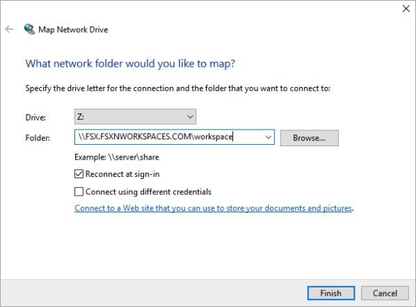
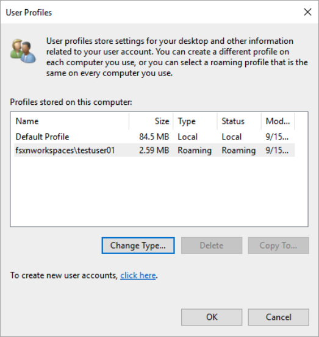
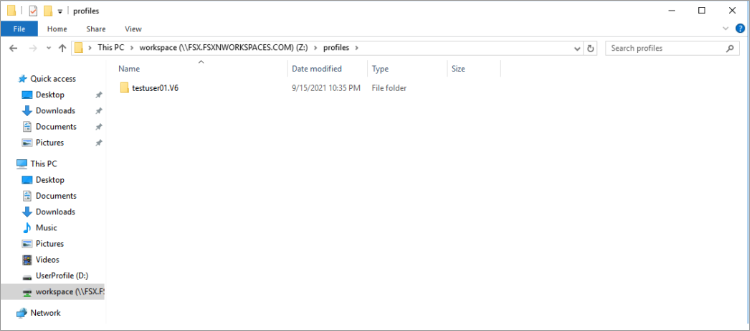
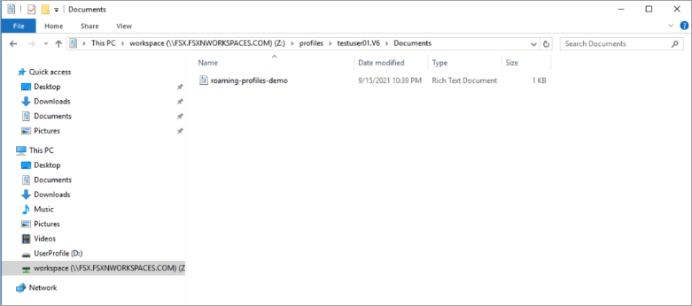
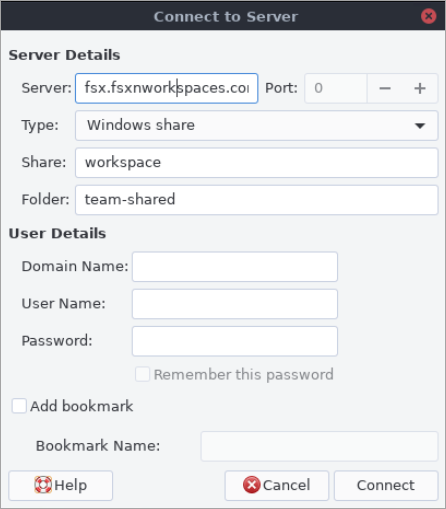
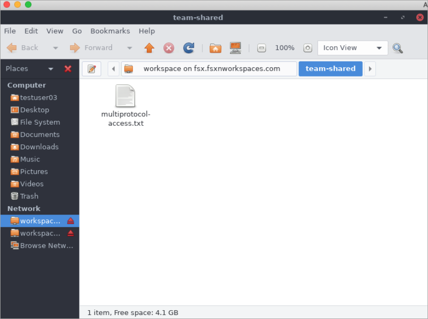

# Using Amazon WorkSpaces with FSx for ONTAP

FSx for ONTAP can be used with Amazon WorkSpaces to provide shared network-attached storage
(NAS) or to store roaming profiles for Amazon WorkSpaces accounts. After connecting to an SMB
file share with a WorkSpaces instance, the user can create and edit files on the file share.

The following procedures shows how to use Amazon FSx with Amazon WorkSpaces to provide roaming
profile and home folder access a consistent experience and to provide a shared team
folder for Windows and Linux WorkSpaces users. If you are new to Amazon WorkSpaces, you can create
your first Amazon WorkSpaces environment with the instructions in
[Get started with WorkSpaces Quick Setup](../../../workspaces/latest/adminguide/getting-started.md "../../../workspaces/latest/adminguide/getting-started.md")
in the _Amazon WorkSpaces Administration Guide_.

###### Topics

- [Provide Roaming Profile support](#workspace-roaming-profile "#workspace-roaming-profile")
- [Provide a shared folder to access common files](#workspace-shared-folder "#workspace-shared-folder")

## Provide Roaming Profile support

You can use Amazon FSx to provide Roaming Profile support to users in your organization.
A user will have permissions to access only their Roaming Profile. The folder will be
automatically connected using Active Directory Group Policies. With a Roaming Profile,
users’ data and desktop settings are saved when they log off an Amazon FSx file share
enabling documents and settings to be shared between different WorkSpaces instances,
and automatically backed up using Amazon FSx daily automatic backups.

###### Step 1: Create a profile folder location for domain users using Amazon FSx

1. Create an FSx for ONTAP file system using the Amazon FSx console. For more information,
   see [To create a file system
   (console)](creating-file-systems.md#create-MAZ-file-system-console "creating-file-systems.md#create-MAZ-file-system-console").

###### Important

Each FSx for ONTAP file system has an endpoint IP address range from which
the endpoints associated with the file system are created. For multi-AZ file systems, FSx for ONTAP chooses
a default unused IP address range from 198.19.0.0/16 as the endpoint IP address range.
This IP address range is also used by WorkSpaces for management traffic range,
as described in [IP address
and port requirements for WorkSpaces](../../../workspaces/latest/adminguide/workspaces-port-requirements.md "../../../workspaces/latest/adminguide/workspaces-port-requirements.md") in
the _Amazon WorkSpaces Administration Guide_. As a result, to access
your _multi-AZ_ FSx for ONTAP file system from WorkSpaces, you
must select an endpoint IP address range that does not overlap with 198.19.0.0/16. 2. If you don't have a storage virtual machine (SVM) joined to an Active Directory,
create one now. For example, you can provision an SVM named `fsx` and set the
security style to `NTFS`. For more information, see [To create a storage virtual machine
(console)](creating-svms.md#create-svm-console "creating-svms.md#create-svm-console"). 3. Create a volume for your SVM. For example, you can create a volume named
`fsx-vol` which inherits the security style of your SVM's
root volume. For more information, see [To create a FlexVol volume (console)](creating-volumes.md#create-volume-console "creating-volumes.md#create-volume-console"). 4. Create an SMB share on your volume. For example, you can create a share called
`workspace` on your volume named `fsx-vol`, in which you
create a folder named `profiles`. For more information, see [Managing SMB shares](create-smb-shares.md "create-smb-shares.md"). 5. Access your Amazon FSx SVM from an Amazon EC2 instance running Windows Server or from a
WorkSpace. For more information, see [Accessing your FSx for ONTAP data](supported-fsx-clients.md "supported-fsx-clients.md"). 6. You map your share to `Z:\` on your Windows WorkSpaces instance:



###### Step 2: Link the FSx for ONTAP file share to User Accounts

1. On your test user's WorkSpace, choose **Windows > System > Advanced System Settings**.
2. In **System Properties**, select the **Advanced** tab
   and press the **Settings** button in the **User Profiles**
   section. The logged-in user will have a profile type of `Local`.
3. Log out the test user from the WorkSpace.
4. Set the test user to have a roaming profile located on your Amazon FSx file system. In your
   administrator WorkSpaces, open a PowerShell console and use a command similar to the following
   example (which uses the `profiles` folder you previously created in Step 1):

```
`Set-ADUser `username` -ProfilePath \\`filesystem-dns-name`\`sharename`\`foldername`\`username``
```

For example:

```
`Set-ADUser testuser01 -ProfilePath \\fsx.fsxnworkspaces.com\workspace\profiles\testuser01`
```

5. Log on to the test user WorkSpace.
6. In **System Properties**, select the **Advanced** tab
   and press the **Settings** button in the **User Profiles**
   section. The logged-in user will have a profile type of `Roaming`.

 7. Browse the FSx for ONTAP shared folder. In the `profiles` folder, you'll see a folder for the user.

 8. Create a document in the test user's `Documents` folder 9. Log out the test user from their WorkSpace. 10. If you log back on as the test user and browse to their profile store, you will see the
document you created.



## Provide a shared folder to access common files

You can use Amazon FSx to provide a shared folder to users in your organization. A shared folder
can be used to store files used by your user community, such as demo files, code examples, and
instruction manuals needed by all users. Typically, you have drives mapped for shared folders;
however because mapped drives use letters, there’s a limit to the number of shares you can have.
This procedure creates an Amazon FSx shared folder that’s available without a drive letter, giving
you greater flexibility in assigning shares to teams.

###### To mount a shared folder for cross-platform access from both Linux and Windows WorkSpaces

1.  From the **Taskbar**, choose **Places > Connect to Server**.

        1. For **Server**, enter `file-system-dns-name`.
        2. Set **Type** to `Windows share`.
        3. Set **Share** to the name of the SMB share, such as `workspace`.
        4. You can leave **Folder** as `/` or set it to a folder,
         such as a folder named `team-shared`.
        5. For a Linux WorkSpace, you don't need to enter your user details if your Linux
         WorkSpace is in the same domain as the Amazon FSx share.
        6. Choose **Connect**.

    

2.  After the connection is made, you can see the shared folder (named `team-shared` in this example)
    in the SMB share named `workspace`.


