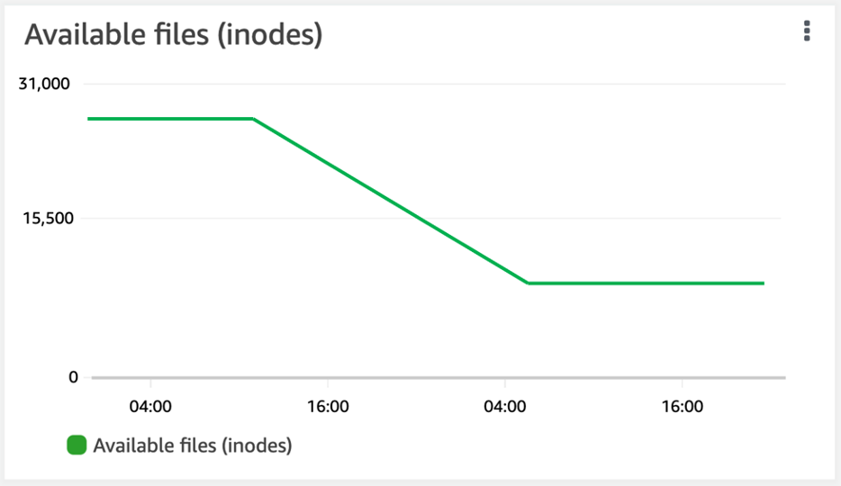

# Monitoring a volume's file capacity

You can use either of the following methods to view the maximum number of files allowed and the
number of files already used on a volume.

- The CloudWatch volume metrics `FilesCapacity` and `FilesUsed`.
- In the Amazon FSx console, navigate to the **Available files (inodes)** chart in your volume's **Monitoring**
  tab. The following image shows the **Available files (inodes)** on a volume decreasing over time.

