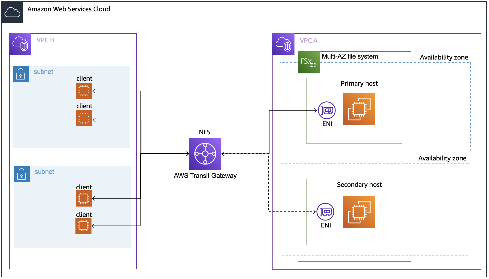

# Accessing your data within the AWS Cloud

Amazon VPC helps you to launch AWS resources into a virtual network that you define.
This virtual network closely resembles a traditional network that you operate in
your own data center, with the benefits of using the scalable infrastructure of
AWS. For more information, see [What is Amazon VPC](../../../vpc/latest/userguide/what-is-amazon-vpc.md "../../../vpc/latest/userguide/what-is-amazon-vpc.md") in the
_Amazon Virtual Private Cloud User Guide_.

Each Amazon FSx file system is associated with a Virtual Private Cloud (VPC). You can access your FSx for OpenZFS file system
from anywhere in the same VPC within which it is deployed regardless of the Availability Zone (AZ). You can also access
your file system from other VPCs. These VPCs can be in different accounts or regions. In addition to any requirements
listed in the following sections for accessing FSx for OpenZFS resources, you also need to ensure that your file system's
VPC security group has the correct settings. It needs to allow data to flow between your file system and any clients
that connect to it. For more information, see [Amazon VPC security groups](limit-access-security-groups.md#fsx-vpc-security-groups "limit-access-security-groups.md#fsx-vpc-security-groups").

###### Topics

- [Access from within the same VPC](#same-vpc-access "#same-vpc-access")
- [Access from a different VPC](#vpc-peering "#vpc-peering")

## Access from within the same VPC

When you create your Amazon FSx for OpenZFS file system, you select the Amazon VPC in which it is located.
All volumes associated with the FSx for OpenZFS file system are also located in the same VPC.
When the file system and the client mounting the volume
are located in the same VPC and AWS account, you can mount a volume using
the file system's DNS name over the NFS protocol. For more information,
see [Step 2: Mount your file system from an Amazon EC2 instance](getting-started.md#getting-started-step2 "getting-started.md#getting-started-step2").

You can achieve better performance and avoid data transfer charges by accessing an FSx for OpenZFS volume using a client in the same Availability Zone as the
file system's subnet. To identify a file system's subnet, choose
**File systems** in the Amazon FSx console, then choose the FSx for OpenZFS file system whose volume you are mounting.
The subnet or preferred subnet (Multi-AZ) is displayed in the **Subnet** or **Preferred subnet** panel.

Accessing a Single-AZ file system using a client located in a different Availability Zone results in data transfer charges. There are no data transfer charges for
accessing a Multi-AZ file system from any Availability Zone in the same region.

## Access from a different VPC

The process of accessing your data from an AWS Region outside of the file system's VPC differs between Single-AZ and Multi-AZ file systems, as Multi-AZ file systems utilize a floating IP address. The following sections describe how to access your file systems from a different VPC depending on deployment type.

### Accessing Single-AZ file systems

You can access your FSx for OpenZFS file system from compute instances in a different
VPC, AWS account, or AWS Region from that associated with your file system by using VPC peering or transit gateways. When you use a VPC peering
connection or transit gateway to connect VPCs, compute instances that are in one VPC
can access Amazon FSx file systems in another VPC. This access is possible even if the
VPCs belong to different AWS accounts, and even if the VPCs reside in different AWS Regions.

A _VPC peering connection_ is a networking connection between
two VPCs that you can use to route traffic between them using private IPv4 or IPv6 addresses. You can use VPC peering to connect VPCs within the same
AWS Region or between AWS Regions. For more information on VPC peering, see [What is VPC peering?](../../../vpc/latest/peering/what-is-vpc-peering.md "../../../vpc/latest/peering/what-is-vpc-peering.md") in the _Amazon Virtual Private Cloud VPC Peering Guide_.

A _transit gateway_ is a network transit hub that you can use
to interconnect your VPCs and on-premises networks. For more information, see
[Work
with transit gateways](../../../vpc/latest/tgw/working-with-transit-gateways.md "../../../vpc/latest/tgw/working-with-transit-gateways.md") in the
_Amazon VPC Transit Gateways_.

### Accessing Multi-AZ file systems

The NFS endpoints on FSx for OpenZFS Multi-AZ file systems use
floating IP addresses so that connected clients seamlessly
transition between the preferred and standby file servers during a failover event.
For more information about failovers, see
[Failover process for FSx for OpenZFS](availability-durability.md#multi-az-failover "availability-durability.md#multi-az-failover").

When you create a file system, you can optionally specify the endpoint IP address range in which these floating IP addresses are created.
By default, the Amazon FSx API selects a CIDR block of 16 available addresses from within the VPC's CIDR ranges.
Additionally, you can optionally specify the VPC route tables in which rules for routing traffic to the correct file server will be created. By default, the Amazon FSx API selects
the VPC's default route table.

Only [AWS Transit Gateway](https://aws.amazon.com/transit-gateway/?whats-new-cards.sort-by=item.additionalFields.postDateTime&whats-new-cards.sort-order=desc "https://aws.amazon.com/transit-gateway/?whats-new-cards.sort-by=item.additionalFields.postDateTime&whats-new-cards.sort-order=desc") supports routing to floating IP addresses, which is also known as transitive peering.
VPC Peering, AWS Direct Connect, and AWS VPN don't support transitive peering. Therefore,
you are required to use Transit Gateway in order to access these interfaces from networks that are outside of
your file system's VPC.

When you access your Multi-AZ file system from outside of the file system's VPC, FSx for OpenZFS will manage routing configurations
as long as the file system's endpoint IP address range is within the CIDR range of the file system's VPC and does not overlap with the CIDR range of any subnets in the VPC. However, if you access
your Multi-AZ file system from outside of the file system's VPC, and the file system's endpoint IP address range is outside of
the CIDR range of the file system's VPC, you will need to set up additional routing in Transit Gateway. For information on how to configure Transit Gateway to access your FSx for OpenZFS file system, see
[Configuring routing using
AWS Transit Gateway](#configuring-routing-using-AWSTG "#configuring-routing-using-AWSTG").

The following diagram illustrates using Transit Gateway for NFS access to a Multi-AZ
file system that is in a different VPC than the clients that are accessing it.

###### Note

Ensure that all of the route tables you're using are associated with
your Multi-AZ file system. Doing so helps prevent loss of availability during a failover.
For information about associating your Amazon VPC route tables with your file system, see
[Updating an Amazon FSx for OpenZFS file system](updating-file-system.md "updating-file-system.md").

### Configuring routing using

AWS Transit Gateway

If you have a Multi-AZ file system with an endpoint IP address range
that's outside your VPC's CIDR range, you need to set up additional routing
in your AWS Transit Gateway to access your file system from peered or on-premises networks.
No additional Transit Gateway configuration is required for Single-AZ file systems
or Multi-AZ file systems with an endpoint IP address range that's within
your VPC's IP address range.

###### Important

To access a Multi-AZ file system using a Transit Gateway, each of the Transit Gateway's attachments
must be created in a subnet whose route table is associated with your file system.

###### To configure routing using AWS Transit Gateway

1. Open the Amazon FSx console at [https://console.aws.amazon.com/fsx/](https://console.aws.amazon.com/fsx/ "https://console.aws.amazon.com/fsx/").
2. Choose the FSx for OpenZFS file system for which you are configuring
   access from a peered network.
3. In **Network & security** copy the
   endpoint IP address range.
4. Add a route to Transit Gateway that routes traffic destined for this IP
   address range to your file system's VPC. For more information, see
   [Work
   with transit gateways](../../../vpc/latest/tgw/working-with-transit-gateways.md "../../../vpc/latest/tgw/working-with-transit-gateways.md") in the
   _Amazon VPC Transit Gateways_.
5. Confirm that you can access your FSx for OpenZFS file system from the
   peered network.

To add the route table to your file system, see [Updating an Amazon FSx for OpenZFS file system](updating-file-system.md "updating-file-system.md").

###### Note

DNS records for the NFS endpoints are only
resolvable from within the same VPC as the file system. In order to
mount a volume or connect to a management port from another network, you
need to use the endpoint's IP address. These IP addresses do not change
over time.
