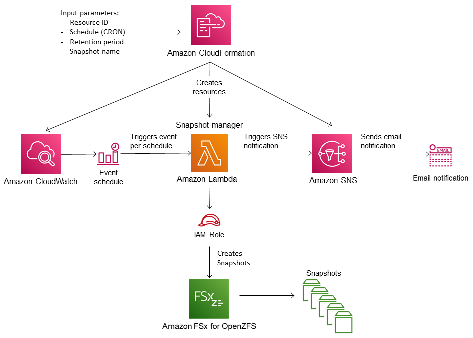

# Setting up a custom snapshot schedule

You can set up a automated custom snapshot schedule for FSx for OpenZFS volumes using the resources
and configuration template provided in this topic. The custom snapshot scheduling solution
performs user-initiated snapshots of your Amazon FSx volumes on a custom
schedule that you define. For example, you can configure a custom schedule to take a snapshot
every hour and automatically delete snapshots that are older than two days.

For more information on CRON schedule patterns, see [Schedule expressions for rules](../../../eventbridge/latest/userguide/eb-create-rule-schedule.md "../../../eventbridge/latest/userguide/eb-create-rule-schedule.md") in the
_Amazon CloudWatch Events User Guide_.

## Architecture overview

Deploying this solution builds the following resources in the AWS Cloud:



The diagram illustrates the following custom snapshot schedule workflow:

1. The solution CloudFormation template deploys an CloudWatch Event, an AWS Lambda function, an Amazon Simple Notification Service (Amazon SNS) queue, and an IAM
   role. The IAM role gives the Lambda function permission to invoke the necessary Amazon FSx API
   operations.
2. The CloudWatch event runs on a schedule you define as a CRON pattern, during the initial
   deployment. This event invokes the solution’s snapshot manager Lambda function that invokes the
   Amazon FSx `CreateSnapshot` API operation to initiate a snapshot.
3. The snapshot manager retrieves a list of existing user-initiated snapshots for the specified
   volume using `DescribeSnapshots`. It then deletes snapshots older than the retention
   period, which you specify during the initial deployment.
4. The snapshot manager sends a notification message to the Amazon SNS queue on a successful snapshot
   if you choose the option to be notified during the initial deployment. A notification is always
   sent in the event of a failure.

### Required permissions

The following permissions are required to use the custom snapshot schedule CloudFormation template:

- `AWSCloudFormationFullAccess`
- `AmazonS3FullAccess`
- `AmazonEventBridgeFullAccess`
- `IAMFullAccess`
- `AmazonSNSFullAccess`
- `AWSKeyManagementServicePowerUser`
- `AWSLambda_FullAccess`

## CloudFormation template

This solution uses CloudFormation to automate the deployment of the Amazon FSx custom snapshot scheduling
solution. To use this solution, download the [fsx-openzfs-scheduled-snapshot.template](https://solution-references.s3.amazonaws.com/fsx/snapshot/fsx-openzfs-scheduled-snapshot.yaml "https://solution-references.s3.amazonaws.com/fsx/snapshot/fsx-openzfs-scheduled-snapshot.yaml") CloudFormation template.

## Automated deployment

The following procedure configures and deploys this custom snapshot scheduling solution. It
takes about five minutes to deploy. Before you start, you must have the ID of a volume on an Amazon FSx file
system running in an Amazon Virtual Private Cloud (Amazon VPC) in your AWS account. For more information on creating
these resources, see [Creating an Amazon FSx for OpenZFS volume](creating-volumes.md "creating-volumes.md").

###### Note

Implementing this solution incurs billing for the associated AWS services. For more
information, see the pricing details pages for those services.

###### To launch the custom snapshot solution stack

1. Download the [fsx-openzfs-scheduled-snapshot.template](https://solution-references.s3.amazonaws.com/fsx/snapshot/fsx-openzfs-scheduled-snapshot.yaml "https://solution-references.s3.amazonaws.com/fsx/snapshot/fsx-openzfs-scheduled-snapshot.yaml") CloudFormation template. For more information on creating an
   CloudFormation stack, see [Creating a stack on
   the AWS CloudFormation console](../../../AWSCloudFormation/latest/UserGuide/cfn-console-create-stack.md "../../../AWSCloudFormation/latest/UserGuide/cfn-console-create-stack.md") in the _CloudFormation User Guide_.

###### Note

By default, this template launches in the US East (N. Virginia) AWS Region. Amazon FSx for OpenZFS is
currently only available in specific AWS Regions. You must launch this solution in an AWS Region
where FSx for OpenZFS is available. For more information, see [Amazon FSx endpoints and quotas](../../../general/latest/gr/fsxn.md "../../../general/latest/gr/fsxn.md") in the
_AWS General Reference_. 2. For **Parameters**, review the parameters for the template and modify
them for the needs of your file system volumes. This solution uses the following default values.

| Parameter                           | Default                                     | Description                                                                                                                                                                                |
| ----------------------------------- | ------------------------------------------- | ------------------------------------------------------------------------------------------------------------------------------------------------------------------------------------------ |
| FSx for OpenZFS resource ID         | No default value                            | The file system ID or volume ID on which the snapshot schedule will apply.<br>If you provide a file system ID, the schedule will take snapshots of all volumes<br>within that file system. |
| CRON schedule pattern for snapshots | 0 0/6 \<br>• \<br>• ? \*<br>[Every 6 hours] | The schedule to run the CloudWatch event, triggering a new snapshot and deleting old snapshots<br>outside of the retention period.                                                         |
| Snapshot retention (days)           | 7                                           | The number of days to keep user-initiated snapshots. The Lambda function deletes<br>user-initiated snapshots older than this number of days.                                               |
| Name for snapshots                  | User-scheduled_snapshot                     | The name for these snapshots, which appears in the **Snapshot Name**<br>column of the Amazon FSx Management Console.                                                                       |
| Snapshot Notification               | Yes                                         | Choose whether to be notified when snapshots are successfully initiated. A<br>notification is always sent if there's an error.                                                             |
| Email address                       | No default value                            | The email address to use in subscribing to the SNS notifications.                                                                                                                          |

3. Choose **Next**.
4. For **Options**, choose **Next**.
5. For **Review**, review and confirm the settings. Select the
   check box acknowledging that the template creates IAM resources.
6. Choose **Create** to deploy the stack.

You can view the status of the stack in the CloudFormation console in the **Status**
column. You should see a status of **CREATE_COMPLETE** in about five
minutes.

## Additional options

You can use the Lambda function created by this solution to perform custom scheduled snapshots
of more than one FSx for OpenZFS volume. The volume ID is passed to the Amazon FSx function in the
input JSON for the CloudWatch event. The default JSON passed to the Lambda function is as follows, where
the values for `VolumeId` and `SuccessNotification` are passed from the
parameters specified when launching the CloudFormation stack.

```
{
	"start-snapshot": "true",
	"purge-snapshots": "true",
	"volume-id": "${VolumeId}",
	"notify_on_success": "${SuccessNotification}"
}

```

To schedule snapshots for an additional FSx for OpenZFS volume, create another CloudWatch event rule. You
do so using the Schedule event source, with the Lambda function created by this solution as the
target. Choose **Constant (JSON text)** under **Configure
Input**. For the JSON input, simply substitute the volume ID of the FSx for OpenZFS
volume to back up in place of `${VolumeId}`. Also, substitute either
`Yes` or `No` in place of `${SuccessNotification}` in the JSON
above.

Any additional CloudWatch Event rules you create manually aren't part of the CloudFormation stack for
the Amazon FSx custom scheduled snapshot solution. Thus, they aren't removed if you delete the stack.
