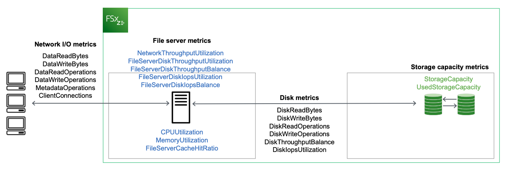

# Using Amazon FSx for OpenZFS CloudWatch metrics

There are two primary architectural components of each Amazon FSx file system:

- The **file server** that serves data to clients that access the
  file system.
- The **storage volumes** that host the data in your file system.
  FSx for OpenZFS reports metrics in CloudWatch that track performance and resource utilization for
  your file system's file server and storage volumes. The following diagram illustrates an Amazon FSx
  file system with its architectural components, and the performance and resource CloudWatch metrics
  that are available for monitoring. The key property for a set of metrics is the file system
  property that determines the capacity for those metrics. Adjusting that property modifies the
  file system's performance for that set of metrics.

You can use the **Monitoring & performance** panel on your file system's dashboard in the Amazon FSx console to view the metrics that are described in the following table.
For more information, see [Accessing CloudWatch metrics](accessingmetrics.md "accessingmetrics.md").

| Monitoring &performance panel                                                                                                                                          | How do I...                                                                                                                                                   | Chart                                                                                        | Relevant metrics                                                                                                                                                                                                                                                                                                                                       |
| ---------------------------------------------------------------------------------------------------------------------------------------------------------------------- | ------------------------------------------------------------------------------------------------------------------------------------------------------------- | -------------------------------------------------------------------------------------------- | ------------------------------------------------------------------------------------------------------------------------------------------------------------------------------------------------------------------------------------------------------------------------------------------------------------------------------------------------------ | ------------------------------------------------------------------------------------------------------------------------------------------------------ | ---------------------------------------------------------------------------------------------------------------------------------------- | --------------------------------- | ------------------------------ |
| Summary                                                                                                                                                                | ...determine my file system's total throughput?                                                                                                               | Total throughput                                                                             | SUM(`DataReadBytes` + `DataWriteBytes`)/Period (in seconds)                                                                                                                                                                                                                                                                                            |
| ...determine my file system's total IOPS?                                                                                                                              | Total IOPS                                                                                                                                                    | SUM(`DataReadOperations` + `DataWriteOperations` + `MetadataOperations`)/Period (in seconds) |                                                                                                                                                                                                                                                                                                                                                        | ...determine the number of connections that are established between clients and the file server?                                                       | Client connections                                                                                                                       | `ClientConnections`               |
| Storage                                                                                                                                                                | ...determine how much primary storage is available?                                                                                                           | Available primary storage capacity (bytes)                                                   | `StorageCapacity` {`SSD`} - `UsedStorageCapacity` {`SSD`}                                                                                                                                                                                                                                                                                              |
| ...determine the percentage of used primary storage for my file system?                                                                                                | Primary storage capacity utilization (percent)                                                                                                                | `StorageCapacity` {`SSD`} \* 100/`UsedStorageCapacity` {`SSD`}                               |                                                                                                                                                                                                                                                                                                                                                        | File server performance                                                                                                                                | ...determine the network throughput for clients that access the file system as a percentage of the file system's provisioned throughput? | Network throughput utilization    | `NetworkThroughputUtilization` |
| ...determine the disk throughput between the file server and its storage volumes as a percentage of the provisioned limit, which is determined by throughput capacity? | Disk throughput utilization                                                                                                                                   | `FileServerDiskThroughputUtilization`                                                        |                                                                                                                                                                                                                                                                                                                                                        | ...determine the percentage of available burst credits for disk throughput between the file server and its storage volumes?                            | Disk throughput burst balance                                                                                                            | `FileServerDiskThroughputBalance` |
| ...determine if the file system is approaching the file server’s maximum SSD IOPS capacity? Do I need to increase throughput on my file system?                        | Disk IOPS utilization                                                                                                                                         | `FileServerDiskIopsUtilization`                                                              |                                                                                                                                                                                                                                                                                                                                                        | ...determine if the file system is approaching the file server’s maximum SSD IOPS capacity? Do I need to increase my file system' throughput capacity? | Disk IOPS burst balance                                                                                                                  | `FileServerDiskIopsBalance`       |
| ...determine the file server's CPU utilization percentage?                                                                                                             | CPU utilization                                                                                                                                               | `CPUUtilization`                                                                             |                                                                                                                                                                                                                                                                                                                                                        | ...determine the file server's memory utilization percentage?                                                                                          | Memory utilization                                                                                                                       | `MemoryUtilization`               |
| ...determine my workload's usage of the file system's in-memory (ARC), NVMe (L2ARC), and Intelligent-Tiering SSD read caches?                                          | Cache hit ratio                                                                                                                                               | `FileServerCacheHitRatio`                                                                    |
| Disk performance                                                                                                                                                       | ....determine if the file system is approaching the file server’s current provisioned SSD IOPS capacity? Do I need to provision more IOPS for my file system? | Disk IOPS utilization (SSD)                                                                  | `DiskIopsUtilization`                                                                                                                                                                                                                                                                                                                                  |
| ...determine if the file system is approaching the file server’s current provisioned SSD IOPS capacity? Do I need to provision more IOPS for my file system?           | Compression ratio                                                                                                                                             | (`UsedStorageCapacity`/`CompressionRatio`) - `UsedStorageCapacity`                           | ###### Note We recommend that you provision throughput capacity so that the utilization of any performance-related dimension,—such as typical network, CPU, and memory utilization is less than 50%. This ensures that you have enough spare throughput capacity for unexpected spikes in your workload, as well as for background storage operations. |
