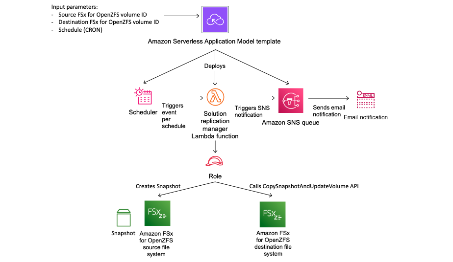

# Setting up ongoing periodic data replication

With ongoing periodic data replication, you can set up a schedule that automatically takes a snapshot of a source volume and performs an incremental replication of that snapshot on a destination volume at a certain interval, for example every 15 minutes.
You can schedule ongoing periodic data replication between two volumes on FSx for OpenZFS file systems within or across AWS Regions and accounts by using the solution provided in this section.

###### Topics

- [Architecture overview](#architecture-overview-periodic-replication "#architecture-overview-periodic-replication")
- [Required permissions](#required-permissions-periodic-replication "#required-permissions-periodic-replication")
- [Step 1: Initializing and deploying the application](#step-1-periodic-replication "#step-1-periodic-replication")
- [Step 2: Monitoring periodic replication](#step2-periodic-replication "#step2-periodic-replication")

## Architecture overview

Deploying this solution builds the following resources in the AWS Cloud.



The diagram illustrates the following periodic replication workflow.

1. AWS Serverless Application Model (SAM) automates the deployment of the FSx for OpenZFS periodic replication solution.
   For more information about AWS SAM, see [What is the AWS Serverless Application Model (AWS SAM)?](../../../serverless-application-model/latest/developerguide/what-is-sam.md "../../../serverless-application-model/latest/developerguide/what-is-sam.md") in the _AWS Serverless Application Model_ User Guide.
2. The SAM template deploys an Amazon EventBridge scheduler, an AWS Lambda function, an Amazon SNS queue, and an IAM role. The IAM role gives the Lambda function permission to call the necessary Amazon FSx API operations.
3. The EventBridge scheduler runs on a schedule you specify as a cron pattern during the initial deployment. For more information about cron patterns, see [Creating an Amazon EventBridge rule that runs on a schedule](../../../eventbridge/latest/userguide/eb-create-rule-schedule.md "../../../eventbridge/latest/userguide/eb-create-rule-schedule.md") in the _Amazon EventBridge_ User Guide.
   The scheduler invokes a Lambda function that calls the Amazon FSx `CreateSnapshot` API operation to create a snapshot of the source volume.
4. Once the snapshot is available, the Lambda function calls the Amazon FSx `CopySnapshotAndUpdateVolume` API operation to start replicating the source snapshot data to the destination volume.
5. The Lambda function sends a notification message to the Amazon SNS queue when replication starts, if you choose to be notified during the initial deployment.
   A notification is always sent when a snapshot cannot be created or the replication cannot be initiated.

## Required permissions

The following permissions are required to use the custom snapshot schedule CloudFormation template.

- `AmazonS3FullAccess`
- `AWSCloudFormationFullAccess`
- `AmazonEventBridgeFullAccess`
- `IAMFullAccess`
- `AmazonSNSFullAccess`
- `AWSKeyManagementServicePowerUser`
- `AWSLambda_FullAccess`

For more information about using IAM to set up permissions, see [How Amazon FSx for OpenZFS works with IAM](security_iam_service-with-iam.md "security_iam_service-with-iam.md").

## Step 1: Initializing and deploying the application

The following procedure configures and deploys the periodic replication solution. It takes about five minutes to deploy.
Before you begin this step, make sure that you have the ID of the source and destination volumes that you would like to initiate the replication between.
For more information on these resources, see [Creating an Amazon FSx for OpenZFS volume](creating-volumes.md "creating-volumes.md"), [Creating a snapshot](snapshots-openzfs.md#creating-snapshots "snapshots-openzfs.md#creating-snapshots"),
and [Using on-demand data replication](on-demand-replication.md#how-to-use-data-replication "on-demand-replication.md#how-to-use-data-replication").

###### Note

Implementing this solution incurs billing for the associated AWS services. For more information, see the pricing details pages for those services.

###### To launch the periodic replication solution stack

1. Follow the instructions on the [Replicate FSx-OpenZFS volumes across file systems](https://serverlessland.com/patterns/eventbridge-lambda-fsx-openzfs-periodic-replication "https://serverlessland.com/patterns/eventbridge-lambda-fsx-openzfs-periodic-replication") page to download the serverless pattern.
2. For **Parameters**, review the following parameters for the template and modify them for the needs of your periodic replication. This solution uses the following default values.

| **Parameter**             | **Default**                       | **Description**                                                                                                                                                                                                                                                                  |
| ------------------------- | --------------------------------- | -------------------------------------------------------------------------------------------------------------------------------------------------------------------------------------------------------------------------------------------------------------------------------- |
| Source volume ID          | No default value                  | The ID of the source volume from which data will be periodically replicated.                                                                                                                                                                                                     |
| Destination volume ID     | No default value                  | The ID of the destination volume that will become a replica of the source volume.                                                                                                                                                                                                |
| CronSchedule              | [0 0/6 \*\*?\*] (every six hours) | The schedule to replicate data from the source volume to the destination volume.                                                                                                                                                                                                 |
| SnapshotName              | fsx-scheduled-snapshot            | The name for the scheduled snapshots that will be taken of the source volume. Appears in the \*_Snapshot Name_<br>• column of the Amazon FSx Console.                                                                                                                            |
| Snapshot retention (days) | 7                                 | The number of days to keep user-initiated snapshots. The Lambda function deletes user-initiatted snapshots that are kept after this number of days.                                                                                                                              |
| SuccessNotification       | Yes                               | Choose whether to be notified when the replication is successfully initiated. A notification is always sent when a snapshot fails to create or the replication fails to start.                                                                                                   |
| Email                     | No default value                  | The email address that you would like notifications to be sent to.                                                                                                                                                                                                               |
| CopyStrategy              | INCREMENTAL_COPY                  | The \*_CopyStrategy_<br>• parameter for the `CopySnapshotAndUpdateVolume` API operation. For more information, see [CopySnapshotAndUpdateVolume](../APIReference/API_CopySnapshotAndUpdateVolume.md "../APIReference/API_CopySnapshotAndUpdateVolume.md") in the Amazon FSx API. |
| Options                   | None                              | The \*_Options_<br>• parameter for the `CopySnapshotAndUpdateVolume` API operation. For more information, see [CopySnapshotAndUpdateVolume](../APIReference/API_CopySnapshotAndUpdateVolume.md "../APIReference/API_CopySnapshotAndUpdateVolume.md") in the Amazon FSx API.      |

3. In the AWS SAM CLI, run the following command to deploy the resources specified in the SAM template.

```
sam deploy --guided \
--stack-name fsxz-periodic-replication \
--template-file fsx-openzfs-periodic-replication.yaml \
--capabilities CAPABILITY_AUTO_EXPAND CAPABILITY_IAM CAPABILITY_NAMED_IAM

```

You will be asked if you would like to update any parameters. 4. Choose **Enter** to deploy the template.

##

Step 2: Monitoring periodic replication

You can monitor the status of the periodic replication workflow using the Amazon FSx Console, AWS CLI, and API.
For more information on how to monitor periodic replication using the Amazon FSx Console, see [Monitoring progress of on-demand data replication](on-demand-replication.md#how-to-monitor-data-replication "on-demand-replication.md#how-to-monitor-data-replication").

To use the AWS CLI or API to track the progress of your replication, call the
[describe-volumes](../../../cli/latest/reference/fsx/describe-volumes.md "../../../cli/latest/reference/fsx/describe-volumes.md") CLI command or
the [DescribeVolumes](../APIReference/API_DescribeVolumes.md "../APIReference/API_DescribeVolumes.md") API operation
to view the `AdministrativeActions` array for the destination volume.
The following example shows the response for an incremental copy on-demand data replication task.

```
"AdministrativeActions": [
   {
    "AdministrativeActionType": "VOLUME_UPDATE_WITH_SNAPSHOT",
    "ProgressPercent": 100,
    "RequestTime": 1699997847.438,
    "Status": "COMPLETED",
    "TargetVolumeValues": {
    "OpenZFSConfiguration": {
        "RecordSizeKiB": 128,
        "DataCompressionType": "ZSTD",
        "DeleteIntermediateSnaphots": true,
        "DeleteClonedVolumes": false,
        "DeleteIntermediateData": true,
        "SourceSnapshotARN": "arn:aws:fsx:us-east-1:609492434915:snapshot/fsvol-0e1ab09de954a352f/fsvolsnap-01dda47dcbb24ddd0",
        "DestinationSnapshot": "fsvolsnap-0afef62088c7c9060"
        }
    },
    "TotalTransferBytes": 44144,
    "RemainingTransferBytes": 0
   },

```
