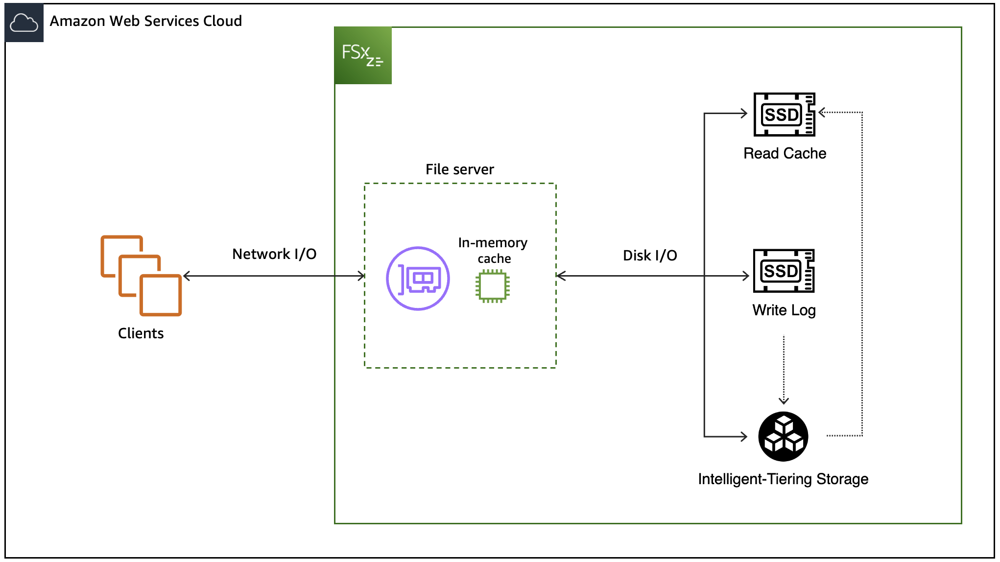

# How FSx for OpenZFS file systems work with Intelligent-Tiering

The FSx for OpenZFS Intelligent-Tiering storage class offers elastic, low-cost storage for workloads that traditionally run on Network Attached Storage (NAS) file systems.
File systems using the Intelligent-Tiering storage class consist of a high-availability pair of file servers that clients communicate with and an
in-memory cache within each file server that enhances performance for frequently accessed data.
Instead of a set of volumes attached to each file server, however, file systems using the Intelligent-Tiering storage class utilize fully elastic, intelligently tiered, regional block storage
which automatically grows and shrinks to fit your workload as it changes. File systems using the Intelligent-Tiering storage class also provide an optional provisioned SSD read cache for
low-latency access to frequently accessed data and a built-in SSD-backed write log for low-latency, durable writes. As most workloads tend to be read-heavy and actively work with only a small subset of the overall dataset at any given time,
the hybrid model of Intelligent-Tiering storage and an SSD read cache allows file systems using the Intelligent-Tiering storage class to provide storage that performs at levels comparable to SSD (provisioned) file systems for most workloads,
while delivering up to 85% cost savings relative to the SSD (provisioned) storage class.

When reading and writing data to an Intelligent-Tiering file system, especially data that hasn't been accessed recently or frequently enough to be in the file server's in-memory cache,
performance depends on the size of the SSD read cache. Data access from Intelligent-Tiering storage has time-to-first-byte latencies of roughly tens of milliseconds as well as per-request costs,
while accesses from the SSD read cache return with sub-millisecond latency and no per-request costs.

You can configure your SSD read cache with one of three sizing mode options: Automatic, Custom, or None. With Automatic, Amazon FSx automatically selects an SSD read cache size based on provisioned throughput.
With Custom, you can customize the size of your SSD read cache and scale it up or down at any time based on your workload's needs. When configuring the size of the SSD read cache for your file system, you should consider both the size of your frequently accessed dataset within the workload and the workload's sensitivity to
higher latency for reads of less-frequently accessed data. Choose None if you do not want to use an SSD read cache with your file system. You can switch between SSD read cache sizing modes after your file system has been created. For more information on how to modify your SSD read cache, see [Modifying provisioned SSD read cache](managing-ssd-read-cache.md "managing-ssd-read-cache.md").

To help determine whether your SSD read cache is sized appropriately, Amazon FSx publishes a cache hit ratio metric,
which reports the percentage of reads that are served from the cache. You can view the cache hit ratio metric in the Amazon FSx console on your file system's
**Monitoring** tab or with CloudWatch. For most workloads, a cache hit ratio of 80% or more provides the right balance of performance and cost optimization.
For more information on how to use CloudWatch to monitor your SSD read cache, see [Using Amazon FSx for OpenZFS CloudWatch metrics](how_to_use_metrics.md "how_to_use_metrics.md").

With the Intelligent-Tiering storage class, you do not need to provision IOPS. Instead, you pay for data access based on usage, in the form of read and write requests.
A request is a single read or write operation between the file system and the Intelligent-Tiering storage. FSx for OpenZFS automatically optimizes the conversion between read and write I/O to the file system
and requests to optimize performance and reduce costs.

A write request occurs when FSx for OpenZFS writes a block of data to Intelligent-Tiering storage. When you write data to the file system, FSx for OpenZFS immediately sends the data to the built-in SSD-based write log.
Write requests are then aggregated and written to Intelligent-Tiering storage from the SSD write log, increasing throughput and lowering request costs.
Reads can be served from the file server’s in-memory cache, SSD read cache, or directly from Intelligent-Tiering storage. When a read is served from Intelligent-Tiering storage, a read request occurs for each block of retrieved data.
When you read data sequentially, FSx for OpenZFS will prefetch data to improve performance.

Data from the in-memory cache on file systems using the Intelligent-Tiering storage class is served directly to the requesting client as _network I/O_.
When a client accesses data that is not in the in-memory cache, it is read from either the SSD read cache or Intelligent-Tiering storage as _disk I/O_ and then served
to the client as network I/O. The following diagram illustrates how data is accessed from an Intelligent-Tiering file system.

###### Topics

- [Data access from in-memory cache](#data-access-intelligent-tiering "#data-access-intelligent-tiering")
- [Data access from SSD cache and Intelligent-Tiering](#data-access-intelligent-tiering-disk "#data-access-intelligent-tiering-disk")
- [Performance considerations](#intelligent-tiering-performance-considerations "#intelligent-tiering-performance-considerations")

## Data access from in-memory cache

For read access directly from the in-memory ARC cache, performance is primarily defined by two components:
the performance supported by the client-server network I/O connection, and the size of the cache.
The following table shows the in-memory cached read performance of file systems using the Intelligent-Tiering storage class.

| Provisioned throughput capacity (MBps) | In-memory cache (GB) | Network throughput capacity (MBps) | Maximum number of client connections | Maximum network IOPS |
| -------------------------------------- | -------------------- | ------------------------------------- | ------------------------------------ | -------------------- | ----------------------------- |
|                                        |                      | **Baseline**                          | **Burst**                            |                      |                               |
| 160                                    | 3                    | 375                                   | 3,125                                | 8,192                | Tens of thousands of IOPS     |
| 320                                    | 11.2                 | 775                                   | 3,750                                | 16,384               |
| 640                                    | 22.4                 | 1,550                                 | 5,000                                | 32,768               | Hundreds of thousands of IOPS |
| 1,280                                  | 44.8                 | 3,125                                 | 6,250                                | 32,768               |
| 2,560                                  | 89.6                 | 6,250                                 | –                                    | 32,768               |
| 3,840                                  | 134.4                | 9,375                                 | –                                    | 32,768               |
| 5,120                                  | 179.2                | 12,500                                | –                                    | 32,768               | 1+ million IOPS               |
| 7,680                                  | 268.8                | 18,750                                | –                                    | 32,768               |
| 10,240                                 | 358.4                | 21,000                                | –                                    | 32,768               |

## Data access from SSD cache and Intelligent-Tiering

For read and write access from the SSD read cache and Intelligent-Tiering, performance depends on the performance supported by the server’s disk I/O connection.
Similar to data accessed from cache, the performance of this connection is determined by the provisioned throughput capacity of the file system, which is equivalent to the baseline throughput capacity of your file server.

| Provisioned throughput capacity (MBps) | Maximum disk throughput capacity (MBps)\* | Maximum disk IOPS |
| -------------------------------------- | ----------------------------------------- | ----------------- | --------- |
|                                        |                                           | **Baseline**      | **Burst** |
| 160                                    | 160                                       | 6,250             | 100,000   |
| 320                                    | 320                                       | 12,500            | 100,000   |
| 640                                    | 640                                       | 25,000            | 100,000   |
| 1,280                                  | 1,280                                     | 50,000            | 100,000   |
| 2,560                                  | 2,560                                     | 100,000           | –         |
| 3,840                                  | 3,840                                     | 150,000           | –         |
| 5,120                                  | 5,120                                     | 200,000           | –         |
| 7,680                                  | 7,680                                     | 300,000           | –         |
| 10,240                                 | 10,240                                    | 400,000           | –         |

###### Note

\*The maximum disk throughput values above refer to read throughput. Maximum write throughput is around 75% of the maximum read throughput for each throughput capacity level up to 3,840. For throughput capacity levels above 3,840, the maximum write throughput is 3,200 MBps.

The previous tables show your file system’s throughput capacity for uncompressed data.
However, because data compression reduces the amount of data that needs to be transferred
as disk I/O, you can often deliver higher levels of throughput for compressed data.
For example, if your data is compressed to be 50% smaller (that is, a compression ratio of 2),
then you can drive up to 2x the throughput than you could if the data were uncompressed.
For more information, see
[Data compression](performance.md#perf-data-compression "performance.md#perf-data-compression").

## Performance considerations

Here are a few important performance considerations when working with file systems using the Intelligent-Tiering storage class:

- The OpenZFS access time `atime` file property indicates when a file was last read.
  For FSx for OpenZFS Intelligent-Tiering storage class, the `atime` property is not updated during file read operations.
- Due to the higher latency and per-request costs of data access from Intelligent-Tiering storage, you should configure your workloads and file systems with I/O size in mind. Workloads reading data with smaller I/O sizes will require higher concurrency and incur more request costs to achieve the same throughput on data not in the cache as workloads using larger I/O sizes.
- For workloads with working-sets larger than the size of the SSD cache, consider maximizing application I/O size and FSx volume record size. Because writes to the file system are only stored on either the in-memory cache (for asynchronous writes) or the SSD write cache (for synchronous writes) before being served to the client, this should be less of a consideration for write I/O.
- You may be more likely to see higher latencies after a maintenance event. This is due to the in-memory cache being erased during maintenance windows for file systems using the Intelligent-Tiering storage class. For more information, see [Modifying file system maintenance windows](maintenance-windows.md "maintenance-windows.md").
- The maximum disk IOPS your clients can drive with an Intelligent-Tiering file system depends on the specific access patterns of your workload and whether you have provisioned an SSD read cache. For workloads with random access, clients can typically drive much higher IOPS if the data is cached in the SSD read cache than if the data is not in the cache.
- Random read requests from Intelligent-Tiering storage will have higher latencies than sequential read requests, as the data will be served just-in-time instead of ahead of time through pre-fetch.
  We recommend configuring your data access pattern sequentially when possible to allow for pre-fetching data and higher performance.
- While you can select a throughput capacity as low as 160 megabytes per second (MBps), we recommend using higher throughput capacity levels for workloads that are write-heavy.
