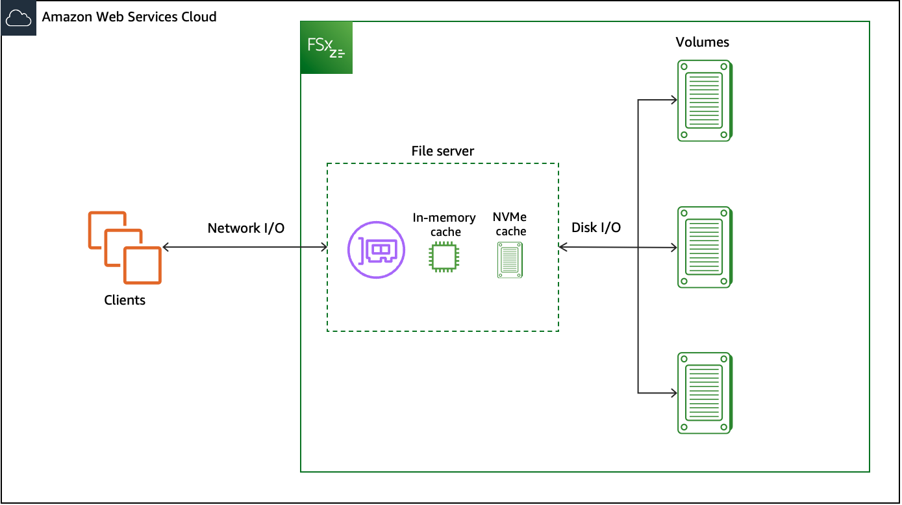
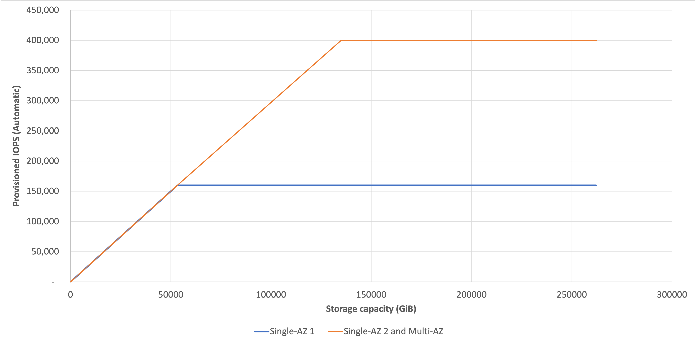

# How FSx for OpenZFS file systems work with SSD storage

FSx for OpenZFS file systems that use the SSD (provisioned) storage class consist of a file server that clients communicate with
and a set of disks attached to that file server. Each file server employs a fast, in-memory
cache to enhance performance for the most frequently accessed data. In addition to the in-memory cache,
Single-AZ 2 file systems also provide an additional Non-volatile Memory Express (NVMe) cache for storing up to terrabytes of frequently accessed data.
FSx for OpenZFS utilizes the Adaptive Replacement Cache (ARC) and L2ARC that are built into the OpenZFS file system, which improves
the portion of data access driven from the in-memory and NVMe caches.

When a client accesses data that's stored in either the in-memory or NVMe caches, the data is served directly to the
requesting client as _network I/O_, without the file server needing to read it from disk. When a client accesses data that is not
in either of these caches, it is read from disk as _disk I/O_ and then served
to the client as network I/O; data read from disk is also subject to the IOPS and bandwidth
limits of the underlying disks.

FSx for OpenZFS file systems can serve network I/O about three times faster than disk I/O,
which means that clients can drive greater throughput and IOPS with lower latencies for
frequently accessed data in cache. The following diagram illustrates how data is accessed
from an FSx for OpenZFS file system, with the NVMe cache applying to all Single-AZ 2 file systems.

File-based workloads are typically spiky, characterized by short, intense periods of
high I/O with plenty of idle time between bursts. To support spiky workloads, in addition
to the _baseline_ speeds that a file system can sustain 24/7, Amazon FSx
provides the capability to _burst_ to higher speeds for periods of
time for both network I/O and disk I/O operations. Amazon FSx uses a network I/O credit
mechanism to allocate throughput and IOPS based on average utilization — file systems
accrue credits when their throughput and IOPS usage is below their baseline limits,
and can use these credits when they perform I/O operations.

###### Topics

- [Data access from cache](#data-access-memory-cache "#data-access-memory-cache")
- [Data access from disk](#data-access-disk "#data-access-disk")
- [SSD IOPS and performance](#ssd-iops-disk-performance "#ssd-iops-disk-performance")

## Data access from cache

For read access directly from the in-memory ARC or NVMe L2ARC cache, performance is primarily defined by two components:
the performance supported by the client-server network I/O connection, and the size of the cache.
The following tables show the cached read performance of all Single-AZ 1, all Single-AZ 2, and Multi-AZ (HA) file systems, based on AWS Region.

###### Note

Single-AZ 1 (HA) and Single-AZ 2 (HA) file systems are only available in a certain subset of AWS Regions. For more information on which AWS Regions support Single-AZ 1 (HA) and Single-AZ 2 (HA) file systems, see [Availability by AWS Region](available-aws-regions.md "available-aws-regions.md").

| Provisioned throughput capacity (MBps) | In-memory cache (GB) | Maximum network throughput capacity (MBps) | Maximum number of client connections | Maximum network IOPS |
| -------------------------------------- | -------------------- | ------------------------------------------ | ------------------------------------ | -------------------- | ----------------------------- |
|                                        |                      | **Baseline**                               | **Burst**                            |                      |                               |
| 64                                     | 3                    | 97                                         | 1,562                                | 4,096                | Tens of thousands of IOPS     |
| 128                                    | 11.2                 | 195                                        | 1,562                                | 8,192                |
| 256                                    | 22.4                 | 390                                        | 1,562                                | 16,384               |
| 512                                    | 44.8                 | 781                                        | 1,562                                | 32,768               | Hundreds of thousands of IOPS |
| 1,024                                  | 89.6                 | 1,562                                      | –                                    | 32,768               |
| 2,048                                  | 179.2                | 3,125                                      | –                                    | 32,768               |
| 3,072                                  | 268.8                | 4,687                                      | –                                    | 32,768               |
| 4,096                                  | 358.4                | 6,250                                      | –                                    | 32,768               | Up to 1 million IOPS          |

| Provisioned throughput capacity (MBps) | In-memory cache (GB) | Maximum network throughput capacity (MBps) | Maximum number of client connections | Maximum network IOPS |
| -------------------------------------- | -------------------- | ------------------------------------------ | ------------------------------------ | -------------------- | ----------------------------- |
|                                        |                      | **Baseline**                               | **Burst**                            |                      |                               |
| 64                                     | 0.25                 | 200                                        | 3,200                                | 4,096                | Tens of thousands of IOPS     |
| 128                                    | 1.0                  | 400                                        | 3,200                                | 8,192                |
| 256                                    | 3.0                  | 800                                        | 3,200                                | 16,384               |
| 512                                    | 11.2                 | 1,600                                      | 3,200                                | 32,768               | Hundreds of thousands of IOPS |
| 1,024                                  | 22.4                 | 3,200                                      | –                                    | 32,768               |
| 2,048                                  | 44.8                 | 6,400                                      | –                                    | 32,768               |
| 3,072                                  | 67.2                 | 9,600                                      | –                                    | 32,768               |
| 4,096                                  | 89.6                 | 12,800                                     | –                                    | 32,768               | 1 million IOPS                |

| Provisioned throughput capacity (MBps) | In-memory cache (GB) | NVMe L2ARC cache (GB) | Network throughput capacity (MBps) | Maximum number of client connections | Maximum network IOPS |
| -------------------------------------- | -------------------- | --------------------- | ---------------------------------- | ------------------------------------ | -------------------- | ----------------------------- |
|                                        |                      |                       | **Baseline**                       | **Burst**                            |                      |                               |
| 160                                    | 3                    | 40                    | 375                                | 3,125                                | 8,192                | Tens of thousands of IOPS     |
| 320                                    | 11.2                 | 80                    | 775                                | 3,750                                | 16,384               |
| 640                                    | 22.4                 | 160                   | 1,550                              | 5,000                                | 32,768               | Hundreds of thousands of IOPS |
| 1,280                                  | 44.8                 | 320                   | 3,125                              | 6,250                                | 32,768               |
| 2,560                                  | 89.6                 | 640                   | 6,250                              | –                                    | 32,768               |
| 3,840                                  | 134.4                | 960                   | 9,375                              | –                                    | 32,768               |
| 5,120                                  | 179.2                | 1,280                 | 12,500                             | –                                    | 32,768               | 1+ million IOPS               |
| 7,680                                  | 268.8                | 1,920                 | 18,750                             | –                                    | 32,768               |
| 10,240                                 | 358.4                | 2,560                 | 21,000                             | –                                    | 32,768               |

| Provisioned throughput capacity (MBps) | In-memory cache (GB) | Network throughput capacity (MBps) | Maximum number of client connections | Maximum network IOPS |
| -------------------------------------- | -------------------- | ---------------------------------- | ------------------------------------ | -------------------- | ----------------------------- |
|                                        |                      | **Baseline**                       | **Burst**                            |                      |                               |
| 160                                    | 11.2                 | 195                                | 1,562                                | 8,192                | Tens of thousands of IOPS     |
| 320                                    | 22.4                 | 390                                | 1,562                                | 16,384               |
| 640                                    | 44.8                 | 781                                | 1,562                                | 32,768               | Hundreds of thousands of IOPS |
| 1,280                                  | 89.6                 | 1,562                              | –                                    | 32,768               |
| 2,560                                  | 179.2                | 3,125                              | –                                    | 32,768               |
| 3,840                                  | 268.8                | 4,687                              | –                                    | 32,768               |
| 5,120                                  | 358.4                | 6,250                              | –                                    | 32,768               | Up to 1 million IOPS          |

| Provisioned throughput capacity (MBps) | In-memory cache (GB) | Network throughput capacity (MBps) | Maximum number of client connections | Maximum network IOPS |
| -------------------------------------- | -------------------- | ---------------------------------- | ------------------------------------ | -------------------- | ----------------------------- |
|                                        |                      | **Baseline**                       | **Burst**                            |                      |                               |
| 160                                    | 3                    | 375                                | 3,125                                | 8,192                | Tens of thousands of IOPS     |
| 320                                    | 11.2                 | 775                                | 3,750                                | 16,384               |
| 640                                    | 22.4                 | 1,550                              | 5,000                                | 32,768               | Hundreds of thousands of IOPS |
| 1,280                                  | 44.8                 | 3,125                              | 6,250                                | 32,768               |
| 2,560                                  | 89.6                 | 6,250                              | –                                    | 32,768               |
| 3,840                                  | 134.4                | 9,375                              | –                                    | 32,768               |
| 5,120                                  | 179.2                | 12,500                             | –                                    | 32,768               | 1+ million IOPS               |
| 7,680                                  | 268.8                | 18,750                             | –                                    | 32,768               |
| 10,240                                 | 358.4                | 21,000                             | –                                    | 32,768               |

###### Note

For Multi-AZ file systems created in Canada (Central) and Asia Pacific (Mumbai) prior to July 9th, 2024, refer to Table 6 for performance details.

| Provisioned throughput capacity (MBps) | In-memory cache (GB) | Network throughput capacity (MBps) | Maximum number of client connections | Maximum network IOPS |
| -------------------------------------- | -------------------- | ---------------------------------- | ------------------------------------ | -------------------- | ----------------------------- |
|                                        |                      | **Baseline**                       | **Burst**                            |                      |                               |
| 160                                    | 1.0                  | 400                                | 3,200                                | 8,192                | Tens of thousands of IOPS     |
| 320                                    | 3                    | 800                                | 3,200                                | 16,384               |
| 640                                    | 11.2                 | 1,600                              | 3,400                                | 32,768               | Hundreds of thousands of IOPS |
| 1,280                                  | 22.4                 | 3,200                              | –                                    | 32,768               |
| 2,560                                  | 44.8                 | 6,400                              | –                                    | 32,768               |
| 3,840                                  | 67.2                 | 9,600                              | –                                    | 32,768               |
| 5,120                                  | 89.6                 | 12,800                             | –                                    | 32,768               | 1+ million IOPS               |

## Data access from disk

For read and write access from the disks attached to the file server, performance depends on the performance supported by the server’s disk I/O connection.
Similar to data accessed from cache, the performance of this connection is determined by the provisioned throughput capacity of the file system, which is equivalent to the baseline throughput capacity of your file server.

| Provisioned throughput capacity (MBps) | Maximum disk throughput capacity (MBps) | Maximum disk IOPS |
| -------------------------------------- | --------------------------------------- | ----------------- | ------------ | --------- |
|                                        | **Baseline**                            | **Burst**         | **Baseline** | **Burst** |
| 64                                     | 64                                      | 1,024             | 2,500        | 40,000    |
| 128                                    | 128                                     | 1,024             | 5,000        | 40,000    |
| 256                                    | 256                                     | 1,024             | 10,000       | 40,000    |
| 512                                    | 512                                     | 1,024             | 20,000       | 40,000    |
| 1,024                                  | 1,024                                   | –                 | 40,000       | –         |
| 2,048                                  | 2,048                                   | –                 | 80,000       | –         |
| 3,072                                  | 3,072                                   | –                 | 120,000      | –         |
| 4,096                                  | 4,096                                   | –                 | 160,000      | –         |

| Provisioned throughput capacity (MBps) | Maximum disk throughput capacity (MBps) | Maximum disk IOPS |
| -------------------------------------- | --------------------------------------- | ----------------- | ------------ | --------- |
|                                        | **Baseline**                            | **Burst**         | **Baseline** | **Burst** |
| 160                                    | 160                                     | 3,125             | 6,250        | 100,000   |
| 320                                    | 320                                     | 3,125             | 12,500       | 100,000   |
| 640                                    | 640                                     | 3,125             | 25,000       | 100,000   |
| 1,280                                  | 1,280                                   | 3,125             | 50,000       | 100,000   |
| 2,560                                  | 2,560                                   | –                 | 100,000      | –         |
| 3,840                                  | 3,840                                   | –                 | 150,000      | –         |
| 5,120                                  | 5,120                                   | –                 | 200,000      | –         |
| 7,680                                  | 7,680                                   | –                 | 300,000      | –         |
| 10,240                                 | 10,240\*                                | –                 | 400,000      | –         |

| Provisioned throughput capacity (MBps) | Maximum disk throughput capacity (MBps)\* | Maximum disk IOPS |
| -------------------------------------- | ----------------------------------------- | ----------------- | ------------ | --------- |
|                                        | **Baseline**                              | **Burst**         | **Baseline** | **Burst** |
| 160                                    | 160                                       | 1,250             | 6,000        | 40,000    |
| 320                                    | 320                                       | 1,250             | 12,000       | 40,000    |
| 640                                    | 640                                       | 1,250             | 20,000       | 40,000    |
| 1,280                                  | 1,280                                     | –                 | 40,000       | –         |
| 2,560                                  | 2,560                                     | –                 | 80,000       | –         |
| 3,840                                  | 3,840                                     | –                 | 120,000      | –         |
| 5,120                                  | 5,120                                     | –                 | 160,000      | –         |

###### Note

\*Deployment hardware differences in these regions may cause disk throughput capacity to vary by up to 5% from the values shown in this table.

| Provisioned throughput capacity (MBps) | Maximum disk throughput capacity (MBps) | Maximum disk IOPS |
| -------------------------------------- | --------------------------------------- | ----------------- | ------------ | --------- |
|                                        | **Baseline**                            | **Burst**         | **Baseline** | **Burst** |
| 160                                    | 160                                     | 3,125             | 6,250        | 100,000   |
| 320                                    | 320                                     | 3,125             | 12,500       | 100,000   |
| 640                                    | 640                                     | 3,125             | 25,000       | 100,000   |
| 1,280                                  | 1,280                                   | 3,125             | 50,000       | 100,000   |
| 2,560                                  | 2,560                                   | –                 | 100,000      | –         |
| 3,840                                  | 3,840                                   | –                 | 150,000      | –         |
| 5,120                                  | 5,120                                   | –                 | 200,000      | –         |
| 7,680                                  | 7,680                                   | –                 | 300,000      | –         |
| 10,240                                 | 10,240\*                                | –                 | 400,000      | –         |

###### Note

\*If you have a Multi-AZ (HA) file system with a throughput capacity of 10,240 MBps, performance will be limited to 7,500 MBps for write traffic only.
Otherwise, for read traffic on all Multi-AZ (HA) file systems, read and write traffic on all Single-AZ file systems, and all other throughput capacity levels,
your file system will support the performance limits shown in the table.

###### Note

For Multi-AZ file systems created in Canada (Central) and Asia Pacific (Mumbai) prior to July 9th, 2024, refer to Table 11 for performance details.

| Provisioned throughput capacity (MBps) | Maximum disk throughput capacity (MBps)\* | Maximum disk IOPS |
| -------------------------------------- | ----------------------------------------- | ----------------- | ------------ | --------- |
|                                        | **Baseline**                              | **Burst**         | **Baseline** | **Burst** |
| 160                                    | 160                                       | 1,187             | 5,000        | 40,000    |
| 320                                    | 320                                       | 1,187             | 10,000       | 40,000    |
| 640                                    | 640                                       | 1,187             | 20,000       | 40,000    |
| 1,280                                  | 1,280                                     | –                 | 40,000       | –         |
| 2,560                                  | 2,560                                     | –                 | 80,000       | –         |
| 3,840                                  | 3,840                                     | –                 | 120,000      | –         |
| 5,120                                  | 5,120                                     | –                 | 160,000      | –         |

###### Note

\*Deployment hardware differences in these regions may cause disk throughput capacity to vary by up to 5% from the values shown in this table.

The previous tables show your file system’s throughput capacity for uncompressed data.
However, because data compression reduces the amount of data that needs to be transferred
as disk I/O, you can often deliver higher levels of throughput for compressed data.
For example, if your data is compressed to be 50% smaller (that is, a compression ratio of 2),
then you can drive up to 2x the throughput than you could if the data were uncompressed.
For more information, see
[Data compression](performance.md#perf-data-compression "performance.md#perf-data-compression").

## SSD IOPS and performance

Data accessed from disk is also subject to the performance of those underlying disks,
which is determined by the number of provisioned SSD IOPS configured on the file system.
The maximum IOPS levels you can achieve are defined by the lower of either the maximum IOPS
supported by your file server’s disk I/O connection, or the maximum SSD disk IOPS
supported by your disks. In order to drive the maximum performance supported by the
server-disk connection, you should configure your file system’s provisioned SSD IOPS
to match the maximum IOPS in the table above.

If you select `Automatic` provisioned SSD IOPS, Amazon FSx will provision 3 IOPS
per GB of storage capacity up to the maximum for your file system, which is the highest IOPS level
supported by the disk I/O connection documented above. If you select `User-provisioned`,
you can configure any level of SSD IOPS from the minimum of 3 IOPS per GB of storage, up to
the maximum for your file system, as long as you don't exceed 1000 IOPS per GiB\*.

###### Note

\*File systems in the following AWS Regions have a maximum IOPS to storage ratio of 50 IOPS per GiB: Africa (Cape Town), Asia Pacific (Hyderabad), Asia Pacific (Jakarta), Middle East (UAE),
Middle East (Bahrain), Asia Pacific (Osaka), Europe (Milan), Europe (Paris), South America (São Paulo) Region, Israel (Tel Aviv), Asia Pacific (Hong Kong), Asia Pacific (Seoul), Asia Pacific (Mumbai), Canada (Central), Europe (Stockholm), and Europe (London).

The following graph illustrates the maximum IOPS for Single-AZ 1 (non-HA and HA), Single-AZ 2 (non-HA and HA), and Multi-AZ (HA) depending on storage capacity.

