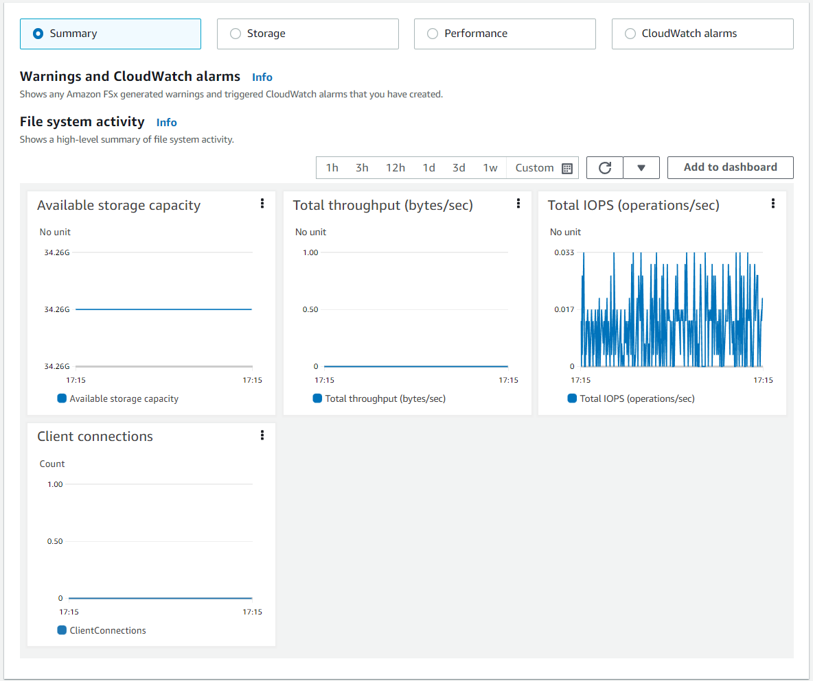
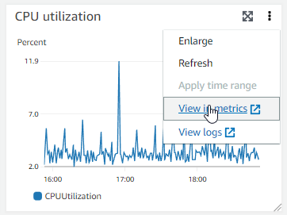
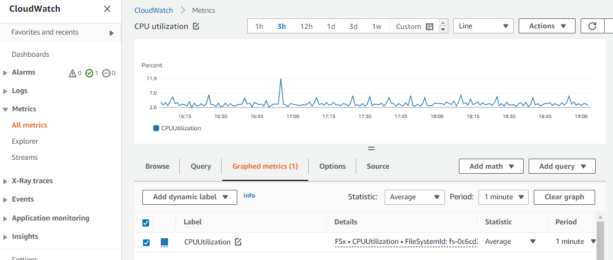

# Accessing file system metrics

You can see Amazon FSx metrics for CloudWatch in the following ways.

- The Amazon FSx console
- The CloudWatch console
- The CloudWatch CLI
- The CloudWatch API
  The following procedures describe how to access your file system's metrics using these various
  tools.

###### To view file system metrics using the Amazon FSx console

1. Open the Amazon FSx console at [https://console.aws.amazon.com/fsx/](https://console.aws.amazon.com/fsx/ "https://console.aws.amazon.com/fsx/").
2. To display the **File system details** page, choose **File systems** in the navigation pane.
3. Choose the file system whose metrics you want to view.
4. To view graphs of the file system's metrics, choose **Monitoring & performance** on the second panel.



    * The **Summary** metrics are displayed by default, showing any active warnings and CloudWatch alarms along with
     **File system activity** metrics.
    * Choose **Storage** to view storage capacity and utilization metrics.
    * Choose **Performance** to view file server and storage performance metrics
    * Choose **CloudWatch alarms** to view graphs of any alarms configured for the file system.

For more information, see [Using file system metrics](monitoring-cloudwatch.md#how_to_use_metrics "monitoring-cloudwatch.md#how_to_use_metrics")

###### To view metrics in the CloudWatch console

1. To view a file system metric in the **Metrics** page of the Amazon CloudWatch console,
   navigate to the metric in the **Monitoring & performance** panel of the Amazon FSx console.
2. Choose **View in metrics** from the actions menu in the upper right of the metric graph, as shown in the following image.



This opens the **Metrics** page in the CloudWatch console, showing the metric graph, as shown in the following image.



###### To add metrics to a CloudWatch dashboard

1. To add a set of FSx for Windows file system metrics to a dashboard in the CloudWatch console,
   choose the set of metrics (**Summary**, **Storage**, or **Performance**)
   in the **Monitoring & performance** panel of the Amazon FSx console.
2. Choose **Add to dashboard** in the upper right of the panel, this opens the CloudWatch console.
3. Select an existing CloudWatch dashboard from the list, or create a new dashboard. For more information, see
   [Using Amazon CloudWatch dashboards](../../../AmazonCloudWatch/latest/monitoring/CloudWatch_Dashboards.md "../../../AmazonCloudWatch/latest/monitoring/CloudWatch_Dashboards.md")
   in the _Amazon CloudWatch User Guide_.

###### To access metrics from the AWS CLI

- Use the [`list-metrics`](../../../cli/latest/reference/cloudwatch/list-metrics.md "../../../cli/latest/reference/cloudwatch/list-metrics.md")
  command with the `--namespace "AWS/FSx"` namespace. For more information, see
  the [AWS CLI Command Reference](../../../cli/latest/reference.md "../../../cli/latest/reference.md").

```
`$` `aws cloudwatch list-metrics --namespace "AWS/FSx"`
`aws cloudwatch list-metrics --namespace "AWS/FSx"
{
 "Metrics": [
 {
 "Namespace": "AWS/FSx",
 "MetricName": "DataWriteOperationTime",
 "Dimensions": [
 {
 "Name": "FileSystemId",
 "Value": "fs-09a106ebc3a0bb087"
 }
 ]
 },
 {
 "Namespace": "AWS/FSx",
 "MetricName": "CapacityPoolWriteBytes",
 "Dimensions": [
 {
 "Name": "VolumeId",
 "Value": "fsvol-0cb2281509f5db3c2"
 },
 {
 "Name": "FileSystemId",
 "Value": "fs-09a106ebc3a0bb087"
 }
 ]
 },
 {
 "Namespace": "AWS/FSx",
 "MetricName": "DiskReadBytes",
 "Dimensions": [
 {
 "Name": "FileSystemId",
 "Value": "fs-09a106ebc3a0bb087"
 }
 ]
 },
 {
 "Namespace": "AWS/FSx",
 "MetricName": "CompressionRatio",
 "Dimensions": [
 {
 "Name": "FileSystemId",
 "Value": "fs-0f84c9a176a4d7c92"
 }
 ]
 },
.
.
.
}`
```

**Using the CloudWatch API**

###### To access metrics from the CloudWatch API

- Call `GetMetricStatistics`. For more information, see [Amazon CloudWatch API Reference](../../../AmazonCloudWatch/latest/APIReference.md "../../../AmazonCloudWatch/latest/APIReference.md").
