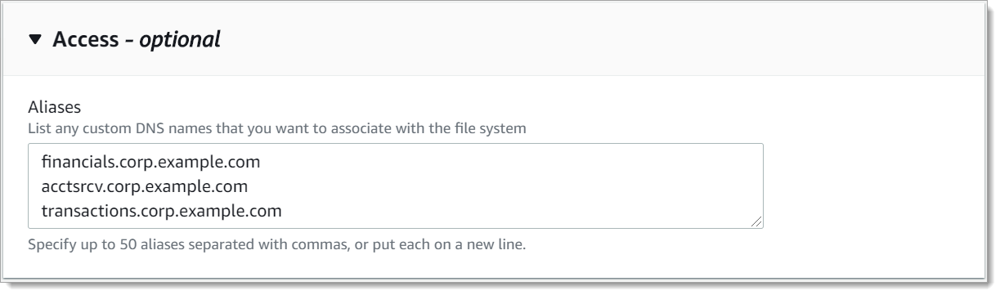

# Associating DNS aliases with file systems

You can associate DNS aliases when creating a new FSx for Windows File Server file system
from scratch, or when restoring a backup to a new file system, using the AWS Management Console, AWS CLI, and API, described
the following procedures.

1. Open the Amazon FSx console at [https://console.aws.amazon.com/fsx/](https://console.aws.amazon.com/fsx/ "https://console.aws.amazon.com/fsx/").
2. Follow the procedure for creating a new file system described in
   [Step 5. Create your file system](getting-started.md#getting-started-step1 "getting-started.md#getting-started-step1") in the Getting Started section.
3. In the **Access - optional** section of the **Create file
   system** wizard, enter the DNS aliases that you want to associate with your file
   system.

 4. When the file system is **Available**, you can access it using the DNS
alias by configuring service principal names (SPNs) and updating or creating a DNS CNAME
record for the alias. For more information, see [Accessing data using DNS aliases](dns-aliases.md "dns-aliases.md").

1. When creating a new file system, use the
   [Alias](../APIReference/API_Alias.md "../APIReference/API_Alias.md") property with the
   [CreateFileSystem](../APIReference/API_CreateFileSystem.md "../APIReference/API_CreateFileSystem.md")
   API operation to associate DNS aliases with the new file system.

```
aws fsx create-file-system \
  --file-system-type WINDOWS \
  --storage-capacity 2000 \
  --storage-type SSD \
  --subnet-ids subnet-123456 \
  --windows-configuration Aliases=[financials.corp.example.com,accts-rcv.corp.example.com]
```

2.  When the file system is **Available**, you can access it using the DNS
    alias by configuring service principal names (SPNs) and updating or creating a DNS CNAME
    record for the alias. For more information, see [Accessing data using DNS aliases](dns-aliases.md "dns-aliases.md").
1.  When creating a new file system from a backup of an existing file system, you can use the
    [Aliases](../APIReference/API_Aliases.md "../APIReference/API_Aliases.md") property with the
    [CreateFileSystemFromBackup](../APIReference/API_CreateFileSystemFromBackup.md "../APIReference/API_CreateFileSystemFromBackup.md")
    API operation as follows:

        * Any aliases associated with the backup are associated with the new file system by default.
        * To create a file system without preserving any aliases from the backup, use the `Aliases`
         property with an empty set.


        To associate additional DNS aliases, use the `Aliases` property and include both the original
         aliases associated with the backup and the new aliases you want to associate.

    The following CLI command associates two aliases with the file system Amazon FSx is creating from a backup.

```
aws fsx create-file-system-from-backup \
  --backup-id backup-0123456789abcdef0
  --storage-capacity 2000 \
  --storage-type HDD \
  --subnet-ids subnet-123456 \
  --windows-configuration Aliases=[transactions.corp.example.com,accts-rcv.corp.example.com]
```

2. When the file system is **Available**, you can access it using the DNS
   alias by configuring service principal names (SPNs) and updating or creating a DNS CNAME
   record for the alias. For more information, see [Accessing data using DNS aliases](dns-aliases.md "dns-aliases.md").
