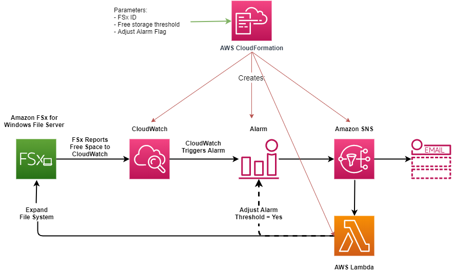
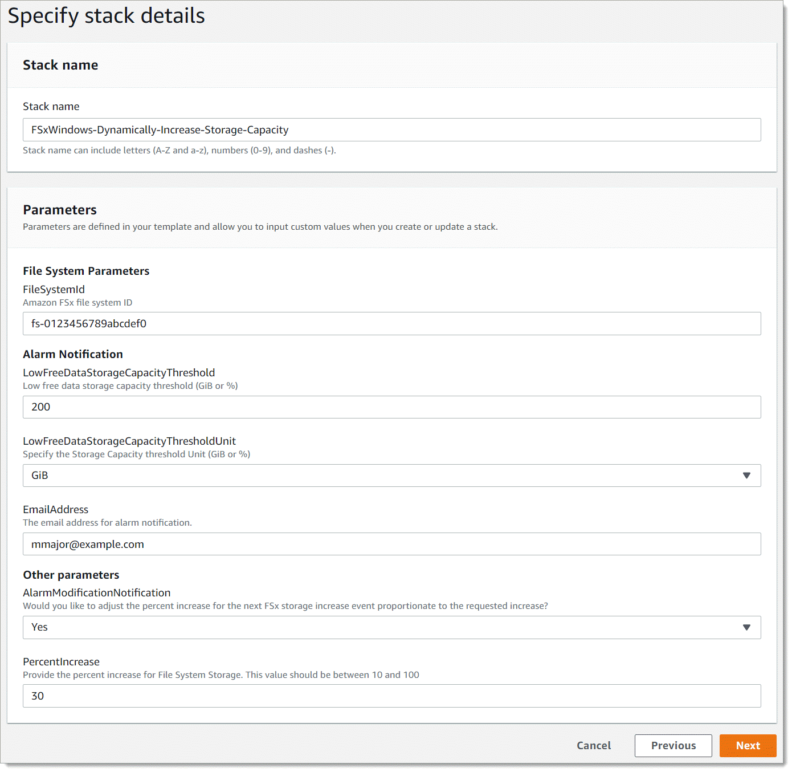

# Increasing the storage capacity of

an FSx for Windows File Server file system dynamically

As an alternative to manually increasing your FSx for Windows File Server file system's storage capacity as the amount of data stored increases,
you can use a CloudFormation template to increase storage automatically. The solution presented in the this section dynamically increases
a file system's storage capacity when the amount of free storage capacity falls below a defined
threshold that you specify.

This AWS CloudFormation template automatically deploys all of the
components that are required to define the free storage capacity threshold, the Amazon CloudWatch
alarm based on this threshold, and the AWS Lambda function that increases the file
system’s storage capacity.

The solution takes in the following parameters:

- The file system ID
- The free storage capacity threshold (numerical value)
- Unit of measurement (percentage [default] or GiB)
- The percentage by which to increase the storage capacity (%)
- The email address for the SNS subscription
- Adjust alarm threshold (Yes/No)

###### Topics

- [Architecture overview](#storage-inc-architecture "#storage-inc-architecture")
- [CloudFormation template](#storage-capacity-CFN-template "#storage-capacity-CFN-template")
- [Automated deployment with
  CloudFormation](#fsx-dynamic-storage-increase-deployment "#fsx-dynamic-storage-increase-deployment")

## Architecture overview

Deploying this solution builds the following resources in the AWS Cloud.

The diagram illustrates the following steps:

1. The CloudFormation template deploys a CloudWatch alarm, an AWS Lambda function, an
   Amazon Simple Notification Service (Amazon SNS) queue, and all required AWS Identity and Access Management (IAM) roles. The IAM
   role gives the Lambda function permission to invoke the Amazon FSx API
   operations.
2. CloudWatch triggers an alarm when the file system’s free storage capacity goes
   below the specified threshold, and sends a message to the Amazon SNS
   queue.
3. The solution then triggers the Lambda function that is subscribed to this
   Amazon SNS topic.
4. The Lambda function calculates the new file system storage capacity based
   on the specified percent increase value and sets the new file system storage
   capacity.
5. The Lambda function can optionally adjust the free storage capacity
   threshold so that it is equal to a specified percentage of the file system’s
   new storage capacity.
6. The original CloudWatch alarm state and results of the Lambda function operations
   are sent to the Amazon SNS queue.

To receive notifications about the actions that are performed as a response to the
CloudWatch alarm, you must confirm the Amazon SNS topic subscription by following the link
provided in the **Subscription Confirmation** email.

## CloudFormation template

This solution uses CloudFormation to automate deploying the components that are used to
automatically increase the storage capacity of an FSx for Windows File Server file system. To use
this solution, download the [IncreaseFSxSize](https://s3.amazonaws.com/solution-references/fsx/DynamicScaling/IncreaseFSxSize.yaml "https://s3.amazonaws.com/solution-references/fsx/DynamicScaling/IncreaseFSxSize.yaml") CloudFormation template.

The template uses the **Parameters** described as follows. Review
the template parameters and their default values, and modify them for the needs of
your file system.

**FileSystemId**

No default value. The ID of the file system for which you want to
automatically increase the storage capacity.

**LowFreeDataStorageCapacityThreshold**

No default value. Specifies the initial free storage capacity
threshold at which to trigger an alarm and automatically increase the
file system's storage capacity, specified in GiB or as a percentage
(%) of the file system's current storage capacity. When expressed
as a percentage, the CloudFormation template re-calculates to GiB to match
the CloudWatch alarm settings.

**LowFreeDataStorageCapacityThresholdUnit**

Default is **%**. Specifies the
units for the `LowFreeDataStorageCapacityThreshold`, either
in GiB or as a percentage of the current storage capacity.

**AlarmModificationNotification**

Default is **Yes**. If set to Yes, the
initial `LowFreeDataStorageCapacityThreshold`, is increased
proportionally to the value of `PercentIncrease` for
subsequent alarm thresholds.

For example, when `PercentIncrease` is set to 20, and
AlarmModificationNotification is set to Yes, the available free space
threshold (`LowFreeDataStorageCapacityThreshold`) specified
in GiB is increased by 20% for subsequent storage capacity
increase events.

**EmailAddress**

No default value. Specifies the email address to use for the SNS
subscription and receives storage capacity threshold alerts.

**PercentIncrease**

No default value. Specifies the amount by which to increase the
storage capacity, expressed as a percentage of the current storage
capacity.

## Automated deployment with

CloudFormation

The following procedure configures and deploys an CloudFormation stack to automatically
increase the storage capacity of an FSx for Windows File Server file system. It takes about 5
minutes to deploy.

###### Note

Implementing this solution incurs billing for the associated AWS services.
For more information, see the pricing details pages for those services.

Before you start, you must have the ID of the Amazon FSx file system running in an
Amazon Virtual Private Cloud (Amazon VPC) in your AWS account. For more information about creating Amazon FSx
resources, see [Getting started with Amazon FSx for Windows File Server](getting-started.md "getting-started.md").

###### To launch the automatic storage capacity increase solution stack

1. Download the [IncreaseFSxSize](https://s3.amazonaws.com/solution-references/fsx/DynamicScaling/IncreaseFSxSize.yaml "https://s3.amazonaws.com/solution-references/fsx/DynamicScaling/IncreaseFSxSize.yaml") CloudFormation template. For more information about
   creating a CloudFormation stack, see [Creating a stack on
   the AWS CloudFormation console](../../../AWSCloudFormation/latest/UserGuide/cfn-console-create-stack.md "../../../AWSCloudFormation/latest/UserGuide/cfn-console-create-stack.md") in the
   _AWS CloudFormation User Guide_.

###### Note

Amazon FSx is currently only available in specific AWS Regions. You must
launch this solution in an AWS Region where Amazon FSx is available. For
more information, see [Amazon FSx endpoints and quotas](../../../general/latest/gr/fsxn.md "../../../general/latest/gr/fsxn.md") in the
_AWS General Reference_. 2. In **Specify stack details**, enter the values for your
automatic storage capacity increase solution.

 3. Enter a **Stack name**. 4. For **Parameters**, review the parameters for the
template and modify them for the needs of your file system. Then choose
**Next**. 5. Enter any **Options** settings that you want for your
custom solution, and then choose **Next**. 6. For **Review**, review and confirm the solution settings.
You must select the check box acknowledging that the template creates IAM
resources. 7. Choose **Create** to deploy the stack.

You can view the status of the stack in the CloudFormation console in the
**Status** column. You should see a status of
**CREATE_COMPLETE** in about 5 minutes.

### Updating the

stack

After the stack is created, you can update it by using the same template and
providing new values for the parameters. For more information, see [Updating stacks directly](../../../AWSCloudFormation/latest/UserGuide/using-cfn-updating-stacks-direct.md "../../../AWSCloudFormation/latest/UserGuide/using-cfn-updating-stacks-direct.md") in the
_AWS CloudFormation User Guide_.
