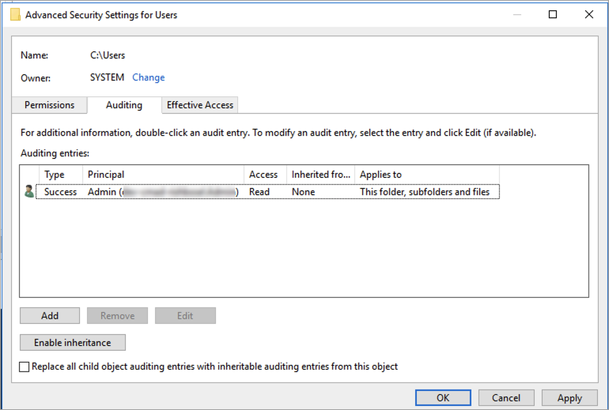

# Setting file and folder auditing controls

You need to set audit controls on the files and folders that you want audited
for user access attempts. Audit controls are also known as NTFS system access
control lists (SACLs).

You configure audit controls using the Windows-native GUI interface or
programmatically using Windows PowerShell commands. If inheritance is enabled, you
typically need to set audit controls only on the top-level folders you want to
log accesses for.

To use a GUI for setting audit controls on your files and folders, use Windows
File Explorer. On a given file or folder, open Windows File Explorer and select the
**Properties > Security > Advanced > Auditing** tab.

The following audit control example audits successful events for a folder.
A Windows event log entry will be emitted whenever that handle is opened for read
successfully by the Admin user.


The **Type** field indicates what actions you want to
audit. Set this field to **Success** to audit successful
attempts, **Fail** to audit failed attempts, or
**All** to audit both successful and failed attempts.

For more information on the auditing entry fields, see
[Apply a basic audit policy on a file or folder](https://docs.microsoft.com/en-us/windows/security/threat-protection/auditing/apply-a-basic-audit-policy-on-a-file-or-folder "https://docs.microsoft.com/en-us/windows/security/threat-protection/auditing/apply-a-basic-audit-policy-on-a-file-or-folder") in the Microsoft documentation.

You can use the Microsoft Windows `Set-Acl` command to set the auditing SACL
on any file or folder. For information about this command, see the Microsoft
[Set-Acl](https://docs.microsoft.com/en-us/powershell/module/microsoft.powershell.security/set-acl?view=powershell-7.1 "https://docs.microsoft.com/en-us/powershell/module/microsoft.powershell.security/set-acl?view=powershell-7.1")
documentation.

Following is an example of using a series of PowerShell commands and variables to set
auditing access for successful attempts. You can adapt these example commands to fit the needs
on your file system.

```
$path = "C:\Users\TestUser\Desktop\DemoTest\"

$ACL = Get-Acl $path

$ACL | Format-List

$AuditUser = "TESTDOMAIN\TestUser"

$AuditRules = "FullControl"

$InheritType = "ContainerInherit,ObjectInherit"

$AuditType = "Success"

$AccessRule = New-Object System.Security.AccessControl.FileSystemAuditRule($AuditUser,$AuditRules,$InheritType,"None",$AuditType)

$ACL.SetAuditRule($AccessRule)

$ACL | Set-Acl $path

Get-Acl $path -Audit | Format-List
```
