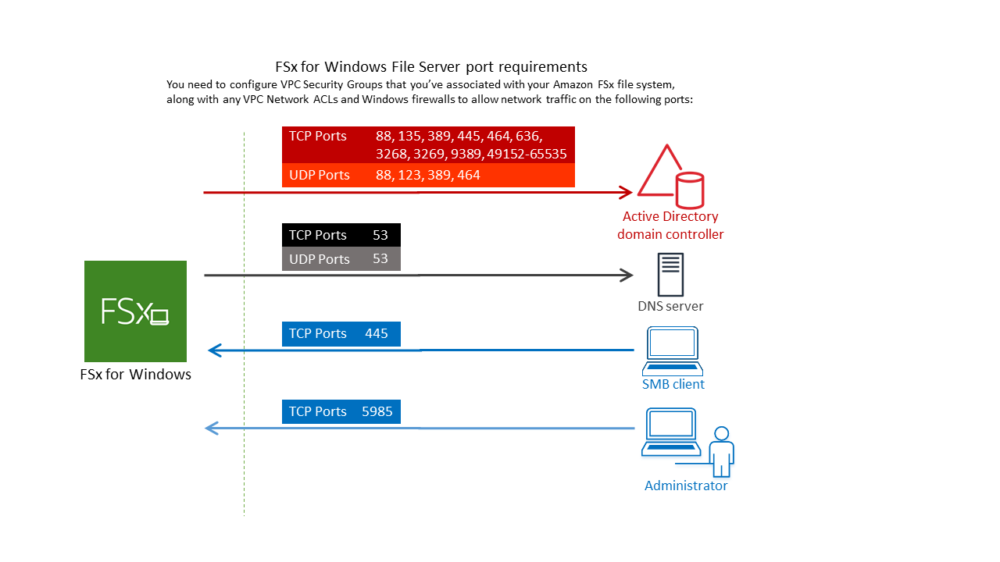

# Using Amazon FSx with AWS Directory Service for Microsoft Active Directory

AWS Directory Service for Microsoft Active Directory (AWS Managed Microsoft AD) provides fully managed, highly available, actual Active
Directory directories in the cloud. You can use these Active Directory directories in your workload
deployment.

If your organization is using AWS Managed Microsoft AD to manage identities and devices, we recommend
that you integrate your Amazon FSx file system with AWS Managed Microsoft AD. By doing this, you get a turnkey
solution using Amazon FSx with AWS Managed Microsoft AD. AWS handles the deployment, operation, high availability,
reliability, security, and seamless integration of the two services, enabling you to focus on
operating your own workload effectively.

To use Amazon FSx with your AWS Managed Microsoft AD setup, you can use the Amazon FSx console. When you create a
new FSx for Windows File Server file system in the console, choose **AWS Managed Active Directory** under the
**Windows Authentication** section. You also choose the specific directory that
you want to use. For more information, see [Step 5. Create your file system](getting-started.md#getting-started-step1 "getting-started.md#getting-started-step1").

Your organization might manage identities and devices on a self-managed Active Directory
domain (on-premises or in the cloud). If so, you can join your Amazon FSx file system directly to your
existing, self-managed Active Directory domain. For more information, see [Using a self-managed Microsoft Active Directory](self-managed-AD.md "self-managed-AD.md").

Additionally, you can also set up your system to benefit from a resource forest isolation model. In this
model, you isolate your resources, including your Amazon FSx file systems, into a separate Active Directory forest
from the one where your users are.

###### Important

For Single-AZ 2 and all Multi-AZ file systems, the Active Directory fully qualified domain name (FQDN)
cannot exceed 47 characters.

## Networking prerequisites

Before you create an FSx for Windows File Server file system joined to your AWS Microsoft Managed Active Directory domain,
make sure that you have created and set up the following network configurations:

- For **VPC security groups**, the default security group for your default
  Amazon VPC is already added to your file system in the console. Please ensure that the
  security group and the VPC Network ACLs for the subnet(s) where you're creating your FSx
  file system allow traffic on the ports and in the directions shown in the following diagram.

The following table identifies the role of each port.

| Protocol | Ports         | Role                                                               |
| -------- | ------------- | ------------------------------------------------------------------ | -------------------------------------------------------------------------------------------------------------------------------------------------------------------------------------------------------------------------------------------------------------------------------------------------------------------------------------------------------------------------------------------------------------------------------------------------------------------------------------------------------------------------------------------------------------------------------------------------------------------------------------------------------------------------------------------------------------------------------------------------------------------------------------------------------------------------------------------------------------------------------------------------------------------------------------------------------------------------------------------------------------------------------------------------------------------------------------------------------------------------------------------------------------------------------------------------------------------------------------------------------------------------------------------------------------------------------------------------------------------------------------------------------------------------------------------------------------------------------------------------------------------------------------------------------------------------------------------------------------------------------------------------------------------------------------------------------------------------------------------------------------------------------------------------------------------------------------------------------------------------------------------------------------------------------------------------------------------------------------------------------------------------------------------------------------------------------------------------------------------------------------------------------------------------------------------------------------------------------------------------------------------------------------------------------------------------------------------------------------------------------------------------------------------------------------------------------------------------------------------------------------------------------------------------------------------------------------------------------------------------------------------------------------------------------------------------------------------------------------------------------------------------------------------------------------------------------------------------------------------------------------------------------------------------------------------------------------------------------------------------------------------------------------------------------------------------------------------------------------------------------------------------------------------------------------------------------------------------------------------------------------------------------------------------------------------------------------------------------------------------------------------------------------------------------------------------------------------------------------------------------------------------------------------------------------------------------------------------------------------------------------------------------------------------------------------------------------------------------------------------------------------------------------------------------------------------------------------------------------------------------------------------------------------------------------------------------------------------------------------------------- |
| TCP/UDP  | 53            | Domain Name System (DNS)                                           |
| TCP/UDP  | 88            | Kerberos authentication                                            |
| TCP/UDP  | 464           | Change/Set password                                                |
| TCP/UDP  | 389           | Lightweight Directory Access Protocol (LDAP)                       |
| UDP      | 123           | Network Time Protocol (NTP)                                        |
| TCP      | 135           | Distributed Computing Environment / End Point Mapper (DCE / EPMAP) |
| TCP      | 445           | Directory Services SMB file sharing                                |
| TCP      | 636           | Lightweight Directory Access Protocol over TLS/SSL (LDAPS)         |
| TCP      | 3268          | Microsoft Global Catalog                                           |
| TCP      | 3269          | Microsoft Global Catalog over SSL                                  |
| TCP      | 5985          | WinRM 2.0 (Microsoft Windows Remote Management)                    |
| TCP      | 9389          | Microsoft AD DS Web Services, PowerShell                           |
| TCP      | 49152 - 65535 | Ephemeral ports for RPC                                            | ###### Important Allowing outbound traffic on TCP port 9389 is required for Single-AZ 2 and all Multi-AZ file system deployments. ###### Note If you're using VPC network ACLs, you must also allow outbound traffic on dynamic ports (49152-65535) from your FSx file system.  • If you are connecting your Amazon FSx file system to an AWS Managed Microsoft Active Directory in a different VPC or account, then ensure connectivity between that VPC and the Amazon VPC where you want to create the file system. For more information, see [Using Amazon FSx with AWS Managed Microsoft AD in a different VPC or account](shared-mad.md "shared-mad.md"). ###### Important While Amazon VPC security groups require ports to be opened only in the direction that network traffic is initiated, VPC network ACLs require ports to be open in both directions. Use the [Amazon FSx Network Validation tool](validate-ad-domain-controllers.md#test-ad-controller-connectivity "validate-ad-domain-controllers.md#test-ad-controller-connectivity") to validate connectivity to your Active Directory domain controllers. ## Using a resource forest isolation model You join your file system to an AWS Managed Microsoft AD setup. You then establish a one-way forest trust relationship between an AWS Managed Microsoft AD domain that you create and your existing self-managed Active Directory domain. For Windows authentication in Amazon FSx, you only need a one-way directional forest trust, where the AWS managed forest trusts the corporate domain forest. Your corporate domain takes the role of the trusted domain, and the AWS Directory Service managed domain takes the role of the trusting domain. Validated authentication requests travel between the domains in only one direction—allowing accounts in your corporate domain to authenticate against resources shared in the managed domain. In this case, Amazon FSx interacts only with the AWS managed domain. In a Kerberos authentication scenario, authentication requests originating from a corporate client get validated by the corporate domain, which then refers it to the AWS Managed Microsoft AD, and eventually the client presents its service ticket to your FSx for Windows File Server file system. For more information about trusts, see the post [Everything you wanted to know about trusts with AWS Managed Microsoft AD](https://aws.amazon.com/blogs/security/everything-you-wanted-to-know-about-trusts-with-aws-managed-microsoft-ad/ "https://aws.amazon.com/blogs/security/everything-you-wanted-to-know-about-trusts-with-aws-managed-microsoft-ad/") in the AWS Security Blog. ## Test your Active Directory configuration Before creating your Amazon FSx file system, we recommend that you validate the connectivity to your Active Directory domain controllers using the Amazon FSx Network Validation tool. For more information, see [Validating connectivity to your Active Directory domain controllers](validate-ad-domain-controllers.md "validate-ad-domain-controllers.md"). The following related resources can help you as you use AWS Directory Service for Microsoft Active Directory with FSx for Windows File Server:  • [What is AWS Directory Service](../../../directoryservice/latest/admin-guide/what_is.md "../../../directoryservice/latest/admin-guide/what_is.md") in the _AWS Directory Service Administration Guide_  • [Create your AWS Managed Active Directory](../../../directoryservice/latest/admin-guide/ms_ad_getting_started_create_directory.md "../../../directoryservice/latest/admin-guide/ms_ad_getting_started_create_directory.md") in the _AWS Directory Service Administration Guide_  • [When to Create a Trust Relationship](../../../directoryservice/latest/admin-guide/ms_ad_setup_trust.md "../../../directoryservice/latest/admin-guide/ms_ad_setup_trust.md") in the _AWS Directory Service Administration Guide_ |
