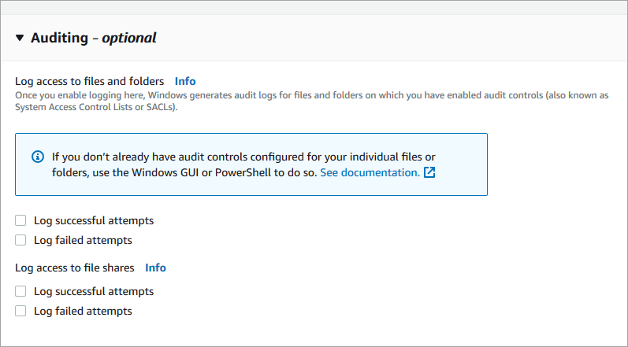
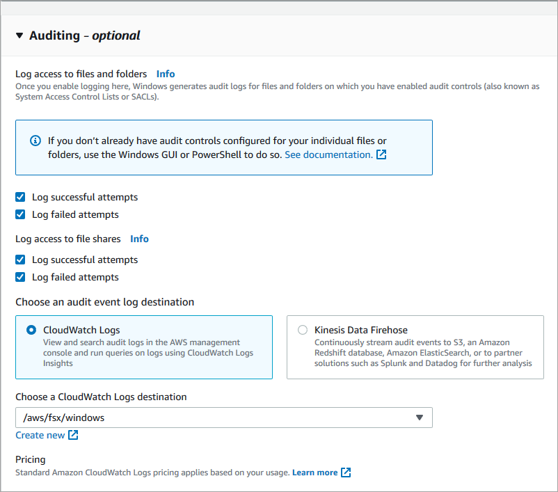
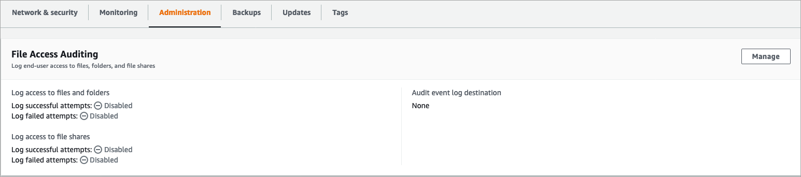
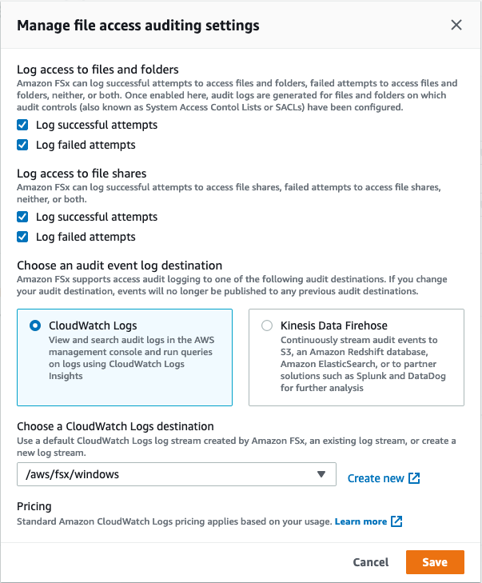

# Managing file access auditing

You can enable file access auditing when creating a new Amazon FSx for Windows File Server file system.
File access auditing is turned off by default when you create a file system from the
Amazon FSx console.

On existing file systems that have file access auditing enabled, you can change the file
access auditing settings, including changing the access attempt types for file and file
share accesses, and the audit event log destination. You can perform these tasks using the
Amazon FSx console, AWS CLI, or API.

###### Note

File access auditing is supported only on Amazon FSx for Windows File Server file systems with
a throughput capacity of 32 MBps or greater. You cannot create or update a file system
with a throughput capacity of less than 32 MBps if file access auditing is enabled. You
can modify the throughput capacity at any time after you create the file system. For
more information, see
[Managing throughput capacity](managing-throughput-capacity.md "managing-throughput-capacity.md").

1. Open the Amazon FSx console at [https://console.aws.amazon.com/fsx/](https://console.aws.amazon.com/fsx/ "https://console.aws.amazon.com/fsx/").
2. Follow the procedure for creating a new file system described in
   [Step 5. Create your file system](getting-started.md#getting-started-step1 "getting-started.md#getting-started-step1") in the Getting Started section.
3. Open the **Auditing - optional** section. File access auditing is disabled by default.

 4. To enable and configure file access auditing, do the following.

    * For **Log access to files and folders**, select the logging
     of successful and/or failed attempts. Logging is disabled for files and folders if you
     don't make a selection.
    * For **Log access to file shares**, select the logging
     of successful and/or failed attempts. Logging is disabled for file shares if you
     don't make a selection.
    * For **Choose an audit event log destination**, choose
     **CloudWatch Logs** or **Firehose**.
     Then choose an existing log or delivery stream or create a new one. For CloudWatch Logs, Amazon FSx can create
     and use a default log stream in the CloudWatch Logs `/aws/fsx/windows` log group.

Following is an example of a file access auditing configuration that will audit successful and
failed access attempts of end users for files, folders, and file shares. The audit event logs will
be sent to the default CloudWatch Logs `/aws/fsx/windows` log group destination.

 5. Continue with the next section of the file system creation wizard.
When the file system is **Available**, the file access auditing feature is enabled.

1. When creating a new file system, use the `AuditLogConfiguration` property
   with the [CreateFileSystem](../APIReference/API_CreateFileSystem.md "../APIReference/API_CreateFileSystem.md")
   API operation to enable file access auditing for the new file system.

```
`aws fsx create-file-system \
 --file-system-type WINDOWS \
 --storage-capacity 300 \
 --subnet-ids subnet-123456 \
 --windows-configuration AuditLogConfiguration='{FileAccessAuditLogLevel="SUCCESS_AND_FAILURE", \
 FileShareAccessAuditLogLevel="SUCCESS_AND_FAILURE", \
 AuditLogDestination="arn:aws:logs:us-east-1:123456789012:log-group:/aws/fsx/my-customer-log-group"}'`
```

2. When the file system is **Available**, the file access auditing feature is enabled.
1. Open the Amazon FSx console at [https://console.aws.amazon.com/fsx/](https://console.aws.amazon.com/fsx/ "https://console.aws.amazon.com/fsx/").
1. Navigate to **File systems**, and choose the Windows file system that you
   want to manage file access auditing for.
1. Choose the **Administration** tab.
1. On the **File Access Auditing** panel, choose **Manage**.

 5. On the **Manage file access auditing settings** dialog, change the desired settings.



    * For **Log access to files and folders**, select the logging
     of successful and/or failed attempts. Logging is disabled for files and folders if you
     don't make a selection.
    * For **Log access to file shares**, select the logging
     of successful and/or failed attempts. Logging is disabled for file shares if you
     don't make a selection.
    * For **Choose an audit event log destination**, choose
     **CloudWatch Logs** or **Firehose**.
     Then choose an existing log or delivery stream or create a new one.

6. Choose **Save**.

- Use the [`update-file-system`](../../../cli/latest/reference/fsx/update-file-system.md "../../../cli/latest/reference/fsx/update-file-system.md")
  CLI command or the equivalent [`UpdateFileSystem`](../APIReference/API_UpdateFileSystem.md "../APIReference/API_UpdateFileSystem.md")
  API operation.

```
`aws fsx update-file-system \
 --file-system-id fs-0123456789abcdef0 \
 --windows-configuration AuditLogConfiguration='{FileAccessAuditLogLevel="SUCCESS_ONLY", \
 FileShareAccessAuditLogLevel="FAILURE_ONLY", \
 AuditLogDestination="arn:aws:logs:us-east-1:123456789012:log-group:/aws/fsx/my-customer-log-group"}'`
```
