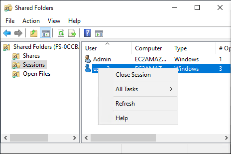
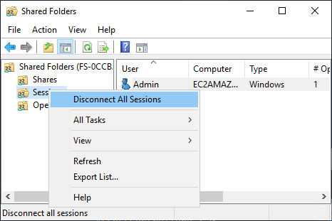
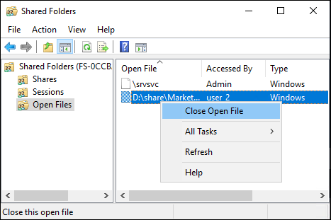
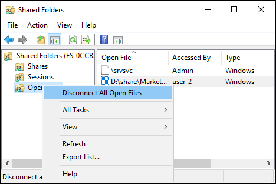

# User sessions and open files

You can monitor connected user sessions and open files on your FSx for Windows File Server file
system using the Shared Folders tool. The Shared Folders tool provides a central
location to monitor who is connected to the file system, along with what files are
open and by whom. You can use this tool to do the following:

- Restore access to locked files.
- Disconnect a user session, which closes all files opened by that user.
  You can use the Windows-native Shared Folders GUI tool and the Amazon FSx CLI for remote management on PowerShell to manage
  user sessions and open files on your FSx for Windows File Server file system.

## Using the GUI to manage users and sessions

The following procedures detail how you can manage user sessions
and open files on your Amazon FSx file system using the Microsoft Windows shared folders tool.

1. Launch your Amazon EC2 instance and connect it to the Microsoft Active Directory
   that your Amazon FSx file system is joined to. To do this, choose one of the
   following procedures from the _AWS Directory Service Administration Guide_:
   - [Seamlessly join a Windows EC2
     instance](../../../directoryservice/latest/admin-guide/launching_instance.md "../../../directoryservice/latest/admin-guide/launching_instance.md")
   - [Manually join a Windows
     instance](../../../directoryservice/latest/admin-guide/join_windows_instance.md "../../../directoryservice/latest/admin-guide/join_windows_instance.md")

2. Connect to your instance as a user that is a member of the file system
   administrators group. In AWS Managed Microsoft Active Directory, this group is called AWS Delegated FSx
   Administrators. In your self-managed Microsoft Active Directory, this group
   is called Domain Admins or the custom name for the administrators group that
   you provided during creation. For more information, see [Connecting to
   Your Windows Instance](../../../AWSEC2/latest/WindowsGuide/connecting_to_windows_instance.md "../../../AWSEC2/latest/WindowsGuide/connecting_to_windows_instance.md") in the
   _Amazon EC2 User Guide_.
3. Open the **Start** menu and run
   **fsmgmt.msc** using `Run As Administrator`.
   Doing this opens the Shared Folders GUI tool.
4. For **Action**, choose **Connect to another
   computer**.
5. For **Another computer**, enter the DNS name of your
   Amazon FSx file system, for example
   `fs-`012345678901234567`.`ad-domain`.com`.
6. Choose **OK**. An entry for your Amazon FSx file system then
   appears in the list for the Shared Folders tool.
   In the Shared Folders tool, choose **Sessions** to view all
   the user sessions that are connected to your FSx for Windows File Server file system. If a user or
   application is accessing a file share on your Amazon FSx file system, this snap-in shows
   you their session. You can disconnect sessions by opening the context (right-click)
   menu for a session and choosing **Close Session**.

To disconnect all open sessions, open the context (right-click) menu for
**Sessions**, choose **Disconnect All
Sessions**, and confirm your action.

In the Shared Folders tool, choose **Open Files** to view all
the files on the system that are currently open. The view also shows which users
have the files or folders open. This information can be helpful in tracking down why
other users cannot open certain files. You can close any file that any user has open
simply by opening the context (right-click) menu for the file's entry in the list
and choosing **Close Open File**.

To disconnect all open files on the file system, the context (right-click) menu for **Open Files**
and choose **Disconnect All Open Files**, and confirm your action.

## Using PowerShell to manage user sessions and open files

You can manage active user sessions and open files on your file system using the Amazon FSx
CLI for remote management on PowerShell. To learn how to use this CLI, see [Using the Amazon FSx CLI for PowerShell](administering-file-systems.md#remote-pwrshell "administering-file-systems.md#remote-pwrshell").

Following are commands that you can use for user session and open file
management.

| Command                  | Description                                                                                                                                                  |
| ------------------------ | ------------------------------------------------------------------------------------------------------------------------------------------------------------ |
| **Get-FSxSmbSession**    | Retrieves information about the Server Message Block (SMB) sessions that are currently established between the file system and the associated clients. |
| **Close-FSxSmbSession**  | Ends an SMB session.                                                                                                                                         |
| **Get-FSxSmbOpenFile**   | Retrieves information about files that are open for the clients connected to the file system.                                                             |
| **Close-FSxSmbOpenFile** | Closes a file that is open for one of the clients of the SMB server.                                                                                         |

The online help for each command provides a reference of all command options. To
access this help, run the command with a **-?**, for example
**Get-FSxSmbSession -?**.
