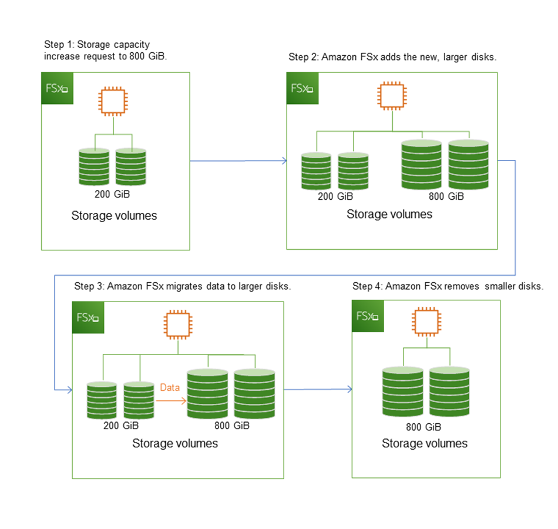

# Managing storage on FSx for Windows File Server

Your file system's storage configuration includes the amount of provisioned storage capacity,
the storage type, and if the storage type is solid state drive (SSD), the amount of SSD
IOPS. You can configure these resources, along with the file system's throughput capacity, when
creating a file system and after it's created, to achieve the desired performance for your workload.
Learn how to manage your file system's storage and storage-related performance using the AWS Management Console, AWS CLI,
and the Amazon FSx CLI for remote management on PowerShell by exploring the following topics.

###### Topics

- [Optimizing storage costs](#optimize-storage-costs "#optimize-storage-costs")
- [Managing storage capacity](#managing-storage-capacity "#managing-storage-capacity")
- [Managing your file system's storage type](#managing-storage-type "#managing-storage-type")
- [Managing SSD IOPS](#managing-provisioned-ssd-iops "#managing-provisioned-ssd-iops")
- [Reducing storage costs with Data Deduplication](#using-data-dedup "#using-data-dedup")
- [Managing storage quotas](managing-user-quotas.md "managing-user-quotas.md")
- [Increasing file system storage capacity](increase-storage-capacity.md "increase-storage-capacity.md")
- [Monitoring storage capacity
  increases](monitoring-storage-capacity-increase.md "monitoring-storage-capacity-increase.md")
- [Increasing the storage capacity of
  an FSx for Windows File Server file system dynamically](automate-storage-capacity-increase.md "automate-storage-capacity-increase.md")
- [Updating the storage type of a FSx for Windows file system](updating-storage-type.md "updating-storage-type.md")
- [Monitoring storage type updates](monitoring-storage-type-updates.md "monitoring-storage-type-updates.md")
- [Updating a file system's SSD IOPS](how-to-provision-ssd-iops.md "how-to-provision-ssd-iops.md")
- [Monitoring provisioned SSD IOPS updates](monitoring-provisioned-ssd-iops.md "monitoring-provisioned-ssd-iops.md")
- [Managing data deduplication](managing-data-dedup.md "managing-data-dedup.md")
- [Troubleshooting data deduplication](data-dedup-ts.md "data-dedup-ts.md")

## Optimizing storage costs

You can optimize your storage costs using the storage configuration options available in FSx for Windows.

**Storage type options**—FSx for Windows File Server provides two storage types, hard disk drives (HDD) and solid state
drives (SSD)—to enable you to optimize cost/performance to meet your workload needs. HDD
storage is designed for a broad spectrum of workloads, including home directories, user and
departmental shares, and content management systems. SSD storage is designed for the
highest-performance and most latency-sensitive workloads, including databases, media processing
workloads, and data analytics applications. For more information about storage types and file system performance,
see [FSx for Windows File Server performance](performance.md "performance.md").

**Data deduplication**—Large datasets often have redundant data, which increases data storage costs. For example,
user file shares can have multiple copies of the same file, stored by multiple users. Software
development shares can contain many binaries that remain unchanged from build to build. You can
reduce your data storage costs by turning on _data deduplication_ for your
file system. When it's turned on, data deduplication automatically reduces or eliminates
redundant data by storing duplicated portions of the dataset only once. For more information
about data deduplication, and how to easily turn it on for your Amazon FSx file system, see [Reducing storage costs with Data Deduplication](#using-data-dedup "#using-data-dedup").

## Managing storage capacity

You can increase your FSx for Windows file system's storage capacity
as your storage requirements change. You can do so using the Amazon FSx console, the Amazon FSx API, or the AWS Command Line Interface
(AWS CLI). Factors to consider when planning a storage capacity increase include knowing when you need to
increase storage capacity, understanding
how Amazon FSx processes storage capacity increases, and tracking the progress of a storage increase request.
You can only increase a file system's storage capacity; you cannot
decrease storage capacity.

###### Note

You can't increase storage capacity for file systems created before June 23, 2019 or
file systems restored from a backup belonging to a file system that was created before
June 23, 2019.

When you increase the storage capacity of your Amazon FSx file system, Amazon FSx adds a new, larger
set of disks to your file system behind the scenes. Amazon FSx then runs a storage optimization
process in the background to transparently migrate data from the old disks to the new disks.
Storage optimization can take between a few hours and several days, depending on the
storage type and other factors, with minimal noticeable
impact on the workload performance. During this optimization, backup usage is temporarily
higher, because both the old and new storage volumes are included in the file system-level
backups. Both sets of storage volumes are included to ensure that Amazon FSx can successfully
take and restore from backups even during storage scaling activity. The backup usage reverts
to its previous baseline level after the old storage volumes are no longer included in the
backup history. When the new storage capacity becomes available, you are billed only for the
new storage
capacity.

The following illustration shows the four main steps of the process that Amazon FSx uses when
increasing a file system's storage capacity.

You can track the progress of storage optimization, SSD storage capacity increases, or SSD
IOPS updates at any time using the Amazon FSx console, CLI, or API. For more information, see
[Monitoring storage capacity
increases](monitoring-storage-capacity-increase.md "monitoring-storage-capacity-increase.md").

### What to know about

increasing a file system's storage capacity

Here are a few important items to consider when increasing storage capacity:

- **Increase only** – You can only
  _increase_ the amount of storage capacity for a file
  system; you can't decrease storage capacity.
- **Minimum increase** – Each storage
  capacity increase must be a minimum of 10 percent of the file system's
  current storage capacity, up to the maximum allowed value of 65,536 GiB.
- **Minimum throughput capacity** – To
  increase storage capacity, a file system must have a minimum throughput capacity
  of 16 MBps. This is because the storage optimization step is a
  throughput-intensive process.
- **Time between increases** – You
  can't make further storage capacity increases on a file system until 6
  hours after the last increase was requested, or until the storage optimization
  process has completed, whichever time is longer. Storage optimization can take
  from a few hours up to a few days to complete. To minimize the time it takes for
  storage optimization to complete, we recommend increasing your file system's
  throughput capacity before increasing storage capacity (the throughput capacity
  can be scaled back down after storage scaling completes), and increasing storage
  capacity when there is minimal traffic on the file system.

###### Note

Certain file system events can consume disk I/O performance resources For
example:

The optimization phase of storage capacity scaling can generate increased disk
throughput, and potentially cause performance warnings. For more information, see
[Performance warnings and recommendations](monitoring-cloudwatch.md#performance-insights-FSxW "monitoring-cloudwatch.md#performance-insights-FSxW").

### Knowing when to increase storage

capacity

Increase your file system's storage capacity when it's running low on free
storage capacity. Use the `FreeStorageCapacity` CloudWatch metric to monitor the
amount of free storage available on the file system. You can create an Amazon CloudWatch alarm on
this metric and get notified when it drops below a specific threshold. For more
information, see [Monitoring with Amazon CloudWatch](monitoring-cloudwatch.md "monitoring-cloudwatch.md").

We recommend maintaining at least 20% of free storage capacity at all times on your
file system. Using all of your storage capacity can negatively impact your performance
and might introduce data inconsistencies.

You can automatically increase your file system's storage capacity when the
amount of free storage capacity falls below a defined threshold that you specify. Use
the AWS‐developed custom AWS CloudFormation template to deploy all of the components required
to implement the automated solution. For more information, see [Increasing storage
capacity dynamically](automate-storage-capacity-increase.md "automate-storage-capacity-increase.md").

### Storage capacity increases

and file system performance

Most workloads experience minimal performance impact while Amazon FSx runs the storage
optimization process in the background after the new storage capacity is available.
However, file systems with HDD storage type and workloads involving large
numbers of end users, high levels of I/O, or datasets that have large numbers of small files could
temporarily experience reduction in the performance. For these cases, we recommend that you first increase
your file system's throughput capacity before increasing storage capacity. For these
types of workloads, we also recommend changing throughput capacity during idle periods when there is
minimal load on your file system. This enables you to continue providing the same level of throughput to
meet your application’s performance needs. For more information, see
[Managing throughput capacity](managing-throughput-capacity.md "managing-throughput-capacity.md").

## Managing your file system's storage type

You can change your file system storage type from HDD to SSD using the AWS Management Console and AWS CLI.
When you change the storage type to SSD, keep in mind that you can't update your file system
configuration again until 6 hours after the last
update was requested, or until the storage optimization process is complete—whichever
time is longer. Storage optimization can take between a few hours and a few days to
complete. To minimize this time, we recommend updating your storage type when there is
minimal traffic on your file system.
For more information, see [Updating the storage type of a FSx for Windows file system](updating-storage-type.md "updating-storage-type.md").

You can't change your file system storage type from SSD to HDD. If you want to change a file
system's storage type from SSD to HDD, you will need to restore a
backup of the file system to a new file system that you configure to use HDD storage. For more
information, see [Restoring backups to new file system](using-backups.md#restoring-backups "using-backups.md#restoring-backups").

### About storage types

You can configure your FSx for Windows File Server file system to use either the solid state drive (SSD) or the magnetic hard disk drive (HDD)
storage type.

**SSD storage** is appropriate for most production
workloads that have high performance requirements and latency-sensitivity. Examples
of these workloads include databases, data analytics, media processing, and
business applications. We also recommend SSD for use cases involving large numbers
of end users, high levels of I/O, or datasets that have large numbers of small
files. Lastly, we recommend using SSD storage if you plan to enable shadow
copies. You can configure and scale SSD IOPS for file systems with SSD storage, but not HDD storage.

**HDD storage** is designed for a broad range of workloads—including home directories,
user and departmental file shares, and content management systems. HDD storage comes at a lower cost relative to SSD
storage, but with higher latencies and lower levels of disk throughput and disk IOPS
per unit of storage. It might be suitable for general-purpose user shares and home
directories with low I/O requirements, large content management systems (CMS) where
data is retrieved infrequently, or datasets with small numbers of large files.

For more information, see [Storage configuration & performance](performance.md#storage-capacity-and-performance "performance.md#storage-capacity-and-performance").

## Managing SSD IOPS

For file systems configured with SSD storage, the amount of SSD IOPS determines the amount of disk I/O
available when your file system has to read data from and write data to disk, as opposed to data that is in cache.
You can select and scale the amount of SSD IOPS independently of storage
capacity. The maximum SSD IOPS that you can provision is dependent on the amount of storage
capacity and throughput capacity you select for your file system. If you attempt to increase
your SSD IOPS above the limit that's supported by your throughput capacity, you might need
to increase your throughput capacity to get that level of SSD IOPS. For more
information, see [FSx for Windows File Server performance](performance.md "performance.md") and [Managing throughput capacity](managing-throughput-capacity.md "managing-throughput-capacity.md").

Here are a few important items to know about updating a file system's provisioned SSD IOPS:

- Choosing an IOPS mode – there are two IOPS modes to choose from:
  - **Automatic** – choose this mode and Amazon FSx will automatically
    scale your SSD IOPS to maintain 3 SSD IOPS per GiB of storage
    capacity, up to 400,000 SSD IOPS per file system.
  - **User-provisioned** – choose this mode so that you can
    specify the number of SSD IOPS within the range of 96–400,000. Specify a number between 3–50 IOPS
    per GiB of storage capacity for all AWS Regions where Amazon FSx is
    available, or between 3–500 IOPS per GiB of storage capacity in
    US East (N. Virginia), US West (Oregon), US East (Ohio),
    Europe (Ireland), Asia Pacific (Tokyo), and
    Asia Pacific (Singapore). When you choose the user-provisiohed mode, and the amount of SSD IOPS you specify is not at least 3
    IOPS per GiB, the request fails. For higher levels of provisioned SSD
    IOPS, you pay for the average IOPS above 3 IOPS per GiB per file
    system.

- **Storage capacity updates** – If you increase your file system's
  storage capacity, and the amount requires by default an amount of SSD IOPS that is greater than
  your current user-provisioned SSD IOPS level, Amazon FSx automatically switches your file
  system to Automatic mode and your file system will have a minimum of 3 SSD IOPS per GiB of storage capacity.
- **Throughput capacity updates** – If you increase your
  throughput capacity, and the maximum SSD IOPS supported by your new throughput
  capacity is higher than your user-provisioned SSD IOPS level, Amazon FSx
  automatically switches your file system to Automatic mode.
- **Frequency of SSD IOPS increases** – You can't make further
  SSD IOPS increases, throughput capacity increases, or storage type updates on a
  file system until 6 hours after the last increase was requested, or until the
  storage optimization process has completed—whichever time is longer.
  Storage optimization can take from a few hours up to a few days to complete. To
  minimize the time it takes for storage optimization to complete, we recommend
  scaling SSD IOPS when there is minimal traffic on the file system.

###### Note

Note that throughput capacity levels of 4,608 MBps and higher are supported only in the
following AWS Regions:
US East (N. Virginia), US West (Oregon), US East (Ohio), Europe (Ireland),
Asia Pacific (Tokyo), and Asia Pacific (Singapore).

For more information about how update the amount of provisioned SSD IOPS for your FSx for Windows File Server file system, see
[Updating a file system's SSD IOPS](how-to-provision-ssd-iops.md "how-to-provision-ssd-iops.md").

## Reducing storage costs with Data Deduplication

Data Deduplication, often referred to as Dedup for short, helps storage administrators reduce costs that are associated with duplicated data.
With FSx for Windows File Server, you can use Microsoft Data Deduplication to identify and eliminate
redundant data. Large datasets often have redundant data, which increases the data storage costs. For
example:

- User file shares may have many copies of the same or similar files.
- Software development shares can have many binaries that remain unchanged from build
  to build.

You can reduce your data storage costs by enabling data deduplication for your file
system. _Data deduplication_ reduces or eliminates
redundant data by storing duplicated portions of the dataset only once. When you enable Data Deduplication, Data compression
is enabled by default, compressing the data after deduplication for additional savings. Data Deduplication optimizes redundancies
without compromising data fidelity or integrity. Data deduplication runs as a
background process that continually and automatically scans and optimizes your file system,
and it is transparent to your users and connected clients.

The storage savings that you can achieve with data deduplication depends on the nature
of your dataset, including how much duplication exists across files. Typical savings
average 50–60 percent for general-purpose file shares. Within shares, savings
range from 30–50 percent for user documents to 70–80 percent for software
development datasets. You can measure potential deduplication savings using the
`Measure-FSxDedupFileMetadata` remote PowerShell command described below.

You can also customize data deduplication to meet your specific storage needs. For example,
you can configure deduplication to run only on certain file types, or you can create a custom
job schedule. Because deduplication jobs can consume file server resources, we recommend
monitoring the status of your deduplication jobs using the
`Get-FSxDedupStatus`.

For information about configuring data deduplication on your file system, see
[Managing data deduplication](managing-data-dedup.md "managing-data-dedup.md").

For information on resolving issues related to data deduplication, see
.

For more information about data deduplication, see
the Microsoft
[Understanding Data Deduplication](https://docs.microsoft.com/en-us/windows-server/storage/data-deduplication/understand "https://docs.microsoft.com/en-us/windows-server/storage/data-deduplication/understand")
documentation.

###### Warning

It is not recommended to run certain Robocopy commands with data deduplication
because these commands can impact the data integrity of the Chunk Store. For more information,
see the Microsoft
[Data Deduplication interoperability](https://docs.microsoft.com/en-us/windows-server/storage/data-deduplication/interop "https://docs.microsoft.com/en-us/windows-server/storage/data-deduplication/interop")
documentation.

### Best practices when using data deduplication

Here are some best practices for using Data Deduplication:

- **Schedule Data Deduplication jobs to run when your
  file system is idle**: The default schedule includes a weekly
  `GarbageCollection` job at 2:45 UTC on Saturdays. It can take
  multiple hours to complete if you have a large amount of data churn on your
  file system. If this time isn't ideal for your workload, schedule this job
  to run at a time when you expect low traffic on your file system.
- **Configure sufficient throughput capacity for Data
  Deduplication to complete**: Higher throughput capacities
  provide higher levels of memory. Microsoft recommends having 1 GB of memory
  per 1 TB of logical data to run Data Deduplication. Use the [Amazon FSx performance
  table](performance.md#impact-throughput-cap-performance "performance.md#impact-throughput-cap-performance") to determine the memory that's associated with your file
  system's throughput capacity and ensure that the memory resources are
  sufficient for the size of your data.
- **Customize Data Deduplication settings to meet your
  specific storage needs and reduce performance requirements**:
  You can constrain the optimization to run on specific file types or folders,
  or set a minimum file size and age for optimization. To learn more, see
  [Reducing storage costs with Data Deduplication](#using-data-dedup "#using-data-dedup").
