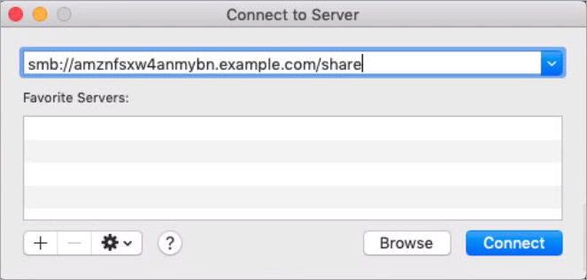
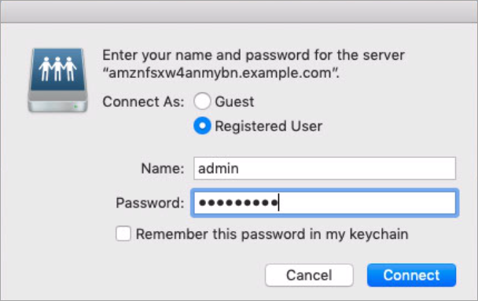

# Mounting a file share on an Amazon EC2 Mac instance

You can mount a file share on an Amazon EC2 Mac instance that is either joined to your Active
Directory or not joined to access your FSx for Windows File Server file system. If the instance is not joined to your Active Directory, be sure to
update the DHCP options set for the Amazon Virtual Private Cloud (Amazon VPC) in which the instance resides to
include the DNS name servers for your Active Directory domain. Then relaunch the
instance.

1. Launch the EC2 Mac instance. To do this, choose one of the
   following procedures from the _Amazon EC2 User Guide_:
   - [Launch a Mac instance using the console](../../../AWSEC2/latest/UserGuide/ec2-mac-instances.md#mac-instance-launch "../../../AWSEC2/latest/UserGuide/ec2-mac-instances.md#mac-instance-launch")
   - [Launch a Mac instance using the AWS CLI](../../../AWSEC2/latest/UserGuide/ec2-mac-instances.md#mac-instance-launch-cli "../../../AWSEC2/latest/UserGuide/ec2-mac-instances.md#mac-instance-launch-cli")

2. Connect to your EC2 Mac instance using Virtual Network Computing (VNC).
   For more information, see
   [Connect to your instance using VNC](../../../AWSEC2/latest/UserGuide/ec2-mac-instances.md#mac-instance-vnc "../../../AWSEC2/latest/UserGuide/ec2-mac-instances.md#mac-instance-vnc")
   in the _Amazon EC2 User Guide_.
3. On your EC2 Mac instance, connect to your Amazon FSx file share, as follows:
   1. Open Finder, choose **Go**, and then choose
      **Connect to Server**.
   2. In the **Connect to Server** dialog box, enter either the
      file system's DNS name or a DNS alias associated with the file system, and the
      share name. Then choose **Connect**.

   You can find the file system's DNS name and any associated DNS aliases on
   the [Amazon FSx console](https://console.aws.amazon.com/fsx "https://console.aws.amazon.com/fsx") by choosing
   **Windows File Server**, **Network &
   security**. Or, you can find them in the response of the [CreateFileSystem](../APIReference/API_CreateFileSystem.md "../APIReference/API_CreateFileSystem.md") or [DescribeFileSystems](../APIReference/API_DescribeFileSystems.md "../APIReference/API_DescribeFileSystems.md") API operation. For more information about using
   DNS aliases, see [Managing DNS aliases](managing-dns-aliases.md "managing-dns-aliases.md").

    3. On the next screen, choose **Connect** to continue. 4. Enter your Microsoft Active Directory (AD) credentials for the Amazon FSx service account,
   as shown in the following example. Then choose **Connect**.

    5. If the connection is successful, you can see the Amazon FSx share, under **Locations** in your Finder window.

4. Launch the EC2 Mac instance. To do this, choose one of the
   following procedures from the _Amazon EC2 User Guide_:
   - [Launch a Mac instance using the console](../../../AWSEC2/latest/UserGuide/ec2-mac-instances.md#mac-instance-launch "../../../AWSEC2/latest/UserGuide/ec2-mac-instances.md#mac-instance-launch")
   - [Launch a Mac instance using the AWS CLI](../../../AWSEC2/latest/UserGuide/ec2-mac-instances.md#mac-instance-launch-cli "../../../AWSEC2/latest/UserGuide/ec2-mac-instances.md#mac-instance-launch-cli")

5. Connect to your EC2 Mac instance using Virtual Network Computing (VNC).
   For more information, see
   [Connect to your instance using VNC](../../../AWSEC2/latest/UserGuide/ec2-mac-instances.md#mac-instance-vnc "../../../AWSEC2/latest/UserGuide/ec2-mac-instances.md#mac-instance-vnc")
   in the _Amazon EC2 User Guide_.
6. Mount the file share with the following command.

```
mount_smbfs //`file_system_dns_name`/`file_share mount_point`
```

You can find the DNS name on the [Amazon FSx
console](https://console.aws.amazon.com/fsx "https://console.aws.amazon.com/fsx") by choosing **Windows File Server**,
**Network & security**. Or, you can find them in the response
of the `CreateFileSystem` or `DescribeFileSystems` API
operation.

    * For a Single-AZ file system joined to an AWS Managed Microsoft Active Directory, the DNS name looks like the
     following.


    ```
    fs-0123456789abcdef0.`ad-domain`.com
    ```
    * For a Single-AZ file system joined to a self-managed Active Directory, and any Multi-AZ file
     system, the DNS name looks like the following.


    ```
    amznfsxaa11bb22.`ad-domain`.com
    ```

The mount command used in this procedure does the following at the given points:

    * `//`file_system_dns_name`/`file_share``
     – Specifies the DNS name and share of the file system to mount.
    * `mount_point` – The directory on the EC2
     instance that you are mounting the file system to.
