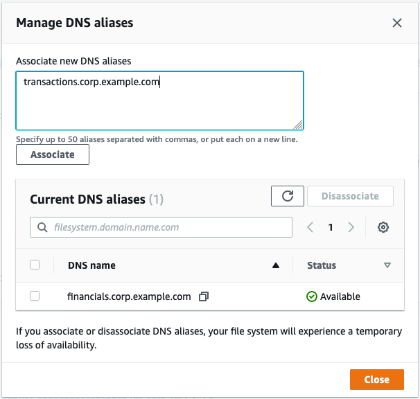

# Migrating your on-premises DNS configuration to FSx for Windows File Server

FSx for Windows File Server provides a default Domain Name System (DNS) name for every file system that you
can use to access the data on your file system. You can also access your file systems using any
DNS name of your choosing by configuring the alternate DNS name as a DNS alias for your Amazon FSx
file system.

With DNS aliases, you can continue to use your existing DNS names to access data stored on
Amazon FSx when migrating file system storage from on-premises to Amazon FSx. This helps eliminate the need
to update any tools or applications that use your DNS names when migrating to Amazon FSx. You can
associate DNS aliases with existing FSx for Windows File Server file systems, when you create new file systems,
and when you create a new file system from a backup. You can associate up to 50 DNS aliases with
a file system at any one time. For more information, see [Managing DNS aliases](managing-dns-aliases.md "managing-dns-aliases.md").

A DNS alias name has to meet the following requirements:

- Must be formatted as a fully qualified domain name (FQDN), for example,
  `accounting.example.com`.
- Can contain alphanumeric characters and the hyphen (‐).
- Cannot start or end with a hyphen.
- Can start with a numeric.
  For DNS alias names, Amazon FSx stores alphabetic characters as lowercase letters (a-z),
  regardless of how you specify them: as uppercase letters, lowercase letters, or the corresponding
  letters in escape codes.

The following procedures describe how to associate DNS aliases with your existing FSx for Windows File Server file systems using the Amazon FSx console, CLI, and API.
For more information
about associating DNS aliases when creating new file systems, including new file systems from a backup, see
[Associating DNS aliases with file systems](add-alias-new-filesystem.md "add-alias-new-filesystem.md").

###### To associate DNS aliases with an existing file system (console)

1. Open the Amazon FSx console at [https://console.aws.amazon.com/fsx/](https://console.aws.amazon.com/fsx/ "https://console.aws.amazon.com/fsx/").
2. Navigate to **File systems**, and choose the Windows file system that you
   want to associate your DNS aliases with.
3. On the **Network & security** tab, choose **Manage** for
   **DNS aliases** to open the **Manage DNS aliases** dialog
   box.

 4. In the **Associate new aliases** box, enter the DNS aliases that you want
to associate. 5. Choose **Associate** to add the aliases to the file system.

You can monitor the status of the aliases that you just associated in the
**Current aliases** list. When the status reads
**Available**, the alias is associated with the file system (a process that
can take up to 2.5 minutes).

###### To associate DNS aliases with an existing file system (CLI)

- Use the `associate-file-system-aliases` CLI command or the [AssociateFileSystemAliases](../APIReference/API_AssociateFileSystemAliases.md "../APIReference/API_AssociateFileSystemAliases.md") API operation to associate DNS aliases with an existing
  file system.

The following CLI request associates two aliases with the specified file system.

```
aws fsx associate-file-system-aliases \
    --file-system-id fs-0123456789abcdef0 \
    --aliases financials.corp.example.com transfers.corp.example.com

```

The response shows the status of the aliases that Amazon FSx is associating with the file system.

```
{
      "Aliases": [
          {
              "Name": "financials.corp.example.com",
              "Lifecycle": CREATING
          },
          {
              "Name": "transfers.corp.example.com",
              "Lifecycle": CREATING
          }
      ]
  }
```

To monitor the status of the aliases that you are associating, use the
`describe-file-system-aliases` CLI command ([DescribeFileSystemAliases](../APIReference/API_DescribeFileSystemAliases.md "../APIReference/API_DescribeFileSystemAliases.md") is the equivalent API operation). When
`Lifecycle` for an alias has a value of AVAILABLE, you can use it to access the
file system (a process that can take up to 2.5 minutes).
