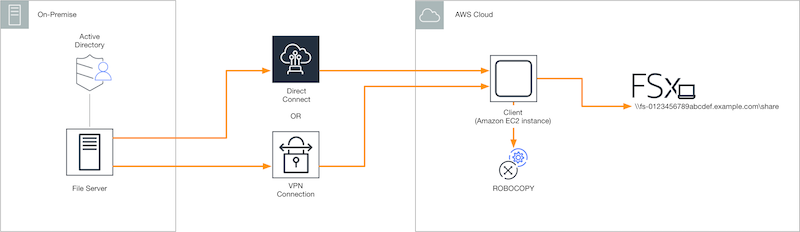

# Migrating existing files to FSx for Windows File Server using

Robocopy

Built on Microsoft Windows Server, Amazon FSx for Windows File Server enables you to migrate your existing datasets
fully into your Amazon FSx file systems. You can migrate the data for each file. You can also migrate
all the relevant file metadata including attributes, timestamps, access control lists (ACLs),
owner information, and auditing information. With this total migration support, Amazon FSx enables
moving your Windows-based workloads and applications relying on these file datasets to the Amazon Web Services
Cloud.

Use the following topics as a guide through the process for copying existing file data. As
you perform this copy, you preserve all file metadata from your on-premises data centers or from
your self-managed file servers on Amazon EC2.

## Prerequisites for file migration with Robocopy

Before you begin, make sure that you do the following:

- Establish network connectivity (by using AWS Direct Connect or VPN) between your on-premises Active
  Directory and the VPC where you want to create the Amazon FSx file system.
- Create a service account on your Active Directory with delegated permissions to join
  computers to the domain. For more information, see
  [Delegate Privileges to Your Service Account](../../../directoryservice/latest/admin-guide/prereq_connector.md#connect_delegate_privileges "../../../directoryservice/latest/admin-guide/prereq_connector.md#connect_delegate_privileges")
  in the _AWS Directory Service Administration Guide_.
- Create an Amazon FSx file system, joined to your self-managed (on-premises) Microsoft AD
  directory.
- Note the location (for example, `\\Source\Share`) of the file share (either
  on-premises or in AWS) that contains the existing files you want to transfer over to
  Amazon FSx.
- Note the location (for example, `\\Target\Share`) of the file share on your
  Amazon FSx file system to which you want to transfer over your existing files.

The following table summarizes the source and destination file system accessibility requirements for three migration user access models.

| Migration user access model                                                | Source file system accessibility requirements                                                                                  | Destination FSx file server accessibility requirements                                                                       |
| -------------------------------------------------------------------------- | ------------------------------------------------------------------------------------------------------------------------------ | ---------------------------------------------------------------------------------------------------------------------------- | -------------------------------------------------------------------------------------------------------------------------------------------------------------------------------------------------------------------------------------------------------------------------------------------------------------------------------------------------------------------------------------------------------------------------------------------------------------------------------------------------------------------------------------------------------------------------------------------------------------------------------------------------------------------------------------------------------------------------------------------------------------------------------------------------------------------------------------------------------------------------------------------------------------------------------------------------------------------------------------------------------------------------------------------------------------------------------------------------------------------------------------------------------------------------------------------------------------------------------------------------------------------------------------------------------------------------------------------------------------------------------------------------------------------------------------------------------------------------------------------------------------------------------------------------------------------------------------------------------------------------------------------------------------------------------------------------------------------------------------------------------------------------------------------------------------------------------------------------------------------------------------------------------------------------------------------------------------------------------------------------------------------------------------------------------------------------------------------------------------------------------------------------------------------------------------------------------------------------------------------------------------------------------------------------------------------------------------------------------------------------------------------------------------------------------------------------------------------------------------------------------------------------------------------------------------------------------------------------------------------------------------------------------------------------------------------------------------------------------------------------------------------------------------------------------------------------------------------------------------------------------------------------------------------------------------------------------------------------------------------------------------------------------------------------------------------------------------------------------------------------------------------------------------------------------------------------------------------------------------------------------------------------------------------------------------------------------------------------------------------------------------------------------------------------------------------------------------------------------------------------------------------------------------------------------------------------------------------------------------------------------------------------------------------------------------------------------------------------------------------------------------------------------------------------------------------------------------------------------------------------------------------------------------------------------------------------------------------------------------------------------------------------------------------------------------------------------------------------------------------------------------------------------------------------------------------------------------------------------------------------------------------------------------------------------------------------------------------------------------------------------------------------------------------------------------------------------------------------------------------------------------------------------------------------------------------------------------------------------------------------------------------------------------------------------------------------------------------------------------------------------------------------------------------------------------------------------------------------------------------------------------------- |
| Direct read/write permissions model                                        | The user needs to have at least read permissions (NTFS ACLs) on the files and folders being migrated.                          | The user needs to have at least write permissions (NTFS ACLs) on the files and folders being migrated.                       |
| Backup/restore privilege model to override access permissions              | The user needs to be a member of the on-premises Active Directory's Backup Operators group, and use the /b flag with RoboCopy. | The user needs to be a member of the Amazon FSx file system's \*administrators group\*\*, and use the /b flag with RoboCopy. |
| Domain administrator (full) privilege model to override access permissions | The user needs to be a member of the on-premises Active Directory's Domain Admins group.                                       | The user needs to be a member of the Amazon FSx file system's \*administrators group\*\*, and use the /b flag with RoboCopy  | ###### Note \* For file systems joined to an AWS Managed Microsoft AD, the Amazon FSx file system administrators group is **AWS Delegated FSx Administrators**. In your self-managed Microsoft AD, the Amazon FSx file system administrators group is **Domain Admins** or the custom group that you specified for administration when you created your file system.  ## Migrating files using Robocopy You can migrate your existing files from your on-premises file systems to FSx for Windows File Server file systems by using the following procedure. ###### To migrate existing files to Amazon FSx using Robocopy 1. Launch a Windows Server 2016 Amazon EC2 instance in the same Amazon VPC as that of your Amazon FSx file system. 2. Connect to your Amazon EC2 instance. For more information, see [Connecting to Your Windows Instance](../../../AWSEC2/latest/WindowsGuide/connecting_to_windows_instance.md "../../../AWSEC2/latest/WindowsGuide/connecting_to_windows_instance.md") in the _Amazon EC2 User Guide for Windows Instances_. 3. Open **Command Prompt** and map the source file share on your existing file server (on-premises or in AWS) to a drive letter (for example, `Y`:) as follows. As part of this, you provide credentials for a member of your on-premises Active Directory's **Domain Administrators** group. ``C:\>net use `Y`: `\\fileserver1.mydata.com\localdata` /user:mydata.com\Administrator Enter the password for ‘fileserver1.mydata.com’: _ Drive Y: is now connected to \\fileserver1.mydata.com\localdata. The command completed successfully.`` 4. Map the target file share on your Amazon FSx file system to a different drive letter (for example, `Z`:) on your Amazon EC2 instance as follows. As part of this, you provide credentials for a user account that is a member of your on-premises Active Directory's domain administrators group and your Amazon FSx file system’s administrators group. For file systems joined to an AWS Managed Microsoft AD, that group is `AWS Delegated FSx` `Administrators`. In your self-managed Microsoft AD, that group is `Domain Admins` or the custom group that you specified for administration when you created your file system. For more information, see the table of [source and destination file system accessibility requirements](#role-access-table "#role-access-table") in the [Prerequisites for file migration with Robocopy](#fsx-migrate-prereqs "#fsx-migrate-prereqs"). ``C:\>net use `Z`: `\\amznfsxabcdef1.mydata.com\share` /user:mydata.com\Administrator Enter the password for 'amznfsxabcdef1.mydata.com': _ Drive Z: is now connected to \\amznfsxabcdef1.mydata.com\share. The command completed successfully.`` 5. Choose **Run as Administrator** from the context menu. Open **Command Prompt** or **Windows PowerShell** as an administrator, and run the following Robocopy command to copy the files from the source share to the target share. The `ROBOCOPY` command is a flexible file-transfer utility with multiple options to control the data transfer process. Because of this `ROBOCOPY` command process, all the files and directories from the source share are copied to the Amazon FSx target share. The copy preserves file and folder NTFS ACLs, attributes, timestamps, owner information, and auditing information. `robocopy Y:\ Z:\ /copy:DATSOU /secfix /e /b /MT:8` The example command preceding uses the following elements and options:  • Y – Refers to the source share located in the on-premises Active Directory forest mydata.com.  • Z – Refers to the target share \\amznfsxabcdef1.mydata.com\share on Amazon FSx.  • /copy – Specifies the following file properties to be copied: + D – data + A – attributes + T – timestamps + S – NTFS ACLs + O – owner information + U – auditing information.  • /secfix – Fixes file security on all files, even skipped ones.  • /e – Copies subdirectories, including empty ones.  • /b – Uses the backup and restore privilege in Windows to copy files even if their NTFS ACLs deny permissions to the current user.  • /MT:8 – Specifies how many threads to use for performing multithreaded copies. ###### Note If you are copying large files over a slow or unreliable connection, you can enable restartable mode by using the **/zb** option with the **robocopy** in place of the **/b** option. With restartable mode, if the transfer of a large file is interrupted, a subsequent Robocopy operation can pick up in the middle of the transfer instead of having to re-copy the entire file from the beginning. Enabling restartable mode can reduce the data transfer speed. |
