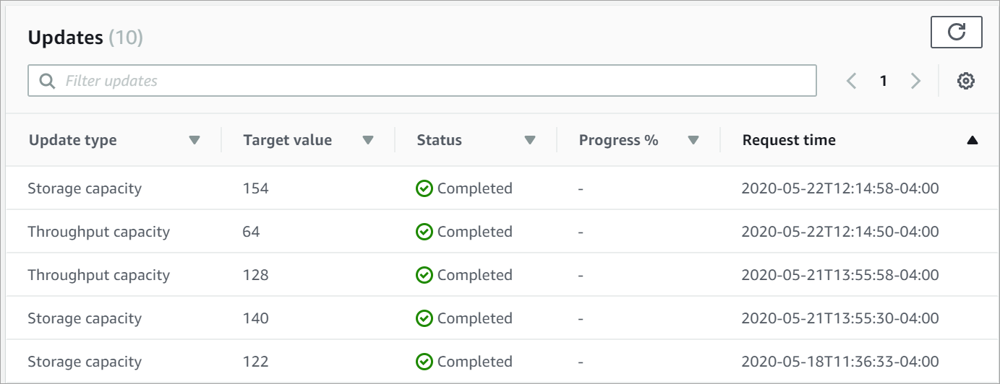

# Monitoring self-managed Active Directory updates

You can monitor the progress of a self-managed Active Directory configuration update using the AWS Management Console, the API,
or the AWS CLI, as described in the following procedures.

When you update your file system's self-managed Active Directory configuration,
the file system's state switches from **Available** to
**Updating** while the update is applied. Once the update is complete, the state
switches back to **Available**. An Active Directory configuration update
can take up to several minutes to complete.

In the **Updates** tab in the **File system details**
window, you can view the 10 most recent updates for each update type.



For self-managed Active Directory updates, you can view the following information.

\***\*Update type\*\***

Supported types are as follows:

- DNS server IP address
- Service account credentials

\***\*Target value\*\***

The desired value to update the file system property to. For **Service account credentials**
updates, only the user name is shown, service account passwords are never included in this field.

\***\*Status\*\***

The current status of the update. For self-managed Active Directory updates, the possible values are as follows:

- **Pending** – Amazon FSx has received the update request, but has not
  started processing it.
- **In progress** – Amazon FSx is processing the update request.
- **Completed** – The file system update completed
  successfully.
- **Failed** – The file system update failed. Choose the question
  mark (**?**) to see details about the failure.

\***\*Progress %\*\***

Displays the progress of the file system update as percent complete.

\***\*Request time\*\***

The time that Amazon FSx received the update action request.

You can view and monitor file system update requests that are in progress using the [describe-file-systems](../../../cli/latest/reference/fsx/describe-file-systems.md "../../../cli/latest/reference/fsx/describe-file-systems.md") AWS CLI command and the [DescribeFileSystems](../APIReference/API_DescribeFileSystems.md "../APIReference/API_DescribeFileSystems.md") API action. The `AdministrativeActions`
array lists the 10 most recent update actions for each administrative action type.

The following example shows an excerpt of the response of a
**describe-file-systems** CLI command. The output shows two self-managed Active Directory file system updates.

```

        {
            "OwnerId": "111122223333",
            .
            .
            .
            "StorageCapacity": 1000,
            "AdministrativeActions": [
                {
                    "AdministrativeActionType": "FILE_SYSTEM_UPDATE",
                    "RequestTime": 1581694766.757,
                    "Status": "PENDING",
                    "TargetFileSystemValues": {
                        "WindowsConfiguration": {
                            "SelfManagedActiveDirectoryConfiguration": {
                                "UserName": "`serviceUser`",
                            }
                        }
                    }
                },
                {
                    "AdministrativeActionType": "FILE_SYSTEM_UPDATE",
                    "RequestTime": 1619032957.759,
                    "Status": "FAILED",
                    "TargetFileSystemValues": {
                        "WindowsConfiguration": {
                            "SelfManagedActiveDirectoryConfiguration": {
                            "DnsIps": [
                                    "10.0.138.161"
                                ]
                            }
                        }
                    },
                    "FailureDetails": {
                        "Message": "`Failure details message`."
                    }
                }
            ],
     .
     .
     .
```
