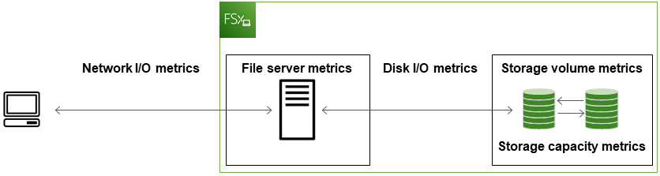
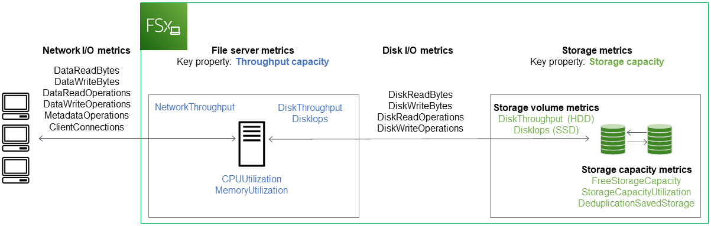

# Monitoring with Amazon CloudWatch

Amazon CloudWatch collects and processes raw data from your
FSx for Windows File Server file system into readable, near real-time metrics.
These statistics are retained for a period of 15
months, giving you to access historical information to help gain perspectives on how
your workflow or file system is performing.

FSx for Windows File Server publishes CloudWatch metrics in the following domains:

- Network I/O metrics measure activity between clients accessing the file system and the file server.
- File server metrics measure network throughput utilization, file server CPU and memory, and file server disk throughput and IOPS utilization.
- Disk I/O metrics measure activity between the file server and the storage volumes.
- Storage volume metrics measure disk throughput utilization for HDD storage volumes, and IOPS utilization
  for SSD storage volumes.
- Storage capacity metrics measure storage usage, including storage savings due to Data Deduplication.
  The following diagram illustrates an FSx for Windows File Server file system, its components, and the metric domains.

By default, Amazon FSx for Windows File Server sends metric data to CloudWatch at 1-minute periods, with the following exceptions
that are emitted in 5-minute intervals:

- `FileServerDiskThroughputBalance`
- `FileServerDiskIopsBalance`
  For more information about CloudWatch, see [What is Amazon CloudWatch?](../../../AmazonCloudWatch/latest/monitoring/WhatIsCloudWatch.md "../../../AmazonCloudWatch/latest/monitoring/WhatIsCloudWatch.md") in the
  _Amazon CloudWatch User Guide_.

Metrics might not be published for Single-AZ file systems during file system maintenance or
infrastructure component replacement, and for Multi-AZ file systems during failover and failback
between the primary and secondary file servers.

Some Amazon FSx CloudWatch metrics are reported as raw _Bytes_.
Bytes are not rounded to either a decimal or binary multiple of the unit.

###### Topics

- [CloudWatch metrics and dimensions](#fsx-windows-metrics "#fsx-windows-metrics")
- [Using file system metrics](#how_to_use_metrics "#how_to_use_metrics")
- [Performance warnings and recommendations](#performance-insights-FSxW "#performance-insights-FSxW")
- [Accessing file system metrics](accessingmetrics.md "accessingmetrics.md")
- [Creating CloudWatch alarms](creating_alarms.md "creating_alarms.md")

## CloudWatch metrics and dimensions

FSx for Windows File Server publishes the following metrics into the `AWS/FSx` namespace in
Amazon CloudWatch for all file systems:

- `DataReadBytes`
- `DataWriteBytes`
- `DataReadOperations`
- `DataWriteOperations`
- `MetadataOperations`
- `FreeStorageCapacity`

FSx for Windows File Server publishes the metrics described in the following sections into the `AWS/FSx` namespace
in Amazon CloudWatch for file systems configured with a throughput capacity of at least 32 MBps.

### Network I/O metrics

The `AWS/FSx` namespace includes the following network I/O metrics.

| Metric                | Description                                                                                                                |
| --------------------- | -------------------------------------------------------------------------------------------------------------------------- |
| `DataReadBytes`       | The number of bytes for read operations for clients accessing the file system. Units: Bytes Valid statistics: `Sum`  |
| `DataWriteBytes`      | The number of bytes for write operations for clients accessing the file system. Units: Bytes Valid statistics: `Sum` |
| `DataReadOperations`  | The number of read operations for clients accessing the file system. Units: Count Valid statistics: `Sum`            |
| `DataWriteOperations` | The number of write operations for clients accessing the file system. Units: Count Valid statistics: `Sum`           |
| `MetadataOperations`  | The number of metadata operations for clients accessing the file system. Units: Count Valid statistics: `Sum`        |
| `ClientConnections`   | The number of active connections between clients and the file server. Units: Count                                      |

### File server metrics

The `AWS/FSx` namespace includes the following file server metrics.

| Metric                                | Description                                                                                                                                                                                                           |
| ------------------------------------- | --------------------------------------------------------------------------------------------------------------------------------------------------------------------------------------------------------------------- |
| `NetworkThroughputUtilization`        | The network throughput for clients accessing the file system, as a percentage of the provisioned limit. Units: Percent                                                                                             |
| `CPUUtilization`                      | The percentage utilization of your file server’s CPU resources. Units: Percent                                                                                                                                     |
| `MemoryUtilization`                   | The percentage utilization of your file server’s memory resources. Units: Percent                                                                                                                                  |
| `FileServerDiskThroughputUtilization` | The disk throughput between your file server and its storage volumes, as a percentage of the provisioned limit determined by throughput capacity. Units: Percent                                                   |
| `FileServerDiskThroughputBalance`     | The percentage of available burst credits for disk throughput between your file server and its storage volumes. Valid for file systems provisioned with throughput capacity of 256 MBps or less. Units: Percent |
| `FileServerDiskIopsUtilization`       | The disk IOPS between your file server and storage volumes, as a percentage of the provisioned limit determined by throughput capacity. Units: Percent                                                             |
| `FileServerDiskIopsBalance`           | The percentage of available burst credits for disk IOPS between your file server and its storage volumes. Valid for file systems provisioned with throughput capacity of 256 MBps or less. Units: Percent       |

### Disk I/O metrics

The `AWS/FSx` namespace includes the following disk I/O metrics.

| Metric                | Description                                                                                                              |
| --------------------- | ------------------------------------------------------------------------------------------------------------------------ |
| `DiskReadBytes`       | The number of bytes for read operations that access storage volumes. Units: Bytes Valid statistics: Sum            |
| `DiskWriteBytes`      | The number of bytes for write operations that access storage volumes. Units: Bytes Valid statistics: Sum           |
| `DiskReadOperations`  | The number of read operations for the file server accessing storage volumes. Units: Count Valid statistics: `Sum`  |
| `DiskWriteOperations` | The number of write operations for the file server accessing storage volumes. Units: Count Valid statistics: `Sum` |

### FSx for Windows storage volume metrics

The `AWS/FSx` namespace includes the following storage volume metrics.

| Metric                      | Description                                                                                                                                                                      |
| --------------------------- | -------------------------------------------------------------------------------------------------------------------------------------------------------------------------------- |
| `DiskThroughputUtilization` | (HDD only) The disk throughput between your file server and its storage volumes, as a percentage of the provisioned limit determined by the storage volumes. Units: Percent |
| `DiskThroughputBalance`     | (HDD only) The percentage of available burst credits for disk throughput and disk IOPS for the storage volumes. Units: Percent                                                |
| `DiskIopsUtilization`       | (SSD only) The disk IOPS between your file server and storage volumes, as a percentage of the provisioned IOPS limit determined by the storage volumes. Units: Percent      |

### Storage capacity metrics

The `AWS/FSx` namespace includes the following storage capacity metrics.

| Metric                       | Description                                                                                         |
| ---------------------------- | --------------------------------------------------------------------------------------------------- |
| `FreeStorageCapacity`        | The amount of available storage capacity. Units: Bytes Valid statistics: `Average`, `Minimum` |
| `StorageCapacityUtilization` | Used physical storage capacity as a percentage of total storage capacity. Units: Percent         |
| `DeduplicationSavedStorage`  | The amount of storage space saved by data deduplication, if it is enabled. Units: Bytes          |

### Namespace and dimensions for FSx for Windows File Server metrics

FSx for Windows File Server metrics use the `FSx` namespace and provide metrics for a single
dimension, `FileSystemId`. You can find a file system's ID using the [describe-file-systems](../../../cli/latest/reference/fsx/describe-file-systems.md "../../../cli/latest/reference/fsx/describe-file-systems.md")
AWS CLI command or the [DescribeFileSystems](../APIReference/API_DescribeFileSystems.md "../APIReference/API_DescribeFileSystems.md")
API command. A file system ID takes the form of
`fs-0123456789abcdef0`.

## Using file system metrics

There are two primary architectural components of each Amazon FSx file system:

- The **file server** that serves data to clients accessing the file system.
- The **storage volumes** that host the data in your file system.

FSx for Windows File Server reports metrics in CloudWatch that track the performance and resource utilization for your file system's
file server and storage volumes. The following diagram illustrates an Amazon FSx file system with its architectural components,
and the performance and resource CloudWatch metrics available for monitoring. The key property shown for a set of metrics is the
file system property that determines the capacity for those metrics. Adjusting that property modifies the file system's performance
for that set of metrics.

Use the **Monitoring & performance** panel in the Amazon FSx console to view the FSx for Windows File Server CloudWatch metrics described in the following table.

| Monitoring & performance panel                                                                                                                                   | How do I...                                                                                                                                             | Chart                                                                                                                           | Relevant metrics                                                                                |
| ---------------------------------------------------------------------------------------------------------------------------------------------------------------- | ------------------------------------------------------------------------------------------------------------------------------------------------------- | ------------------------------------------------------------------------------------------------------------------------------- | ----------------------------------------------------------------------------------------------- |
| Summary                                                                                                                                                          | ...determine my file system's total IOPS?                                                                                                               | Total IOPS                                                                                                                      | SUM(`DataReadOperations` + `DataWriteOperations` + `MetadataOperations`)/Period (in seconds) |
| ...determine my file system's total throughput?                                                                                                                  | Total throughput                                                                                                                                        | SUM(`DataReadBytes` + `DataWriteBytes`)/Period (in seconds)                                                                     |
| ...determine the amount of available storage capacity on my file system?                                                                                         | Available storage capacity                                                                                                                              | `FreeStorageCapacity`                                                                                                           |
| ...determine the number of connections established between clients and the file server?                                                                          | Client connections                                                                                                                                      | `ClientConnections`                                                                                                             |
| Storage                                                                                                                                                          | ...determine the amount of used physical disk space as a percentage of the file system's total storage capacity?                                        | Storage capacity utilization                                                                                                    | `StorageCapacityUtilization`                                                                    |
| ...determine the amount of physical disk space saved by data deduplication?                                                                                      | Storage saved from Data Deduplication                                                                                                                   | `DeduplicationSavedStorage`                                                                                                     |
| Performance • File server                                                                                                                                     | ...determine the network throughput for clients accessing the file system, as a percentage of the file system's provisioned throughput?                 | Network throughput utilization                                                                                                  | `NetworkThroughputUtilization`1                                                                 |
| ...determine the disk throughput between file server and its storage volumes, as a percentage of the provisioned limit determined by Throughput Capacity?     | Disk throughput utilization                                                                                                                             | `FileServerDiskThroughputUtilization`1                                                                                          |
| ...determine the percentage of available burst credits for disk throughput between the file server and its storage volumes?                                   | Disk throughput burst balance                                                                                                                           | `FileServerDiskThroughputBalance`                                                                                               |
| ...determine the amount of disk IOPS between the file server and storage volumes, as a percentage of the provisioned limit determined by Throughput Capacity? | Disk IOPS utilization                                                                                                                                   | `FileServerDiskIopsUtilization`                                                                                                 |
| ...determine the percentage of available burst credits for disk IOPS between the file server and storage volumes?                                                | Disk IOPS burst balance                                                                                                                                 | `FileServerDiskIopsBalance`                                                                                                     |
| ...determine the file server's CPU utilization percentage?                                                                                                       | CPU utilization                                                                                                                                         | `CPUUtilization`                                                                                                                |
| ...determine the file server's memory utilization percentage?                                                                                                    | Memory utilization                                                                                                                                      | `MemoryUtilization`                                                                                                             |
| Performance – Storage volumes                                                                                                                                    | ...determine the throughput for operations that access storage volumes, as a percentage of the provisioned limit determined by HDD Storage Capacity? | Disk throughput utilization (HDD)                                                                                               | `DiskThroughputUtilization`                                                                     |
| ...determine the percentage of available throughput and IOPS burst credits for operations that access HDD storage volumes?                                    | Disk throughput burst balance (HDD)                                                                                                                     | `DiskThroughputBalance`2                                                                                                        |
| ...determine the IOPS for operations that access storage volumes, as a percentage of the provisioned limit determined by HDD Storage Capacity?                | Disk IOPS utilization (HDD)                                                                                                                             | SUM(`DiskReadOperations` + `DiskWriteOperations`) / `Period` (in seconds) / (12 \ • provisioned HDD storage capacity in TiB) |
| ...determine the IOPS for operations that access storage volumes, as a percentage of the provisioned limit determined by SSD Storage Capacity?                | Disk IOPS utilization (SSD)                                                                                                                             | `DiskIopsUtilization`                                                                                                           |

###### Note

1We recommend that you maintain an average throughput capacity utilization
under 50% to ensure that you have enough spare throughput capacity for unexpected
spikes in your workload, as well as for any background Windows storage operations
(such as storage synchronization, deduplication, or shadow copies).

2HDD storage volumes can experience significant performance variations depending on the workload.
Sudden spikes in IOPS or throughput can lead to disk performance degradation. For more information, see
[HDD burst performance](performance.md#hdd-burst-performance "performance.md#hdd-burst-performance").

## Performance warnings and recommendations

FSx for Windows provides you with performance warnings for file systems configured with a
throughput capacity of at least 32 MBps. Amazon FSx displays a warning for a set of the CloudWatch metrics
whenever one of these metrics has approached or crossed a predetermined threshold
for multiple consecutive data points. These warnings provide you with actionable recommendations that
you can use to optimize your file system's performance.

Warnings are accessible in several areas of the **Monitoring & performance**
dashboard. All active or recent Amazon FSx performance warnings and any CloudWatch alarms configured
for the file system that are in an ALARM state appear in the **Monitoring & performance**
panel in the **Summary** section. The warning also appears in the section of the
dashboard that the metric graph is displayed.

You can create CloudWatch alarms for any of the Amazon FSx metrics. For more information, see
[Creating CloudWatch alarms](creating_alarms.md "creating_alarms.md").

### Use performance warnings to improve file system performance

Amazon FSx provides actionable recommendations that you can use to optimize your file system's performance.
These recommendations describe how you can address a potential performance bottle neck.
You can take the recommended action if you expect the activity to continue, or if it's causing an impact to your file system's
performance. Depending on which metric has triggered a warning, you can resolve it by
increasing either the file system's throughput capacity or storage capacity, as described in the following table.

| If there's a warning for this metric                   | Do this                                                                                                                                                                       |
| ------------------------------------------------------ | ----------------------------------------------------------------------------------------------------------------------------------------------------------------------------- |
| Network throughput – utilization                       | [Increase throughput capacity](increase-throughput-capacity.md "increase-throughput-capacity.md")                                                                             |
| File server > Disk IOPS – utilization                  |
| File server > Disk throughput – utilization            |
| File server > Disk IOPS • burst balance             |
| File server > Disk throughput – burst balance          |
| Storage capacity utilization                           | [Increase storage capacity](increase-storage-capacity.md "increase-storage-capacity.md")                                                                                      |
| Storage volume > Disk throughput – utilization (HDD)   | [Increase storage capacity](increase-storage-capacity.md "increase-storage-capacity.md") or [switch to SDD storage type](updating-storage-type.md "updating-storage-type.md") |
| Storage volume > Disk throughput – burst balance (HDD) |
| Storage volume > Disk IOPS – utilization (SSD)         | [Increase SSD IOPS](how-to-provision-ssd-iops.md "how-to-provision-ssd-iops.md")                                                                                              |

###### Note

Certain file system events can consume disk I/O performance resources and potentially
trigger performance warnings. For example:

- The optimization phase of storage capacity scaling can generate increased disk throughput,
  as described in [Storage capacity increases
  and file system performance](managing-storage-configuration.md#storage-capacity-increase-and-performance "managing-storage-configuration.md#storage-capacity-increase-and-performance")
- For Multi-AZ file systems, events such as throughput capacity scaling, hardware replacement, or Availability
  Zone disruption result in automatic failover and failback events. Any data changes that occur during this time need
  to be synchronized between the primary and secondary file servers, and Windows Server runs a data synchronization job
  that can consume disk I/O resources. For more information, see [Managing throughput capacity](managing-throughput-capacity.md "managing-throughput-capacity.md").

For more information file system performance, see [FSx for Windows File Server performance](performance.md "performance.md").
