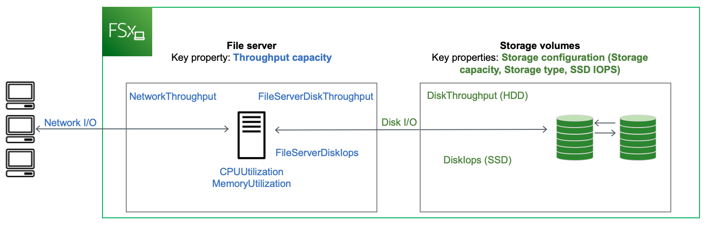

# FSx for Windows File Server performance

FSx for Windows File Server offers file system configuration options to meet a variety of performance needs. Following is an
overview of Amazon FSx file system performance, with a discussion of the available performance configuration options and useful performance tips.

###### Topics

- [File system performance](#performance-details-fsxw "#performance-details-fsxw")
- [Additional performance considerations](#perf-overview "#perf-overview")
- [Impact of throughput capacity on performance](#impact-throughput-cap-performance "#impact-throughput-cap-performance")
- [Choosing the right level of throughput capacity](#choosing-throughput "#choosing-throughput")
- [Impact of storage configuration on performance](#storage-capacity-and-performance "#storage-capacity-and-performance")
- [Example: storage capacity and throughput capacity](#throughput-example-fsxw "#throughput-example-fsxw")
- [Measuring performance using CloudWatch metrics](#measure-performance-cw "#measure-performance-cw")
- [Troubleshooting file system performance issues](performance-troubleshooting.md "performance-troubleshooting.md")

## File system performance

Each FSx for Windows File Server file system consists of a Windows file server that clients communicate with and a set of storage volumes, or disks, attached to the file server.
Each file server employs a fast, in-memory cache to enhance performance for the most frequently accessed data.

The following diagram illustrates how data is accessed from an FSx for Windows File Server file system.



When a client accesses data that is stored in the in-memory cache, the data is served directly to the requesting client
as _network I/O_. The file server doesn't need to read it from or write it into the disk. The performance of this data access is determined by the network I/O limits and the size of the in-memory cache.

When a client accesses data that is not in cache, the file server reads it from or writes it into the disk as _disk I/O_. The data is then served from the file server to the client as network I/O. The performance of this
data access is determined by the network I/O limits as well as the disk I/O limits.

Network I/O performance and file server in-memory cache are determined by a file sytem's
throughput capacity. Disk I/O performance is determined by a combination of throughput capacity and storage configuration.
The maximum disk I/O performance, which consists of disk throughput and disk IOPS levels, that your file system can achieve is the lower of:

- The disk I/O performance level provided by your file server, based on the throughput capacity you select for your file system.
- The disk I/O performance level provided by your storage configuration (the storage capacity, storage type, and SSD IOPS level you select
  for your file system).

## Additional performance considerations

File system performance is typically measured by its latency, throughput, and I/O operations per
second (IOPS).

### Latency

FSx for Windows File Server file servers employ a fast, in-memory cache to achieve consistent sub-millisecond
latencies for actively accessed data. For data that is not in the in-memory cache, that is, for file
operations that need to be served by performing I/O on the underlying storage volumes,
Amazon FSx provides sub-millisecond file operation latencies with solid state drive (SSD) storage, and single-digit
millisecond latencies with hard disk drive (HDD) storage.

### Throughput and IOPS

Amazon FSx file systems provide up to 2 GBps and 80,000 IOPS in all AWS Regions where Amazon FSx is available, and 12 GBps of throughput and 400,000 IOPS in US East (N. Virginia), US West (Oregon),
US East (Ohio), Europe (Ireland), Asia Pacific (Tokyo), and Asia Pacific (Singapore).
The specific amount of throughput and IOPS that your workload can drive on your file
system depends on the throughput capacity, storage capacity and storage type of your file system, along with
the nature of your workload, including the size of the active working set.

### Single-client performance

With Amazon FSx, you can get up to the full throughput and IOPS levels for your file system
from a single client accessing it. Amazon FSx supports _SMB Multichannel_.
This feature enables it to provide up to multiple GBps throughput and hundreds of thousands
of IOPS for a single client accessing your file system. SMB Multichannel uses multiple
network connections between the client and server simultaneously to aggregate network
bandwidth for maximal utilization. Although there's a theoretical limit to the number of
SMB connections supported by Windows, this limit is in the millions, and practically you
can have an unlimited number of SMB connections.

### Burst performance

File-based workloads are typically spiky, characterized by short, intense periods of high I/O with
plenty of idle time between bursts. To support spiky workloads, in addition to the baseline speeds
that a file system can sustain 24/7, Amazon FSx provides the capability to burst to higher speeds for periods of time
for both network I/O and disk I/O operations. Amazon FSx uses an I/O credit mechanism to allocate
throughput and IOPS based on average utilization — file systems accrue credits when their throughput and IOPS
usage is below their baseline limits, and can use these credits when they perform I/O operations.

## Impact of throughput capacity on performance

Throughput capacity determines file system performance in the following categories:

- Network I/O – The speed at which the file server can serve file data to clients accessing it.
- File server CPU and memory – Resources that are available for serving file data and performing background
  activities such as data deduplication and shadow copies.
- Disk I/O – The speed at which the file server can support I/O between the file server and the storage volumes.

The following tables provide details about the maximum levels of network I/O (throughput and IOPS) and disk I/O (throughput and IOPS)
that you can drive with each provisioned throughput capacity configuration, and the amount of memory available for caching and supporting background activities
such as data deduplication and shadow copies. While you can select levels of throughput capacity below 32 megabytes per second (MBps)
when you use the Amazon FSx API or CLI, keep in mind that these levels
are meant for test and development workloads, not for production workloads.

###### Note

Note that throughput capacity levels of 4,608 MBps and higher are supported only in the following regions: US East (N. Virginia), US West (Oregon),
US East (Ohio), Europe (Ireland), Asia Pacific (Tokyo), and Asia Pacific (Singapore).

| FSx throughput capacity (MBps) | Network throughput (MBps) | Network IOPS                        | Memory (GB)           |
| ------------------------------ | ------------------------- | ----------------------------------- | --------------------- | --- |
|                                | **Baseline**              | **Burst (for a few minutes a day)** |                       |     |
| 32                             | 32                        | 600                                 | Thousands             | 4   |
| 64                             | 64                        | 600                                 | Tens of thousands     | 8   |
| 128                            | 150                       | 1,250                               | 8                     |
| 256                            | 300                       | 1,250                               | Hundreds of thousands | 16  |
| 512                            | 600                       | 1,250                               | 32                    |
| 1,024                          | 1,500                     | –                                   | 72                    |
| 2,048                          | 3,125                     | –                                   | 144                   |
| 4,608                          | 9,375                     | –                                   | Millions              | 192 |
| 6,144                          | 12,500                    | –                                   | 256                   |
| 9,216                          | 18,750                    | –                                   | 384                   |
| 12,288                         | 21,250                    | –                                   | 512                   |

| FSx throughput capacity (MBps) | Disk throughput (MBps) | Disk IOPS                     |
| ------------------------------ | ---------------------- | ----------------------------- | ------------ | ----------------------------- |
|                                | **Baseline**           | **Burst (for 30 mins a day)** | **Baseline** | **Burst (for 30 mins a day)** |
| 32                             | 32                     | 260                           | 2K           | 12K                           |
| 64                             | 64                     | 350                           | 4K           | 16K                           |
| 128                            | 128                    | 600                           | 6K           | 20K                           |
| 256                            | 256                    | 600                           | 10K          | 20K                           |
| 512                            | 512                    | –                             | 20K          | –                             |
| 1,024                          | 1,024                  | –                             | 40K          | –                             |
| 2,048                          | 2,048                  | –                             | 80K          | –                             |
| 4,608                          | 4,608                  | –                             | 150K         | –                             |
| 6,144                          | 6,144                  | –                             | 200K         | –                             |
| 9,216                          | 9,2161                 | –                             | 300K1        | –                             |
| 12,288                         | 12,2881                | –                             | 400K1        | –                             |

###### Note

1If you have a Multi-AZ file system with a throughput capacity of 9,216 or 12,288 MBps, performance will be limited to 9,000 MBps and 262,500 IOPS for write traffic only.
Otherwise, for read traffic on all Multi-AZ file systems, read and write traffic on all Single-AZ file systems, and all other throughput capacity levels,
your file system will support the performance limits shown in the table.

## Choosing the right level of throughput capacity

When you create a file system using the Amazon Web Services Management Console, Amazon FSx automatically picks the
recommended throughput capacity level for your file system based on the amount of storage capacity you configure.
While the recommended throughput capacity should be sufficient for most workloads,
you have the option to override the recommendation and configure a specific amount of throughput capacity to meet
your workload's needs. For example, if your workload requires driving 1 GBps of traffic to your file system, you should select a
throughput capacity of at least 1,024 MBps. The following table provides the minimum
recommended throughput capacity level for a file system based on the amount of provisioned storage capacity.

| SSD storage capacity (GiB) | HDD storage capacity (GiB) | Minimum recommended throughput capacity (MBps) |
| -------------------------- | -------------------------- | ---------------------------------------------- |
| Up to 640                  | Up to 3,200                | 32                                             |
| 641—1,280                  | 3201—6,400                 | 64                                             |
| 1281—2,560                 | 6,401—12,800               | 128                                            |
| 2,561—5,120                | 12,801—25,600              | 256                                            |
| 5,121—10,240               | 25,601—51,200              | 512                                            |
| 10,241—20,480              | >51,200                    | 1,024                                          |
| >20,480                    | NA                         | 2,048                                          |

You should also consider the features you’re planning to enable on your file system in deciding the level
of throughput to configure. For example, enabling [Shadow Copies](shadow-copies-fsxW.md "shadow-copies-fsxW.md") may require you to increase your throughput
capacity to a level up to three times your expected workload to ensure the file server can
maintain the shadow copies with the available I/O performance capacity. If you are enabling
[Data Deduplication](data-dedup-ts.md "data-dedup-ts.md"), you should determine the amount of memory associated with your file
system's throughput capacity and ensure this amount of memory is sufficient for the size of
your data.

You can adjust the amount of throughput capacity up or down at any time after you create it. For more information, see [Managing throughput capacity](managing-throughput-capacity.md "managing-throughput-capacity.md").

You can monitor your workload’s utilization of file server performance resources and get
recommendations on which throughput capacity to select by viewing the **Monitoring &
performance > Performance** tab of your Amazon FSx console.
We recommend testing in a pre-production environment to ensure the configuration you’ve
selected meets your workload’s performance requirements. For Multi-AZ file systems, we also recommend
testing the impact of the failover process that occurs during file system maintenance,
throughput capacity changes, and unplanned service disruption on your workload, as well as ensuring that you have
provisioned sufficient throughput capacity to prevent performance impact during these events. For more information, see
[Accessing file system metrics](accessingmetrics.md "accessingmetrics.md").

## Impact of storage configuration on performance

Your file system's storage capacity, storage type, and SSD IOPS level all impact the disk I/O performance of your file system.
You can configure these resources to deliver the desired performance levels for your workload.

You can increase storage capacity and scale SSD IOPS at any time. For more information,
see [Managing storage capacity](managing-storage-configuration.md#managing-storage-capacity "managing-storage-configuration.md#managing-storage-capacity") and
[Managing SSD IOPS](managing-storage-configuration.md#managing-provisioned-ssd-iops "managing-storage-configuration.md#managing-provisioned-ssd-iops").
You can also upgrade your file system from HDD storage type to SSD storage type. For more information, see [Managing your file system's storage type](managing-storage-configuration.md#managing-storage-type "managing-storage-configuration.md#managing-storage-type").

Your file system provides the following default levels of disk throughput and IOPS:

| Storage type | Disk throughput (MBps per TiB of storage)                         | Disk IOPS (per TiB of storage) |
| ------------ | ----------------------------------------------------------------- | ------------------------------ |
| SSD          | 750                                                               | 3,0001                         |
| HDD          | 12 baseline; 80 burst<br>(up to a max. of 1 GBps per file system) | 12 baseline; 80 burst          |

###### Note

1For file systems with SSD storage type, you can provision additional IOPS, up to a maximum ratio of
500 IOPS per GiB of storage and 400,000 IOPS per file system.

### HDD burst performance

For HDD storage volumes, Amazon FSx uses a burst bucket model for performance. Volume size determines the baseline throughput
of your volume, which is the rate at which the volume accumulates throughput credits. Volume size also determines the burst
throughput of your volume, which is the rate at which you can spend credits when they are available. Larger volumes have higher
baseline and burst throughput. The more credits your volume has, the longer it can drive I/O at the burst level.

The available throughput of an HDD storage volume is expressed by the following formula:

```
(Volume size) × (Credit accumulation rate per TiB) = Throughput
```

For a 1-TiB HDD volume, burst throughput is limited to 80 MiBps, the bucket fills with credits at 12 MiBps, and it can hold up to 1 TiB-worth of credits.

HDD storage volumes can experience significant performance variations depending on the workload.
Sudden spikes in IOPS or throughput can lead to disk performance degradation. The [DiskThroughputBalance](monitoring-cloudwatch.md#fsx-storage-volume-metrics "monitoring-cloudwatch.md#fsx-storage-volume-metrics")
metric provides information about the burst credit balance for both disk throughput and disk IOPS utilization. For example,
if your workload exceeds the baseline HDD IOPS limits (12 IOPS per TiB of storage), the Disk IOPS utilization (HDD)
will be above 100% and result in depleting the burst credit balance, which you can see in the `DiskThroughputBalance` metric.
In order for your workload to continue driving high levels of I/O, you may need to do one of the following:

- Reduce the I/O demands for your workload so that the burst credit balance is replenished.
- Increase the file system's storage capacity to provide higher baseline level of disk IOPS.
- Upgrade the file system to use SSD storage, which provides a higher baseline level of disk IOPS to better match
  your workload’s requirements.

## Example: storage capacity and throughput capacity

The following example illustrates how storage capacity and throughput capacity impact
file system performance.

A file system that is configured with 2 TiB of HDD storage capacity and 32 MBps of
throughput capacity has the following throughput levels:

- Network throughput – 32 MBps baseline and 600 MBps burst (see throughput capacity table)
- Disk throughput – 24 MBps baseline and 160 MBps burst, which is the lower of:
  - the disk throughput levels of 32 MBps baseline and 260 MBps burst supported by the file server,
    based on the file system's throughput capacity
  - the disk throughput levels of 24 MBps baseline (12 MBps per TB \* 2 TiB) and 160 MBps burst (80 MBps per TiB \* 2 TiB)
    supported by the storage volumes, based on storage type and capacity

Your workload accessing the file system will therefore be able to drive up to 32 MBps baseline and
600 MBps burst throughput for file operations performed on actively accessed data cached in the file
server in-memory cache, and up to 24 MBps baseline and 160 MBps burst throughput for file operations
that need to go all the way to the disk, for example, due to cache misses.

## Measuring performance using CloudWatch metrics

You can use Amazon CloudWatch to measure and monitor your file system's throughput and IOPS. For more information,
see [Monitoring with Amazon CloudWatch](monitoring-cloudwatch.md "monitoring-cloudwatch.md").
