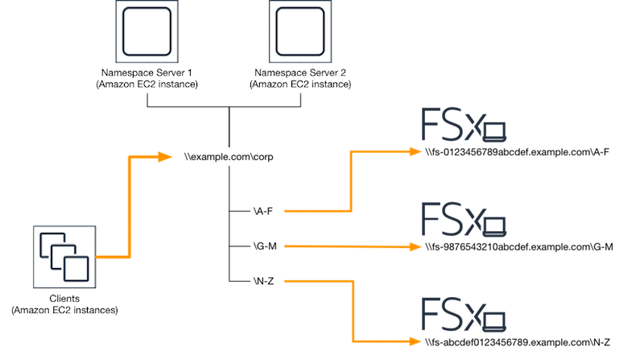

# Sharding data using DFS Namespaces for scale-out performance

The following procedure guides you through creating a DFS solution on Amazon FSx for scale-out
performance. In this example, the data stored in the `corp` namespace is
sharded alphabetically. Data files ‘A-F’, ‘G-M’ and ‘N-Z’ are all stored on different file
shares. Based on the type of data, I/O size, and I/O access pattern, you should decide how to
best shard your data across multiple file shares. Choose a sharding convention that distributes
I/O evenly across all the file shares you plan on using. Keep in mind that each namespace
supports up to 50,000 file shares and hundreds of petabytes of storage capacity in
aggregate.

###### To set up DFS Namespaces for scale-out performance

1. If you don't already have DFS Namespace servers running, you can launch a pair of highly
   available DFS Namespace servers using the [setup-DFSN-servers.template](https://s3.amazonaws.com/solution-references/fsx/dfs/setup-DFSN-servers.template "https://s3.amazonaws.com/solution-references/fsx/dfs/setup-DFSN-servers.template") AWS CloudFormation template. For more information on creating an AWS CloudFormation
   stack, see [Creating a Stack on the AWS
   CloudFormation Console](../../../AWSCloudFormation/latest/UserGuide/cfn-console-create-stack.md "../../../AWSCloudFormation/latest/UserGuide/cfn-console-create-stack.md") in the _AWS CloudFormation User Guide_.
2. Connect to one of the DFS Namespace servers launched in the previous step as a user in the
   **AWS Delegated Administrators** group. For more information, see [Connecting to Your Windows
   Instance](../../../AWSEC2/latest/WindowsGuide/connecting_to_windows_instance.md "../../../AWSEC2/latest/WindowsGuide/connecting_to_windows_instance.md") in the _Amazon EC2 User Guide_.
3. Access the DFS Management Console. Open the **Start** menu and run
   **dfsmgmt.msc**. This opens the DFS Management GUI tool.
4. Choose **Action** then **New Namespace**, type in the
   computer name of the first DFS Namespace server you launched for **Server**
   and choose **Next**.
5. For **Name**, type in the namespace you're creating (for example,
   **corp**).
6. Choose **Edit Settings** and set the appropriate permissions based on
   your requirements. Choose **Next**.
7. Leave the default **Domain-based namespace** option selected, leave the
   **Enable Windows Server 2008 mode** option selected, and choose
   **Next**.

###### Note

Windows Server 2008 mode is the latest available option for Namespaces. 8. Review the namespace settings and choose **Create**. 9. With the newly created namespace selected under **Namespaces** in the
navigation bar, choose **Action** then **Add Namespace
Server**. 10. Type in the computer name of the second DFS Namespace server you launched for
**Namespace server**. 11. Choose **Edit Settings**, set the appropriate permissions based on your
requirements, and choose **OK**. 12. Open the context (right-click) menu for the namespace you just created, choose
**New Folder**, enter the name of the folder for the first shard (for
example, `A-F` for **Name**), and choose
**Add**. 13. Type in the DNS name of the file share hosting this shard in UNC format (for example,
`\\fs-0123456789abcdef0.example.com\A-F`) for **Path to folder
target** and choose **OK**. 14. If the share doesn't exist:

    1. Choose **Yes** to create it.
    2. From the **Create Share** dialog, choose
     **Browse**.
    3. Choose an existing folder, or create a new folder under **D$**, and
     choose **OK**.
    4. Set the appropriate share permissions, and choose **OK**.

15. With the folder target now added for the shard, choose **OK**.
16. Repeat the last four steps for other shards you want to add to the same namespace.
