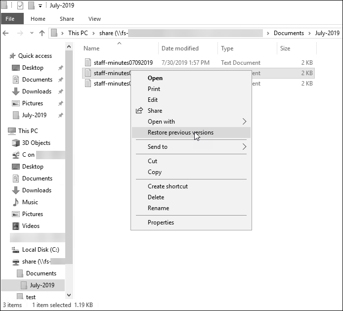
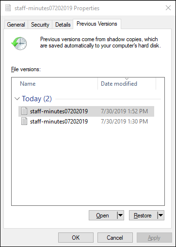

# Protecting your data with shadow copies

A Microsoft Windows _shadow copy_ is a snapshot of a Windows
file system at a point in time. With shadow copies enabled, users can quickly recover deleted or
changed files that are stored on the network, and compare file versions. Storage administrators can
easily schedule shadow copies to be taken periodically using Windows PowerShell commands.

Shadow copies are stored alongside your file system's data, and consume file
system storage capacity only for the changed portions of files. All shadow copies stored
in your file system are included in file system backups.

###### Note

Shadow copies are _not_ enabled on FSx for Windows File Server by default. To protect the data
on your file system using shadow copies, you must enable shadow copies and set up a shadow copy
schedule on your file system. For more information, see [Configuring shadow copies to use the default storage and schedule](setting-up-fsx-shadow-copies.md "setting-up-fsx-shadow-copies.md").

###### Warning

Shadow copies are not a substitute for backups. If you enable shadow copies, make sure that
you continue performing regular backups.

###### Topics

- [Best practices when using shadow copies](#shadow-copies-best-practices "#shadow-copies-best-practices")
- [Setting up shadow copies](#shadow-cpy-config-ovrvw "#shadow-cpy-config-ovrvw")
- [Configuring shadow copies to use the default storage and schedule](setting-up-fsx-shadow-copies.md "setting-up-fsx-shadow-copies.md")
- [Setting the maximum amount of shadow copy storage](shadow-copy-storage.md "shadow-copy-storage.md")
- [Viewing shadow copy storage](get-fsxshadowstorage.md "get-fsxshadowstorage.md")
- [Creating a custom shadow copy schedule](shadow-schedules.md "shadow-schedules.md")
- [Viewing the shadow copy schedule](get-fsxshadowcopy-sched.md "get-fsxshadowcopy-sched.md")
- [Creating a shadow copy](new-fsxshadow-copy.md "new-fsxshadow-copy.md")
- [Viewing existing shadow copies](get-fsxshadow-copies.md "get-fsxshadow-copies.md")
- [Deleting shadow copies](remove-fsxshadow-copies.md "remove-fsxshadow-copies.md")
- [Deleting a shadow copy schedule](remove-fsxshadowcopy-sched.md "remove-fsxshadowcopy-sched.md")
- [Deleting shadow copy storage, schedule, and all shadow
  copies](remove-fsxshadowstorage.md "remove-fsxshadowstorage.md")
- [Troubleshooting shadow copies](shadow-copy-ts.md "shadow-copy-ts.md")

## Best practices when using shadow copies

You can enable shadow copies for your file system to allow end-users to view and
restore individual files or folders from an earlier snapshot in Windows File
Explorer. Amazon FSx uses the shadow copies feature as provided by Microsoft Windows
Server. Use these best practices for shadow copies:

- **Ensure your file system has sufficient performance resources**: Microsoft
  Windows uses a copy-on-write method to record changes since the most recent
  shadow copy point, and this copy-on-write activity can result in up to three
  I/O operations for every file write operation.
- **Use SSD storage and increase throughput
  capacity**: Because Windows requires a high level of I/O
  performance to maintain shadow copies, we recommend using SSD storage and
  increasing throughput capacity up to a value as high as three times that of
  your expected workload. This helps to ensure that your file system has
  enough resources to avoid issues like the unwanted deletion of shadow
  copies.
- **Maintain only the number of shadow copies that you
  need**: If you have a large number of shadow copies—for
  example, more than 64 of the most recent shadow copies—or shadow
  copies that occupy a large amount of storage (TB-scale) on a single file
  system, processes such as failover and failback might take some extra time.
  This is due to the need for FSx for Windows to run consistency checks on the shadow
  copy storage. You might also experience higher latency of I/O operations due
  to the need for FSx for Windows to perform copy-on-write activity while maintaining
  the shadow copies. To minimize availability and performance impact from
  shadow copies, delete unused shadow copies manually or configure scripts to
  delete old shadow copies on your file system automatically.

###### Note

During [failover events](high-availability-multiAZ.md#MultiAZ-Failover "high-availability-multiAZ.md#MultiAZ-Failover") for Multi-AZ file systems, FSx for Windows runs a consistency check
that requires scanning the shadow copy storage on your file system before the new active file server comes online.
The duration of the consistency check is related to the number of shadow copies on your file system as well as the storage consumed. To prevent delayed failover and failback events,
we recommend maintaining fewer than 64 shadow copies on your file system and following the steps below to regularly monitor and delete your oldest shadow copies.

## Setting up shadow copies

You enable and schedule periodic shadow copies on your file system using Windows PowerShell
commands defined by Amazon FSx. The following are three main settings when configuring shadow copies on
your FSx for Windows File Server file system:

- Setting the maximum amount of storage that shadow copies can consume on your file system
- (Optional) Setting the maximum number of shadow copies that can be stored on your file system. The default value is 20.
- (Optional) Setting a schedule that defines the times and intervals at which to take shadow copies, such as daily, weekly, and monthly

You can store a maximum of 500 shadow copies per file system at any point in time;
however, we recommend maintaining fewer than 64 shadow copies at any time to ensure availability and performance. When you reach
this limit, the next shadow copy that you take replaces the oldest shadow copy. Similarly, when
the maximum shadow copy storage amount is reached, one or more of the oldest shadow copies are deleted
to make sufficient storage space for the next shadow copy.

For information about how to quickly enable and schedule periodic shadow copies by using
default Amazon FSx settings, see [Configuring shadow copies to use the default storage and schedule](setting-up-fsx-shadow-copies.md "setting-up-fsx-shadow-copies.md").

### Considerations for allocating shadow copy storage

A shadow copy is a block-level copy of file changes that were made since the last shadow
copy. The entire file is not copied, only the changes. Therefore, previous versions of files
typically don't take up as much storage space as the current file. The amount of volume
space used for changes can vary according to your workload. When a file is modified, the storage
space used by shadow copies depends on your workload. When you determine how much storage space
to allocate for shadow copies, you should account for your workload's file system usage
patterns.

When you enable shadow copies, you can specify the maximum amount of storage that shadow
copies can consume on the file system. The default limit is 10 percent of your file system. We
recommend that you increase the limit if your users frequently add or modify files. Setting the
limit too small can result in the oldest shadow copies being deleted more often than users might
expect.

You can set the shadow copy storage as unbounded (`Set-FsxShadowStorage -Maxsize
 "UNBOUNDED"`). However, an unbounded configuration can result in a large number of shadow
copies consuming your file system storage. This could result in not having enough storage
capacity for your workloads. If you set an unbounded storage, be sure to scale your storage
capacity as the shadow copy limits are reached. For information about configuring your shadow
copy storage to a specific size or as unbounded, see [Setting the maximum amount of shadow copy storage](shadow-copy-storage.md "shadow-copy-storage.md").

After you enable shadow copies, you can monitor the amount of storage space consumed by
the shadow copies. For more information,
see [Viewing shadow copy storage](get-fsxshadowstorage.md "get-fsxshadowstorage.md").

### Considerations when setting the maximum number of shadow copies

When you enable shadow copies, you can specify the maximum number of shadow copies stored on the file system.
The default limit is 20, and to minimize availability and performance impact from shadow copies, Microsoft
recommends configuring the maximum number of shadow copies to less than 64. Because Windows requires a high level of I/O performance to maintain shadow copies,
we recommend using SSD storage and increasing throughput capacity up to a value as high as three times that of your expected workload.
This helps to ensure that your file system has enough resources to avoid issues like the unwanted deletion of shadow copies.

You can set the maximum number of shadow copies up to 500. However, if you have a large number of shadow
copies or shadow copies that occupy a large amount of storage (TB-scale) on a single file system, processes
such as failover and failback may take longer than expected. This is because Windows needs to run consistency
checks on the shadow copy storage. You may also experience higher latency of I/O operations due to the need for
Windows to perform copy-on-write activity while maintaining the shadow copies.

### File system recommendations for shadow copies

Following are file system recommendations for using shadow copies.

- Make sure you provision sufficient performance capacity for your workload needs
  on your file system. Amazon FSx delivers the Shadow Copies feature as provided by Microsoft Windows
  Server. By design, Microsoft Windows uses a copy-on-write method for recording the changes since
  the most recent shadow copy point, and this copy-on-write activity can result in up to three I/O
  operations for every file write operation. If Windows is unable to keep up with the incoming rate
  of I/O operations per second, it can cause all shadow copies to be deleted because it can no longer
  maintain the shadow copies via copy-on-write. Therefore, it is important that you provision sufficient
  I/O performance capacity for your workload needs on your file system (both the throughput capacity
  dimension that determines the file server I/O performance, and the storage type and capacity that
  determine the storage I/O performance).
- We generally recommend that you use file systems configured with SSD storage rather
  than HDD storage when you enable shadow copies, given that Windows consumes a higher I/O performance
  to maintain shadow copies, and given that HDD storage provides lower performance capacity for I/O
  operations.
- Your file system should have at least 320 MB of free space, in addition to the maximum shadow
  copy storage amount configured (`MaxSpace`). For example, if you allocated 5 GB
  `MaxSpace` to shadow copies, your file system should always have at least 320 MB
  free space in addition to the 5 GB `MaxSpace`.

###### Warning

When configuring your shadow copy schedule, make sure that you don't schedule shadow
copies when migrating data or when data deduplication jobs are scheduled to run. You should
schedule shadow copies when you expect your file system to be idle. For information about
configuring a custom shadow copy schedule, see [Creating a custom shadow copy schedule](shadow-schedules.md "shadow-schedules.md").

### Restoring individual files and folders

After you configure shadow copies on your Amazon FSx file system, your users can quickly restore
previous versions of individual files or folders, and recover deleted files.

Users restore files to previous versions using the familiar Windows File Explorer interface.
To restore a file, you choose the file to restore, then choose **Restore previous
versions** from the context (right-click) menu.

Users can then view and restore a previous version from the **Previous Versions** list.

