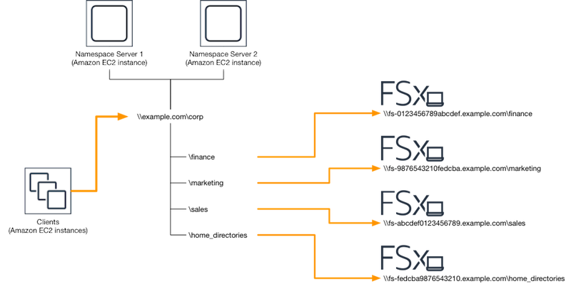

# Using DFS Namespaces

DFS Namespaces is a Windows Server role service that you use to group shared folders
located on different servers into one or more logically structured namespaces. This makes it possible
to give users a virtual view of shared folders, where a single path leads to files located on multiple
file systems, as shown in the following diagram. In addition to organizing and unifying access
to your file shares across multiple file systems,

## Group multiple FSx for Windows File Server file systems with DFS Namespaces

You can use Microsoft's Distributed File System (DFS) Namespaces
to group file shares on multiple FSx for Windows File Server file systems into one common folder structure,
or namespace. Using DFS Namespaces, you can scale file storage beyond the maximum storage capacity of single file system
(64 TiB) for large file datasets—up to hundreds of petabytes. This section shows you how to set up DFS namespaces on multiple FSx for Windows File Server
file systems.

DFS Namespaces is a Windows Server role service that you use to group shared folders
located on different servers into one or more logically structured namespaces. This makes it possible
to give users a virtual view of shared folders, where a single path leads to files located on multiple
file systems, as shown in the following diagram. In addition to organizing and unifying access to your file shares across multiple file systems,

For a step-by-step procedure for grouping FSx for Windows file systems using DFS Namespaces, see
[Group multiple file systems under a single namespace](group-fsx-namespace.md "group-fsx-namespace.md").

## Improving performance with shards

Amazon FSx for Windows File Server supports the use of the Microsoft Distributed File System (DFS). By using DFS
Namespaces, you can scale out performance (both read and write) to serve I/O-intensive workloads
by spreading your file data across multiple Amazon FSx file systems. At the same time, you can still
present a unified view under a common namespace to your applications. This solution involves
dividing your file data into smaller datasets or _shards_ and
storing them across different file systems. Applications accessing your data from multiple
instances can achieve high levels of performance by reading and writing to these shards in
parallel.

You can use the solution provided in [Sharding data using DFS Namespaces for scale-out performance](scaleout-performance.md "scaleout-performance.md")
to distribute read/write access to your data uniformly across your data multiple FSx for Windows File Server file systems.
