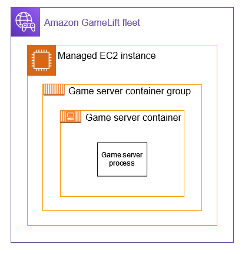
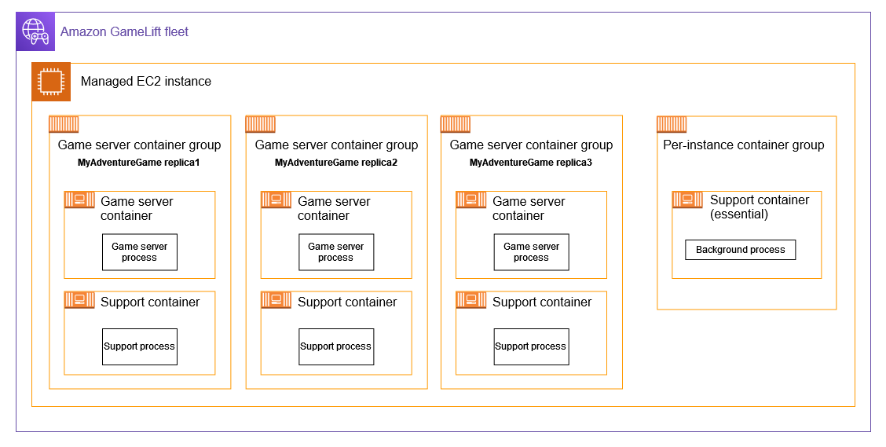
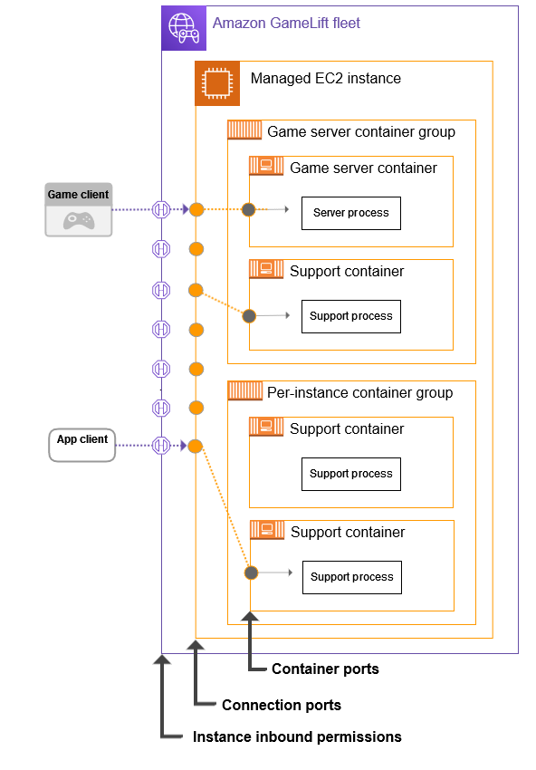

# How containers work in Amazon GameLift Servers

Amazon GameLift Servers container fleets are designed to give you flexibility in how you deploy and scale your
containerized applications. It uses the Amazon Elastic Container Service (Amazon ECS) to manage task deployment and
execution for your Amazon GameLift Servers fleets. This topic describes the basic structural elements for running
containers on an Amazon GameLift Servers managed fleet, illustrates common architectures, and outlines some core
concepts.

###### Speed up onboarding with these tools for managed containers:

- The [containers starter kit](https://github.com/aws/amazon-gamelift-toolkit/tree/main/containers-starter-kit "https://github.com/aws/amazon-gamelift-toolkit/tree/main/containers-starter-kit") streamlines integration and fleet setup. It adds
  essential game session management features to your game server, and uses pre-configured
  templates to build a container fleet and an automated deployment pipeline for your game
  server. After deployment, use the Amazon GameLift Servers console and API tools to monitor fleet
  performance, manage game sessions, and analyze metrics.
- For Unreal Engine or Unity developers, use the [Amazon GameLift Servers plugins](https://github.com/amazon-gamelift/ "https://github.com/amazon-gamelift/") to integrate your game server and
  build a container fleet from inside your game engine's development environment. The
  plugin's guided workflows help you create a fast, simple solution with cloud-based hosting
  using managed containers. Then build on this foundation to create a custom hosting
  solution for your game.

## Container fleet components

**Fleet**
A container fleet is a collection of Amazon EC2 instances to host your containerized game servers.
These instances are managed by Amazon GameLift Servers on your behalf. When you create a fleet, you
configure how the container architecture with your game server software is deployed to
each fleet instance. You can create a container fleet with instances in one or multiple
geographic locations. You can use Amazon GameLift Servers scaling tools to automatically scale a container
fleet's capacity to host game sessions and players.

**Instance**
An Amazon EC2 instance is the virtual server that provides compute capacity for game hosting. With
Amazon GameLift Servers, you can choose from a range of instance types. Each instance type offers a
different combination of CPU, memory, storage, and networking capacity.

When you create a container fleet, Amazon GameLift Servers deploys your containers based on the
instance type you choose and your fleet configuration. Each deployed fleet instance is
identical and runs your containerized game server software in the same way. The number
of instances in a fleet determines the fleet's size and game hosting capacity.

**Container group**
Amazon GameLift Servers uses the concept of a container group to describe and manage a set of containers. A
container group is similar to a container "task" or "pod". Within each container group,
you can define how containers behave, set up dependencies, and share available CPU and
memory resources.

Each fleet instance can have the following types of container groups:

- A **game server container group** manages the
  containers that run your game server application and supporting software. A
  container fleet must have one of this type of container group to host game sessions
  and players. A game server container group can be replicated across a fleet
  instance. The number of game server group replicas per fleet instance depends on
  your software's compute requirements and the compute resources available on the
  instance.
- A **per-instance container group**, which is optional, gives you
  the ability to run additional software on each fleet instance. They are useful for
  running background services or utility programs, such as for monitoring. You game
  server software doesn't directly depend on processes in a per-instance group. Only
  one copy of a per-instance container group is deployed to each fleet instance.

Each container group in a container fleet has one container that's designated
"essential". An essential container drives the lifecycle of a container group. If the
essential container fails, the entire container group restarts.

**Container**
The container is the most basic element of a container-based architecture. It includes a
container image with software executables and dependent files. Define a container to
configure how the software runs and interacts with Amazon GameLift Servers.

Amazon GameLift Servers defines two types of containers:

- A **game server container** includes everything you
  need to run your game server processes and host game sessions for players. It
  includes your game server build and dependent software. Define one game server
  container for a fleet's game server container group. The game server container is
  automatically considered essential to the container group.
- A **support container** runs additional software to
  support your game server. It is similar to the concept of a "sidecar" container. It
  gives you the option to run and scale supporting software alongside your game
  servers but manage as separate containers. In a game server container group, you can
  define zero or more support containers. In a per-instance container group, all
  containers are support containers. Any support container can be designated
  essential.

**Compute**
A compute represents a copy of a game server container group on a fleet instance.

## Common architectures

The following diagram illustrates the simplest container fleet structure. In this
structure, each instance in the fleet maintains one copy of the game server container group.
The container group has a single game server container that runs one game server process. In
this example, the container fleet is configured to place one copy of the game server container
group per instance. With this architecture, each instance runs one game server process.

This second diagram illustrates a more complex container fleet architecture. In this
structure, the fleet has a both a game server container group and a per-instance container
group. The game server container group has separate containers for the game server process and
a support process. The fleet is configured to place three copies of the game server container
group on each fleet instance. The per-instance container group is never replicated. In this
example, the container fleet is configured to place three copies of the game server container
group per instance. With this architecture, each instance runs three game server
process.

## Core features

This section summarizes how Amazon GameLift Servers implements some basic container concepts. For
instructions on how to work with container fleets, see the relevant topics in this guide.

### Active fleet updates

Managed containers provides advanced support to help you manage the life cycle of your
hosted software and container architecture. You can update your container definitions,
including container images, and deploy changes to your existing fleets. This feature makes
it faster and easier to iterate changes to your containers during development. It also
provides features to help you build, deploy, and track your software version updates over
time. These features include:

- Manage container group definition updates and versioning. You can update nearly all
  properties of a container group definition, including container images and configuration
  settings. Whenever you update a container, Amazon GameLift Servers automatically assigns a version number
  to the update and by default maintains all versions. You can access any specific
  version, and you can delete versions as desired. When creating a container fleet, you
  can specify the container group definition and version to deploy.
- Update existing container fleets with new container group definitions and
  configuration settings. You can deploy container updates to fleets that are already
  deployed to fleet instances. You can track the status of update deployments across each
  fleet location using the AWS Management Console or the AWS SDK and CLI.
- Configure how you want fleet updates to deploy across an active fleet.
  - Game session protection. Choose to protect fleet instances with active game
    sessions until after the game sessions end (safe deployment). Or choose to replace
    fleet instances regardless of game session activity (unsafe deployment). Use unsafe
    deployments during development and testing phases to reduce deployment time.
  - Minimum healthy percentage. Specify the percentage of healthy tasks that you
    want to maintain during deployment. This feature lets you decide how many fleet
    instances are impacted during a deployment. A low value prioritizes deployment
    speed, while a high value ensures that game server availability remains high
    throughout the deployment.
  - Deployment failure strategy. Decide what actions to take if a deployment fails.
    A deployment failure means that some of the updated containers have failed status
    checks and are considered impaired. You can set deployments to automatically roll
    back all fleet instances to the previously deployed state. Alternatively you can
    choose to maintain some of the impaired fleet instances for use in debugging.

The ability to update active fleets is highly useful when you want to deploy an update
to your game server software. After you've built a new container image for your game
server, deploying it is a two-step process: first, update the container group definition
with the new image, and second, update the container fleet. Amazon GameLift Servers handles all other tasks as
needed.

### Container packing

When developing your container structure for deployment in a container fleet, a common
goal is to optimize your use of available computing power. To achieve this goal, you want to
pack as many game server container groups as possible onto each fleet instance.

Amazon GameLift Servers helps you do this by calculating the maximum game server container groups per
instance, based on the following information:

- The fleet's instance type and its vCPU and memory resources.
- The vCPU and memory requirements for all containers in the game server container
  group.

The vCPU and memory requirements for all containers in a per-instance container
group, if there is one.

When you create a container fleet, you can use the calculated maximum or you can specify
a desired number. As a best practice, plan to experiment with your containerized game server
software to determine resource requirements for optimal game server performance.

### Capacity scaling

Fleet capacity measures the number of game sessions that a fleet can host concurrently.
You can also measure capacity based on the number of concurrent players that a fleet can
support. To increase or decrease a fleet's hosting capacity, you add or remove fleet
instances.

A container fleet is configured to run a specific number of concurrent game server
processes on each fleet instance. (You can calculate this based on (1) the game server
container groups per instance and (2) the number of game server processes that run in each
container group.) The number of cncurrent game servers per instance tells you what the
impact is of adding or removing each fleet instance. For example, if your container fleet
runs 1 game server process in each game server container group, and each fleet instance
holds 100 game server containers groups, you increase or decrease your fleet's capacity to
host concurrent game sessions by increments of 100. If each game session has 10 player
slots, then you increase or decrease your fleet's capacity to host players by increments of 1000.

With container fleets, you can use any of the capacity scaling methods provided by
Amazon GameLift Servers. These include:

- Set fleet capacity manually by setting a desired fleet instance count.
- Set up automatic scaling by targeting a desired buffer of available instances
  (target tracking). This method automatically maintains a certain amount of idle hosting
  resources so that incoming players can get into games quickly. As player demand
  increases or decreases, the size of this buffer is continually adjusted.
- Set up automatic scaling with custom scaling rules (advanced feature). This method
  lets you scale based on fleet metrics that you choose.

### Game client/server connections

With Amazon GameLift Servers managed fleets, game clients connect directly to your cloud-hosted game
servers. When a game client asks to join a game, Amazon GameLift Servers finds a game session and provides
connection information (IP and port) to the game client. You can control external access to
fleet instances by opening certain port ranges (inbound permissions) for the fleet. Inbound
permissions determine which ports are open to incoming traffic. You can quickly shut down
all ports, limit to a few, or open all ports.

Managed container fleets require an additional setting that allows access to processes
that are running in a container. When you create a container definition, you specify a set
of ports, one for each process that takes a connection. This includes:

- All game server processes that will run concurrently in the game server container.
  All game server processes must allow game clients to connect in order to join a game
  session.
- Any process in a support container that an external source needs to connect to. For
  example, you could remotely connect to a testing app.

When you set the internal-facing container port settings, Amazon GameLift Servers uses them to calculate
the external-facing inbound permissions that game clients and other applications can connect
to. Amazon GameLift Servers also manages the mapping between inbound permissions and individual container
ports that gives players access to an game session in a container. This internal mapping
provides a layer of security by protecting your game servers from direct access to the
container ports. You have the option to customize a fleet's external-facing port settings as
needed. For more information about manually setting container fleet ports, see
[Configure network connections](containers-design-fleet.md#containers-custom-network "containers-design-fleet.md#containers-custom-network").

You can modify a container fleet's port settings at any time. This change requires a fleet update deployment.

The following diagram illustrates the role of port connections across a container fleet.
As shown, you set ports on individual containers, and Amazon GameLift Servers uses this information to
configure enough ports on the fleet instance to map to each container port. Both the
external-facing instance inbound permissions and the internal-facing connection ports are
calculated by Amazon GameLift Servers for your fleet, unless you choose to set them manually.

### Container logging

In managed container fleets, the standard output (and standard error) streams are
captured for all containers. This includes your game server's game session logs. You can
configure a container fleet to use one of several options to handle output streams:

- Save container output as an Amazon CloudWatch log stream. Each log stream references the
  fleet ID and container. If you choose this logging option for the fleet, you specify a
  CloudWatch log group, which organizes all the log streams from the fleet. You can then use
  CloudWatch features to search and analyse log data as needed.
- Save container output to an Amazon Simple Storage Service (Amazon S3) storage bucket. You can view, share, or
  download the content as needed.
- Turn off logging. In this scenario, container output isn't saved.

Amazon GameLift Servers sends log data from managed container fleets to the CloudWatch or Amazon S3 services in your AWS account.
To view your data, use the AWS Management Console or other tools by signing in to your AWS account and working with the
individual services. You extend limited access to Amazon GameLift Servers to take these actions by creating a service role for
your container fleets.

You can modify a container fleet's logging configuration at any time. This change requires a fleet update deployment.

### Container fleets and the Amazon GameLift Servers Agent

A commonly used container architecture runs a single process in each container. In an
Amazon GameLift Servers container fleet, the game server container group has one game server container, which
runs one game server process. With this architecture, Amazon GameLift Servers manages the lifecycle of the
single game server process in each game server container group on a fleet instance.

If you opt to build a container architecture that runs multiple game server processes in
each game server container group, you need a way to manage the lifecycle of all processes.
This includes tasks such as starting, shutting down, and replacing processes as needed,
managing a desired number of processes to run concurrently, and handling failure
states.

You can choose to use the Amazon GameLift Servers Agent for these tasks. For a container fleet, the Agent
implements runtime instructions that specify which executables to run (and how many),
provide launch parameters, and set rules around game server activation. For example, runtime
instructions might tell the Agent to maintain ten game server processes for production use,
and one game server process with special launch parameters for testing.

To use the Agent with your container fleets, add the Agent to your container image and
include a set of runtime instructions. For more information about the Agent, see
[Work with the Amazon GameLift Servers Agent](integration-dev-iteration-agent.md "integration-dev-iteration-agent.md").
