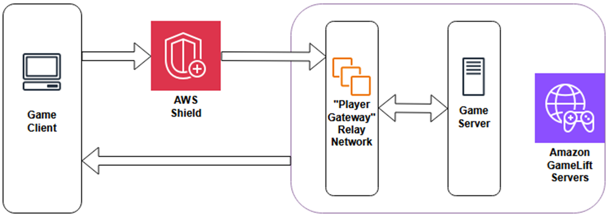
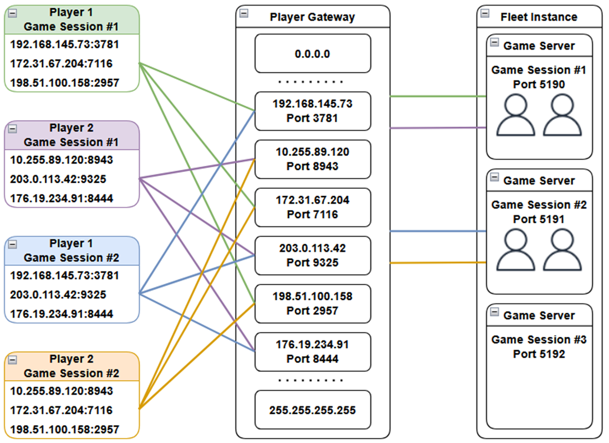

# How player gateway works

Player gateway uses a relay network to route UDP traffic between game clients and
game servers. This protects against DDoS attacks by validating traffic before it reaches
game servers, rate limiting player traffic, hiding game server IP addresses from the public,
and providing updated endpoints when relay endpoints become unhealthy.

## Traffic flow

When a player connects to a game session, your game backend retrieves relay endpoints and a player gateway token from the
`GetPlayerConnectionDetails` API and sends them to the game client. The game client prepends the player gateway token
to UDP packets and sends the packets to a relay endpoint. The relay network validates the token and routes legitimate traffic to
the game server. Before delivery, the relay network strips the player gateway token so that game servers receive the raw game
client payload and should not require code changes. Communication from the game server back to the game client returns through
the relay network without modification.

## Core concepts

### Relay endpoints

Relay endpoints are IP address and port combinations that game clients use to send
traffic through player gateway. Each player receives multiple endpoints that vary across
players to distribute traffic and reduce the impact of attacks on other players in the
same game session.

### Player gateway tokens

Player gateway tokens are encrypted byte arrays that authorize a player to send
traffic to a game session through player gateway. The `GetPlayerConnectionDetails`
API returns tokens as base64-encoded strings. Game clients must prepend the player gateway
token to every UDP packet. The relay network validates tokens and rejects packets with
invalid or missing tokens.

###### Important

Player gateway tokens must not be encrypted and must appear at the beginning of each UDP
packet sent by the game client. If your game encrypts payloads, prepend the unmodified player gateway token after
encrypting the game data.

Player gateway tokens remain valid for at least 3 minutes. We recommend refreshing
tokens every 60 seconds to ensure players receive updated endpoints when relay endpoints
become unhealthy.

### GetPlayerConnectionDetails API

Your game backend calls the `GetPlayerConnectionDetails` API to retrieve
connection details for players in a game session. The API returns either relay endpoints
and player gateway tokens, or falls back to the game server's IP address and port for
direct connection. Your game client should be designed to handle both connection types.
To receive updated endpoints when relay endpoints become unhealthy, call this API
periodically throughout the game session (recommended every 60 seconds).

For more information, see [GetPlayerConnectionDetails API](ddos-protection-integrate.md#ddos-protection-integrate-backend-api "ddos-protection-integrate.md#ddos-protection-integrate-backend-api").

## Monitoring player gateway

Player gateway publishes metrics to Amazon CloudWatch to help you monitor network traffic
patterns, identify potential DDoS attacks, and track relay performance. Metrics include
packets and bytes in/out, throttled traffic, and player sessions. For the complete
list of player gateway metrics, see [DDoS protection (player gateway) metrics](monitoring-cloudwatch.md#gamelift-metrics-fleet-playergateway "monitoring-cloudwatch.md#gamelift-metrics-fleet-playergateway").

## Player gateway limits

To protect your game servers from traffic abuse, player gateway enforces a rate limit on
UDP traffic for each player. With a valid player gateway token, player gateway limits
each player token to 100 packets per second (pps). The relay network throttles traffic
that exceeds this limit, and the traffic does not reach the game server.

This per-player rate limit helps prevent individual players from overwhelming game
servers with excessive traffic, whether because of misconfigured clients or malicious intent.

## IPv4 and IPv6 compatibility

Game clients communicate using IPv4. Player gateway uses IPv6 to communicate with game servers. Amazon GameLift Servers automatically handles the translation between IPv4 and IPv6 based on your fleet configuration.

For more information on configuring player gateway on your fleet, see
[CreateFleet](../apireference/API_CreateFleet.md#gameliftservers-CreateFleet-request-PlayerGatewayMode "../apireference/API_CreateFleet.md#gameliftservers-CreateFleet-request-PlayerGatewayMode")
or [CreateContainerFleet](../apireference/API_CreateContainerFleet.md#gameliftservers-CreateContainerFleet-request-PlayerGatewayMode "../apireference/API_CreateContainerFleet.md#gameliftservers-CreateContainerFleet-request-PlayerGatewayMode").
For more information about IPv4 and IPv6 support, see [IPv4 and IPv6 compatibility](ddos-protection-enable.md#ddos-protection-enable-ip-protocol "ddos-protection-enable.md#ddos-protection-enable-ip-protocol").
