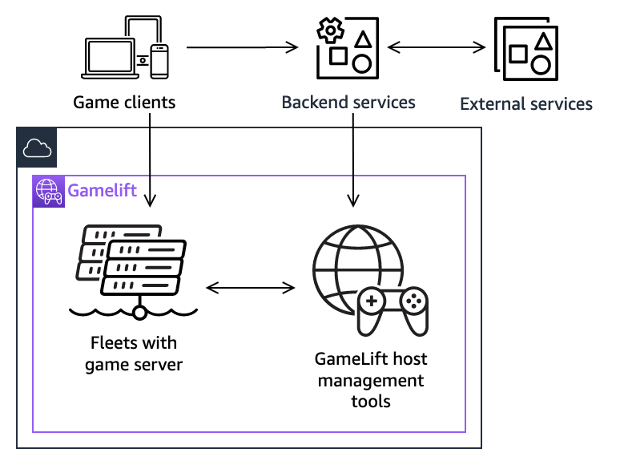
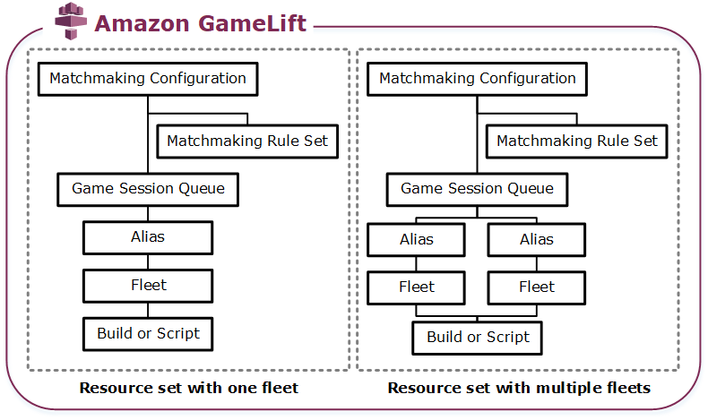

# Managed Amazon GameLift Servers solution architecture

The diagrams in this topic outline how a complete hosting solution with Amazon GameLift Servers is structured.

## Game components with hosting

The following diagram illustrates how the key components of a managed Amazon GameLift Servers hosting
solution work together to run dedicated game servers and help players find and connect to
hosted game sessions. The hosting solution you develop for your game will include most or
all of these components.

The key components of this architecture include the following:

Game clients

A game client is your software that is running on a player's device. The
player plays your game by joining a game session on a hosted game server. A game
client asks to join a game session through a backend service, receives
connection information for a game session, and uses it to connect directly with
the game session. For more information, see [Preparing games for Amazon GameLift Servers](integration-intro.md "integration-intro.md"). When connecting to an Realtime server,
a A game client uses the client SDK for Amazon GameLift Servers Realtime.

Backend services

A backend service is a custom service that you create to handle communication
with the Amazon GameLift Servers service on behalf of a game client. You can also use backend
services for game-specific tasks such as player authentication and
authorization, inventory, or currency control. A backend service communicates
with the Amazon GameLift Servers service using the API operations in the AWS SDK.

A backend service makes requests to get existing game session information and
to start game sessions. Requests for new game sessions define certain
characteristics, such as the maximum number of players. These requests prompt
Amazon GameLift Servers to start the game session placement process. When a game session is ready
to accept players, the backend service retrieves connection information and
provides it to the game client.

External services

Your game can rely on external services, such as for validating a subscription
membership. An external service can pass information to your game servers
through a backend service and Amazon GameLift Servers.

Game servers

A game server is your game's server software that runs on a set of hosting
resources. You upload your game server software to Amazon GameLift Servers, which deploys it to
the hosting resources and starts running server processes. Each game server
process connects with the Amazon GameLift Servers service to signal readiness to host game
sessions. It interacts with the service to start game sessions, validate newly
connected players, and report the status of game sessions and player
connections.

Custom game servers communicate with Amazon GameLift Servers by using the server SDK for Amazon GameLift Servers. For
more information, see [Integrate games with custom game servers](integration-custom-intro.md "integration-custom-intro.md"). Realtime servers are game
servers that are provided by Amazon GameLift Servers. You can customize server logic by providing
a custom script. For more information, see [Integrating games with Amazon GameLift Servers Realtime](realtime-intro.md "realtime-intro.md").

Host management tools

When setting up and managing hosting resources, game owners use hosting
management tools to manage game server builds or scripts, fleets, matchmaking,
and queues. The Amazon GameLift Servers tool set in the AWS SDK and the console provides
multiple ways for you to manage your hosting resources. You can remotely access
any individual game server for troubleshooting.

## Hosting solution resources

The following diagram illustrates Amazon GameLift Servers resources that make up a managed hosting solution.
Provide a custom server build or an Amazon GameLift Servers Realtime script, deploy a fleet of computes to host game servers,
and then set up a game session queue to find available hosting resources and start
new game sessions. For games that use FlexMatch matchmaking, add a matchmaking configuration and a
matchmaking rule set to generate player matches.

\***\*Game server code\*\***

- **Build** – Your custom-built game
  server software that runs on Amazon GameLift Servers and hosts game sessions for your
  players. A game build represents the set of files that run your game
  server on a particular operating system, and that you must integrate
  with Amazon GameLift Servers. Upload game build files to Amazon GameLift Servers in the AWS Regions where
  you plan to set up fleets. For more information, see [Deploy a custom server build for Amazon GameLift Servers
  hosting](gamelift-build-cli-uploading.md "gamelift-build-cli-uploading.md").
- **Script** – Your configuration
  and custom game logic for use with Amazon GameLift Servers Realtime. Configure Amazon GameLift Servers Realtime for your game
  clients by creating a script using JavaScript, and add custom game logic
  to host game sessions for your players. For more information, see [Deploy a script for Amazon GameLift Servers Realtime](realtime-script-uploading.md "realtime-script-uploading.md").

\***\*Fleet\*\***

A collection of compute resources that run your game servers and host game
sessions for your players. For information about where you can deploy fleets,
see [Amazon GameLift Servers service locations](gamelift-regions.md "gamelift-regions.md"). For
information about creating fleets, see [Setting up a hosting fleet with Amazon GameLift Servers](fleets-intro.md "fleets-intro.md").

\***\*Alias\*\***

An abstract identifier for a fleet that you can use to change the fleet that
your players are connected to at any time. For more information, see [Create an Amazon GameLift Servers alias](aliases-creating.md "aliases-creating.md").

\***\*Game session queue\*\***

A game session placement mechanism that receives requests for new game
sessions and searches for available game servers to host the new sessions. For
more information about game session queues, see [Managing game session placement with Amazon GameLift Servers queues](queues-intro.md "queues-intro.md").
