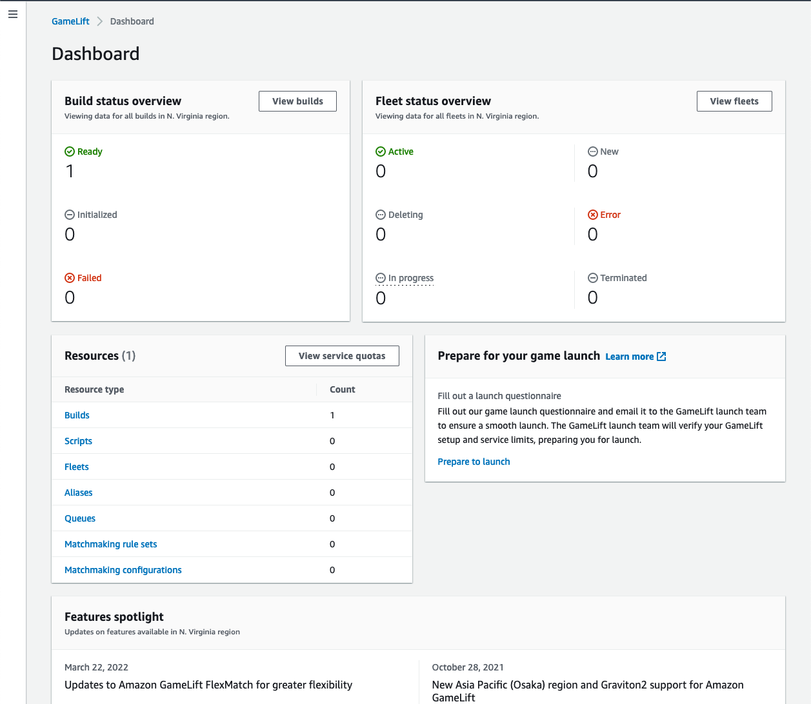

# Hosting dashboard in the Amazon GameLift Servers

dashboard

Use the Amazon GameLift Servers console dashboard to get a high-level snapshot about the current status of
the Amazon GameLift Servers hosting resources in your AWS account. The **Amazon GameLift Servers dashboard** provides a view of the
following:

- The number of builds in **Ready**,
  **Initialized**, and **Failed** statuses.
  Choose **View builds** for details about builds in your current
  Region.
- The number of fleets in all statuses. Choose **View fleets** for
  details about fleets in your current Region.
- Your current resources.
- New feature and service announcements.

###### To open the Amazon GameLift Servers dashboard

- In the [Amazon GameLift Servers console](https://console.aws.amazon.com/gamelift/ "https://console.aws.amazon.com/gamelift/"), in the
  navigation pane, choose **Dashboard**.
  From the dashboard, you can:

- Prepare your game for launch by choosing **Prepare for launch**
  and filling out the corresponding launch questionnaire.
- Request service quota increases in preparation for launches or in response to
  launches by choosing **View service quotas**.
- View blog posts and detailed information about new features by choosing the link
  in the **Features spotlight**.

