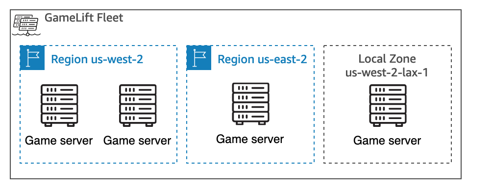

# Amazon GameLift Servers service locations

Amazon GameLift Servers features are available across multiple AWS Regions and Local Zones. You can design
a hosting solution that puts your game servers right where your players are located.

## Supported AWS locations

The following table is a list of AWS Regions and Local Zones that support Amazon GameLift Servers
resources. It indicates the types of resources that you can create in each location.

| Geographic location       | Location code    | Home Region for managed fleets (single location) | Home Region for managed fleets (multi-location) | Remote location for managed fleets (multi-location) | Anywhere fleet | Game session queue | FlexMatch matchmaker and rule set |
| ------------------------- | ---------------- | ------------------------------------------------ | ----------------------------------------------- | --------------------------------------------------- | -------------- | ------------------ | --------------------------------- | ------------------------------------------------------------------------------------------------------------------------------------------------------------------------------------------------------------------------------------------------------------------------------------------------------------------------------------------------------------------------------------------------------------------------------------------------------------------------------------------------------------------------------------------------------------------------------------------------------------------------------------------------------------------------------------------------------------------------------------------------------------------------------------------------------------------------------------------------------------------------------------------------------------------------------------------------------------------------------------------------------------------------------------------------------------------------------------------------------------------------------------------------------------------------------------------------------------------------------------------------------------------------------------------------------------------------------------------------------------------------------------------------------------------------------------------------------------------------------------------------------------------------------------------------------------------------------------------------------------------------------------------------------------------------------------------------------------------------------------------------------------------------------------------------------------------------------------------------------------------------------------------------------------------------------------------------------------------------------------------------------------------------------------------------------------------------------------------------------------------------------------------------------------------------------------------------------------------------------------------------------------------------------------------------------------------------------------------------------------------------------------------------------------------------------------------------------------------------------------------------------------------------------------------------------------------------------------------------------------------------------------------------------------------------------------------------------------------------------------------------------------------------------------------------------------------------------------------------------------------------------------------------------------------------------------------------------------------------------------------------------------------------------------------------------------------------------------------------------------------------------------------------------------------------------------------------------------------------------------------------------------------------------------------------------------------------------------------------------------------------------------------------------------------------------------------------------------------------------------------------------------------------------------------------------------------------------------------------------------------------------------------------------------------------------------------------------------------------------------------------------------------------------------------------------------------------------------------------------------------------------------------------------------------------------------------------------------------------------------------------------------------------------------------------------------------------------------------------------------------------------------------------------------------------------------------------------------------------------------------------------------------------------------------------------------------------------------------------------------------------------------------------------------------------------------------------------------------------------------------------------------------------------------------------------------------------------------------------------------------------------------------------------------------------------------------------------------------------------------------------------------------------------------------------------------------------------------------------------------------------------------------------------------------------------------------------------------------------------------------------------------------------------------------------------------------------------------------------------------------------------------------------------------------------------------------------------------------------------------------------------------------------------------------------------------------------------------------------------------------------------------------------------------------------------------------------------------------------------------------------------------------------------------------------------------------------------------------------------------------------------------------------------------------------------------------------------------------------------------------------------------------------------------------------------------------------------------------------------------------------------------------------------------------------------------------------------------------------------------------------------------------------------------------------------------------------------------------------------------------------------------------------------------------------------------------------------------------------------------------------------------------------------------------------------------------------------------------------------------------------------------------------------------------------------------------------------------------------------------------------------------------------------------------------------------------------------------------------------------------------------------------------------------------------------------------------------------------------------------------------------------------------------------------------------------------------------------------------------------------------------------------------------------------------------------------------------------------------------------------------------------------------------------------------------------------------------------------------------------------------------------------------------ |
| US East (N. Virginia)     | us-east-1        | Yes                                              | Yes                                             | Yes                                                 | Yes            | Yes                | Yes                               |
| US East (Ohio)            | us-east-2        | Yes                                              |                                                 | Yes                                                 | Yes            | Yes                |                                   |
| US West (N. California)   | us-west-1        | Yes                                              |                                                 | Yes                                                 | Yes            | Yes                |                                   |
| US West (Oregon)          | us-west-2        | Yes                                              | Yes                                             | Yes                                                 | Yes            | Yes                | Yes                               |
| Africa (Cape Town)        | af-south-1       |                                                  |                                                 | Yes                                                 |                |                    |                                   |
| Asia Pacific (Thailand)   | ap-southeast-7   |                                                  |                                                 | Yes                                                 |                |                    |                                   |
| Asia Pacific (Hong Kong)  | ap-east-1        |                                                  |                                                 | Yes                                                 |                |                    |                                   |
| Asia Pacific (Malaysia)   | ap-southeast-5   |                                                  |                                                 | Yes                                                 |                |                    |                                   |
| Asia Pacific (Mumbai)     | ap-south-1       | Yes                                              |                                                 | Yes                                                 | Yes            | Yes                |                                   |
| Asia Pacific (Osaka)      | ap-northeast-3   |                                                  |                                                 | Yes                                                 |                |                    |                                   |
| Asia Pacific (Seoul)      | ap-northeast-2   | Yes                                              | Yes                                             | Yes                                                 | Yes            | Yes                | Yes                               |
| Asia Pacific (Singapore)  | ap-southeast-1   | Yes                                              |                                                 | Yes                                                 | Yes            | Yes                |                                   |
| Asia Pacific (Sydney)     | ap-southeast-2   | Yes                                              | Yes                                             | Yes                                                 | Yes            | Yes                | Yes                               |
| Asia Pacific (Tokyo)      | ap-northeast-1   | Yes                                              | Yes                                             | Yes                                                 | Yes            | Yes                | Yes                               |
| Canada (Central)          | ca-central-1     | Yes                                              |                                                 | Yes                                                 | Yes            | Yes                |                                   |
| Europe (Frankfurt)        | eu-central-1     | Yes                                              | Yes                                             | Yes                                                 | Yes            | Yes                | Yes                               |
| Europe (Ireland)          | eu-west-1        | Yes                                              | Yes                                             | Yes                                                 | Yes            | Yes                | Yes                               |
| Europe (London)           | eu-west-2        | Yes                                              |                                                 | Yes                                                 | Yes            | Yes                |                                   |
| Europe (Milan)            | eu-south-1       |                                                  |                                                 | Yes                                                 |                |                    |                                   |
| Europe (Paris)            | eu-west-3        |                                                  |                                                 | Yes                                                 |                |                    |                                   |
| Europe (Stockholm)        | eu-north-1       |                                                  |                                                 | Yes                                                 |                |                    |                                   |
| Middle East (Bahrain)     | me-south-1       |                                                  |                                                 | Yes                                                 |                |                    |                                   |
| South America (São Paulo) | sa-east-1        | Yes                                              |                                                 | Yes                                                 | Yes            | Yes                |                                   |
| Atlanta local zone        | us-east-1-atl-1  |                                                  |                                                 | Yes                                                 |                |                    |                                   |
| Chicago local zone        | us-east-1-chi-1  |                                                  |                                                 | Yes                                                 |                |                    |                                   |
| Dallas local zone\*       | us-east-1-dfw-1  |                                                  |                                                 | Yes                                                 |                |                    |                                   |
| Dallas local zone 2       | us-east-1-dfw-2  |                                                  |                                                 | Yes                                                 |                |                    |                                   |
| Denver local zone         | us-west-2-den-1  |                                                  |                                                 | Yes                                                 |                |                    |                                   |
| Houston local zone        | us-east-1-iah-1  |                                                  |                                                 | Yes                                                 |                |                    |                                   |
| Kansas City local zone    | us-east-1-mci-1  |                                                  |                                                 | Yes                                                 |                |                    |                                   |
| Los Angeles local zone    | us-west-2-lax-1  |                                                  |                                                 | Yes                                                 |                |                    |                                   |
| Phoenix local zone        | us-west-2-phx-1  |                                                  |                                                 | Yes                                                 |                |                    |                                   |
| Lagos, Nigeria local zone | af-south-1-los-1 |                                                  |                                                 | Yes                                                 |                |                    |                                   | \* Available to AWS accounts that have already opted in. ###### Note Some AWS Regions and all Local Zones are not enabled by default for an AWS account. You must first opt in to these Regions or Local Zones before you can deploy game servers to those locations. For more information about Regions that aren't enabled by default and how to enable them, see [Managing AWS Regions](../../../general/latest/gr/rande-manage.md "../../../general/latest/gr/rande-manage.md") in the _AWS General Reference_. See [Getting started with Local Zones](../../../local-zones/latest/ug/getting-started.md "../../../local-zones/latest/ug/getting-started.md") in the _AWS Local Zones User Guide_. (Fleets created before February 28, 2022 are not affected by this requirement.) In addition, you must update your Amazon GameLift Servers administrator policy to allow the `ec2:DescribeRegions` action. For a policy example with Regions that aren't enabled by default, see [Administration permission examples](gamelift-iam-policy-examples.md#iam-policy-simple-example "gamelift-iam-policy-examples.md#iam-policy-simple-example"). ## Locations for managed hosting Amazon GameLift Servers managed hosting deploys fleets of game server resources. Each fleet is created in an AWS Region, which is the fleet's _home region_. A fleet's home Region is referenced in the fleet's Amazon Resource Number (ARN). You can deploy a _single-region fleet_, with hosting resources in the home region only. Alternatively, you can deploy a _multi-location fleet_, with hosting resources in multiple geographic locations. A multi-location fleet has a home region and one or more _remote locations_. When managing hosting capacity for a multi-location fleet, you can set capacity for each location individually. Remote locations for a multi-location fleet can be other AWS Regions or Local Zones. A _Local Zone_ is an extension of an AWS Region. It lets you place compute resources closer to users to provide lower-latency gameplay. For more information, see [AWS Local Zones](https://aws.amazon.com/about-aws/global-infrastructure/localzones/ "https://aws.amazon.com/about-aws/global-infrastructure/localzones/"). The location code for a Local Zone is its parent Region code followed by a physical location identifier. For example, the code for the Los Angeles Local Zone is `us-west-2-lax-1`. The following diagram illustrates a multi-location fleet with resources in two AWS Regions and one Local Zone. The fleet's home Region is `us-west-2`, and it has two remote locations: `us-east-2` Region and `us-west-2-lax-1` Local Zone.  In addition to fleet resources, managed hosting with Amazon GameLift Servers can also use the following types of resources. You create these resources in a specific AWS Region that supports the resource type.  • _Build_ – This is a game server build to be hosted with a managed EC2 fleet. Create a build resource in the same region as the fleet that it will be deployed to.  • _Script_ – This is a configuration script for hosting a game with Amazon GameLift Servers Realtime. Create a script resource in the same Region as the fleet that it will be deployed to.  • _Container group definition_ and _container image_ – This is a configuration for running containers on a managed container fleet. It identifies one or more container images with software to deploy to the container fleet. Create a container group definition and all container images (which are stored in an Amazon Elastic Container Registry repository) in the same Region as the fleet they will be deployed to.  • _Game session queue_ – This resource processes requests for game sessions and initiates new game sessions. Processing takes place in the AWS Region where the queue is located. To reduce latency in the game session placement process, create a queue geographically near the players that will use it. ## Locations for Amazon GameLift Servers Anywhere An Amazon GameLift Servers Anywhere fleet is a collection of hosting hardware that you provide. You manage all activity on your hosting resources, including deploying game server software, keeping it updated, and starting server processes. You create an Anywhere fleet to connect the Amazon GameLift Servers service with your self-managed hosting resources. Amazon GameLift Servers manages game session placement--processing player join requests, locating available hosting resources, initiating new game sessions, and providing game clients with connection information. You can create an Anywhere fleet in any of the AWS Regions that support them. You add instances of hosting hardware to an Anywhere fleet by registering it. Each registered instance must have a custom location associated with it. Custom locations are not related to AWS Regions or Local Zones. They are used to represent the physical location of the hardware. For more information about creating an Anywhere fleet and testing your game server integration, see [Create an Amazon GameLift Servers Anywhere fleet](fleets-creating-anywhere.md "fleets-creating-anywhere.md") and [Set up local testing with Amazon GameLift Servers Anywhere](integration-testing.md "integration-testing.md"). ## Locations for Amazon GameLift Servers FlexMatch FlexMatch resources are used to process player requests for matchmaking. They include a matchmaking configuration resource and a rule set resource. Processing takes place in the AWS Region where the FlexMatch resources are located. To reduce latency in the matchmaking process, create the resources geographically near the players that will use it. A matchmaking configuration and the rule set it uses must be located in the same AWS Region. You can create FlexMatch resources in any of the AWS Regions that support them. For more information about setting up FlexMatch for your hosting solution, see the [Amazon GameLift Servers FlexMatch developer guide](../flexmatchguide/match-intro.md "../flexmatchguide/match-intro.md"). ## Amazon GameLift Servers in China When using Amazon GameLift Servers for resources in the China (Beijing) Region, operated by Sinnet, or the China (Ningxia) Region, operated by NWCD, you must have a separate AWS (China) account. Be aware that some features are unavailable in the China Regions. For more information about using Amazon GameLift Servers in these Regions, see the following resources:  • [Amazon Web Services in China](https://www.amazonaws.cn/en/about-aws/china/ "https://www.amazonaws.cn/en/about-aws/china/")  • [Amazon GameLift Servers](https://docs.amazonaws.cn/en_us/aws/latest/userguide/gamelift.html "https://docs.amazonaws.cn/en_us/aws/latest/userguide/gamelift.html") (Getting Started with Amazon Web Services in China) |
