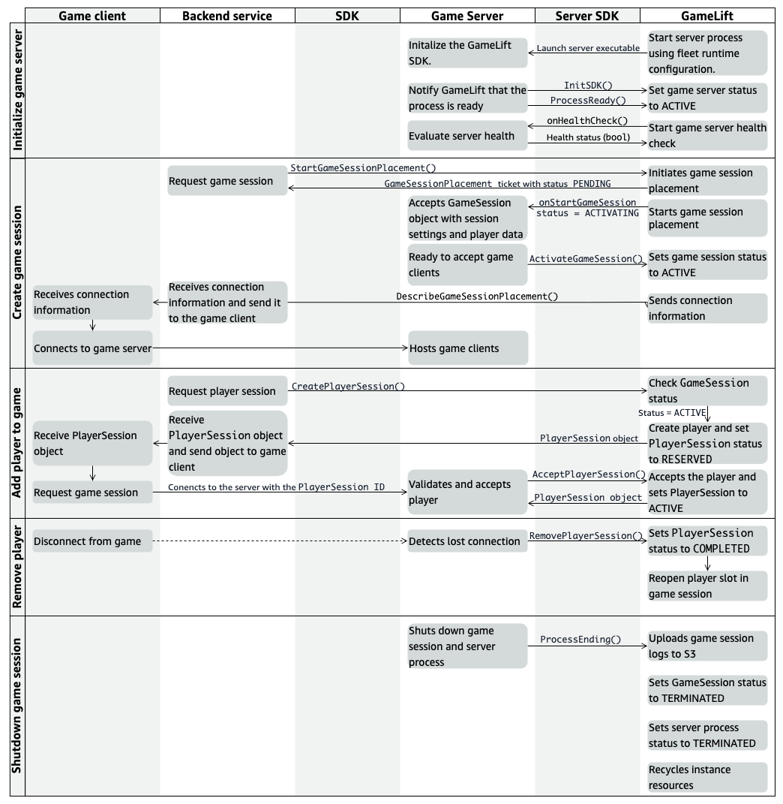

# Game client/server interactions with

Amazon GameLift Servers

The components in your Amazon GameLift Servers hosting solution interact with each other in specific
ways to run game sessions in response to player demand. This topic describes how components
communicate with each other when your game server is hosted on Amazon GameLift Servers managed EC2 fleets,
self-managed Amazon GameLift Servers Anywhere fleets, or a hybrid solution.

Hosting solution components include a game server, the Amazon GameLift Servers service, a client-side
backend service, and a game client. The game server uses the
[Amazon GameLift Servers server SDK](reference-serversdk.md "reference-serversdk.md") to
interact with the Amazon GameLift Servers service. The backend service uses the
[Amazon GameLift Servers service API](reference-awssdk.md "reference-awssdk.md")
(part of the AWS SDK) to interact with the service on behalf of the game client. When
joining a game session, the game client connects directly to a game session using the game
session's unique IP address and port number.

###### Topics

- [Interactions diagram](#gamelift-sdk-interactions-diagram "#gamelift-sdk-interactions-diagram")
- [Interaction behaviors](#gamelift-sdk-interactions-descriptions "#gamelift-sdk-interactions-descriptions")

## Interactions diagram

The following diagram illustrates how your game hosting components interact so that the
Amazon GameLift Servers service can track the status of game server availability and start game
sessions in response to player demands.

## Interaction behaviors

The following sections describe the sequence of events in each of the key
interactions.

### Initializing a game server

process

On startup, a game server process establishes communication with the Amazon GameLift Servers service and
reports its status as ready to host a game session.

1. A new process of the game server executable starts running on a hosting
   resource.
2. The game server process calls the following server SDK operations in
   sequence:
   1. `InitSDK()` to initialize the server SDK, authenticate the
      server process, and establish communication with the Amazon GameLift Servers service.
   2. `ProcessReady()` to communicate readiness to host a game
      session. This call also reports the process's connection
      information, which game clients use to connect to the game session,
      and other information.The server process then waits for prompts from the Amazon GameLift Servers service.

3. Amazon GameLift Servers updates the status of the server process to `ACTIVE` and
   available to host a new game session.
4. Amazon GameLift Servers begins periodically calling the `onHealthCheck` callback to
   request a health status from the server processes. These calls continue
   while the server process remains in active status. The server process must
   respond healthy or not healthy within one minute. If the server process
   responds not healthy or doesn't respond, at some point the Amazon GameLift Servers service
   changes the server process's active status and stops sending requests to
   start game session.

### Creating a game session

The Amazon GameLift Servers service starts a new game session in response to a request from a player to
play the game.

1. A player using the game client asks to join a game session. Depending on how
   your game handles the player join process, the game client sends a request
   to the backend service.
2. If the player join process requires starting a new game session, the backend
   service sends a request for a new game session to the Amazon GameLift Servers service. This
   request calls the service API operation
   `StartGameSessionPlacement()`. (As an alternative, the
   backend service might call `StartMatchmaking()`, or
   `CreateGameSession()`.)
3. The Amazon GameLift Servers service responds by creating a new
   `GameSessionPlacement` ticket with status
   `PENDING`. It returns ticket information to the backend
   service, so that it can track the placement ticket status and determine when
   the game session is ready for players. For more information, see [Set up event notification for game session
   placement](queue-notification.md "queue-notification.md").
4. The Amazon GameLift Servers service starts the game session placement process. It identifies
   which fleets to look at and searches those fleets for an active server
   process that's not hosting a game session. On locating an available server
   process, the Amazon GameLift Servers service does the following:
   1. Creates a `GameSession` object with the game session
      settings and player data from the placement request, and sets the
      status to `ACTIVATING`.
   2. Prompts the server process to start a game session. The service
      invokes the server process's `onStartGameSession`
      callback and passes the `GameSession` object.
   3. Changes the server process's number of game sessions to
      `1`.

5. The server process runs its `onStartGameSession` callback function.
   When the server process is ready to accept player connections, it calls the
   server SDK operation `ActivateGameSession()` and waits for player
   connections.
6. The Amazon GameLift Servers service updates the `GameSession` object with connection
   information for the server process (as reported in the call to
   `ProcessReady()`) and sets the game session status to
   `ACTIVE`. It also updates the
   `GameSessionPlacement` ticket status to
   `FULFILLED`.
7. The backend service calls `DescribeGameSessionPlacement()` to check
   ticket status and get game session information. When the game session is
   active, the backend service notifies the game client and passes the game
   session connection information.
8. The game client uses the connection information to connect directly to the
   game server process and join the game session.

### Adding a player to a game

A game can optionally use player sessions to track player connections to game
sessions. Player sessions can be created individually or as part of a game session
placement request.

1. The backend service calls the service API operation
   `CreatePlayerSession()` with a game session ID.
2. The Amazon GameLift Servers service checks the game session status (must be
   `ACTIVE`), and looks for an open player slot in the game session.
   If a slot is available, then the service does the following:
   1. Creates a new `PlayerSession` object and sets the status to
      `RESERVED`.
   2. Responds to the backend service request with player session
      information.

3. The backend service passes player session information to the game client along
   with game session connection information.
4. The game client uses the connection information and player session ID to
   connect directly to the game server process and ask to join the game
   session.
5. In response to a game client join attempt, the game server process calls the
   service API operation `AcceptPlayerSession()` to validate the
   player session ID. The server process either accepts or rejects the
   connection.
6. The Amazon GameLift Servers service does one of the following:
   1. If the connection is accepted, then Amazon GameLift Servers sets the
      `PlayerSession` status to `ACTIVE` and
      passes the `PlayerSession` to the game server
      process.
   2. If the game server process doesn't call
      `AcceptPlayerSession()` for the player session ID
      within a certain time period after the original
      `CreatePlayerSession()` request, the Amazon GameLift Servers service
      changes the `PlayerSession` status to
      `TIMEDOUT` and reopens the player slot in the game
      session.

### Removing a player

For games that use player sessions, the game server process notifies the Amazon GameLift Servers service
when a player disconnects. The service uses this information to track the status of
player slots in a game session and can allow new players to use open slots.

1. A player disconnects from the game session.
2. The game server process detects the lost connection and calls the server SDK
   operation `RemovePlayerSession()`.
3. The Amazon GameLift Servers service changes the player session status to `COMPLETED`
   and reopens the player slot in the game session.

### Shutting down the game

session

At the end of a game session, or when shutting down the game session, the server
process notifies the Amazon GameLift Servers service of game session status.

1. The game server process ends the game session and initiates process shut
   down by calling the server SDK operation
   `ProcessEnding()`.
2. The game server process calls `Destroy()` to free the server
   SDK from memory. This step is required for
   [Telemetry metrics](monitoring-gamelift-servers-metrics.md "monitoring-gamelift-servers-metrics.md")
   to prevent it from reporting normal process exits as crashes.
3. The Amazon GameLift Servers service does the following:
   1. Uploads game session logs to Amazon Simple Storage Service (Amazon S3).
   2. Changes the game session status to `TERMINATED`.
   3. Changes the server process status to `TERMINATED`.
   4. Depending on how the hosting solution is designed, the newly available
      hosting resources are allocated to run a new game server
      process.
