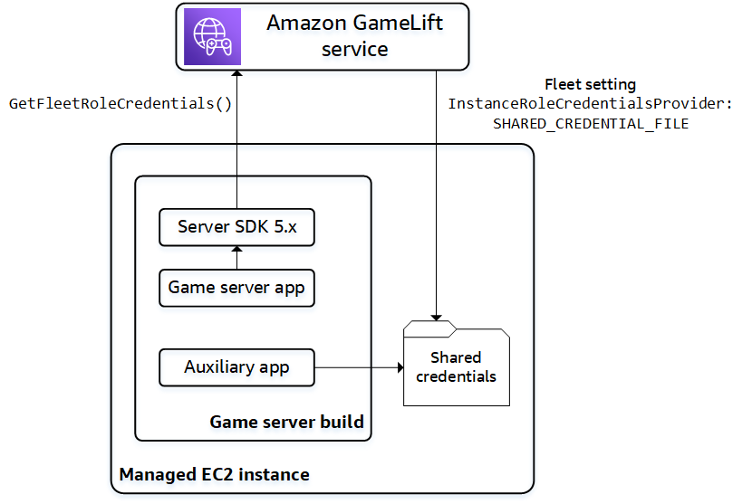

# Communicate with other AWS resources from

your fleets

When you're creating a game server build for deployment on Amazon GameLift Servers fleets, you might want
the applications in your game build to communicate directly and securely with other AWS
resources that you own. Because Amazon GameLift Servers manages your game hosting fleets, you must give Amazon GameLift Servers
limited access to these resources and services.

Some example scenarios include:

- Use an Amazon CloudWatch agent to collect metrics, logs, and traces from managed EC2 fleets
  and Anywhere fleets.
- Send instance log data to Amazon CloudWatch Logs.
- Obtain game files stored in an Amazon Simple Storage Service (Amazon S3) bucket.
- Read and write game data (such as game modes or inventory) stored in an Amazon DynamoDB
  database or other data storage service.
- Send signals directly to an instance using Amazon Simple Queue Service (Amazon SQS).
- Access custom resources that are deployed and running on Amazon Elastic Compute Cloud (Amazon EC2).
  Amazon GameLift Servers supports these methods for establishing access:

- [Access AWS resources with an
  IAM role](#gamelift-sdk-server-resources-roles "#gamelift-sdk-server-resources-roles")
- [Access AWS resources with VPC
  peering](#gamelift-sdk-server-resources-vpc "#gamelift-sdk-server-resources-vpc")

## Access AWS resources with an

IAM role

Use an IAM role to specify who can access your resources and set limits on that
access. Trusted parties can "assume" a role and get temporary security credentials that
authorize them to interact with the resources. When the parties make API requests
related to the resource, they must include the credentials.

To set up access controlled by an IAM role, do the following tasks:

1. [Create the IAM role](#gamelift-sdk-server-resources-roles-create "#gamelift-sdk-server-resources-roles-create")
2. [Modify applications to acquire
   credentials](#gamelift-sdk-server-resources-roles-apps "#gamelift-sdk-server-resources-roles-apps")
3. [Associate a fleet with the IAM
   role](#gamelift-sdk-server-resources-roles-fleet "#gamelift-sdk-server-resources-roles-fleet")

### Create the IAM role

In this step, you create an IAM role, with a set of permissions to control
access to your AWS resources and a trust policy that gives Amazon GameLift Servers rights to use the
role's permissions.

For instructions on how to set up the IAM role , see [Set up an IAM service role for Amazon GameLift Servers](setting-up-role.md "setting-up-role.md"). When creating the
permissions policy, choose specific services, resources, and actions that your
applications need to work with. As a best practice, limit the scope of the
permissions as much as possible.

After you create the role, take note of the role's Amazon Resource Name (ARN). You
need the role ARN during fleet creation.

### Modify applications to acquire

credentials

In this step, you configure your applications to acquire security credentials for
the IAM role and use them when interacting with your AWS resources . See the
following table to determine how to modify your applications based on (1) the type
of application, and (2) the server SDK version your game uses to communicate with
Amazon GameLift Servers.

|                                           | Game server applications                                                           | Other applications                                                                        |
| ----------------------------------------- | ---------------------------------------------------------------------------------- | ----------------------------------------------------------------------------------------- | ---------------------------------------------------------------------------------------------------------------------------------------------------------------------------------------------------------------------------------------------------------------------------------------------------------------------------------------------------------------------------------------------------------------------------------------------------------------------------------------------------------------------------------------------------------------------------------------------------------------------------------------------------------------------------------------------------------------------------------------------------------------------------------------------------------------------------------------------------------------------------------------------------------------------------------------------------------------------------------------------------------------------------------------------------------------------------------------------------------------------------------------------------------------------------------------------------------------------------------------------------------------------------------------------------------------------------------------------------------------------------------------------------------------------------------------------------------------------------------------------------------------------------------------------------------------------------------------------------------------------------------------------------------------------------------------------------------------------------------------------------------------------------------------------------------------------------------------------------------------------------------------------------------------------------------------------------------------------------------------------------------------------------------------------------------------------------------------------------------------------------------------------------------------------------------------------------------------------------------------------------------------------------------------------------------------------------------------------------------------------------------------------------------------------------------------------------------------------------------------------------------------------------------------------------------------------------------------------------------------------------------------------------------------------------------------------------------------------------------------------------------------------------------------------------------------------------------------------------------------------------------------------------------------------------------------------------------------------------------------------------------------------------------------------------------------------------------------------------------------------------------------------------------------------------------------------------------------------------------------------------------------------------------------------------------------------------------------------------------------------------------------------------------------------------------------------------------------------------------------------------------------------------------------------------------------------------------------------------------------------------------------------------------------------------------------------------------------------------------------------------------------------------------------------------------------------------------------------------------------------------------------------------------------------------------------------------------------------------------------------------------------------------------------------------------------------------------------------------------------------------------------------------------------------------------------------------------------------------------------------------------------------------------------------------------------------------------------------------------------------------------------------------------------------------------------------------------------------------------------------------------------------------------------------------------------------------------------------------------------------------------------------------------------------------------------------------------------------------------------------------------------------------------------------------------------------------------------------------------------------------------------------------------------------------------------------------------------------------------------------------------------------------------------------------------------------------------------------------------------------------------------------------------------------------------------------------------------------------------------------------------------------------------------------------------------------------------------------------------------------------------------------------------------------------------------------------------------------------------------------------------------------------------------------------------------------------------------------------------------------------------------------------------------------------- |
| **Using server SDK version 5.x**          | Call the server SDK method `GetFleetRoleCredentials()` from your game server code. | Add code to the application to pull credentials from a shared file on the fleet instance. |
| **Using server SDK version 4 or earlier** | Call AWS Security Token Service (AWS STS) `AssumeRole` with the role ARN.          | Call AWS Security Token Service (AWS STS) `AssumeRole` with the role ARN.                 | For games integrated with server SDK 5.x, this diagram illustrates how applications in your deployed game build can acquire credentials for the IAM role.  In your game server code, which should already be integrated with the Amazon GameLift Servers server SDK 5.x, call `GetFleetRoleCredentials` ([C++](integration-server-sdk5-cpp-actions.md#integration-server-sdk5-cpp-getfleetrolecredentials "integration-server-sdk5-cpp-actions.md#integration-server-sdk5-cpp-getfleetrolecredentials")) ([C#](integration-server-sdk5-csharp-actions.md#integration-server-sdk5-csharp-getfleetrolecredentials "integration-server-sdk5-csharp-actions.md#integration-server-sdk5-csharp-getfleetrolecredentials")) ([Unreal](integration-server-sdk5-unreal-actions.md#integration-server-sdk5-unreal-getfleetrolecredentials "integration-server-sdk5-unreal-actions.md#integration-server-sdk5-unreal-getfleetrolecredentials")) ([Go](integration-server-sdk-go-actions.md#integration-server-sdk-go-getfleetrolecredentials "integration-server-sdk-go-actions.md#integration-server-sdk-go-getfleetrolecredentials")) to retrieve a set of temporary credentials. When the credentials expire, you can refresh them with another call to `GetFleetRoleCredentials`. For non-server applications that are deployed with game server builds using server SDK 5.x, add code to get and use credentials stored in a shared file. Amazon GameLift Servers generates a credentials profile for each fleet instance. The credentials are available for use by all applications on the instance. Amazon GameLift Servers continually refreshes the temporary credentials. You must configure a fleet to generate the shared credentials file on fleet creation. In each application that needs to use the shared credentials file, specify the file location and profile name, as follows: Windows: `[credentials] shared_credential_profile= "FleetRoleCredentials" shared_credential_file= "C:\\Credentials\\credentials"` Linux: `[credentials] shared_credential_profile= "FleetRoleCredentials" shared_credential_file= "/local/credentials/credentials"` **Example: Set up a CloudWatch agent to collect metrics for Amazon GameLift Servers fleet instances** If you want to use an Amazon CloudWatch agent to collect metrics, logs, and traces from your Amazon GameLift Servers fleets, use this method to authorize the agent to emit the data to your account. In this scenario, take the following steps: 1. Retrieve or write the CloudWatch agent `config.json` file. 2. Update the `common-config.toml` file for the agent to identify the credentials file name and profile name, as described above. 3. Set up your game server build install script to install and start the CloudWatch agent. Add code to your applications to assume the IAM role and get credentials to interact with your AWS resources. Any application that runs on an Amazon GameLift Servers fleet instance with server SDK 4 or earlier can assume the IAM role. In the application code, before accessing an AWS resource, the application must call the AWS Security Token Service (AWS STS) `AssumeRole` API operation and specify the role ARN. This operation returns a set of temporary credentials that authorizes the application to access to the AWS resource. For more information, see [Using temporary credentials with AWS resources](../../../IAM/latest/UserGuide/id_credentials_temp_use-resources.md "../../../IAM/latest/UserGuide/id_credentials_temp_use-resources.md") in the _IAM User Guide_. ### Associate a fleet with the IAM role After you've created the IAM role and updated the applications in your game server build to get and use the access credentials, you can deploy a fleet. When you configure the new fleet, set the following parameters:  • [InstanceRoleArn](../apireference/API_FleetAttributes.md#gamelift-Type-FleetAttributes-InstanceRoleArn "../apireference/API_FleetAttributes.md#gamelift-Type-FleetAttributes-InstanceRoleArn") – Set this parameter to the ARN of the IAM role.  • [InstanceRoleCredentialsProvider](../apireference/API_FleetAttributes.md#gamelift-Type-FleetAttributes-InstanceRoleCredentialsProvider "../apireference/API_FleetAttributes.md#gamelift-Type-FleetAttributes-InstanceRoleCredentialsProvider") – To prompt Amazon GameLift Servers to generate a shared credentials file for each fleet instance, set this parameter to `SHARED_CREDENTIAL_FILE`. You must set these values when you create the fleet. They can't be updated later. ## Access AWS resources with VPC peering You can use Amazon Virtual Private Cloud (Amazon VPC) peering to communicate between applications running on a Amazon GameLift Servers instance and another AWS resource. A VPC is a virtual private network that you define that includes a set of resources managed through your AWS account. Each Amazon GameLift Servers fleet has its own VPC. With VPC peering, you can establish a direct network connection between the VPC for your fleet and for your other AWS resources. Amazon GameLift Servers streamlines the process of setting up VPC peering connections for your game servers. It handles peering requests, updates route tables, and configures the connections as required. For instructions about how to set up VPC peering for your game servers, see [VPC peering for Amazon GameLift Servers](vpc-peering.md "vpc-peering.md"). |
