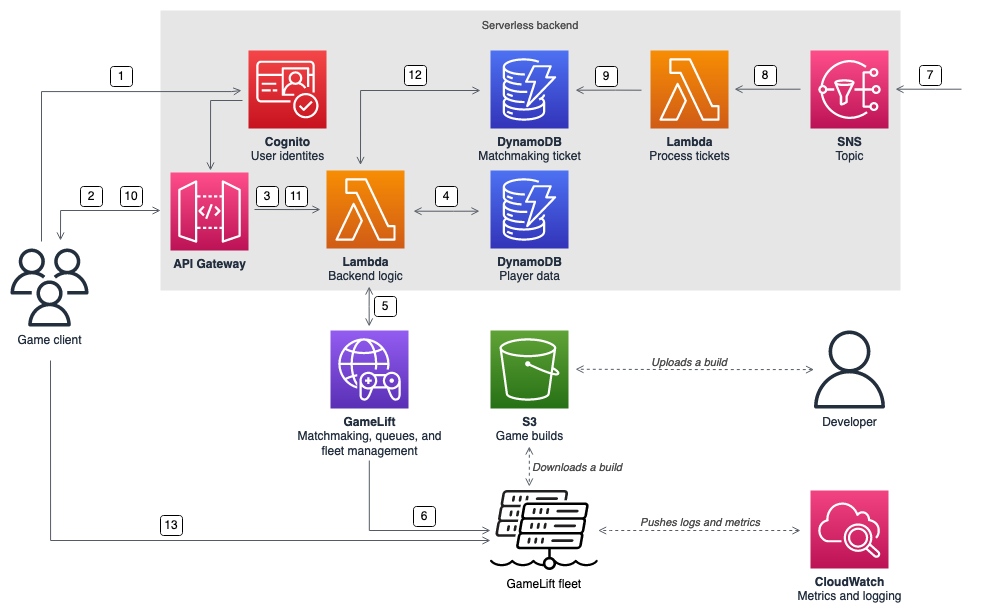

# Standalone game session servers with a serverless backend

Using a serverless client service architecture, the backend can view the status of
matchmaking tickets from a highly scalable database instead of by directly accessing the
Amazon GameLift Servers API.

The following diagram shows a serverless backend built with AWS services that
matches players into games running on Amazon GameLift Servers fleets. The following list provides a
description for each numbered callout in the diagram. To try out this example, see
[Multiplayer Session-based Game Hosting on AWS](https://github.com/aws-samples/aws-gamelift-and-serverless-backend-sample "https://github.com/aws-samples/aws-gamelift-and-serverless-backend-sample") on GitHub.

1. The game client requests an Amazon Cognito user identity from an Amazon Cognito identity
   pool.
2. The game client receives temporary access credentials and requests a game
   session through an Amazon API Gateway API.
3. API Gateway invokes an AWS Lambda function.
4. The Lambda function requests player data from an Amazon DynamoDB NoSQL table. The
   function provides the Amazon Cognito identity in the request context data.
5. The Lambda function requests a match through Amazon GameLift Servers FlexMatch matchmaking.
6. FlexMatch matches a group of players with suitable latency, and then requests a
   game session placement through a Amazon GameLift Servers queue. The queue has fleets with one or
   more AWS Region locations in it.
7. After Amazon GameLift Servers places the session on one of the fleet's locations, Amazon GameLift Servers sends an
   event notification to an Amazon Simple Notification Service (Amazon SNS) topic.
8. A Lambda function receives the Amazon SNS event and processes it.
9. If the matchmaking ticket is a `MatchmakingSucceeded` event, then
   the Lambda function writes the result, along with the port and IP address of the
   game server, to a DynamoDB table.
10. The game client makes a signed request to API Gateway to view the status of the
    matchmaking ticket on a specific interval.
11. API Gateway uses a Lambda function that checks the matchmaking ticket status.
12. The Lambda function checks the DynamoDB table to see if the ticket is successful.
    If it has succeeded, the function sends the game server's port and IP address,
    along with the player session ID, back to the client. If the ticket hasn't
    succeeded, the function sends a response verifying that the match isn't ready
    yet.
13. The game client connects to the game server using TCP or UDP by using the port
    and IP address that the backend service provides. The game client then sends the
    player session ID to the game server, which then validates the ID using the
    server SDK for Amazon GameLift Servers.
