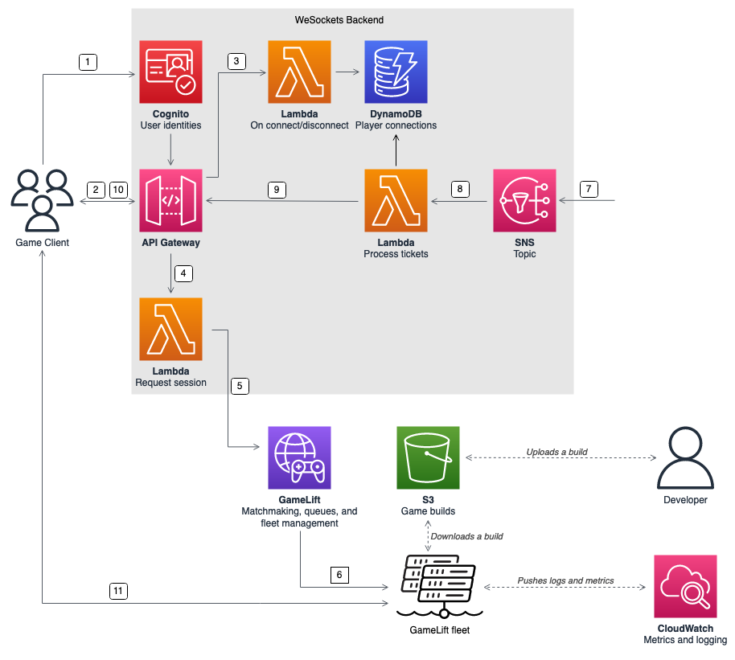

# Standalone game session servers with a WebSocket-based backend

Using an Amazon API Gateway WebSocket-based architecture, you can make matchmaking requests
with WebSockets and send push notifications for matchmaking completion using
server-initiated messages. This architecture improves performance by having two-way
communication between the client and the server.

For more information about using API Gateway WebSock APIs, see [Working with
WebSocket APIs](../../../apigateway/latest/developerguide/apigateway-websocket-api.md "../../../apigateway/latest/developerguide/apigateway-websocket-api.md").

The following diagram shows a WebSocket-based backend architecture that uses API Gateway and
other AWS services to match players into games running on Amazon GameLift Servers fleets. The following
list provides a description for each numbered callout in the diagram.

1. The game client requests an Amazon Cognito user identity from an Amazon Cognito identity
   pool.
2. The game client signs a WebSocket connection to an API Gateway API with the Amazon Cognito
   credentials.
3. API Gateway calls an AWS Lambda function on the connection. The function stores the
   connection information in an Amazon DynamoDB table.
4. The game client sends a message to a Lambda function, through the API Gateway API
   over the WebSocket connection, to request a session.
5. A Lambda function receives the message and then requests a match through Amazon GameLift Servers
   FlexMatch matchmaking.
6. After FlexMatch matches a group of players, FlexMatch requests a game session
   placement through an Amazon GameLift Servers queue.
7. After Amazon GameLift Servers places the session on one of the fleet's locations, Amazon GameLift Servers sends an
   event notification to an Amazon Simple Notification Service (Amazon SNS) topic.
8. A Lambda function receives the Amazon SNS event and processes it.
9. If the matchmaking ticket is a `MatchmakingSucceeded` event, then
   the Lambda function requests the correct player connection from DynamoDB. The
   function then sends a message to the game client through the API Gateway API over the
   WebSocket connection. In this architecture, the game client doesn't actively
   poll the status of matchmaking.
10. The game client receives the port and IP address of the game server, along
    with the player session ID, through the WebSocket connection.
11. The game client connects to the game server using TCP or UDP using the port
    and IP address that the backend service provides. The game client also sends the
    player session ID to the game server, which then validates the ID using the
    server SDK for Amazon GameLift Servers.
