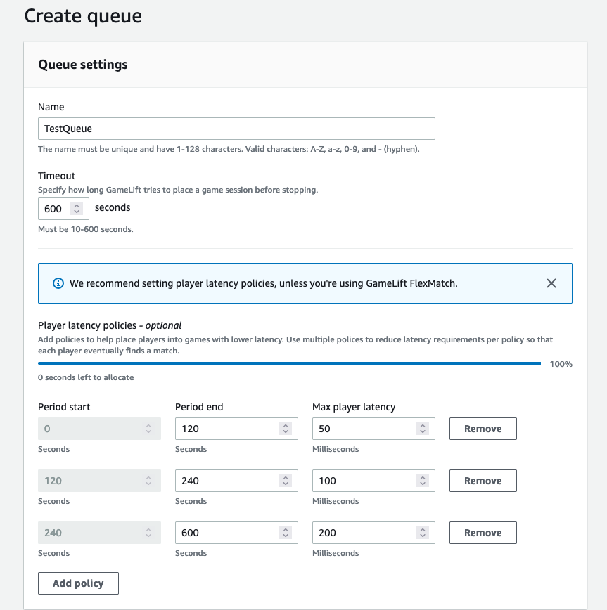

# Create a player latency policy

If your placement requests include player latency data, Amazon GameLift Servers finds game
sessions in locations with the lowest average latency for all players. Placing game
sessions based on average player latency prevents Amazon GameLift Servers from placing most players in
games with high latency. However, Amazon GameLift Servers still places players with extreme latency. To
accommodate these players, create player latency policies.

A player latency policy prevents Amazon GameLift Servers from placing a requested game session anywhere
that players in the request would experience latency over the maximum value. Player
latency policies can also prevent Amazon GameLift Servers from matching game session requests with higher
latency players.

###### Tip

To manage latency specific rules, such as requiring similar latency across all
players in a group, you can use [Amazon GameLift Servers FlexMatch](../flexmatchguide/match-intro.md "../flexmatchguide/match-intro.md") to
create latency-based matchmaking rules.

For example, consider this queue with a 5-minute timeout and the following player
latency policies:

1. Spend 120 seconds searching for a location where all player latencies are less
   than 50 milliseconds.
2. Spend 120 seconds searching for a location where all player latencies are less
   than 100 milliseconds.
3. Spend the remaining queue time until timeout searching for a location where
   all player latencies are less than 200 milliseconds.

