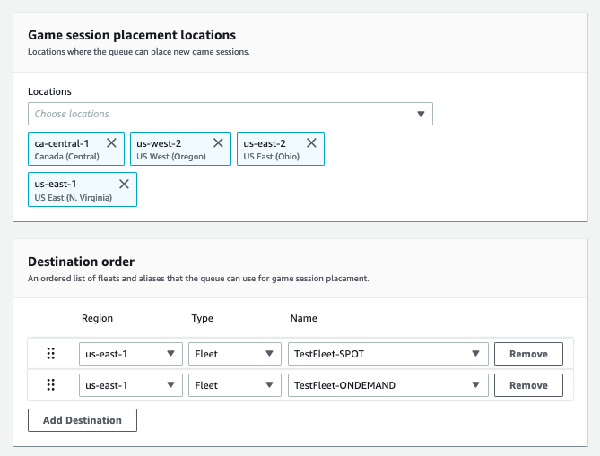
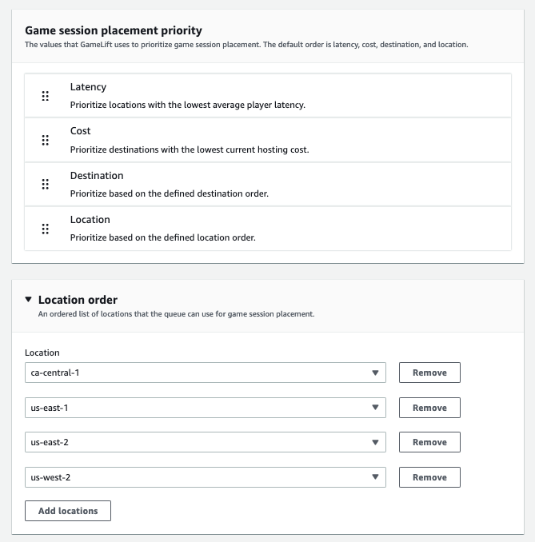

# Build a multi-location queue

We recommend a multi-location design for all queues. This design can improve placement
speed and hosting resiliency. A multi-location design is required to use player latency
data to put players into game sessions with minimal latency. If you're building
multi-location queues that use Spot Instance fleets, follow the instructions in [Tutorial: Create an Amazon GameLift Servers queue with Spot Instances](tutorial-queues-spot.md "tutorial-queues-spot.md").

One way to create a multi-location queue is to add a [multi-location fleet](gamelift-regions.md#gamelift-regions-hosting "gamelift-regions.md#gamelift-regions-hosting") to a queue. That way,
the queue can place game sessions in any of the fleet's locations. You can also add
other fleets with different configurations or home locations for redundancy. If you're
using a multi-location Spot Instance fleet, follow best practices and include an
On-Demand Instance fleet with the same locations.

The following example outlines the process of designing a basic multi-location queue.
In this example, we use two fleets: one Spot Instance fleet and one On-Demand Instance
fleet. Each fleet has the following AWS Regions for placement locations:
`us-east-1`, `us-east-2`, `ca-central-1`, and
`us-west-2`.

###### To create a basic multi-location queue with multi-location fleets

1. Choose a location to create the queue in. You can minimize request latency by
   placing the queue in a location near where you deployed the client service. In
   this example, we create the queue in `us-east-1`.
2. Create a new queue and add your multi-location fleets as queue destinations.
   The destination order determines how Amazon GameLift Servers places game sessions. In this
   example, we list the Spot Instance fleet first and the On-Demand Instance fleet
   second.
3. Define the queue's game session placement priority order. This order
   determines where the queue searches first for an available game server. In this
   example, we use the default priority order.
4. Define the location order. If you don't define the location order, Amazon GameLift Servers uses
   the locations in alphabetical order.

