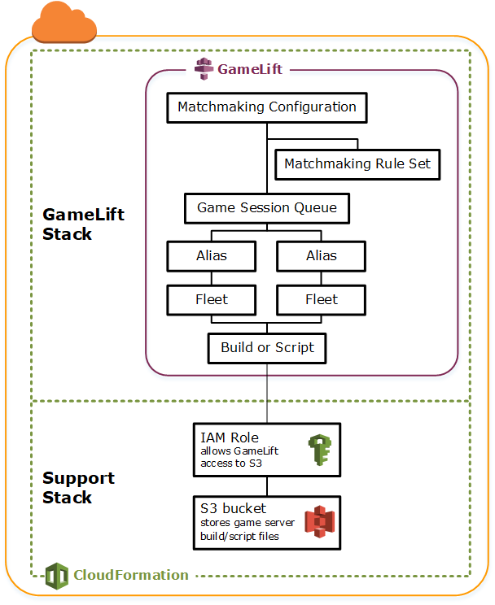
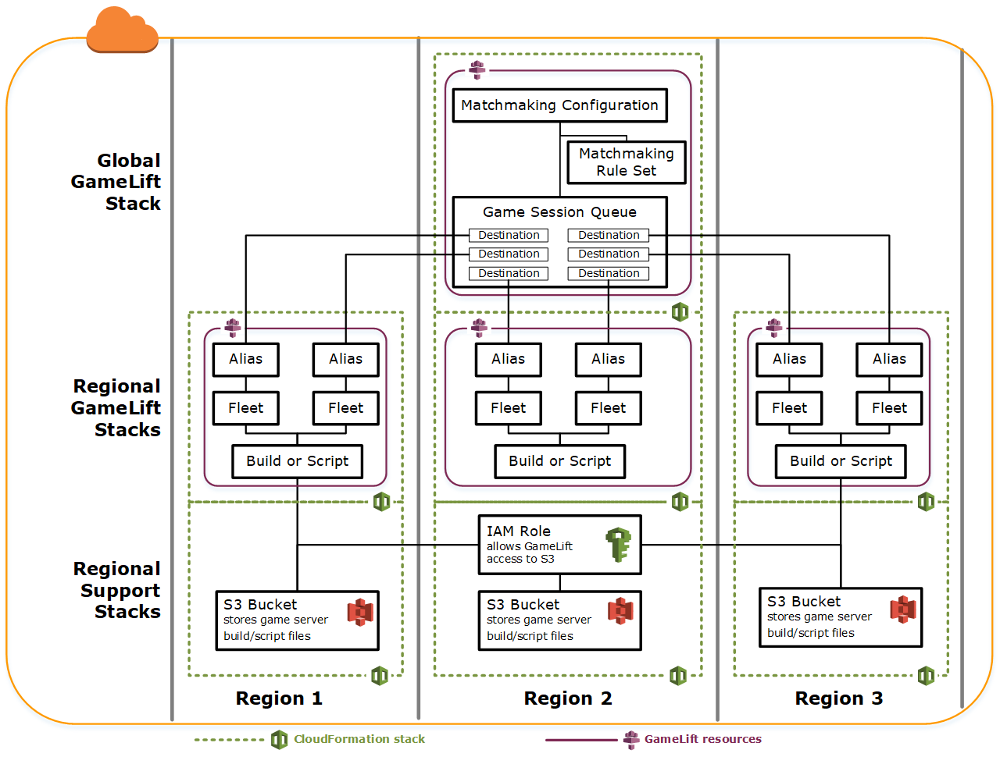
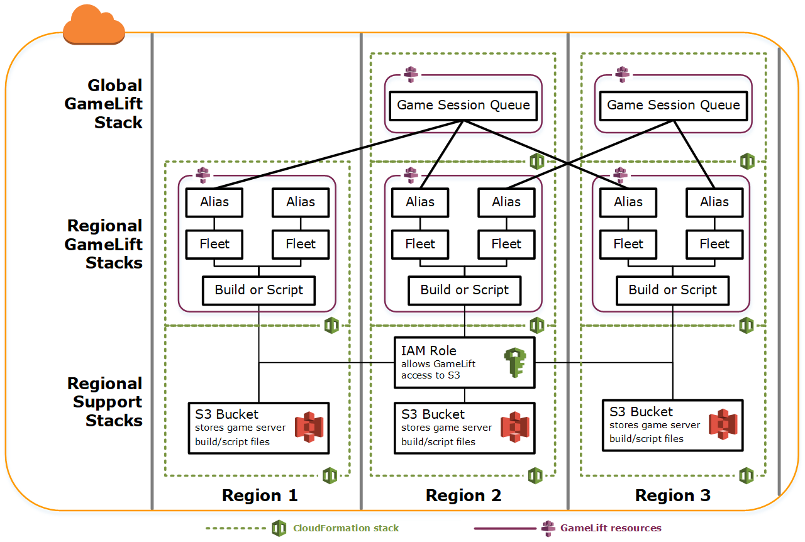
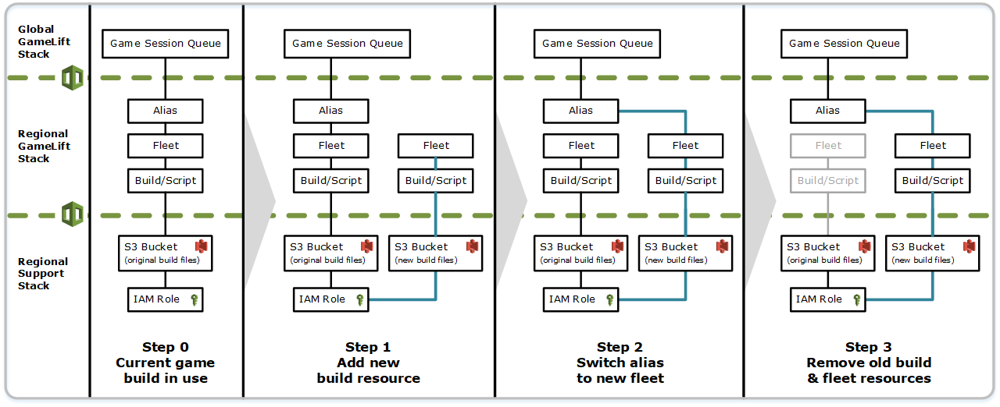

# Manage Amazon GameLift Servers hosting resources using AWS CloudFormation

You can use AWS CloudFormation to manage your Amazon GameLift Servers resources. In AWS CloudFormation, you create a template that
models each resource and then use the template to create your resources. To update
resources, you make the changes to your template and use AWS CloudFormation to implement the updates. You
can organize your resources into logical groups, called stacks and stack sets.

Using AWS CloudFormation to maintain your Amazon GameLift Servers hosting resources offers a more efficient way to manage
sets of AWS resources. You can use version control to track template changes over time and
coordinate updates made by multiple team members. You can also reuse templates. For example,
when deploying a game across multiple Regions, you might use the same template to create
identical resources in each Region. You can also use these templates to deploy the same sets
of resources in another partition.

For more information about AWS CloudFormation, see the [AWS CloudFormation User Guide](../../../AWSCloudFormation/latest/UserGuide.md "../../../AWSCloudFormation/latest/UserGuide.md"). To view template information for
Amazon GameLift Servers resources, see the [Amazon GameLift Servers resource
type reference](../../../AWSCloudFormation/latest/UserGuide/AWS_GameLift.md "../../../AWSCloudFormation/latest/UserGuide/AWS_GameLift.md").

## Best practices

For detailed guidance on using AWS CloudFormation, see the [AWS CloudFormation best practices](../../../AWSCloudFormation/latest/UserGuide/best-practices.md "../../../AWSCloudFormation/latest/UserGuide/best-practices.md") in the
_AWS CloudFormation User Guide_. In addition, these best
practices have special relevance with Amazon GameLift Servers.

- **Consistently manage your resources through
  AWS CloudFormation.** If you change your resources outside of AWS CloudFormation your
  resources will get out of sync with your resource templates.
- **Use AWS CloudFormation stacks and stack sets to efficiently manage
  multiple resources.**
  - Use stacks to manage groups of connected resources. For example, a
    stack that contains a build, a fleet that references the build, and an
    alias that references the fleet. If you update your template to replace
    a build, AWS CloudFormation replaces the fleets connected to the build. AWS CloudFormation then
    updates the existing aliases to point to the new fleets. For more
    information, see [Working with
    stacks](../../../AWSCloudFormation/latest/UserGuide/stacks.md "../../../AWSCloudFormation/latest/UserGuide/stacks.md") in the _AWS CloudFormation User Guide_.
  - Use AWS CloudFormation stack sets if you're deploying identical stacks across
    multiple regions or AWS accounts. For more information, see [Working with stack
    sets](../../../AWSCloudFormation/latest/UserGuide/what-is-cfnstacksets.md "../../../AWSCloudFormation/latest/UserGuide/what-is-cfnstacksets.md") in the _AWS CloudFormation User Guide_.

- **If you are using Spot Instances, include an On-Demand
  Fleet as a back-up.** We recommend setting up your templates with
  two fleets in each region, one fleet with Spot Instances, and one fleet with
  On-Demand Instances.
- **Group your location-specific resources and global
  resources into separate stacks when you are managing resources in multiple
  locations.**
- **Place your global resources close to the services that
  use it.** Resources like queues and matchmaking configurations tend
  to receive a high volume of requests from specific sources. By placing your
  resources close to the source of those requests, you minimize the request travel
  time and can improve overall performance.
- **Place your matchmaking configuration in the same Region
  as the game session queue that it uses.**
- **Create a separate alias for each fleet in the
  stack.**

## Using AWS CloudFormation stacks

We recommend the following structures to use when setting up AWS CloudFormation stacks for Amazon GameLift Servers
resources. Your optimal stack structure varies depending on if you are deploying your
game in one location or multiple locations.

### Stacks for a

single location

To manage Amazon GameLift Servers resources in a single location, we recommend a two-stack
structure:

- **Support stack** – This stack
  contains resources that your Amazon GameLift Servers resources depend on. At a minimum, this
  stack should include the S3 bucket where you store your custom game server
  or Realtime script files. The stack should also include an IAM role that
  gives Amazon GameLift Servers permission to retrieve your files from the S3 bucket when
  creating a Amazon GameLift Servers build or script resource. This stack might also contain
  other AWS resources that are used with your game, such as DynamoDB tables,
  Amazon Redshift clusters, and Lambda functions.
- **Amazon GameLift Servers stack** – This stack contains
  all of your Amazon GameLift Servers resources, including the build or script, a set of fleets,
  aliases, and game session queue. AWS CloudFormation creates a build or script resource
  with files stored in the S3 bucket location and deploys the build or script
  to one or more fleet resources. Each fleet should have a corresponding
  alias. The game session queue references some or all of the fleet aliases.
  If you are using FlexMatch for matchmaking, this stack also contains a
  matchmaking configuration and rule set.

The diagram below illustrates a two-stack structure for deploying resources in a
single AWS Region.

### Stacks for

multiple regions

When deploying your game in more than one Region, keep in mind how resources can
interact across Regions. Some resources, such as Amazon GameLift Servers fleets, can only reference
other resources in the same Region. Other resources, such as a Amazon GameLift Servers queue, are
Region agnostic. To manage Amazon GameLift Servers resources in multiple Regions, we recommend the
following structure.

- **Regional support stacks** – These
  stacks contain resources that your Amazon GameLift Servers resources depend on. This stack
  must include the S3 bucket where you store your custom game server or
  Realtime script files. It might also contain other AWS resources for your
  game, such as DynamoDB tables, Amazon Redshift clusters, and Lambda functions. Many of
  these resources are Region specific, so you must create them in every
  Region. Amazon GameLift Servers also needs an IAM role that allows access to these support
  resources. Because an IAM role is Region agnostic, you only need one role
  resource, placed in any Region and referenced in all of the other support
  stacks.
- **Regional Amazon GameLift Servers stacks** –This stack
  contains the Amazon GameLift Servers resources that must exist in each region where your game
  is being deployed, including the build or script, a set of fleets, and
  aliases. AWS CloudFormation creates a build or script resource with files in an S3 bucket
  location, and deploys the build or script to one or more fleet resources.
  Each fleet should have a corresponding alias. The game session queue
  references some or all of the fleet aliases. You can maintain one template
  to describe this type of stack and use it to create identical sets of
  resources in every Region.
- **Global Amazon GameLift Servers stack** – This stack
  contains your game session queue and matchmaking resources. These resources
  can be located in any Region and are usually placed in the same Region. The
  queue can reference fleets or aliases that are located in any Region. To
  place additional queues in different Regions, create additional global
  stacks.

The diagrams below illustrates a multistack structure for deploying resources in
several AWS Regions. The first diagram shows a structure for a single game session
queue. The second diagram shows a structure with multiple queues.

## Updating builds

Amazon GameLift Servers builds are immutable, as is the relationship between a build and a fleet. As a
result, when you update your hosting resources to use a new set of game build files, the
following need to happen:

- Create a new build using the new set of files (replacement).
- Create a new set of fleets to deploy the new game build (replacement).
- Redirect aliases to point to the new fleets (update with no interruption).

For more information, see [Update
behaviors of stack resources](../../../AWSCloudFormation/latest/UserGuide/using-cfn-updating-stacks-update-behaviors.md "../../../AWSCloudFormation/latest/UserGuide/using-cfn-updating-stacks-update-behaviors.md") in the _AWS CloudFormation User Guide_.

### Deploy build updates

automatically

When updating a stack containing related build, fleet and alias resources, the
default AWS CloudFormation behavior is to automatically perform these steps in sequence. You
trigger this update by first uploading the new build files to a new S3 location.
Then you modify your AWS CloudFormation build template to point to the new S3 location. When you
update your stack with the new S3 location, this triggers the following AWS CloudFormation
sequence:

1. Retrieves the new files from S3, validates the files, and creates a new
   Amazon GameLift Servers build.
2. Updates the build reference in the fleet template, which triggers new
   fleet creation.
3. After the new fleets are active, updates the fleet reference in the alias,
   which triggers the alias to update to target the new fleets.
4. Deletes the old fleet.
5. Deletes the old build.

If your game session queue uses fleet aliases, player traffic is automatically
switched to the new fleets as soon as the aliases are updated. The old fleets are
gradually drained of players as game sessions end. Auto scaling handles the task of
adding and removing instances from each set of fleets as player traffic fluctuates.
Alternatively, you can specify an initial desired instance count to quickly ramp up
for the switch and enable auto scaling later.

You can also have AWS CloudFormation retain resources instead of deleting them. For more
information, see [RetainResources](../../../AWSCloudFormation/latest/APIReference/API_DeleteStack.md "../../../AWSCloudFormation/latest/APIReference/API_DeleteStack.md") in the _AWS CloudFormation API Reference_.

### Deploy build updates

manually

If you want to have more control over when new fleets go live for players, you
have some options. You can choose to manage aliases manually using the Amazon GameLift Servers console
or the CLI. Alternatively, instead of updating your build template to replace the
build and fleets, you can add a second set of build and fleet definitions to your
template. When you update the template, AWS CloudFormation creates a second build resource and
corresponding fleets. Since the existing resources are not replaced, they are not
deleted, and the aliases remain pointing at original fleets.

The main advantage with this approach is that it gives you the flexibility. You
can create separate resources for the new version of your build, test the new
resources, and control when the new fleets go live to players. A potential drawback
is that it requires twice as many resources in each Region for a brief period of
time.

The following diagram illustrates this process.

### How rollbacks

work

When executing a resource update, if any step is not completed successfully, AWS CloudFormation
automatically initiates a rollback. This process reverses each step in sequence,
deleting the newly created resources.

If you need to manually trigger a rollback, change the build template's S3
location key back to the original location and update your stack. A new Amazon GameLift Servers build
and fleet are created, and the alias switches over to the new fleet after the fleet
is active. If you are managing aliases separately, you need to switch them to point
to the new fleets.

For more information about how to handle a rollback that fails or gets stuck, see
[Continue rolling back an update](../../../AWSCloudFormation/latest/UserGuide/using-cfn-updating-stacks-continueupdaterollback.md "../../../AWSCloudFormation/latest/UserGuide/using-cfn-updating-stacks-continueupdaterollback.md") in the _AWS CloudFormation User Guide_.
