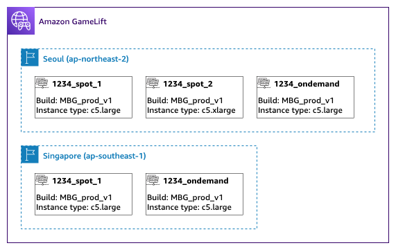
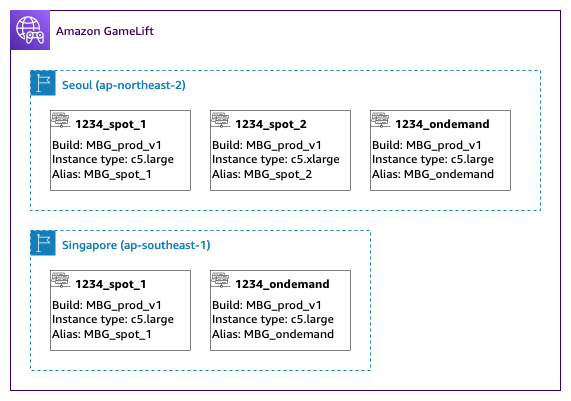
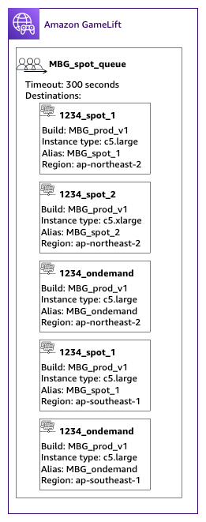
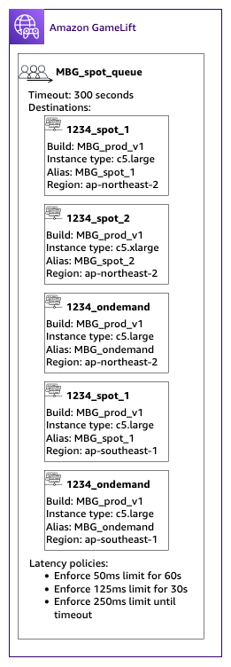

# Tutorial: Create an Amazon GameLift Servers queue with Spot Instances

**Introduction**

This tutorial describes how to set up game session placement for games
deployed on low-cost Spot fleets. Spot fleets require additional steps to
maintain continual game server availability for your players.

**Intended audience**

This tutorial is for game developers who want to use Spot fleets to host
custom game servers or Amazon GameLift Servers Realtime.

**What you'll learn**

- Define the group of players who your game session queue serves.
- Build a fleet infrastructure to support the game session queue's
  scope.
- Assign an alias to each fleet to abstract the fleet ID.
- Create a queue, add fleets, and prioritize where Amazon GameLift Servers places game
  sessions.
- Add player latency policies to help minimize latency issues.

**Prerequisites**

Before creating fleets and queues for game session placement, complete the
following tasks:

- Review [How Amazon GameLift Servers works](gamelift-howitworks.md "gamelift-howitworks.md").
- [Integrate you game server with Amazon GameLift Servers](integration-intro.md "integration-intro.md").
- [Upload your game
  server](../../../gamelift/latest/developerguide/gamelift-build-intro.md "../../../gamelift/latest/developerguide/gamelift-build-intro.md") build or Realtime script to Amazon GameLift Servers.
- [Plan your
  fleet configuration](fleets-design.md "fleets-design.md").

## Step 1: Define the scope of your

queue

In this tutorial, we design a queue for a game that has one game server build
variation. At launch, we're releasing the game in two locations: Asia Pacific (Seoul)
and Asia Pacific (Singapore). Because these locations are close to each other, latency
isn't an issue for our players.

For this example, there's one player segment, which means we create one queue. In the
future, when we release the game in North America, we can create a second queue that's
scoped for North American players.

For more information, see [Define a queue's scope](queues-design-scope.md "queues-design-scope.md").

## Step 2: Create Spot fleet

infrastructure

Create fleets in locations and with game server builds or scripts that fit the scope
that you defined in [Step 1: Define the scope of your
queue](#tutorial-queues-spot-segment "#tutorial-queues-spot-segment").

In this tutorial, we create a two location infrastructure with at least one Spot
fleet and one On-Demand fleet in each location. Every fleet deploys the same game
server build. In addition, we anticipate that player traffic will be heavier in the
Seoul location, so we add more Spot fleets there.

The following diagram shows the example Spot fleet infrastructure, with 3 fleets in
the ap-northeast-2 (Seoul) location and 2 fleets in the ap-southeast-1 (Singapore)
location. All instances in both fleets are using the build MBG_prod_V1. The fleet in
ap-northeast-2 contains the following fleet configurations: fleet 1234_spot_1 with an
instance type of c5.large, fleet 1234_spot_2 with an instance type of c5.xlarge, and
fleet 1234_ondemand with an instance type of c5.large. The fleet in ap-southeast-1
contains the following fleet configurations: fleet 1234_spot_1 with an instance type of
c5.large and fleet 1234_ondemand with an instance type of c5.large.

## Step 3: Assign aliases for each

fleet

Create a new alias for each fleet in your infrastructure. Aliases abstract fleet
identities, making periodic fleet replacement efficient. For more information about
creating aliases, see [Create an Amazon GameLift Servers alias](aliases-creating.md "aliases-creating.md").

Our fleet infrastructure has five fleets, so we create five aliases using the
routing strategy. We need three aliases in the Asia Pacific (Seoul) location, and
two aliases in the Asia Pacific (Singapore) location.

The following diagram shows the Spot fleet infrastructure described in step two with
aliases added to each fleet. Fleet 1234_spot_1 has the alias MBG_spot_1, Fleet
1234_spot_2 has the alias MBG_spot_2, and fleet 1234_ondemand has the alias
MBG_ondemand.

For more information, see [Build a multi-location queue](queues-design-multiregion.md "queues-design-multiregion.md").

## Step 4: Create a queue with

destinations

Create the game session queue and add your fleet destinations. For more information
about creating a queue, see [Create a game session queue](queues-creating.md "queues-creating.md").

When creating your queue:

- Set the default timeout to 10 minutes. Later, you can test how the queue
  timeout affects your players' wait times for getting into games.
- Skip the section on player latency policies for now. We'll cover this in the
  next step.
- Prioritize the fleets in your queue. When working with Spot fleets, we
  recommend either of the following approaches:
  - If your infrastructure uses a primary location with fleets in a second
    location for backup, prioritize fleets first by location then by fleet
    type.
  - If your infrastructure uses multiple locations equally, prioritize
    fleets by fleet type, placing Spot fleets at the top of the
    queue.

For this tutorial, we create a new queue with the name
`MBG_spot_queue`, and add the aliases of all five of our
fleets. We then prioritize placements first by location and second by fleet type.

Based on this configuration, this queue always attempts to place new game sessions
into a Spot fleet in Seoul. When those fleets are full, the queue uses available
capacity on the Seoul On-Demand fleet as a backup. If all three Seoul fleets are
unavailable, Amazon GameLift Servers places game sessions on the Singapore fleets.

The following diagram shows a queue with a timeout of 300 seconds and prioritized
destinations. The destinations are in the following order: 1234_spot_1 in
ap-northeast-2, 1234_spot_2 in ap-northeast-2, 1234_ondemand in ap-northeast-2,
1234_spot_1 in ap-southeast-1, and 1234_ondemand in ap-southeast-1.

## Step 5: Add latency limits to the

queue

Our game includes latency information in game session placement requests. We also
have a player party feature that creates a game session for a group of players. We
can have players wait a little longer to get into games with the ideal gameplay
experience. Our game tests show the following observations:

- Latency under 50 milliseconds is ideal.
- The game is unplayable at latencies over 250 milliseconds.
- Players become impatient at about one minute.

For our queue, with a 300-second timeout, we add policy statements limiting the
allowable latency. The policy statements gradually allow larger latency values up to
250-millisecond latency.

With this policy, our queue looks for placements with ideal latency (under 50
milliseconds) for the first minute, and then relaxes the limit. The queue doesn't make
placements where player latency is 250 milliseconds or higher.

The following diagram shows the queue from step four with player latency policies
added. The player latency policies state, enforce 50ms limit for 60s, enforce 125ms
limit for 30s, and enforce 250ms limit until timeout.

## Summary

Congratulations! Here are the things you accomplished:

- You have a game session queue scoped for a segment of your player
  population.
- Your queue uses Spot fleets effectively and is resilient when Spot
  interruptions happen.
- Your queue prioritizes the fleets for the top player experience.
- The queue has latency limits to protect players from bad gameplay
  experiences.

You can now use the queue to place game sessions for the players it serves. When
making game session placement requests for these players, reference this game session
queue name in the request. For more information about making game session placement
requests, see [Create game sessions](gamelift-sdk-client-api.md#gamelift-sdk-client-api-create "gamelift-sdk-client-api.md#gamelift-sdk-client-api-create"), or [Integrating a game client for Amazon GameLift Servers Realtime](realtime-client.md "realtime-client.md").

Next steps:

- [Design your own
  queue](queues-design.md "queues-design.md").
- [Create a
  queue](queues-creating.md "queues-creating.md").
- [Use a queue with your game
  client](gamelift-sdk-client-api.md#gamelift-sdk-client-api-create "gamelift-sdk-client-api.md#gamelift-sdk-client-api-create").
