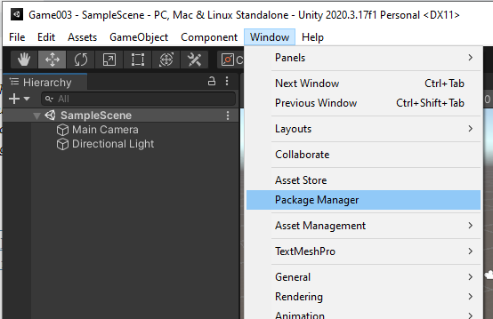
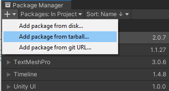
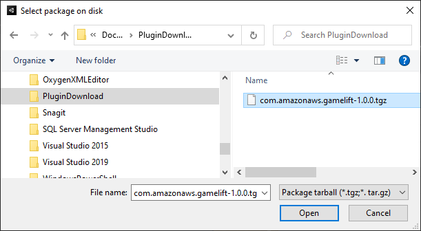
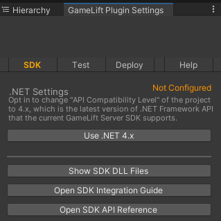
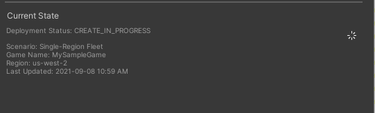
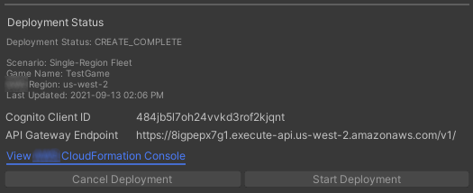
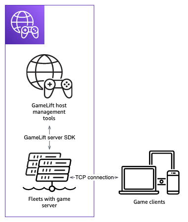

# Amazon GameLift Servers plugin for Unity (server SDK 4.x)

###### Note

This topic provides information for an earlier version of the Amazon GameLift Servers plugin for Unity. Version 1.0.0
(released in 2021) uses the server SDK for Amazon GameLift Servers 4.x or earlier. For documentation on the
latest version of the plugin, which uses server SDK 5.x and supports Amazon GameLift Servers Anywhere, see
[Amazon GameLift Servers plugin for Unity (server SDK 5.x)](unity-plug-in.md "unity-plug-in.md").

Amazon GameLift Servers provides tools for preparing your multiplayer game servers to run on
Amazon GameLift Servers. The Amazon GameLift Servers plugin for Unity makes it easier to integrate Amazon GameLift Servers into
your Unity game projects and deploy Amazon GameLift Servers resources for cloud hosting.
Use the plugin for Unity to access Amazon GameLift Servers APIs and deploy AWS CloudFormation
templates for common gaming scenarios.

After you've set up the plugin, you can try out the [Amazon GameLift Servers Unity sample](https://github.com/aws-samples/amazon-gamelift-unity "https://github.com/aws-samples/amazon-gamelift-unity") on
GitHub.

###### Topics

- [Integrate Amazon GameLift Servers with a Unity game server
  project](integration-unity-server-sdk4.md "integration-unity-server-sdk4.md")
- [Integrate Amazon GameLift Servers with a Unity game client
  project](integration-unity-client-sdk4.md "integration-unity-client-sdk4.md")
- [Install and set up the plugin](#unity-plug-in-sdk4-install "#unity-plug-in-sdk4-install")
- [Test your game locally](#unity-plug-in-sdk4-test "#unity-plug-in-sdk4-test")
- [Deploy a scenario](#unity-plug-in-sdk4-scenario "#unity-plug-in-sdk4-scenario")
- [Integrate games with Amazon GameLift Servers in Unity](#unity-plug-in-sdk4-integration-intro "#unity-plug-in-sdk4-integration-intro")
- [Import and run a sample game](#unity-plug-in-sdk4-sample-game "#unity-plug-in-sdk4-sample-game")

## Install and set up the plugin

###### Note

This topic refers to Amazon GameLift Servers plugin for Unity version 1.0.0,
which uses server SDK 4.x or earlier.

This section describes how to download, install, and set up the Amazon GameLift Servers plugin for Unity, version
1.0.0.

###### Prerequisites

- Unity for Windows 2019.4 LTS, Windows 2020.3 LTS, or Unity for MacOS
- Current version of Java
- Current version of .NET 4.x

###### To download and install the plugin for Unity

1. Download the Amazon GameLift Servers plugin for Unity. You can find the latest version on the [Amazon GameLift Servers plugin for Unity repository](https://github.com/aws/amazon-gamelift-plugin-unity/releases "https://github.com/aws/amazon-gamelift-plugin-unity/releases") page. Under the [latest
   release](https://github.com/aws/amazon-gamelift-plugin-unity/releases "https://github.com/aws/amazon-gamelift-plugin-unity/releases"), choose **Assets**, and then download the
   `com.amazonaws.gamelift-*version*.tgz`
   file.
2. Launch Unity and choose a project.
3. In the top navigation bar, under **Window** choose
   **Package Manager**:

 4. Under the **Package Manager** tab choose
**+**, and then choose **Add package from
tarball...**:

 5. In the **Select packages on disk** window, navigate to the
`com.amazonaws.gamelift` folder, choose the file
`com.amazonaws.gamelift-*version*.tgz` , and then choose **Open**:

 6. After Unity has loaded the plug-in, **Amazon GameLift Servers** appears as a
new item in the Unity menu. It may take a few minutes to install and recompile
scripts. The **Amazon GameLift Servers Plugin Settings** tab automatically
opens.

 7. In the **SDK** pane, choose **Use .NET
4.x**.

When configured, the status changes from **Not Configured**
to **Configured**.

## Test your game locally

###### Note

This topic refers to Amazon GameLift Servers plugin for Unity version 1.0.0,
which uses server SDK 4.x or earlier.

Use Amazon GameLift Servers Local to run Amazon GameLift Servers on your local device. You can use Amazon GameLift Servers Local to
verify code changes in seconds, without a network connection.

### Configure local testing

1. In the plugin for Unity window, choose the **Test** tab.
2. In the **Test** pane, choose **Download Amazon GameLift Servers
   Local**. The plugin for Unity opens a browser window and downloads the
   `GameLift_06_03_2021.zip` file to your downloads
   folder.

The download includes the C# Server SDK, .NET source files, and a .NET
component compatible with Unity. 3. Unzip the downloaded file `GameLift_06_03_2021.zip`. 4. In the **Amazon GameLift Servers Plugin Settings** window, choose
**Amazon GameLift Servers Local Path**, navigate to the unzipped folder,
choose the file `GameLiftLocal.jar`, and then choose
**Open**.

When configured, local testing status changes from **Not
Configured** to **Configured**. 5. Verify the status of the JRE. If the status is **Not
Configured**, choose **Download JRE** and
install the recommended Java version.

After you install and configure the Java environment, the status changes
to **Configured**.

### Run your local game

1. In the plugin for Unity tab, choose the **Test** tab.
2. In the **Test** pane, choose **Open Local Test
   UI**.
3. In the **Local Testing** window, specify a
   **Server executable path**. Select
   **...** to select the path and executable name of your
   server application.
4. In the **Local Testing** window, specify a **GL
   Local port**.
5. Choose **Deploy & Run** to deploy and run the
   server.
6. To stop your game server, choose **Stop** or close the
   game server windows.

## Deploy a scenario

###### Note

This topic refers to Amazon GameLift Servers plugin for Unity version 1.0.0,
which uses server SDK 4.x or earlier.

A scenario uses an AWS CloudFormation template to create the resources you need to deploy a cloud
hosting solution for your game. This section describes the scenarios Amazon GameLift Servers provides and
how to use them.

###### Prerequisites

To deploy the scenario, you need an IAM role for the Amazon GameLift Servers service. For
information on how to create a role for Amazon GameLift Servers, see [Set up an AWS account](setting-up-aws-login.md "setting-up-aws-login.md").

Each scenario requires permissions to the following resources:

- Amazon GameLift Servers
- Amazon S3
- AWS CloudFormation
- API Gateway
- AWS Lambda
- AWS WAFV2
- Amazon Cognito

### Scenarios

###### Note

This topic refers to Amazon GameLift Servers plugin for Unity version 1.0.0,
which uses server SDK 4.x or earlier.

The Amazon GameLift Servers Plug-in for Unity includes the following scenarios:

###### Auth only

This scenario creates a game backend service that performs player authentication
without game server capability. The template creates the following resources in your
account:

- An Amazon Cognito user pool to store player authentication information.
- An Amazon API Gateway REST endpoint-backed AWS Lambda handler that starts games and
  views game connection information.

###### Single-Region fleet

This scenario creates a game backend service with a single Amazon GameLift Servers fleet. It creates
the following resources:

- An Amazon Cognito user pool for a player to authenticate and start a game.
- An AWS Lambda handler to search for an existing game session with an open
  player slot on the fleet. If it can't find a open slot, it creates a new game
  session.

###### Multi-Region fleet with a queue and custom matchmaker

This scenario forms matches by using Amazon GameLift Servers queues and a custom matchmaker to group
together the oldest players in the waiting pool. It creates the following
resources:

- An Amazon Simple Notification Service topic that Amazon GameLift Servers publishes messages to. For more information on
  SNS topics and notifications, see [Set up event notification for game session
  placement](queue-notification.md "queue-notification.md").
- A Lambda function that's invoked by the message that communicates placement and
  game connection details.
- An Amazon DynamoDB table to store placement and game connection details.
  `GetGameConnection` calls read from this table and return the
  connection information to the game client.

###### Spot fleets with a queue and custom matchmaker

This scenario forms matches by using Amazon GameLift Servers queues and a custom matchmaker and
configures three fleets. It creates the following resources:

- Two Spot fleets that contain different instance types to provide durability
  for Spot unavailability.
- An On-Demand fleet that acts as a backup for the other Spot fleets. For more
  information on designing your fleets, see [Customize your Amazon GameLift Servers EC2 managed fleets](fleets-design.md "fleets-design.md").
- A Amazon GameLift Servers queue to keep server availability high and cost low. For more
  information and best practices about queues, see [Customize a game session queue](queues-design.md "queues-design.md").

###### FlexMatch

This scenario uses FlexMatch, a managed matchmaking service, to match game players
together. For more information about FlexMatch, see [What is Amazon GameLift Servers FlexMatch](../flexmatchguide/match-intro.md "../flexmatchguide/match-intro.md"). This scenario creates the following
resources:

- A Lambda function to create a matchmaking ticket after it receives
  `StartGame` requests.
- A separate Lambda function to listen to FlexMatch match events.

To avoid unnecessary charges on your AWS account, remove the resources created by
each scenario after you are done using them. Delete the corresponding AWS CloudFormation stack.

### Update AWS

credentials

###### Note

This topic refers to Amazon GameLift Servers plugin for Unity version 1.0.0,
which uses server SDK 4.x or earlier.

The Amazon GameLift Servers plugin for Unity requires security credentials to deploy a scenario. You can
either create new credentials or use existing credentials.

For more information about configuring credentials, see [Understanding and getting your AWS credentials](../../../general/latest/gr/aws-sec-cred-types.md "../../../general/latest/gr/aws-sec-cred-types.md").

###### To update AWS credentials

1. In Unity, in the plugin for Unity tab, choose the **Deploy**
   tab.
2. In the **Deploy** pane, choose **AWS
   Credentials**.
3. You can create new AWS credentials or choose existing
   credentials.
   - To create credentials, choose **Create new credentials
     profile**, and then specify the **New Profile
     Name**, **AWS Access Key ID**,
     **AWS Secret Key**, and
     **AWS Region**.
   - To choose existing credentials, choose **Choose existing
     credentials profile** and then select a profile name
     and **AWS Region**.

4. In the **Update AWS Credentials** window, choose
   **Update Credentials Profile**.

### Update account bootstrap

###### Note

This topic refers to Amazon GameLift Servers plugin for Unity version 1.0.0,
which uses server SDK 4.x or earlier.

The bootstrap location is an Amazon S3 bucket used during deployment. It's used to
store game server assets and other dependencies. The AWS Region you choose for the
bucket must be the same Region you will use for the scenario deployment.

For more information about Amazon S3 buckets, see [Creating, configuring, and working with Amazon Simple Storage Service buckets](../../../AmazonS3/latest/userguide/creating-buckets-s3.md "../../../AmazonS3/latest/userguide/creating-buckets-s3.md").

###### To update the account bootstrap location

1. In Unity, in the plugin for Unity tab, choose the **Deploy**
   tab.
2. In the **Deploy** pane, choose **Update Account
   Bootstrap**.
3. In the **Account Bootstrapping** window, you choose an
   existing Amazon S3 bucket or create a new Amazon S3 bucket:
   - To choose an existing bucket, choose **Choose existing
     Amazon S3 bucket** and **Update** to save
     your selection.
   - Choose **Create new Amazon S3 bucket** to create a new
     Amazon Simple Storage Service bucket, then choose a **Policy**. The
     policy specifies when the Amazon S3 bucket will be expire. Choose
     **Create** to create the bucket.

### Deploy a game scenario

###### Note

This topic refers to Amazon GameLift Servers plugin for Unity version 1.0.0,
which uses server SDK 4.x or earlier.

You can use a scenario to test your game with Amazon GameLift Servers. Each scenario uses a AWS CloudFormation
template to create a stack with the required resources. Most of the scenarios
require a game server executable and build path. When you deploy the scenario, Amazon GameLift Servers
copies game assets to the bootstrap location as part of deployment.

You must configure AWS credentials and an AWS account bootstrap to deploy a
scenario.

###### To deploy a scenario

1. In Unity, in the plugin for Unity tab, choose the **Deploy**
   tab.
2. In the **Deploy** pane, choose **Open Deployment
   UI**.
3. In the **Deployment** window, choose a scenario.
4. Enter a **Game Name**. It must be unique. The game name
   is part of the AWS CloudFormation stack name when you deploy the scenario.
5. Choose the **Game Server Build Folder Path**. The build
   folder path points to the folder containing the server executable and
   dependencies.
6. Choose the **Game Server Build .exe File Path**. The
   build executable file path points to the game server executable.
7. Choose **Start Deployment** to begin deploying a
   scenario. You can follow the status of the update in the
   **Deployment** window under **Current
   State**.Scenarios can take several minutes to deploy.

 8. When the scenario completes deployment, the **Current
State** updates to include the **Cognito Client
ID** and **API Gateway Endpoint** that you can
copy and paste into the game.

 9. To update game settings, on the Unity menu, choose **Go To Client
Connection Settings**. This displays an
**Inspector** tab on the right side of the Unity
screen. 10. Deselect **Local Testing Mode**. 11. Enter the **API Gateway Endpoint** and the **Coginito
Client ID**. Choose the same AWS Region you used for the
scenario deployment. You can then rebuild and run the game client using the
deployed scenario resources.

### Deleting resources created by the

scenario

###### Note

This topic refers to Amazon GameLift Servers plugin for Unity version 1.0.0,
which uses server SDK 4.x or earlier.

To delete the resources created for the scenario, delete the corresponding AWS CloudFormation
stack.

###### To delete resources created by the scenario

1. In the Amazon GameLift Servers plugin for Unity **Deployment** window, select
   **View AWS CloudFormation Console** to open the AWS CloudFormation console.
2. In the AWS CloudFormation console, choose **Stacks**, and then choose
   the stack that includes the game name specified during deployment.
3. Choose **Delete** to delete the stack. It may take a few
   minutes to delete a stack. After AWS CloudFormation deletes the stack used by the
   scenario, its status changes to `ROLLBACK_COMPLETE`.

## Integrate games with Amazon GameLift Servers in Unity

###### Note

This topic refers to Amazon GameLift Servers plugin for Unity version 1.0.0,
which uses server SDK 4.x or earlier.

Integrate your Unity game with Amazon GameLift Servers by completing the following
tasks:

- [Integrate Amazon GameLift Servers with a Unity game server
  project](integration-unity-server-sdk4.md "integration-unity-server-sdk4.md")
- [Integrate Amazon GameLift Servers with a Unity game client
  project](integration-unity-client-sdk4.md "integration-unity-client-sdk4.md")

The following diagram shows an example flow of integrating a game. In the diagram, a
fleet with the game server is deployed to Amazon GameLift Servers. The game client communicates with the
game server, which communicates with Amazon GameLift Servers.



## Import and run a sample game

###### Note

This topic refers to Amazon GameLift Servers plugin for Unity version 1.0.0,
which uses server SDK 4.x or earlier.

The Amazon GameLift Servers plugin for Unity includes a sample game you can use to explore the basics of
integrating your game with Amazon GameLift Servers. In this section, you build the game client and game
server and then test locally using Amazon GameLift Servers Local.

### Prerequisites

- [Set up an AWS account](setting-up-aws-login.md "setting-up-aws-login.md")
- [Install and set up the plugin](#unity-plug-in-sdk4-install "#unity-plug-in-sdk4-install")

### Build and run the sample game server

###### Note

This topic refers to Amazon GameLift Servers plugin for Unity version 1.0.0,
which uses server SDK 4.x or earlier.

Set up the game server files of the sample game.

1. In Unity, on the menu, choose **Amazon GameLift Servers**, and then choose
   **Import Sample Game**.
2. In the **Import Sample Game** window, choose
   **Import** to import the game, its assets and
   dependencies.
3. Build the game server. In Unity, on the menu, choose
   **Amazon GameLift Servers**, and then choose **Apply Windows
   Sample Server Build Settings** or **Apply MacOS Sample
   Server Build Settings**. After you configure the game server
   settings, Unity recompiles the assets.
4. In Unity, on the menu, choose **File**, and then choose
   **Build**. Choose **Server Build**,
   choose **Build**, and then choose a build folder
   specifically for server files.

Unity builds the sample game server, placing the executable and required
assets in the specified build folder.

### Build and run the sample game client

###### Note

This topic refers to Amazon GameLift Servers plugin for Unity version 1.0.0,
which uses server SDK 4.x or earlier.

Set up the game client files of the sample game.

1. In Unity, on the menu, choose **Amazon GameLift Servers**, and then choose
   **Apply Windows Sample Client Build Settings** or
   **Apply MacOS Sample Client Build Settings**. After the
   game client settings are configured, Unity will recompile assets.
2. In Unity, on the menu, select **Go To Client Settings**.
   This will display an **Inspector** tab on the right side of
   the Unity screen. In the **Amazon GameLift Servers Client Settings** tab,
   select **Local Testing Mode**.
3. Build the game client. In Unity, on the menu, choose
   **File**. Confirm **Server Build** is
   not checked, choose **Build**, and then select a build
   folder specifically for client files.

Unity builds the sample game client, placing the executable and required
assets in the specified client build folder. 4. You've no built the game server and client. In the next steps, you run the
game and see how it interacts with Amazon GameLift Servers.

### Test the sample game locally

###### Note

This topic refers to Amazon GameLift Servers plugin for Unity version 1.0.0,
which uses server SDK 4.x or earlier.

Run the sample game you imported using Amazon GameLift Servers Local.

1. Launch the game server. In Unity, in the plugin for Unity tab, choose the
   **Deploy** tab.
2. In the **Test** pane, choose **Open Local Test
   UI**.
3. In the **Local Testing** window, specify a **Game
   Server .exe File Path**. The path must include the executable
   name. For example,
   `C:/MyGame/GameServer/MyGameServer.exe`.
4. Choose **Deploy and Run**. The plugin for Unity launches the
   game server and opens a Amazon GameLift Servers Local log window. The windows contains log
   messages including messages sent between the game server and Amazon GameLift Servers Local.
5. Launch the game client. Find the build location with the sample game
   client and choose the executable file .
6. In the **Amazon GameLift Servers Sample Game**, provide an email and
   password and then choose **Log In**. The email and password
   aren't validated or used.
7. In the **Amazon GameLift Servers Sample Game**, choose
   **Start**. The game client looks for a game session. If
   it can't find a session, it creates one. The game client then starts the
   game session. You can see game activity in the logs.

```
...
2021-09-15T19:55:3495 PID:20728 Log :) GAMELIFT AWAKE
2021-09-15T19:55:3512 PID:20728 Log :) I AM SERVER
2021-09-15T19:55:3514 PID:20728 Log :) GAMELIFT StartServer at port 33430.
2021-09-15T19:55:3514 PID:20728 Log :) SDK VERSION: 4.0.2
2021-09-15T19:55:3556 PID:20728 Log :) SERVER IS IN A GAMELIFT FLEET
2021-09-15T19:55:3577 PID:20728 Log :) PROCESSREADY SUCCESS.
2021-09-15T19:55:3577 PID:20728 Log :) GAMELIFT HEALTH CHECK REQUESTED (HEALTHY)
...
2021-09-15T19:55:3634 PID:20728 Log :) GAMELOGIC AWAKE
2021-09-15T19:55:3635 PID:20728 Log :) GAMELOGIC START
2021-09-15T19:55:3636 PID:20728 Log :) LISTENING ON PORT 33430
2021-09-15T19:55:3636 PID:20728 Log SERVER: Frame: 0 HELLO WORLD!
...
2021-09-15T19:56:2464 PID:20728 Log :) GAMELIFT SESSION REQUESTED
2021-09-15T19:56:2468 PID:20728 Log :) GAME SESSION ACTIVATED
2021-09-15T19:56:3578 PID:20728 Log :) GAMELIFT HEALTH CHECK REQUESTED (HEALTHY)
2021-09-15T19:57:3584 PID:20728 Log :) GAMELIFT HEALTH CHECK REQUESTED (HEALTHY)
2021-09-15T19:58:0334 PID:20728 Log SERVER: Frame: 8695 Connection accepted: playerIdx 0 joined
2021-09-15T19:58:0335 PID:20728 Log SERVER: Frame: 8696 Connection accepted: playerIdx 1 joined
2021-09-15T19:58:0338 PID:20728 Log SERVER: Frame: 8697 Msg rcvd from playerIdx 0 Msg: CONNECT: server IP localhost
2021-09-15T19:58:0338 PID:20728 Log SERVER: Frame: 8697 Msg rcvd from player 0:CONNECT: server IP localhost
2021-09-15T19:58:0339 PID:20728 Log SERVER: Frame: 8697 CONNECT: player index 0
2021-09-15T19:58:0339 PID:20728 Log SERVER: Frame: 8697 Msg rcvd from playerIdx 1 Msg: CONNECT: server IP localhost
2021-09-15T19:58:0339 PID:20728 Log SERVER: Frame: 8697 Msg rcvd from player 1:CONNECT: server IP localhost
2021-09-15T19:58:0339 PID:20728 Log SERVER: Frame: 8697 CONNECT: player index 1
```

```
12:55:26,000  INFO || - [SocketIOServer] main - Session store / pubsub factory used: MemoryStoreFactory (local session store only)
12:55:28,092  WARN || - [ServerBootstrap] main - Unknown channel option 'SO_LINGER' for channel '[id: 0xe23d0a14]'
12:55:28,101  INFO || - [SocketIOServer] nioEventLoopGroup-2-1 - SocketIO server started at port: 5757
12:55:28,101  INFO || - [SDKConnection] main - GameLift SDK server (communicates with your game server) has started on http://localhost:5757
12:55:28,120  INFO || - [SdkWebSocketServer] WebSocketSelector-20 - WebSocket Server started on address localhost/127.0.0.1:5759
12:55:28,166  INFO || - [StandAloneServer] main - GameLift Client server (listens for GameLift client APIs) has started on http://localhost:8080
12:55:28,179  INFO || - [StandAloneServer] main - GameLift server sdk http listener has started on http://localhost:5758
12:55:35,453  INFO || - [SdkWebSocketServer] WebSocketWorker-12 - onOpen socket: /?pID=20728&sdkVersion=4.0.2&sdkLanguage=CSharp and handshake /?pID=20728&sdkVersion=4.0.2&sdkLanguage=CSharp
12:55:35,551  INFO || - [HostProcessManager] WebSocketWorker-12 - client connected with pID 20728
12:55:35,718  INFO || - [GameLiftSdkHttpHandler] GameLiftSdkHttpHandler-thread-0 - GameLift API to use: ProcessReady for pId 20728
12:55:35,718  INFO || - [ProcessReadyHandler] GameLiftSdkHttpHandler-thread-0 - Received API call for processReady from 20728
12:55:35,738  INFO || - [ProcessReadyHandler] GameLiftSdkHttpHandler-thread-0 - onProcessReady data: port: 33430
 12:55:35,739  INFO || - [HostProcessManager] GameLiftSdkHttpHandler-thread-0 - Registered new process with pId 20728
12:55:35,789  INFO || - [GameLiftSdkHttpHandler] GameLiftSdkHttpHandler-thread-0 - GameLift API to use: ReportHealth for pId 20728
12:55:35,790  INFO || - [ReportHealthHandler] GameLiftSdkHttpHandler-thread-0 - Received API call for ReportHealth from 20728
12:55:35,794  INFO || - [ReportHealthHandler] GameLiftSdkHttpHandler-thread-0 - ReportHealth data: healthStatus: true
 12:56:24,098  INFO || - [GameLiftHttpHandler] Thread-12 - API to use: GameLift.DescribeGameSessions
12:56:24,119  INFO || - [DescribeGameSessionsDispatcher] Thread-12 - Received API call to describe game sessions with input: {"FleetId":"fleet-123"}
12:56:24,241  INFO || - [GameLiftHttpHandler] Thread-12 - API to use: GameLift.CreateGameSession
12:56:24,242  INFO || - [CreateGameSessionDispatcher] Thread-12 - Received API call to create game session with input: {"FleetId":"fleet-123","MaximumPlayerSessionCount":4}
12:56:24,265  INFO || - [HostProcessManager] Thread-12 - Reserved process: 20728 for gameSession: arn:aws:gamelift:local::gamesession/fleet-123/gsess-59f6cc44-4361-42f5-95b5-fdb5825c0f3d
12:56:24,266  INFO || - [WebSocketInvoker] Thread-12 - StartGameSessionRequest: gameSessionId=arn:aws:gamelift:local::gamesession/fleet-123/gsess-59f6cc44-4361-42f5-95b5-fdb5825c0f3d, fleetId=fleet-123, gameSessionName=null, maxPlayers=4, properties=[], ipAddress=127.0.0.1, port=33430, gameSessionData?=false, matchmakerData?=false, dnsName=localhost
12:56:24,564  INFO || - [CreateGameSessionDispatcher] Thread-12 - GameSession with id: arn:aws:gamelift:local::gamesession/fleet-123/gsess-59f6cc44-4361-42f5-95b5-fdb5825c0f3d created
12:56:24,585  INFO || - [GameLiftHttpHandler] Thread-12 - API to use: GameLift.DescribeGameSessions
12:56:24,585  INFO || - [DescribeGameSessionsDispatcher] Thread-12 - Received API call to describe game sessions with input: {"FleetId":"fleet-123"}
12:56:24,660  INFO || - [GameLiftSdkHttpHandler] GameLiftSdkHttpHandler-thread-0 - GameLift API to use: GameSessionActivate for pId 20728
12:56:24,661  INFO || - [GameSessionActivateHandler] GameLiftSdkHttpHandler-thread-0 - Received API call for GameSessionActivate from 20728
12:56:24,678  INFO || - [GameSessionActivateHandler] GameLiftSdkHttpHandler-thread-0 - GameSessionActivate data: gameSessionId: "arn:aws:gamelift:local::gamesession/fleet-123/gsess-59f6cc44-4361-42f5-95b5-fdb5825c0f3d"
```

### Shut down server process

###### Note

This topic refers to Amazon GameLift Servers plugin for Unity version 1.0.0,
which uses server SDK 4.x or earlier.

After you're done with your sample game, shut down the server in Unity.

1. In the game client, choose **Quit** or close the window
   to stop the game client.
2. In Unity, in the **Local Testing** window, choose
   **Stop** or close the game server windows to stop the
   server.
