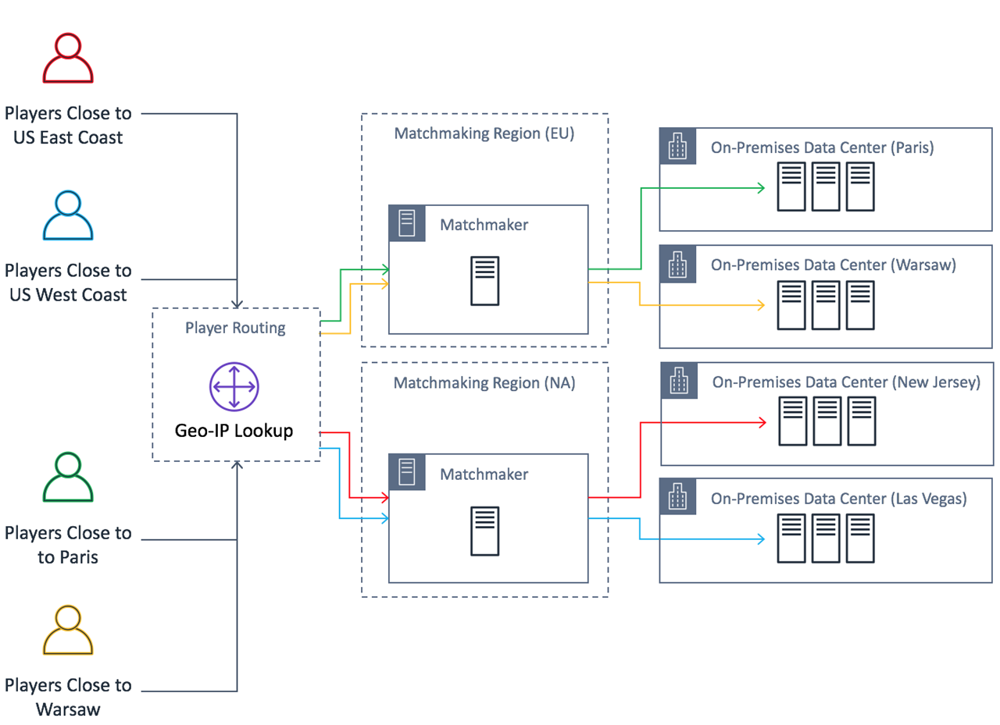
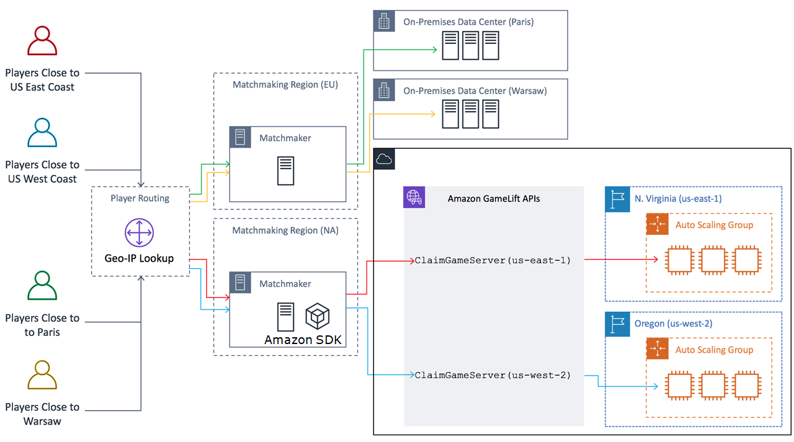

# Game architecture with Amazon GameLift Servers FleetIQ

## Supplementing on-premises hosting

Amazon GameLift Servers FleetIQ is designed to reuse your existing game backend, including any player geo-IP
routing, matchmaking, or lobby services that you might already have in place. The
following example illustrates how Amazon GameLift Servers FleetIQ might fit into an existing on-premises
deployment.

###### Example

In this example, game hosting is initially handled with four proprietary data
centers to host players in North America and Europe. Depending on their approximate
physical location, players are routed to one of two regional matchmakers. The
matchmakers group players by skill and latency and then place them onto nearby game
servers to minimize lag.

The game developer wants to replace their North America game servers with servers
provided by Amazon GameLift Servers FleetIQ. To start, they make minor updates to their game server to
enable it for use with Amazon GameLift Servers FleetIQ and then create an Amazon Machine Image (AMI). This
image will be installed on every EC2 instance that is deployed for the game. The
image contains the game server, dependencies, and anything else needed to run game
sessions for players.

With the AMI ready, the developer creates two Amazon GameLift Servers FleetIQ game server groups, one for
each AWS North America Region (`us-east-1` and `us-west-2)`.
The developer passes in launch template (which provides the AMI), a list of desired
instance types, and other configuration settings for the group. The list of desired
instance types tells Amazon GameLift Servers FleetIQ which types to use when checking for Spot Instances
that are viable for game hosting.

Finally, the developer integrates the AWS SDK with Amazon GameLift Servers FleetIQ into their North
American matchmaker, which calls Amazon GameLift Servers FleetIQ when a new group of players needs server
capacity for a game session. Amazon GameLift Servers FleetIQ locates a Spot Instance with an available game
server, reserves it for the players, and provides server connection information.
Players connect to the server, play the game, and disconnect. To start a new game,
players re-enter matchmaking, which prompts Amazon GameLift Servers FleetIQ to find another available game
server. Each new game request triggers Amazon GameLift Servers FleetIQ to search for and select game
servers with a low chance of interruptions. As a result, Amazon GameLift Servers FleetIQ is constantly
redirecting players away from game servers that are not viable for game hosting,
even as Spot Instance availability fluctuates over time.

